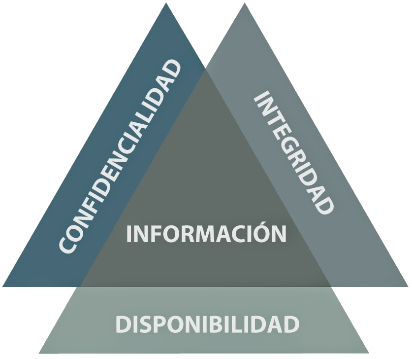
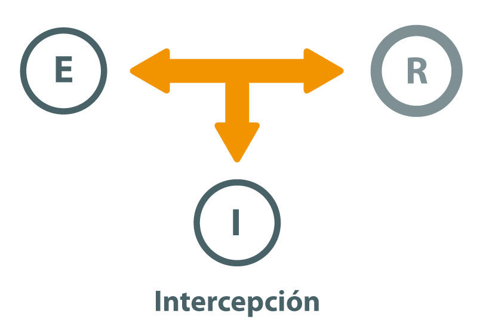
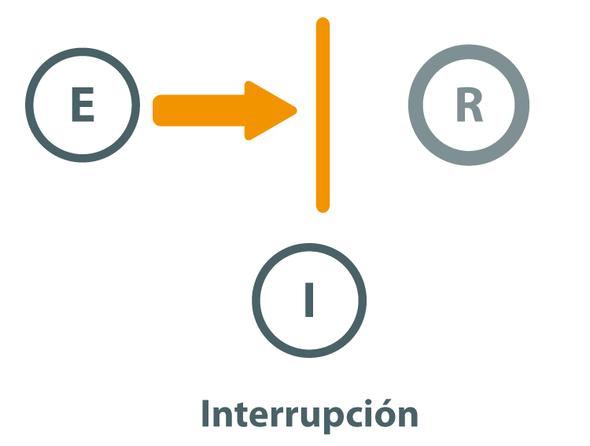
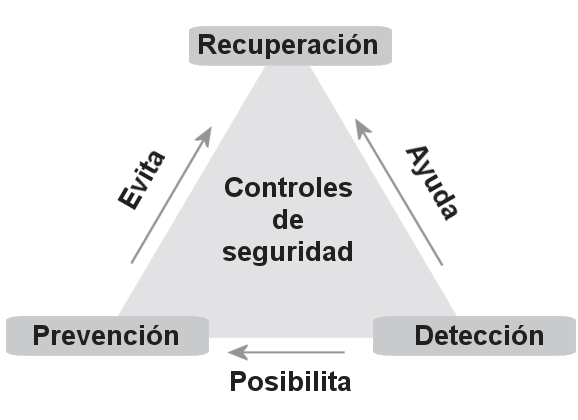

# Introducción a la seguridad informática

## Importancia de la seguridad informática

El espectacular auge de Internet y de los servicios telemáticos ha hecho que los equipos informáticos y las redes de comunicación de datos se conviertan en un elemento cotidiano en nuestras vidas.

Los sistemas de información se han convertido en un soporte fundamental para el funcionamiento de la gran mayoría de las empresas. El uso de las tecnologías de la información ha permitido a las empresas gestionar de forma eficiente su **información** y prestar **servicios** a través de Internet. Estos servicios se pueden usar para dar soporte operacional a la empresa o pueden ser el producto final que se venda a los clientes. 

¿Por qué es necesaria la **gestión del riesgo** de estos sistemas de información? 
Si las empresas dependen de los sistemas de información para su funcionamiento, necesitan saber hasta qué punto pueden confiar en ellos, qué puede salir mal y estar preparadas para recuperar la situación operacional en un tiempo y coste aceptables cuando suceda un incidente.

El primer paso de la gestión del riesgo consistirá en valorar la situación actual de la empresa, para ello se realizará un **análisis de riesgos** para determinar los posibles problemas que pueden surgir. Se identificarán los activos de la empresa, sus vulnerabilidades, las amenazas a las que están expuestos y el riesgo que suponen estas amenazas para la empresa. En otras palabras se determinará el posible daño económico resultante en caso de producirse un incidente de seguridad así como la probabilidad de que ese incidente pueda llegar a producirse.

Una vez conocida al situación de la empresa mediante el análisis de riesgos, el siguiente paso es evaluar si la situación es aceptable o si es necesario **tratar los riesgos** detectados estableciendo medidas o controles para mitigar los posibles efectos de las amenazas. No es posible eliminar completamente todos los riesgos, pero se deben tomar las medidas razonables para que los daños potenciales sean aceptables para la organización. Se debe llegar a una situación de **equilibrio entre el coste de la protección y el valor del activo protegido**. No tiene sentido gastar más que el valor del activo que se protege, pero tampoco se puede dejar un activo desprotegido y sufrir los efectos de no haber invertido lo suficiente en su protección.

Se debe tener en cuenta que las amenazas son dinámicas: la empresa cambia y su entorno cambia. Este cambio constante hace imprescindible que el proceso de gestión de riesgos se realice usando un **ciclo de mejora continua**. Puesto que la empresa, los sistemas de información y las amenazas evolucionan, la gestión del riesgo tiene que ser una actividad que se realice cíclicamente para adaptarse a los cambios.

## Definición de Seguridad de la información

La **seguridad de la información** se refiere a la protección de la información y de los sistemas que la procesan, almacenan y transmiten, contra cualquier tipo de amenaza que pueda comprometer su **confidencialidad, integridad y disponibilidad**. Estos tres principios forman la base de la seguridad de la información y son comúnmente conocidos como la **tríada CIA** (por sus siglas en inglés: Confidentiality, Integrity, Availability).

{:class="center" width="60%"}

1. **Confidencialidad**: Implica garantizar que la información sea accesible únicamente por las personas autorizadas, protegiendo los datos sensibles contra accesos no autorizados. Según la norma ISO/IEC 27000, la confidencialidad es la "propiedad de que la información no esté disponible ni se divulgue a individuos, entidades o procesos no autorizados" (ISO/IEC 27000:2018).
    
2. **Integridad**: Se refiere a la exactitud y completitud de la información, así como a la protección contra modificaciones no autorizadas. La norma ISO/IEC 27000 define la integridad como la "propiedad de exactitud y completitud" de los activos de información (ISO/IEC 27000:2018).
    
3. **Disponibilidad**: Asegura que la información esté disponible y accesible para su uso cuando sea necesario. La disponibilidad, según la ISO/IEC 27000, es la "propiedad de ser accesible y utilizable a demanda por una entidad autorizada" (ISO/IEC 27000:2018).
    

El marco normativo internacional más reconocido para la gestión de la seguridad de la información es la **ISO/IEC 27001**, que establece los requisitos para implementar, mantener y mejorar continuamente un Sistema de Gestión de Seguridad de la Información (SGSI). Esta norma proporciona una estructura integral para gestionar los riesgos relacionados con la seguridad de la información, asegurando que se implementen los controles adecuados para proteger los datos críticos de la organización.

Además, la **NIST SP 800-53**, publicada por el Instituto Nacional de Estándares y Tecnología de Estados Unidos, es otra referencia importante en el ámbito de la seguridad de la información. Este marco ofrece una lista exhaustiva de controles de seguridad que pueden ser utilizados por organizaciones para gestionar y mitigar los riesgos de seguridad de la información.

En resumen, la seguridad de la información es un campo multifacético que requiere la implementación de controles, políticas y procedimientos diseñados para proteger los datos y sistemas críticos de una organización. Su gestión efectiva es esencial para asegurar la continuidad del negocio y la protección contra amenazas tanto internas como externas.

### Definición de Seguridad de la Información Extendida

La tríada CIA (Confidencialidad, Integridad y Disponibilidad) constituye el núcleo de la seguridad de la información, pero en varias normas y marcos se amplía la definición de seguridad de la información con dos dimensiones adicionales: **Autenticidad** y **Trazabilidad**.
Reconociendo que la protección de los datos también depende de garantizar la legitimidad de la información y la capacidad de rastrear sus movimientos y modificaciones a lo largo del tiempo.

### Autenticidad

La **autenticidad** se refiere a la garantía de que la información, así como sus fuentes y usuarios, son genuinos y pueden ser verificados. Asegurar la autenticidad implica que los datos no han sido alterados desde su creación y que provienen de una fuente confiable. Según la norma ISO/IEC 27000, la autenticidad es definida como "la propiedad de que una entidad es lo que dice ser" (ISO/IEC 27000:2018). En el contexto de la seguridad de la información, la autenticidad es fundamental para prevenir fraudes y asegurar que tanto la información como las comunicaciones sean legítimas.

### Trazabilidad

La **trazabilidad** se refiere a la capacidad de rastrear la historia, aplicación o localización de lo que se está considerando. En el ámbito de la seguridad de la información, la trazabilidad está relacionada con la capacidad de seguir el rastro de las actividades y transacciones que se realizan en un sistema, lo que incluye el seguimiento de accesos y modificaciones. Esto es crucial para la **auditoría** y la **responsabilidad**, permitiendo identificar quién hizo qué, cuándo y cómo. La trazabilidad está alineada con el principio de **no repudio**, que asegura que las acciones realizadas por un usuario o sistema puedan ser probadas, de modo que nadie pueda negar haber realizado una acción específica.

Estas dimensiones adicionales están reflejadas en varias normas y marcos, como la **ISO/IEC 27001**, que incluye controles relacionados con la autenticación, la gestión de registros y la auditoría, elementos esenciales para garantizar la autenticidad y la trazabilidad en los sistemas de información.

## Conceptos Fundamentales: Activo, Vulnerabilidad, Amenaza, Riesgo y Controles

En la gestión de la seguridad de la información, es fundamental comprender varios conceptos clave que forman la base para identificar y mitigar los riesgos a los que están expuestos los recursos de una organización. Estos conceptos incluyen **activo**, **vulnerabilidad**, **amenaza**, **riesgo** y **controles**. A continuación, se explican estos términos y su interrelación.

### Activo

Un **activo** es cualquier recurso de valor para la organización que necesita ser protegido. Los activos pueden ser tangibles o intangibles y abarcan desde la información misma hasta los sistemas que la procesan, almacenan y transmiten. Ejemplos de activos incluyen:

- **Datos y bases de datos**: Información crítica, como registros de clientes, propiedad intelectual, planes estratégicos, etc.
- **Sistemas de información**: Hardware, software, redes y servidores.
- **Recursos humanos**: Personal con conocimientos especializados.
- **Infraestructura física**: Edificios, centros de datos, instalaciones de telecomunicaciones.

El valor de un activo depende de su importancia para la operación y el éxito de la organización, así como del impacto que tendría su pérdida, daño o compromiso.

> **Activo**: Componente o funcionalidad de un sistema de información susceptible de ser atacado deliberada o accidentalmente con consecuencias para la organización. Incluye: información,  datos, servicios, aplicaciones (software), equipos (hardware), comunicaciones, recursos administrativos, recursos físicos y recursos humanos. [UNE 71504:2008]

### Vulnerabilidad

Una **vulnerabilidad** es una debilidad o deficiencia en un activo o en las medidas de seguridad que lo protegen, que podría ser explotada por una amenaza para causar daño. Las vulnerabilidades pueden ser de naturaleza técnica, física, o humana. Ejemplos de vulnerabilidades incluyen:

- **Fallos de software**: Bugs o configuraciones inseguras que pueden ser explotadas por un atacante.
- **Controles de acceso inadecuados**: Contraseñas débiles o mal gestionadas.
- **Deficiencias físicas**: Áreas no aseguradas o dispositivos sin protección física adecuada.
- **Errores humanos**: Falta de formación del personal o errores operacionales.

La existencia de una vulnerabilidad no implica necesariamente que se vaya a sufrir un daño, pero sí aumenta el potencial de que una amenaza se materialice.

> **Vulnerabilidad**: Debilidad de un activo o control que puede dar lugar a una o más amenazas.[ISO 27000]

### Amenaza

Una **amenaza** es cualquier circunstancia o evento con el potencial de explotar una vulnerabilidad y causar daño a un activo. Las amenazas pueden ser intencionales, como los ataques cibernéticos, o no intencionales, como los desastres naturales. Ejemplos de amenazas incluyen:

- **Ciberataques**: Malware, phishing, ataques DDoS, etc.
- **Desastres naturales**: Inundaciones, terremotos, incendios.
- **Fallos técnicos**: Caídas de sistemas, fallos de hardware.
- **Errores humanos**: Borrado accidental de datos, divulgación no autorizada de información.

El impacto de una amenaza puede variar, dependiendo de la vulnerabilidad que explote y del valor del activo afectado.

> **Amenaza**: Causa potencial de un incidente indeseado, que puede resultar en daño a un sistema u organización.[ISO 27000]

### Riesgo

El **riesgo** es la posibilidad de que una amenaza explote una vulnerabilidad y cause un impacto negativo sobre un activo. En términos simples, el riesgo puede ser entendido como la probabilidad de que ocurra un evento adverso y la magnitud de sus consecuencias. El riesgo se calcula generalmente como:

	Riesgo=Probabilidad de la amenaza×Impacto del evento

Los riesgos pueden ser categorizados en función de su gravedad y la urgencia de mitigación, lo que ayuda a las organizaciones a priorizar sus esfuerzos de seguridad.

> **Riesgo**: efecto de incertidumbre en los objetivos. [ISO 27000]

- Un efecto es una desviación de lo esperado - positiva o negativa.
- Incertidumbre es el estado, incluso parcial, de deficiencia en la información relacionada con el entendimiento o el conocimiento de un evento, sus consecuencias o su probabilidad.
- El riesgo se caracteriza a menudo en relación a potenciales "eventos" y "consecuencias" (definidos en ISO 73:2003) o una combinación de ambos.
- El riesgo a menudo se expresa en términos de una combinación de consecuencias de un evento (incluyendo cambios en las circunstancias) y su probabilidad  de ocurrencia asociada.
- En el contexto de sistemas de gestión de la seguridad de la información, los riesgos de la seguridad de la información pueden ser expresados como el efecto de incertidumbre sobre los objetivos de la seguridad de la información.
- Los riesgos de la seguridad de la información están asociados con el potencial de que amenazas exploten vulnerabilidades de activos de información o grupos de activos de información y consecuentemente cause daño a la organización.

### Controles

Los **controles** son las medidas y procedimientos implementados para mitigar o eliminar los riesgos, reduciendo la probabilidad de que una amenaza explote una vulnerabilidad o minimizando el impacto si ocurre un incidente de seguridad. Los controles pueden ser de varios tipos, incluidos:

- **Controles preventivos**: Destinados a evitar que ocurran incidentes de seguridad (por ejemplo, firewalls, políticas de acceso, autenticación multifactor).
- **Controles detectivos**: Diseñados para identificar incidentes de seguridad cuando ocurren (por ejemplo, sistemas de detección de intrusiones, registros de auditoría).
- **Controles correctivos**: Orientados a mitigar el daño y recuperar la funcionalidad tras un incidente (por ejemplo, planes de recuperación ante desastres, copias de seguridad).

Los controles deben ser seleccionados y diseñados en función del análisis de riesgos y alineados con los objetivos de la organización, garantizando que sean adecuados para proteger los activos de forma eficaz y eficiente.
Es posible que los controles no siempre consigan el efecto pretendido.

Los controles también son denominados **salvaguardas**, **medidas** de seguridad o contramedidas.

> Control: Medida que modifica el riesgo.

### Interrelación de los Conceptos

La relación entre estos conceptos es fundamental para la gestión de la seguridad de la información. Un activo valioso que presenta una vulnerabilidad puede estar en riesgo si existe una amenaza que pueda explotarlo. Los controles se implementan para reducir estos riesgos, protegiendo así los activos de la organización. La evaluación continua de los riesgos y la actualización de los controles es esencial para mantener la seguridad en un entorno cambiante.

## Seguridad Física y Seguridad Lógica

La **seguridad física** y la **seguridad lógica** son dos aspectos fundamentales de la seguridad de la información, cada uno con enfoques, objetivos y mecanismos distintos, pero complementarios. Ambos tipos de seguridad son esenciales para proteger los activos de una organización, pero lo hacen de maneras diferentes.

### Seguridad Física

La **seguridad física** se refiere a las medidas diseñadas para proteger los elementos tangibles de una organización, tales como el hardware, las instalaciones, el personal y otros recursos físicos, contra amenazas físicas. El objetivo principal de la seguridad física es evitar el acceso no autorizado, el daño o la destrucción de estos activos.

Algunos ejemplos de medidas de seguridad física incluyen:

- **Control de acceso**: Uso de tarjetas de identificación, cerraduras electrónicas, guardias de seguridad, y sistemas de vigilancia para restringir el acceso a áreas sensibles.
- **Videovigilancia**: Cámaras de seguridad para monitorear y grabar actividades en áreas críticas.
- **Sistemas de detección y alarma**: Detectores de humo, sistemas contra incendios, alarmas de intrusión y sensores de movimiento.
- **Protección contra desastres**: Medidas para proteger las instalaciones contra incendios, inundaciones, terremotos, y otras amenazas naturales.

La seguridad física es esencial para evitar que personas no autorizadas accedan o dañen los recursos que contienen o procesan información crítica, como servidores, centros de datos, o dispositivos de almacenamiento.

<!--
Algunas medidas de seguridad física son el estudio de de la ubicación correcta, medidas preventivas contra incidentes como incendios o inundaciones o el controles de acceso físico. 
 
| Amenaza                   | Salvaguarda                                                                                                            |
| ------------------------- | ---------------------------------------------------------------------------------------------------------------------- |
| Incendios                 | Mobiliario ignífugo Evitar localización peligrosa Sistemas antiincendios, detectores de incendios, ...           |
| Inundaciones              | Evitar plantas bajas Impermeabilización de paredes, techos, sellado de puertas...                                   |
| Robos                     | Puertas con medidas biométricas, cámaras, vigilantes, ...                                                              |
| Señales electromagnéticas | Evitar lugares con radiaciones electromagnéticas Filtros o cableado especial. La fibra óptica no es sensible a esto |
| Apagones                  | SAI                                                                                                                    |
| Sobrecargas eléctricas    | SAI. También estabilizan la señal eléctrica                                                                            |
| Desastres naturales       | Estar en contacto con los organismos que proporcionan información sobre terremotos o desastres meteorológicos          |
: Seguridad física
-->

### Seguridad Lógica

La **seguridad lógica** se refiere a las medidas utilizadas para proteger los sistemas informáticos y la información que almacenan o procesan, mediante la implementación de controles en el software, datos, y procesos informáticos. Este tipo de seguridad se enfoca en proteger los activos digitales contra amenazas cibernéticas, como el acceso no autorizado, la modificación o destrucción de datos, y el robo de información.

Ejemplos de medidas de seguridad lógica incluyen:

- **Autenticación y control de acceso**: Uso de contraseñas, autenticación de múltiples factores, y sistemas de gestión de identidades para garantizar que solo los usuarios autorizados puedan acceder a los sistemas y datos.
- **Cifrado**: Protege la confidencialidad de los datos mediante la codificación de la información para que solo pueda ser leída por usuarios con la clave correcta.
- **Cortafuegos (firewalls) y sistemas de detección de intrusiones**: Monitorean y controlan el tráfico de red para bloquear accesos no autorizados y detectar actividades sospechosas.
- **Software antivirus y antimalware**: Protege los sistemas contra virus, spyware, ransomware, y otros tipos de software malicioso.
- **Políticas de seguridad y gestión de parches**: Definen las reglas para el uso seguro de los sistemas y aseguran que todos los componentes de software estén actualizados para prevenir vulnerabilidades.

 <!--

|   Amenaza				|  Salvaguarda                |
|----------------------	|----------------------------------|
| Robos	|      Cifrado, Contraseñas, Sistemas biométricos     |
| Perdida de información	| Copia de seguridad (distintas ubicaciones), Sistemas tolerantes a fallos,Discos redundantes     |
| Perdida de integridad de la información|     Programas de chequeo del equipo, Firma digital, Comando sfc      |
| 	Entrada de virus|  Antivirus |
| Ataques desde la red	|  Firewall, Programas de monitorización Proxys |
| Modificaciones no autorizadas	|  Contraseñas Listas de control de acceso Cifrar documentos |
: Seguridad lógica

-->
### Complementariedad entre Seguridad Física y Lógica

La seguridad física y la seguridad lógica deben trabajar en conjunto para proporcionar una protección integral de la información. Por ejemplo, aunque un servidor pueda estar protegido por cifrado (seguridad lógica), si un intruso puede acceder físicamente al dispositivo, podría extraer los datos directamente. Del mismo modo, si un centro de datos tiene controles de acceso físicos estrictos, pero carece de seguridad lógica adecuada, un atacante podría explotar vulnerabilidades de software para acceder a la información.

Por lo tanto, para garantizar la seguridad de la información de manera efectiva, es crucial que las organizaciones adopten un enfoque holístico que combine tanto medidas de seguridad física como lógica.

## Clasificación de los controles según el momento de aplicación

* **Seguridad activa**:
Son aquellas medidas que se utilizan para evitar las amenazas antes de que se produzcan.
Son preventivas y evitan grandes daños a los sistemas informáticos, se consideran acciones previas a un ataque. 

 <!--
 Principales técnicas de seguridad activa:
|   Técnicas				|  ¿Qué previene?                                              |
|----------------------	|---------------------------------------------------------|
| Contraseñas	|   Previene el acceso a recursos a usuarios no autorizados      |
| Listas de control de acceso						|Previene acceso a ficheros a usuarios no autorizados       |
| Encriptación	|Evita a personas no autorizadas interpretar la información|
|Software de seguridad	|  Evita virus y accesos no deseados al sistema|
|	Firmas y certificados digitales|  Comprueba la procedencia, autenticidad e integridad de los mensajes|
|Sistemas de ficheros tolerantes a fallos| Previene fallos de integridad |
|	Cuotas de disco|Previene el uso excesivo de disco por parte de algún usuario|
: Seguridad activa
   -->
   
* **Seguridad pasiva**:
Comprende el conjunto de medidas utilizadas para intentar minimizar los daños una vez que se produzca el ataque o fallo, activando los mecanismos de recuperación.   
Son correctivas, minimizan el impacto y los efectos causados por accidentes, es decir, se consideran medidas o acciones posteriores a un ataque o un incidente. Un ejemplo son las copias de seguridad que permiten minimizar el efecto de un incidente producido.  
 <!--
|   Técnicas				|  Resultado                                              |
|----------------------	|---------------------------------------------------------|
| Discos redundantes	|   Restaurar datos que han quedado inconsistentes        |
| SAI						|Proporcionan energía durante un periodo de tiempo        |
| Copias de seguridad	|Podemos recuperar información en caso de pérdida de datos|
: Seguridad pasiva
-->

## Seguridad Activa y Seguridad Pasiva

En el ámbito de la seguridad de la información, las estrategias para proteger los activos de una organización pueden clasificarse en dos categorías principales: **seguridad activa** y **seguridad pasiva**. Ambas son complementarias y juegan un papel crucial en la defensa contra amenazas y en la mitigación de riesgos.

### Seguridad Activa

La **seguridad activa** se refiere a las medidas y mecanismos que se implementan de manera proactiva para detectar, prevenir y responder a incidentes de seguridad en tiempo real. Estas acciones están diseñadas para intervenir activamente en la protección de los sistemas, haciendo frente a las amenazas antes o mientras ocurren.

**Ejemplos comunes de seguridad activa:**

- **Sistemas de detección y prevención de intrusiones (IDS/IPS)**: Estos sistemas monitorizan el tráfico de red y los sistemas en busca de actividades sospechosas o patrones de ataque, y pueden bloquear automáticamente las amenazas detectadas.
- **Firewalls**: Los firewalls filtran el tráfico entrante y saliente basado en reglas de seguridad predefinidas, evitando que el tráfico malicioso acceda a la red.
- **Antivirus y antimalware en tiempo real**: Estos programas escanean los archivos y actividades del sistema en busca de software malicioso y lo eliminan antes de que cause daño.
- **Autenticación multifactor (MFA)**: Al requerir múltiples formas de verificación (como contraseñas, tokens físicos, o datos biométricos) para acceder a un sistema, se reduce significativamente la posibilidad de acceso no autorizado.
- **Respuesta a incidentes**: Equipos dedicados y herramientas especializadas para gestionar y mitigar incidentes de seguridad a medida que ocurren, minimizando el impacto en la organización.

### Seguridad Pasiva

La **seguridad pasiva** se refiere a las medidas que están diseñadas para resistir o mitigar los efectos de un ataque o incidente de seguridad sin requerir una intervención activa en tiempo real. Estas medidas no previenen activamente los ataques, pero aseguran que, si ocurre un incidente, el daño se minimice y la recuperación sea posible.

**Ejemplos comunes de seguridad pasiva:**

- **Cifrado de datos**: El cifrado protege la confidencialidad de la información almacenada o transmitida, de modo que, aunque los datos sean interceptados o robados, no puedan ser leídos sin la clave de descifrado.
- **Backups (copias de seguridad)**: La creación regular de copias de seguridad garantiza que la información crucial pueda ser restaurada en caso de pérdida, daño o corrupción de datos.
- **Políticas de control de acceso**: Estas políticas definen quién tiene acceso a qué información y recursos, limitando la exposición de datos sensibles.
- **Seguridad física**: Aunque no es proactiva contra ataques cibernéticos, la seguridad física, como las cerraduras, los sistemas de videovigilancia, y los controles de acceso a las instalaciones, previene el acceso no autorizado a los componentes físicos de los sistemas de información.
- **Redundancia de sistemas**: La implementación de sistemas y recursos redundantes asegura que si un componente falla, otro puede tomar su lugar sin interrupción del servicio.

### Complementariedad entre Seguridad Activa y Pasiva

Ambas formas de seguridad son necesarias para una protección integral. La **seguridad activa** permite responder rápidamente a las amenazas y detener los ataques en curso, mientras que la **seguridad pasiva** asegura que, en caso de que una amenaza pase desapercibida o no pueda ser detenida, los daños sean mínimos y se pueda garantizar la continuidad del servicio y la recuperación de los datos.

Por ejemplo, un sistema que combina **cifrado de datos** (seguridad pasiva) con un **IDS/IPS** (seguridad activa) está mejor protegido contra una gama más amplia de amenazas que uno que solo utiliza una de estas estrategias. De este modo, se logra un enfoque más robusto y resiliente frente a los diversos riesgos que enfrenta la organización en el entorno digital actual.

# Alta Disponibilidad

La **alta disponibilidad** es un enfoque estratégico en la arquitectura de sistemas que garantiza que un servicio o sistema esté operativo y accesible la mayor parte del tiempo, minimizando las interrupciones y el tiempo de inactividad. Esto es especialmente crítico para aplicaciones y servicios que requieren funcionamiento continuo, como plataformas de comercio electrónico, sistemas financieros o infraestructuras críticas.

Para lograr alta disponibilidad, se utilizan diversas técnicas, como la redundancia de hardware y software, la replicación de datos, el uso de balanceadores de carga, y la implementación de mecanismos de failover que aseguren que, en caso de fallo de uno de los componentes, otro pueda tomar su lugar sin interrumpir el servicio.

## Cálculo del nivel de disponibilidad

La disponibilidad se calcula como la proporción del tiempo en que un sistema está operativo respecto al tiempo total (sumando el tiempo de operación y el tiempo de reparación). La fórmula expresa la disponibilidad como el cociente entre el tiempo medio entre fallos y la suma del tiempo medio entre fallos y el tiempo medio de reparación.

$$D=\frac{MTBF}{MTTR + MTBF}$$

En este contexto, $$D$$ representa la disponibilidad de un sistema, $$MTBF$$ es el **Mean Time Between Failures** o **Tiempo Medio Entre Fallos**, y $$MTTR$$ es el **Mean Time To Repair** o **Tiempo Medio de Reparación**.

## Los Nueves de la Alta Disponibilidad

Los "nueves" se refieren al porcentaje de tiempo que un sistema está disponible durante un año, y es una forma común de medir la **disponibilidad** de un sistema. Cuantos más "nueves" haya, mayor es la disponibilidad, y por lo tanto, menor el tiempo de inactividad.

- **99% de disponibilidad**: Aproximadamente 3,65 días de inactividad al año.
- **99.9% de disponibilidad (tres nueves)**: Aproximadamente 8,76 horas de inactividad al año.
- **99.99% de disponibilidad (cuatro nueves)**: Aproximadamente 52,56 minutos de inactividad al año.
- **99.999% de disponibilidad (cinco nueves)**: Aproximadamente 5,26 minutos de inactividad al año.
- **99.9999% de disponibilidad (seis nueves)**: Aproximadamente 31,5 segundos de inactividad al año.

### Ejemplos Relevantes

1. **Google Cloud y Amazon Web Services (AWS)**: Ambos ofrecen servicios con SLA (Service Level Agreement) que garantizan entre el 99.95% y el 99.99% de disponibilidad, dependiendo del servicio. Estos proveedores implementan alta disponibilidad a través de centros de datos distribuidos geográficamente, redundancia y sistemas automatizados de failover.
    
2. **Sistemas Financieros**: Las plataformas de transacciones financieras, como las redes de cajeros automáticos o las aplicaciones bancarias en línea, a menudo requieren cinco nueves de disponibilidad para asegurar que los clientes puedan acceder a sus fondos y realizar transacciones en cualquier momento.
    
3. **Servicios de Salud**: Los sistemas de información hospitalaria (HIS) y las aplicaciones de monitoreo de pacientes en tiempo real necesitan operar con alta disponibilidad para asegurar que los médicos tengan acceso continuo a la información crítica, incluso durante emergencias.
    

La alta disponibilidad es esencial para garantizar que los sistemas críticos continúen operando sin interrupciones, ofreciendo a los usuarios un servicio confiable y continuo, independientemente de las condiciones adversas que puedan presentarse.

<!---

# Introducción

## Razones para la seguridad informática

El espectacular auge de Internet y de los servicios telemáticos ha hecho que los ordenadores y las redes se conviertan en un elemento cotidiano en nuestras casas y en un instrumento imprescindible en las tareas de las empresas.  

Las empresas, sea cual sea su tamaño, disponen de equipos conectados a Internet que les ayudan en sus procesos productivos. Cualquier fallo en los mismos puede suponer una gran pérdida económica ocasionada por el parón producido, de modo que es muy importante asegurar un correcto funcionamiento de los sistemas y redes informáticas.  

Tenemos que intentar lograr un nivel de seguridad razonable y estar preparados para que, cuando se produzcan los ataques, los daños puedan ser evitados o en caso contrario haber sido lo suficientemente precavidos para realizar las copias de seguridad.  

Con unas buenas políticas de seguridad, tanto físicas como lógicas, conseguiremos que nuestros sistemas sean menos vulnerables a las distintas amenazas. 

## Seguridad informática

### Definición de seguridad informática

Según la norma ISO27002 “La seguridad de la información se puede caracterizar por la preservación de la confidencialidad, integridad y la disponibilidad”.

Según INFOSEC Glosssary 2000: “Seguridad informática son las medidas y controles que aseguran la confidencialidad, integridad y disponibilidad de los activos de los sistemas de información, incluyendo hardware, software, firmware y aquella información que procesan, almacenan y comunican”.

### Objetivos de la seguridad informática

La seguridad informática consiste en asegurar que los recursos de sistemas de información de una organización sean utilizados de la manera que se decidió y que el acceso a la información allí contenida, así como su modificación, sólo sea posible a las personas que se encuentran acreditadas y dentro de los límites de su autorización.  

Los principales objetivos de la seguridad informática por tanto son:

* Garantizar la adecuada utilización de los recursos y de las aplicaciones de los sistemas
* Detectar los posibles problemas y amenazas a la seguridad, minimizando y gestionando riesgos
* Limitar las pérdidas y conseguir la adecuada recuperación del sistema en caso de un incidente de seguridad
* Cumplir con el marco legal y con los requisitos impuestos a nivel organizativo

### CID: Confidencialidad, Integridad y Disponibilidad

A grandes rasgos se entiende que mantener un sistema seguro (o fiable) consiste básicamente en garantizar 3 aspectos: disponibilidad, confidencialidad e integridad.

* **Confidencialidad**: cualidad de un mensaje, comunicación o datos, para que sólo se entiendan de manera comprensible o sean leídos por la persona o sistema que esté autorizado (privacidad y protección).
* **Integridad**: cualidad de mensaje, comunicación o datos, que permite comprobar que no se ha producido manipulación alguna en el original, es decir, que no ha sido alterado.
* **Disponibilidad**: capacidad de un servicio, de unos datos o de un sistema, a ser accesible y utilizable por los usuarios (o procesos) autorizados cuando estos lo requieran (evitar pérdidas o bloqueos).

{width=35%}

Junto a estos 3 conceptos se suelen estudiar la autenticación y el no repudio.

* **Autenticación**: verificar que un documento ha sido elaborado (o pertenece) a quien el documento indica. Se suele realizar mediante un usuario o login y una contraseña o password.
* **No repudio o irrenunciabilidad:** estrechamente relacionado con la autenticación, permite probar la participación de las partes en una comunicación. Existen 2 posibilidades:
	* **No repudio en origen:** el emisor no puede negar el envío. La prueba la crea el emisor y la recibe el destinatario.
	* **No repudio en destino:** el receptor no puede negar que recibió el mensaje porque el emisor tiene pruebas de la recepción. La prueba la crea el receptor y la recibe el emisor.

Si la autenticidad prueba quien es el autor de un documento y cuál es el destinatario, el no repudio prueba que es el mismo autor quien envía la comunicación (no repudio en origen) y que el destinatario la recibió (no repudio en destino).

-->

<!--
### Alta disponibilidad
La alta disponibilidad se refiere a la capacidad de que servicios e información se encuentren operativos los la mayor parte del tiempo. Para ello se deben evitar las interrupciones.

Se distinguen 2 tipos de interrupciones:

* Interrupciones **previstas**, que se realizan cuando paralizamos el sistema para realizar cambios o mejoras en nuestro hardware o software.
* Interrupciones **imprevistas**, que suceden por acontecimientos imprevistos (un apagón, un error del hardware o del software, problemas de seguridad, desastre natural, virus, accidentes, caídas involuntarias del sistema)

La disponibilidad se define a partir del tiempo medio que un sistema es capaz de estar funcionando sin fallar (Mean Time Between Failure o **MTBF**) y del tiempo medio que se tarda en reparar o sustituir en caso de fallo (Mean Time To Repair o **MTTR**). La disponibilidad (D) se define con la siguiente ecuación:

$$\\D=\frac{MTBF}{MTTR + MTBF}$$

**La disponibilidad suele expresarse por el número de nueves**: disponibilidad de 3 nueves significa que D = 99,9%. En aplicaciones críticas se suele exigir una disponibilidad de 5 nueves, lo que significa que en promedio el sistema sólo estará caído 315 segundos al año.
-->

<!---

### Elementos vulnerables a proteger

>SISTEMA DE SEGURIDAD = TECNOLOGÍAS + PERSONAS + OPERACIONES

La seguridad informática necesita que a nivel organizativo se establezcan unas normas y pautas comunes para los **usuarios** de sistemas dentro de una empresa, por mucha tecnología de seguridad que se implante, si no se educa a los usuarios no se conseguirán los objetivos de seguridad perseguidos.

Los 3 elementos principales a proteger en cualquier sistema informático son: software, hardware y datos.
**Los datos constituyen el principal elemento a proteger**, ya que es el más amenazado y el más difícil de recuperar.

Los objetivos principales de la seguridad informática son proteger los **activos** informáticos:

* **La información contenida:** Uno de los elementos más importantes del sistema. Se debe evitar que usuarios externos o no autorizados puedan acceder a ella y que los usuarios autorizados puedan acceder en cualquier momento.
  
* **La infraestructura física:** Se debe velar porque los equipos funcionen de la forma adecuada previendo medidas en caso de robo, incendio, accidentes o desastres naturales...

{width=80%}

# Amenazas

Lamentablemente **la seguridad absoluta no es posible**, el elemento de riesgo está siempre presente independientemente de las medidas que tomemos. **El riesgo puede reducirse, pero no eliminarse**.
Hablaremos siempre de niveles de seguridad. Así, diremos que la seguridad informática es un conjunto de técnicas encaminadas a obtener **niveles de seguridad aceptables** en los sistemas informáticos.
La determinación de este nivel dependerá en gran medida de los objetivos concretos de la organización, del valor de sus activos, de su dimensión y presupuesto de seguridad

Teniendo en cuenta esto, la definición de seguridad se suaviza pasando a hablar de **fiabilidad**: probabilidad de que un sistema se comporte tal y como se espera de él. Esto es, se habla de tener sistemas fiables en lugar de sistemas seguros.

Contrariamente a lo que tiende a pensarse, ni todas las amenazas de seguridad se deben a ataques maliciosos ni todos los ataques provienen desde el exterior. 
En primer lugar, la mayoría de problemas de seguridad reales a las que se ven expuestos los activos no tienen que ver con ataques informáticos, sino con **fallos de hardware o software**, errores de programación o administración, robo, fraude y extorsión, demandas legales, infracción de derechos de autor o ingeniería social, por citar algunas. 
En segundo lugar, los **usuarios internos** suponen la mayor fuente de amenazas: son los que mejor conocen el sistema, poseen acceso a veces ilimitado al mismo, saben cuáles son los activos más valiosos, en definitiva, pueden causar el daño mayor y con la mayor impunidad. 
En consecuencia, no todas las medidas de seguridad ni las más importantes deben basarse en la tecnología y por tanto en la adquisición de software o hardware de seguridad, sino también en la **organización de tareas y responsabilidades**, en la gestión racional de procesos y en la formación y concienciación del personal. La seguridad de la información requiere un enfoque holístico, que implique la participación coordinada de tecnología, personas y operaciones. Su objetivo no es conseguir sistemas 100% seguros, espejismo imposible de alcanzar, sino sistemas tan seguros como sea necesario para proteger los activos con un nivel que se corresponda con las expectativas. 

## Vulnerabilidad, amenaza y riesgo.

* Una **vulnerabilidad** (en términos de informática) es una debilidad o fallo en un sistema de información que pone en riesgo la seguridad de la información pudiendo permitir que un atacante pueda comprometer la integridad, disponibilidad o confidencialidad de la misma, por lo que es necesario encontrarlas y eliminarlas lo antes posible. Estos «agujeros» pueden tener distintos orígenes por ejemplo: fallos de diseño, errores de configuración o carencias de procedimientos.
* Por su parte, una **amenaza** es toda acción que aprovecha una vulnerabilidad para atentar contra la seguridad de un sistema de información. Es decir, que podría tener un potencial efecto negativo sobre algún elemento de nuestros sistemas. Las amenazas pueden proceder de ataques (fraude, robo, virus), sucesos físicos (incendios, inundaciones) o negligencia y decisiones institucionales (mal manejo de contraseñas, no usar cifrado). Desde el punto de vista de una organización pueden ser tanto internas como externas.

{width=35%}

Por tanto, las vulnerabilidades son las condiciones y características propias de los sistemas de una organización que la hacen susceptible a las amenazas. El problema es que en el mundo real, si existe una vulnerabilidad, siempre existirá alguien que intentará explotarla, es decir, sacar provecho de su existencia.  

Una vez que tenemos clara la diferencia entre amenaza y vulnerabilidad, es interesante introducir el concepto de riesgo. El **riesgo** es la probabilidad de que se produzca un incidente de seguridad, materializándose una amenaza y causando pérdidas o daños. Se mide asumiendo que existe una cierta vulnerabilidad frente a una determinada amenaza, como puede ser un hacker, un ataque de denegación de servicios, un virus... El riesgo depende entonces de los siguientes factores: la probabilidad de que la amenaza se materialice aprovechando una vulnerabilidad y produciendo un daño o impacto. El producto de estos factores representa el riesgo.

{width=50%}

### Vulnerabilidades en software.

Como el software está hecho por humanos, puede tener errores. Pueden ser leves (algún mensaje mal traducido), graves (corrupción de datos) o críticos (agujeros de seguridad).

Una **vulnerabilidad** es un defecto en una aplicación que puede ser aprovechado por un atacante que puede programar un **malware** que utilice esa vulnerabilidad para realizar alguna acción no deseada sobre la máquina.(**exploit**)

Hay 3 tipos de vulnerabilidades:

* Vulnerabilidades reconocidas por el suministrador del software y para las cuales ya tiene un parche.

* Vulnerabilidades reconocidas por el suministrador del software y para las cuales no tiene todavía un parche. Algunas veces se proporciona una solución temporal (*workaround*), pero es mejor desactivar el servicio hasta tener el parche que lo solucione.

* Vulnerabilidades no reconocidas por el suministrador del software. Podemos estar expuestos y no ser conscientes de ello.

## Tipos de amenazas.

Las amenazas pueden ser provocadas por: personas, condiciones físicas-ambientales y software o lógicas.

### Amenazas físicas-ambientales   

Las amenazas físicas y ambientales afectan a las instalaciones y/o el hardware contenido en ellas y suponen el primer nivel de seguridad a proteger para garantizar la disponibilidad de los sistemas. Hay que tener en cuenta aspectos como:

* Robos, sabotajes, destrucción de sistemas
* Cortes, subidas y bajadas bruscas de suministro eléctrico
* Condiciones atmosféricas adversas. Humedad relativa excesiva o temperaturas extremas
* Catástrofes (naturales o artificiales) terremotos, inundaciones, incendios , humo o atentados de baja magnitud, ...
* Interferencias electromagnéticas que afecten al normal comportamiento de circuitos y comunicaciones

### Amenazas software o lógicas  

Una amenaza lógica es software o código que de alguna manera puede afectar o dañar a nuestro sistema, creados de forma intencionada para ello. Entre otro software malicioso o malware encontramos:

* **Herramientas de seguridad:** Existen herramientas para detectar y solucionar fallos en los sistemas que se pueden usar para detectar esos fallos y, al mismo tiempo, aprovechar para atacarlos.
* **Rogueware o falsos programas de seguridad:** También denominados Rogue, FakeAVs, Badware, Scareware, son falsos antivirus o antiespías.
* **Puertas traseras o backdoors:** Los programadores insertan atajos de acceso o administración, en ocasiones con poco nivel de segundad.
* **Virus:** Secuencia de código que se inserta en un fichero ejecutable (denominado huésped), de forma que cuando el archivo se ejecuta, el virus también lo hace.
* **Gusano o Worm:** Programa capaz de ejecutarse y propagarse por sí mismo a través de redes, normalmente mediante correo electrónico basura o spam.
* **Troyanos o Caballos de Troya:** Aplicaciones con instrucciones escondidas de forma que éste parezca realizar las tareas que un usuario espera de él, pero que realmente ejecute funciones ocultas sin el conocimiento del usuario
* **Programas conejo o bacterias:** Programas que no hacen nada útil, simplemente se dedican a reproducirse hasta que el número de copias acaba con los recursos del sistema, produciéndose una negación de servicio
* **Canales cubiertos:** Canales de comunicación que permiten a un proceso transferir información de forma que viole la política de seguridad del sistema

### Amenazas provocadas por personas

La mayoría de ataques a un sistema provienen de personas que, intencionadamente o no, pueden causar enormes pérdidas.  

Estos atacantes se dividen en 2 grandes grupos: los atacantes pasivos que fisgonean el sistema sin modificar ni destruir nada; y los atacantes activos que dañan el objetivo atacado o lo modifican en su favor:

* **Personal**: Dentro de una organización, el propio personal puede producir un ataque intencionado
* **Hacker**: Experto o gurú en aspectos técnicos relacionados con la informática. Se distinguen 2 tipos, los que actúan con carácter constructivo, informativo o sólo intrusivo, denominados hackers o white hat; o los que actúan de forma destructiva denominados crackers o black hat. Los que andan entre un tipo y otro se denominan grey hat.
* **Crackers o black hat**: Hacker que quiere causar daño u obtener beneficio.
* **Sniffers:** Analizan el tráfico de la red para obtener información de los paquetes trasmitidos.
* **Ciberterrorista**: Experto informático que trabaja para países u organizaciones como espías o saboteadores.
* **Programadores de virus**: Crean programas dañinos para los sistemas o aplicaciones.
* **Carders**: Atacan sistemas de tarjetas de crédito.

Otras categorías son:

* **Newbie**: Hacker novato
Wannaber: Interesados por el hacking pero que aún no han sido reconocidos por la élite
* **Lammer** o **Script-Kiddies**: Pretenden hacer hacking sin tener conocimientos de informática. Se suelen dedicar a buscar y descargar programas de hacking para luego ejecutarlos
* **Luser** (looser + user): Término utilizado por los hackers para referirse a los usuarios comunes (como burla).
*  **Pirata informático**, ciberdelincuente o delincuente informático: Personas dedicadas a realizar actos delictivos y perseguidos legalmente.

## Categorías generales de ataques

Las amenazas a la información en una red pueden caracterizarse modelando el sistema como un flujo de información desde una fuente, como por ejemplo un archivo o una región de la memoria principal, a un destino, como por ejemplo otro archivo o un usuario. Las cuatro categorías generales de ataques son las siguientes:

* Interceptación 
* Modificación
* Interrupción
* Fabricación

En el flujo normal de la información se intenta garantizar:

* Confidencialidad: nadie no autorizado accede a la información.
* Integridad: los datos enviados no se modifican en el camino.
* Disponibilidad: la recepción y acceso es correcto.

###  Interceptación  

Interceptación consiste en el acceso a la información por parte de personas no autorizadas. Uso de privilegios no adquiridos.

Detección difícil, no deja huellas.
Se garantiza:

* Integridad.
* Disponibilidad

No se garantiza:

* Confidencialidad: es posible que alguien no autorizado acceda a la información

Ejemplos:

* Copias ilícitas de programas
* Escucha en línea de datos

###  Modificación  

Modificación consiste en el acceso no autorizado que cambia el entorno para su beneficio.

Detección difícil según circunstancias.
Se garantiza:

* Disponibilidad: la recepción es correcta.
No se garantiza:

* Integridad: los datos enviados pueden ser modificados en el camino.
* Confidencialidad: alguien no autorizado accede a la información.

Ejemplos:

* Modificación de bases de datos
* Modificación de elementos del HW

###  Interrupción  

Los ataques de interrupción pueden provocar que un objeto del sistema se pierda, quede no utilizable o no disponible.

Detección inmediata.
Se garantiza:

* Confidencialidad: nadie no autorizado accede a la información.
* Integridad: los datos enviados no se modifican en el camino.

No se garantiza:

* Disponibilidad: puede que la recepción no sea correcta.

Ejemplos:

* Destrucción del hardware
* Borrado de programas, datos
* Fallos en el sistema operativo

###  Fabricación  

La Fabricación puede considerarse como un caso concreto de modificación ya que se consigue un objeto similar al atacado de forma que no resulte sencillo distinguir entre objeto original y el fabricado.

Detección difícil. Delitos de falsificación.
En este caso se garantiza:

* Confidencialidad: nadie no autorizado accede a la información.

* Disponibilidad: la recepción es correcta.

No se garantiza:

* Integridad: los datos recibidos no fueron emitidos en el camino.

Ejemplos:

* Añadir transacciones en red
* Añadir registros en base de datos

## Técnicas de ataque

Los tipos de amenazas también pueden clasificarse en función de la técnica que se emplea para realizar el ataque:

* **Malware**: Programas malintencionados que afectan a los sistemas con pretensiones como: controlarlo o realizar acciones remotas, dejarlo inutilizable, reenvío de spam, etc.
* **Ingeniería social**: Se obtiene información confidencial de una persona para utilizarla con fines maliciosos, o se influye en su comportamiento para propiciar la realización de ataques.
* **Scam:** Estafa electrónica por medio del engaño como donaciones, transferencias, compra de productos fraudulentos,... Las cadenas de correo electrónico engañosas pueden ser scam si hay pérdida monetaria y hoax cuando sólo hay engaño.
* **Spam:** Correo o mensaje basura, no solicitados, no deseados o de remitente no conocido, habitualmente de tipo publicitario, enviados en grandes cantidades que perjudican de alguna o varias maneras al receptor.
* **Sniffing:** Rastrear monitorizando el tráfico de una red para hacerse con información confidencial.
* **Spoofing:** Suplantación de identidad de un equipo o falsificación, por ejemplo, existe IP, MAC, ARP, web o mail Spoofing.
* **Pharming:** Redirigir un nombre de dominio a otra máquina distinta falsificada y fraudulenta.
* **Phishing:** estafa basada en la suplantación de identidad y la ingeniería social para adquirir acceso a cuentas bancarias o comercio electrónico ilícito.
* **Password cracking:** Descifrar contraseñas de sistemas o comunicaciones. Los métodos más comunes son mediante sniffing, observando directa la introducción de credenciales (shoulder surfing), ataques por fuerza bruta y de diccionario.
* **Botnet:** Conjunto de robots informáticos o bots, que se ejecutan de manera autónoma y automática, en multitud de hosts, normalmente infectados. Permite controlar todos los ordenadores/servidores infectados de forma remota. Sus fines, normalmente, son rastrear información confidencial o incluso cometer actos delictivos.
* **Denegación de servicio o Denial of Service (DoS):** Causar que un servicio o recurso sea inaccesible a los usuarios legítimos. Una ampliación del ataque DoS es el llamado ataque distribuido de denegación de servicio, **DDoS**, a través de una botnet, siendo esta técnica el ciberataque más usual y eficaz.
* **Keyloggers**: Almacenan lo que se teclea e incluso hacen capturas de pantalla para averiguar contraseñas.

# Protección

El objetivo final de la seguridad es proteger lo que la empresa posee. Todo aquello que es propiedad de la empresa se denomina **activo**. Un activo es tanto el mobiliario de la oficina, como los equipos informáticos, como los datos que se manejan. Cualquier daño que se produzca sobre estos activos tendrá un impacto en la empresa.

Para proteger nuestro sistema hemos de realizar un análisis de las amenazas potenciales que puede sufrir, las pérdidas que podrían generar y la probabilidad de su ocurrencia. Este análisis se realiza normalmente mediante **auditorías de seguridad**.

Antes de lanzarse ciegamente a implantar medidas de seguridad que no se sabe muy bien qué es lo que van a proteger ni contra qué, se debe realizar una labor previa de análisis de riesgos:

* Identificar cuáles son los **activos** a proteger de la organización: ¿Qué activos son los más valiosos? ¿Cuál es su valor? ¿Cuánto cuesta reponerlos si se pierden o degradan? ¿Es posible reponerlos?
* Identificar las **amenazas** a que están expuestos los activos: ¿Cuáles son las amenazas naturales y humanas? ¿Qué agentes pueden realizar esas amenazas? ¿En qué circunstancias pueden producirse?
* Identificar los **riesgos** que suponen las amenazas para los activos: ¿Cuál es la **probabilidad** de que ocurra una amenaza? ¿Cuál es el coste tangible o intangible para la organización si la amenaza se materializa en un ataque?
* Identificar y evaluar el **coste** de las **contramedidas o salvaguardas** a implantar para reducir o mitigar el riesgo: ¿De qué manera puede mitigarse el riesgo? ¿Cuánto cuesta implantar una contramedida? ¿Cuál es su eficacia?

{width=50%}

## Auditoría de seguridad de sistemas de información

Una auditoría de seguridad informática o auditoría de sistemas de información es el estudio que comprende el análisis y gestión de sistemas para identificar y posteriormente corregir las diversas vulnerabilidades que pudieran presentarse en una revisión exhaustiva de las estaciones de trabajo, redes de comunicaciones o servidores.

Obtenidos los resultados, se detallan, archivan y reportan a los responsables quienes deberán establecer medidas preventivas de refuerzo.
Los objetivos de una auditoría de seguridad de los sistemas de información son: 

* Revisar la seguridad de los entornos y sistemas
* Verificar el cumplimiento de la normativa
* Elaborar un informe independiente

{width=50%}

Una auditoría se realiza basándose en un conjunto de directrices o buenas prácticas sugeridas. Existen estándares orientados a servir como base para auditorías de informática. Uno de ellos es COBIT (Objetivos de Control de las Tecnologías de la Información) y adicionalmente a él encontramos el estándar ISO 27002, que supone un código internacional de buenas prácticas de seguridad de la información. Otros estándares, como el ISO 27001, definen los requisitos de auditoría y sistemas de gestión de seguridad.
Los servicios de auditoría constan de las siguientes fases:

* Enumeración de sistemas operativos, servicios,, aplicaciones, topologías y protocolos de red
* Detección, comprobación y evaluación de vulnerabilidades
* Medidas específicas de corrección
* Recomendaciones sobre implantación de medidas preventivas

### Tipos de auditoría

Los servicios de auditoría pueden ser de distinta índole:

* **Auditoría de seguridad interna:** se contrasta el nivel de seguridad de las redes locales y corporativas de carácter interno
* **Auditoría de seguridad perimetral:** se estudia el perímetro de la red local o corporativa, conectado a redes públicas
* **Test de intrusión:** se intenta acceder a los sistemas, para comprobar el nivel de resistencia a la intrusión no deseada
* **Análisis forense:** análisis posterior de incidentes, mediante el que se trata de reconstruir cómo se ha penetrado en el sistema, a la vez que se valoran los daños ocasionados. Si los daños han provocado la inoperabilidad del sistema, se llama análisis post mórtem.
* **Auditoría de código de aplicaciones:** análisis del código independientemente del lenguaje empleado, comprobando vulnerabilidades.
Los sistemas deben estar continuamente verificados mediante auditoría.

## Mecanismos de seguridad

A partir de los análisis realizados mediante auditorías, hemos de diseñar una política de seguridad que defina responsabilidades y reglas a seguir para evitar amenazas o minimizar sus efectos en caso de que se produzcan.
A los mecanismos utilizados para implementar esta política de seguridad se les denomina mecanismos de seguridad (también **salvaguardas** o **contramedidas**), son la parte más visible de nuestro sistema de seguridad y se convierten en la herramienta básica para garantizar la protección de los sistemas o de la propia red. 

Un mecanismo de seguridad informática es una técnica o herramienta que se utiliza para fortalecer la confidencialidad , la integridad y la disponibilidad de un sistema informático. 

Se pueden clasificar según su función en:

* **Preventivos:** Actúan antes de que un hecho ocurra y su función es detener agentes no deseados.  
* **Detectivos:** Actúan también antes de que un hecho ocurra pero su función es revelar la presencia de agentes no detectados en algún elemento del sistema.  
* **Correctivos:** Actúan después de que haya ocurrido el hecho y su función es corregir las consecuencias.

{width=40%}

## Ejemplos de salvaguardas software o lógicas

Cortafuegos, antivirus, antispam, utilización de números de serie, protección anticopia, encriptación de la información, uso de contraseñas, formación de usuarios del sistema.

### Ejemplos de salvaguardas hardware o físicas

SAI, extintores, cámaras de seguridad, control de acceso físico al sistema, controles de acceso con tarjetas de identificación, control de la temperatura y la humedad de la habitación donde se encuentran los ordenadores.

## Pautas generales de protección para nuestro sistema

* Localizar los activos a proteger: equipos, aplicaciones, datos y comunicaciones.
  
* Redactar y revisar regularmente los planes de actuación ante catástrofes.

* No instalar nada innecesario

* Estar al día de los informes de seguridad que vayan surgiendo y actualizar parches de seguridad

* Formar a los usuarios

* Instalar Firewall

* Llevar una buena política de copias de seguridad

* Gestionar y revisar los logs del sistema.

* Revisar las listas de usuarios activos.

-->

# Bibliografía

<!--
https://www.iso27000.es/
-->

* ISO/IEC 27000: [https://standards.iso.org/ittf/PubliclyAvailableStandards/c073906_ISO_IEC_27000_2018_E.zip](https://standards.iso.org/ittf/PubliclyAvailableStandards/c073906_ISO_IEC_27000_2018_E.zip)

* www.industriaconectada40.gob.es:[ https://www.industriaconectada40.gob.es/difusion/Paginas/enlaces-interes.aspx](https://www.industriaconectada40.gob.es/difusion/Paginas/enlaces-interes.aspx)

	* ISO/IEC 27001: [https://www.eoi.es/es/file/166057/download?token=k6tPtilN](https://www.eoi.es/es/file/166057/download?token=k6tPtilN)
	
	* ISO/IEC 27002: [https://www.eoi.es/es/file/164952/download?token=eQUyOf6C](https://www.eoi.es/es/file/164952/download?token=eQUyOf6C)

* NIST Cybersecurity Framework: [https://www.nist.gov/cyberframework/framework](https://www.nist.gov/cyberframework/framework)

	* [NIST: Guía inicio rápido en español](https://nvlpubs.nist.gov/nistpubs/SpecialPublications/NIST.SP.1271es.pdf)

* MAGERIT v.3 : Metodología de Análisis y Gestión de Riesgos de los Sistemas de Información [https://administracionelectronica.gob.es/pae_Home/pae_Documentacion/pae_Metodolog/pae_Magerit.html](https://administracionelectronica.gob.es/pae_Home/pae_Documentacion/pae_Metodolog/pae_Magerit.html)

* NIST SP 800-30: [https://csrc.nist.gov/publications/detail/sp/800-30](https://csrc.nist.gov/publications/detail/sp/800-30)

<!--
* https://iuriscj.com/rgpd/

https://www.cookiebot.com/es/lopdgdd/?gclid=CjwKCAjw74b7BRA_EiwAF8yHFOO_BwtzrlXz_sMDd0dK_8KQNBauO3WdMHBfWyYpiD4-6xSXEY7zWhoCKb0QAvD_BwE
-->

* Instituto nacional de ciberseguridad (INCIBE): [https://www.incibe.es/](https://www.incibe.es/)
	
	*  INCIBE - Gestión de riesgos [https://www.incibe.es/sites/default/files/contenidos/guias/doc/guia_ciberseguridad_gestion_riesgos_metad.pdf](https://www.incibe.es/sites/default/files/contenidos/guias/doc/guia_ciberseguridad_gestion_riesgos_metad.pdf)

* Centro criptográfico nacional (CCN): [https://www.ccn-cert.cni.es/](https://www.ccn-cert.cni.es/)
	
	* Herramienta PILAR (Análisis de Riesgos): [https://www.ccn-cert.cni.es/sobre-nosotros/servicios-ccn-cert/11-categoria-es-es/1994-pilar-herramientas.html
](https://www.ccn-cert.cni.es/sobre-nosotros/servicios-ccn-cert/11-categoria-es-es/1994-pilar-herramientas.html)

* European Union Agency for Cybersecurity (ENISA): [https://www.enisa.europa.eu/](https://www.enisa.europa.eu/)

	* Gestión de riesgos ENISA: [https://www.enisa.europa.eu/topics/threat-risk-management/risk-management](https://www.enisa.europa.eu/topics/threat-risk-management/risk-management)

* Agencia española protección de datos (AEPD): [Ahttps://www.aepd.es/es](https://www.aepd.es/es)

	* Normativa protección de datos. [https://www.aepd.es/es/informes-y-resoluciones/normativa-y-circulares](https://www.aepd.es/es/informes-y-resoluciones/normativa-y-circulares)

* ALARP: [https://www.sciencedirect.com/topics/engineering/as-low-as-reasonably-practicable-process-safety](https://www.sciencedirect.com/topics/engineering/as-low-as-reasonably-practicable-process-safety)

<!--
* Oficina de seguridad del internauta (OSI): [https://www.osi.es/es/contrasenas](https://www.osi.es/es/contrasenas)
-->

<!--
https://www.jesusninoc.com/bastionado-de-redes-y-sistemas/
-->

<!--

Posibles actividades

Plan director de seguridad INCIBE
https://www.incibe.es/protege-tu-empresa/que-te-interesa/plan-director-seguridad

Evalúa los riesgos de tu empresa en 5 minutos
https://www.incibe.es/protege-tu-empresa/blog/evalua-los-riesgos-tu-empresa-tan-solo-5-minutos

-->
