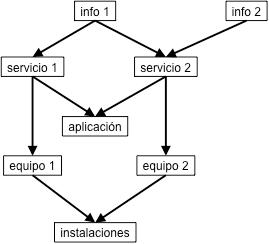
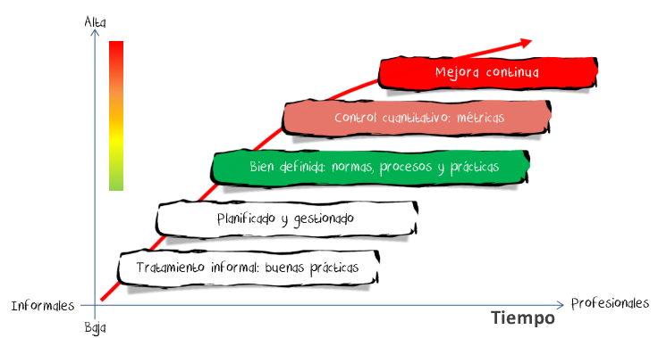

# Estándares de securización de sistemas y redes

En este apartado se introducen las principales normas nacionales e internacionales relacionadas con la seguridad de la información y la gestión del riesgo.

## ISO/IEC 31000 - Gestión del riesgo

<!-- https://www.isotools.org/normas/riesgos-y-seguridad/iso-31000/ -->

Esta norma fue publicada en 2018 por la Organización Internacional de Normalización (ISO) en colaboración con IEC, y tiene por objetivo que organizaciones de todos los tipos y tamaños puedan gestionar los riesgos en la empresa de forma efectiva, por lo que recomienda que las organizaciones desarrollen, implanten y mejoren continuamente un marco de trabajo cuyo objetivo es integrar el proceso de gestión de riesgos en cada una de sus actividades.

La norma ISO 31000 **no es certificable**, consiste en una serie de buenas prácticas. Y no lo es porque no hace referencia a un sistema de gestión concreto.
**Aborda cualquier tipo de riesgo**, entre ellos, por supuesto, los vinculados a la seguridad de la información, pero también, los referentes a la continuidad del negocio, los riesgos operacionales, los riesgos ambientales, etc. Sin embargo, al tratarse de un estándar de aplicación general, no profundiza en una metodología especifica para atender un determinado sector o un área concreta, como sí lo hace ISO 27001.

Como complemento a esta norma se ha desarrollado otro estándar: la **ISO 31010** “Gestión del riesgo. Técnicas de evaluación de riesgos”. Esta norma provee de una serie de técnicas para la identificación y evaluación de riesgos, tanto positivos como negativos.

## Familia de normas ISO/IEC 27000 (SGSI)

Esta familia de normas establece los requisitos que deben cumplir los **Sistemas de gestión de la Seguridad de la Información** **(SGSI)**. La norma principal es la **ISO/IEC 27001** que es **certificable**. Su cumplimiento es de carácter voluntario.

> Las normas ISO/IEC no son de libre difusión, están protegidas por leyes de protección intelectual, para el acceso al texto completo deben ser adquiridas:
> 
> * Originales en inglés en Tienda ISO: [https://www.iso.org/store.html](https://www.iso.org/store.html)
> * En español AENOR: [https://tienda.aenor.com/](https://tienda.aenor.com/)

{width=80%}

| Norma         | Descripción                                                                                      |
| ------------- | ------------------------------------------------------------------------------------------------ |
| ISO **27000** | Contiene las definiciones y los términos que se utilizarán durante toda la serie 27000           |
| ISO **27001** | Sistema de Gestión de Seguridad de la Información. **Certificable**                              |
| ISO **27002** | Manual de buenas prácticas en la que se describen los objetivos de control y las evaluaciones    |
| ISO 27003     | Información necesaria para la utilización del ciclo PHVA (Planificar, Hacer, Verificar y Actuar) |
| ISO 27004     | Técnicas de medida y las métricas que son aplicables                                             |
| ISO **27005** | Gestión de los Riesgos en la Seguridad de la Información                                         |
| ISO 27006     | Requisitos para lograr la acreditación de las entidades de auditoría y certificación             |
| ISO 27007     | Manual de auditoría de un Sistema de Gestión de Seguridad de la Información                      |
| ISO 27011     | Gestión de seguridad de la información específica para telecomunicaciones                        |
| ISO 27017     | Seguridad en servicios en Cloud                                                                  |
| ISO 27018     | Privacidad en servicios en Cloud                                                                 |

Table: Principales normas de la familia ISO/IEC 27001

### ISO/IEC 27000

Esta norma proporciona una visión general de la familia de normas que componen la serie 27000, y define la **terminología** utilizada. Establece la importancia de la la implantación de un SGSI, una introducción a los Sistemas de Gestión de Seguridad de la Información, una breve descripción de los pasos para el establecimiento, monitorización, mantenimiento y mejora de un SGSI .

> Disponible para la descarga de forma pública: [https://standards.iso.org/ittf/PubliclyAvailableStandards/c073906_ISO_IEC_27000_2018_E.zip](https://standards.iso.org/ittf/PubliclyAvailableStandards/c073906_ISO_IEC_27000_2018_E.zip)

### ISO/IEC 27001

**Es la norma principal de la serie** y contiene los **requisitos del sistema de gestión de seguridad de la información**. Define qué debería tener un SGSI, pero no define cómo implementarlo.
Es la norma con arreglo a la cual se certifican por auditores externos los SGSIs de las organizaciones. 
 
En su Anexo A, enumera en forma de resumen los objetivos de control y controles que desarrolla la norma **ISO/IEC 27002**. A pesar de no ser obligatoria la implementación de todos los controles, cada organización deberá argumentar sólidamente la no aplicabilidad de los controles no implementados.

> Existe una reciente edición puesta a libre disposición pública por "Industria Conectada 4.0" de la versión [UNE-ISO/IEC 27001:2017 (https://www.industriaconectada40.gob.es/difusion/Paginas/enlaces-interes.aspx](https://www.industriaconectada40.gob.es/difusion/Paginas/enlaces-interes.aspx) que es una edición consolidada de la traducción del 2013 y que incorpora las correcciones de 2015.

## Esquema Nacional de Seguridad (ENS)

El ENS establece la **política de seguridad para la protección adecuada de la información y los servicios prestados a por las administraciones públicas**, así como los **proveedores del sector privado** que prestan servicio a las administraciones publicas. Estas políticas se estructuran en base a un planteamiento común de **principios, requisitos, medidas de protección, mecanismos de conformidad y monitorización** para todas las entidades en el alcance.

> Publicado en el Real Decreto 311/2022, de 3 de mayo, por el que se regula el Esquema Nacional de Seguridad: [https://www.boe.es/eli/es/rd/2022/05/03/311](https://www.boe.es/eli/es/rd/2022/05/03/311)

Objetivos del ENS:

* Crear las condiciones necesarias de seguridad en el uso de los medio electrónicos. Promover la gestión continuada de la seguridad
* Promover la prevención, detección y corrección
* Promover un tratamiento homogéneo de la seguridad
* Servir de modelo de buenas prácticas

[Esquema Nacional de Seguridad - ENS](https://administracionelectronica.gob.es/pae_Home/pae_Estrategias/pae_Seguridad_Inicio/pae_Esquema_Nacional_de_Seguridad.html)

<!--
https://administracionelectronica.gob.es/pae_Home/pae_Estrategias/pae_Seguridad_Inicio/pae_metodos_instrumentos_y_normas.html
-->

### Adecuación al Esquema Nacional de Seguridad

Una adecuación ordenada al Esquema Nacional de Seguridad requiere el tratamiento de las siguientes cuestiones:

* **Preparar y aprobar la política de seguridad**, incluyendo los objetivos o misión de la organización, el marco regulatorio de las actividades, la definición de roles de seguridad, la estructura y composición del comité para la gestión y coordinación de la seguridad, las directrices de estructuración de la documentación de la seguridad, y los riesgos derivados del tratamiento de datos personales.
* **Categorizar los sistemas** atendiendo a la valoración de la información manejada y de los servicios prestados.
* Realizar el **análisis de riesgos**, incluyendo la valoración de las medidas de seguridad existentes.
* Preparar y aprobar la **Declaración de aplicabilidad de las medidas del Anexo II del ENS**.
* **Elaborar un plan de adecuación** para la mejora de la seguridad, sobre la base de las insuficiencias detectadas, incluyendo plazos estimados de ejecución.
* **Implantar, operar y monitorizar** las medidas de seguridad a través de la gestión continuada de la seguridad correspondiente.
* **Auditar la seguridad** para verificar el cumplimiento de los requisitos del ENS.
* **Obtener y publicitar la conformidad con el ENS**. 
* **Informar sobre el estado de la seguridad**.

## NIST Cybersecurity Framework

Es un marco de ciberseguridad creado para ayudar a las empresas de todos los tamaños a comprender, gestionar y reducir los riesgos cibernéticos y proteger sus redes y datos, proporcionando un lenguaje común y un resumen de las mejores prácticas en ciberseguridad.
Sus resultados se basan en la mejora de los 5 procesos que constituyen el ciclo de la ciberseguridad que presenta el marco:

{width=30%}

* **IDENTIFICAR**:
Desarrollar una comprensión organizacional para la gestión del riesgo de ciberseguridad de: sistemas, activos, datos y capacidades.
	- Identificar los procesos y activos críticos empresariales
	- Flujos de información de documentos
	- Mantener el inventario de hardware y software
	- Establecer políticas para la ciberseguridad que incluyan roles y responsabilidades
	- Identificar amenazas, vulnerabilidades y riesgos a activos

* **PROTEGER**:
Desarrollar e implementar las protecciones apropiadas para garantizar la entrega de servicios.

* **DETECTAR**: 
Desarrollar e implementar las actividades apropiadas para identificar cuando ocurra un evento de ciberseguridad

* **RESPONDER**:
Desarrollar e implementar las actividades apropiadas para tomar acción en relación con un evento de ciberseguridad detectado.

* **RECUPERAR**:
Desarrollar e implementar las actividades apropiadas para mantener planes para la resiliencia y para reestablecer cualesquiera capacidades o servicios que hayan sido afectados durante un evento de ciberseguridad.

El grado de madurez de los controles se evalúa en función a **4 niveles de implementación**: 

* **Parcial**:
No formalizado. Ad-hoc. Reactivo.

* **Informado**:
Procesos aprobados, pero podrían no ser establecidos como políticas de toda la organización. 
Actividades de ciberseguridad basadas en objetivos de riesgo.

* **Repetible**:
Procesos aprobados y se expresan como políticas.
Actividades de ciberseguridad se actualizan regularmente con base a cambios en el perfil de riesgos

* **Adaptativo**:
Mejora continua.
Incluye lecciones aprendidas e indicadores predictivos.
La organización continuamente se adapta a un panorama cambiante de amenazas y tecnologías y responde de forma eficaz.

# Guías de buenas prácticas

Los siguientes apartados detallan guías de buenas prácticas para la securización de sistemas y redes. 

## ISO/IEC 27002

ISO/IEC 27002 define un **Código de prácticas para los controles de seguridad de la información**.

Es una **guía de buenas prácticas** que describe los objetivos de control y **controles** recomendables en cuanto a seguridad de la información. **No es certificable**. 

> Existe una edición puesta a libre disposición pública por "Industria Conectada 4.0" de la versión[ UNE-ISO/IEC 27002:2017 https://www.industriaconectada40.gob.es/difusion/Paginas/enlaces-interes.aspx](https://www.industriaconectada40.gob.es/difusion/Paginas/enlaces-interes.aspx) que es una edición consolidada de la traducción del 2013 y que incorpora las correcciones de 2015. La última versión es de 2022.

Dentro de cada sección, se especifican los objetivos de los distintos controles para la seguridad de la información. Para cada uno de los controles se indica asimismo una guía para su implantación.

**ISO/IEC 27002:2013** establece 14 dominios, 35 objetivos de control Y 114 controles. Aunque cada organización debe considerar previamente cuántos serán realmente los aplicables según sus propias necesidades.

> ISO/IEC 27002:2013. 14 DOMINIOS, 35 OBJETIVOS DE CONTROL Y 114 CONTROLES: [https://www.iso27000.es/assets/files/ControlesISO27002-2013.pdf](https://www.iso27000.es/assets/files/ControlesISO27002-2013.pdf)

La versión de 2013 del estándar describe los siguientes catorce dominios principales:

1. **Políticas de Seguridad**
	1. Gestión directiva en seguridad
2. **Organización de la Seguridad de la Información** 
	1. Organización interna
	2. Dispositivos móviles y teletrabajo
3. **Seguridad de los Recursos Humanos**
	1. Pre contratación
	2. Durante el contrato
	3. Finalización y cambio de contrato
4. **Gestión de los Activos**
	1. Responsabilidad por los activos
	2. Clasificación de la información
	3. Manejo de los medios de comunicación
5. **Control de Accesos**
	1. Gestión del acceso en usuarios
	2. Responsabilidades del usuario
	3. Control de acceso en sistemas y aplicaciones
6. **Cifrado**
	1. Controles en el cifrado
7. **Seguridad Física y Ambiental**
	1. 	Áreas seguras
	1. 	Equipamiento
8. **Seguridad de las Operaciones**
	1. Procedimientos y responsabilidades operativas
	1. Protección ante malware
	1. Copias de seguridad
	1. Registros y monitoreo
	1. Control del software operacional
	1. Gestión de las vulnerabilidades técnicas
	1. Consideraciones en auditorias de sistemas
9. **Seguridad de las Comunicaciones**
	1. Gestión de la seguridad en red
	1. Transferencia de información
10. **Adquisición de sistemas, desarrollo y mantenimiento**
	1. Requisitos de seguridad en sistemas de la información
	1. Seguridad en el desarrollo y proceso de soporte
	1. Pruebas
11. **Relaciones con los Proveedores**
	1. Seguridad de la información en las relaciones con proveedores
	1. Gestión de la entrega con proveedores
12. **Gestión de Incidencias que afectan a la Seguridad de la Información**
	1. Gestión de incidentes y mejoras
13. **Aspectos de Seguridad de la Información para la Gestión de la Continuidad del Negocio**
	1. Continuidad en la seguridad de la información
	1. Redundancias
14. **Cumplimiento**
	1. Cumplimiento con la ley y los requisitos de contratos
	1. Revisiones en la seguridad de la información

El 15 de febrero se publicó una nueva versión de la norma, la **ISO 27002:2022**. Se puede ver el esquema en la tienda de ISO :[https://www.iso.org/standard/75652.html](https://www.iso.org/standard/75652.html) Han sido varios los cambios que ha sufrido:

* El número de controles se ha visto reducido de 114 a 93. La ISO 27002:2022 incorpora 11 nuevos controles para adaptar la norma a las nuevas tecnologías (otros de los controles han sido agrupados o renombrados) y necesidades surgidas en los últimos años:

	* Inteligencia de amenazas
	* Seguridad de la información en la nube
	* Continuidad del negocio
	* Seguridad física y su supervisión
	* Configuración
	* Eliminación de la información
	* Encriptación de datos
	* Prevención de fugas de datos
	* Seguimiento y monitoreo
	* Filtrado web
	* Codificación segura

* El número de dominios se ha reducido asimismo de 14 a 4 (se ha reestructurado su clasificación).

	* Controles organizacionales (37)
	* Controles de personas (8)
	* Controles físicos (14)
	* Controles Tecnológicos (34)

**Aún no se ha publicado la actualización de la ISO/IEC 27001:2022 que actualice el anexo A con los nuevos controles**.

## CCN 

El Centro Criptológico Nacional ([CCN](https://www.ccn.cni.es/index.php/es/menu-ccn-es/funciones-del-ccn)) depende del Centro Nacional de Inteligencia (CNI).

La primera de sus funciones asignadas es "Normativa. Elaborar y difundir normas, instrucciones, guías y recomendaciones para garantizar la seguridad de los sistemas TIC ([Guías CCN-STIC](https://www.ccn-cert.cni.es/guias/guias-series-ccn-stic))".

Destacando las [Guías del Esquema Nacional de Seguridad: https://www.ccn-cert.cni.es/guias/guias-series-ccn-stic/800-guia-esquema-nacional-de-seguridad.html](https://www.ccn-cert.cni.es/guias/guias-series-ccn-stic/800-guia-esquema-nacional-de-seguridad.html)

También publica una serie de [informes de buenas prácticas:
https://www.ccn-cert.cni.es/informes/informes-de-buenas-practicas-bp.html](https://www.ccn-cert.cni.es/informes/informes-de-buenas-practicas-bp.html)

Un [decálogo de ciberseguridad: https://www.ccn-cert.cni.es/documentos-publicos/1153-decalogo-de-ciberseguridad/file.html](https://www.ccn-cert.cni.es/documentos-publicos/1153-decalogo-de-ciberseguridad/file.html)

Un [decálogo de prevención proactiva: https://angeles.ccn-cert.cni.es/index.php/es/docman/documentos-publicos/372-infografia-decalogo-prevencion-proactiva/file](https://angeles.ccn-cert.cni.es/index.php/es/docman/documentos-publicos/372-infografia-decalogo-prevencion-proactiva/file)

## INCIBE

El Instituto Nacional de CIBErseguridad de España (INCIBE), anteriormente Instituto Nacional de Tecnologías de la Comunicación, es una sociedad dependiente del Ministerio de Asuntos Económicos y Transformación Digital a través de la Secretaría de Estado de Digitalización e Inteligencia Artificial y consolidada como entidad de referencia para el desarrollo de la ciberseguridad y de la confianza digital de ciudadanos, red académica y de investigación, profesionales, empresas y especialmente para sectores estratégicos.

Dispone de multitud de guías y materiales para ayudar a las pymes a mejorar su nivel de ciberseguridad:
[https://www.incibe.es/protege-tu-empresa/que-te-interesa](https://www.incibe.es/protege-tu-empresa/que-te-interesa)

Destacaremos el decálogo de ciberseguridad: [https://www.incibe.es/sites/default/files/contenidos/guias/doc/guia_decalogo_ciberseguridad_metad.pdf
](https://www.incibe.es/sites/default/files/contenidos/guias/doc/guia_decalogo_ciberseguridad_metad.pdf)

## NIST SP 800-53

Desarrollada por el Instituto Nacional de Estándares y Tecnología de Estados Unidos (NIST). La (SP) Special Publication, define una serie de controles para desarrollar sistemas más seguros y eficientes. Se trata de guías tanto operacionales como técnicas. Para la gestión de la ciberseguridad de las organizaciones, utiliza un ciclo de mejora continua basado en procesos de seguridad ( Identificar – Proteger – Detectar – Responder – Recuperar).

Se puede consultar en el siguiente enlace:
[https://nvlpubs.nist.gov/nistpubs/SpecialPublications/NIST.SP.800-53r5.pdf](https://nvlpubs.nist.gov/nistpubs/SpecialPublications/NIST.SP.800-53r5.pdf)

# Gestión del riesgo

La gestión de riesgos es un proceso iterativo, que consta de dos partes diferenciadas: 

> **Gestión de riesgos = Análisis de riesgos + Tratamiento de riesgos**

La primera parte es el **análisis de riesgos** que en el caso de sistemas de información es una actividad compleja. Y como toda actividad compleja requiere ser afrontada metódicamente, gestionándola como un proyecto con sus tareas, entregas y puntos de control; y  ajustándose a una  **metodología** que sirva de guía y permita explicar y comparar los resultados. El uso de una metodología permite estandarizar los resultados.

La segunda parte consiste en el **tratamiento de los riesgos** mediante la definición del  **Plan de Seguridad** o de Mejora de la Seguridad, y que consiste en una serie de actuaciones destinadas al tratamiento de los riesgos detectados en el análisis de riesgos. Corrigiendo aquellos puntos en los que el riesgo sea excesivo y asegurando que los recursos dedicados a proteger los distintos activos sea proporcional al valor de los mismos.

## Sistema de gestión de seguridad de la información (SGSI)

El establecimiento e implementación de un Sistema de Gestión de Seguridad de la Información (SGSI) en una organización depende de varios factores, como sus necesidades, **objetivos**, **requisitos de seguridad**, los **procesos** organizativos utilizados, así como su tamaño y estructura. Estos factores son dinámicos y es probable que evolucionen con el tiempo.

El SGSI tiene como propósito **preservar la confidencialidad, integridad y disponibilidad de la información** mediante la aplicación de un proceso de **gestión de riesgos**, proporcionando así confianza a las partes interesadas sobre la adecuada gestión de los riesgos de seguridad.

Es crucial que el SGSI esté **integrado con los procesos organizativos y la estructura de gestión global**. La seguridad de la información debe considerarse desde el diseño de los procesos, los sistemas de información y los controles. Es fundamental que la implementación del SGSI se adapte a las necesidades específicas de la organización.

Las principales fuentes de requisitos de seguridad son:

1. **Evaluación de riesgos**: considerando los objetivos y la estrategia de negocio de la organización, se identifican las amenazas a los activos, se evalúan las vulnerabilidades y la probabilidad de ocurrencia, y se estima el impacto potencial.
    
2. **Requisitos legales, estatutarios, regulatorios y contractuales**: que deben ser cumplidos por la organización, así como por sus socios comerciales, contratistas, proveedores de servicios y el entorno socio-cultural en el que opera.
    
3. **Principios, objetivos y requisitos de negocio**: que la organización ha definido para el manejo, tratamiento, almacenamiento, comunicación y archivo de la información que respalda sus operaciones.
    

Es fundamental que los recursos destinados a la implementación de los controles estén equilibrados con el nivel de daño potencial que podría resultar de incidentes de seguridad en ausencia de dichos controles. Los resultados de la evaluación de riesgos orientarán y determinarán las acciones de gestión más apropiadas, estableciendo prioridades en la gestión de los riesgos de seguridad de la información y en la implementación de los controles necesarios para mitigar estos riesgos.

## Principios para la gestión de riesgos

Los principios para la gestión del riesgo según la norma **según ISO/IEC 31000** son los siguientes:

* **Crear y proteger el valor**. Contribuye a la consecución de objetivos así como la mejora de ciertos aspectos tales como la seguridad y salud laboral, cumplimiento de los requisitos legales, protección ambiental, etc.
* Estar **integrada en los procesos de una organización**. No debe ser entendida como una actividad aislada sino como parte de las actividades y procesos principales de una organización.
* **Formar parte de la toma de decisiones**. La gestión del riesgo ayuda a la toma de decisiones evaluando la información sobre las distintas alternativas.
* Tratar explícitamente la **incertidumbre**. La gestión del riesgo trata aquellos aspectos de la toma de decisiones que son inciertos, la naturaleza de esa incertidumbre y cómo puede tratarse.
* Ser **sistemática**, estructurada y adecuada. Contribuye a la eficiencia y, consecuentemente, a la obtención de resultados fiables.
* Basarse en la mejor **información disponible**. Los inputs del proceso de gestión del riesgo están basados en fuentes de información como la propia experiencia, la observación y la opinión de expertos.
* Estar hecha a medida. La gestión del riesgo está **alineada con el contexto externo e interno de la organización** y con su perfil de riesgo.
* Tener en cuenta **factores humanos y culturales**. Reconoce la capacidad y percepción de los empleados y personas interesadas, esto puede facilitar o dificultar la consecución de los objetivos de la organización.
* Ser transparente e inclusiva. La apropiada y oportuna participación de los grupos de interés (stakeholders) y, en particular, de los responsables a todos los niveles, asegura que la gestión del riesgo permanece relevante y actualizada.
* Ser dinámica, iterativa y sensible al cambio. La organización debe velar para que la **gestión del riesgo detecte y responda a los cambios de la empresa y de su entorno**.
* Facilitar la mejora continua de la organización. Las organizaciones deberían desarrollar e implementar **estrategias para mejorar continuamente, tanto en la gestión del riesgo** como en cualquier otro aspecto de la organización.

## Metodologías para la gestión del riesgo

Existen numerosas metodologías para la gestión del riesgo, se pueden consultar algunas de ellas en el siguiente listado de ENISA:

[https://www.enisa.europa.eu/topics/threat-risk-management/risk-management/current-risk/risk-management-inventory/rm-ra-methods](https://www.enisa.europa.eu/topics/threat-risk-management/risk-management/current-risk/risk-management-inventory/rm-ra-methods)

A continuación se detallan algunas de las más relevantes:

### ISO/IEC 27005

La norma ISO/IEC 27005 se centra en proporcionar un proceso continuo que consiste en realizar una serie de actividades de forma iterativa:

- Establecer el contexto del proceso de gestión de riesgos. Para ello se identifica el alcance, las obligaciones legales y contractuales y criterios como la tolerancia al riesgo de la organización.
- Evaluar cuantitativamente o cualitativamente información relevante sobre los riesgos. Teniendo en cuenta amenazas, información sobre los activos, y controles y vulnerabilidades existentes.
- Tratar el riesgo de forma apropiada usando métricas comunes para determinar qué riesgos hay que priorizar.
- Mantener informadas a las partes interesadas durante el proceso.
- Monitorizar y revisar el contexto, los riesgos y las obligaciones de forma continuada identificando y respondiendo apropiadamente a cambios significativos.

### MARGERIT v3

MAGERIT versión 3 es la metodología de análisis y gestión de riesgos elaborada en su día por el antiguo Consejo Superior de Administración Electrónica y actualmente mantenida por la Secretaría General de Administración Digital (Ministerio de Asuntos Económicos y Transformación Digital) con la colaboración del Centro Criptológico Nacional (CCN).

MAGERIT es una metodología de carácter público que puede ser utilizada libremente y no requiere autorización previa. Interesa principalmente a las entidades en el ámbito de aplicación del Esquema Nacional de Seguridad (ENS)

MAGERIT implementa el Proceso de Gestión de Riesgos dentro de un marco de trabajo para que los órganos de gobierno tomen decisiones teniendo en cuenta los riesgos derivados del uso de tecnologías de la información.

MAGERIT versión 3 se estructura en tres libros: "Método", "Catálogo de Elementos" y "Guía de Técnicas". Está disponible en el siguiente enlace: 
[https://administracionelectronica.gob.es/pae_Home/pae_Documentacion/pae_Metodolog/pae_Magerit.html](https://administracionelectronica.gob.es/pae_Home/pae_Documentacion/pae_Metodolog/pae_Magerit.html)

### NIST SP 800-30 

<!-- TODO: mejora de este párrafo -->

Metodología creada por el gobierno norteamericano. Desarrollada por el [NIST](https://csrc.nist.gov/publications) (National Institute of Standards and Techonogy).

Puede ser consultada en el siguiente enlace:
[NIST SP 800-30 https://csrc.nist.gov/publications/detail/sp/800-30/rev-1/final](https://csrc.nist.gov/publications/detail/sp/800-30/rev-1/final)

## Marco de trabajo

El compromiso de la dirección de la organización con  la gestión de riesgos  es básico para llevarla a cabo con éxito. 

La gestión de riesgos debe estar plenamente integrada en los procesos de la empresa y requiere un compromiso fuerte y sostenido de la dirección. 
Así como el establecimiento de una rigurosa **planificación estratégica**, que ha de ser objeto de seguimiento y revisión periódica que permitan medir el progreso y adaptarse a los cambios del entorno, tomando las decisiones oportunas para la mejora continua.

Para conseguir una buena gestión del riesgo el marco de trabajo definido ha de:

* comprender la empresa y su contexto
* establecer una **política de gestión de riesgos**
* identificar autoridades y competencias
* definir la integración en los procesos de negocio como plan estratégico para que sea relevante, eficaz y eficiente
* proporcionar los **recursos** necesarios:
	* personas, formación 
	* procesos y procedimientos 
	* métodos y herramientas
* establecer mecanismos de comunicación interna y externa

Este marco de trabajo se implementará definiendo un **calendario** y estrategia de implementación y revisión que permita:

* establecer y desarrollar los objetivos
* aplicar la política y el proceso
* cumplir con la legislación y normativa
* organizar la formación y la comunicación y consulta a los interesados

### Política de gestión de riesgos

El establecimiento de una política de gestión de riesgos en la que se indiquen con claridad los objetivos y se materialice el compromiso de toda la empresa va a ser clave para una gestión de riesgos eficaz. La política tratará estas cuestiones:

* motivos para llevar a cabo la gestión de riesgos
* relación con otras políticas de la empresa
* responsabilidades y rendición de cuentas en el proceso de gestión de riesgos n recursos disponibles
* medición del desempeño
* compromiso de revisión del marco de trabajo y de la política

## Proceso de gestión del riesgo

La siguiente figura muestra las etapas del proceso de gestión del riesgo según la norma ISO 31000:

{width=60%}

### Comunicación y consulta

Esta actividad es la primera y abarca todas las siguientes, pues se ha de realizar en todas las etapas. En ella se fomenta la participación y se coordinan las actuaciones de todas las partes implicadas, **tanto internas como externas**, en la gestión de riesgos.

### Determinar el contexto

Es esencial que la gestión de riesgos se integre tanto con el resto de áreas de la empresa como con su entorno externo. Por tanto hay que determinar los condicionantes tanto internos como externos que definen el marco de trabajo. A nivel interno se tendrán en cuenta: la **cultura, recursos, procesos y objetivos del negocio**. A nivel externo se consideran diferentes aspectos relativos al **entorno social, económico o legislativo**.

Como resultado de esta fase se establecen:

* los objetivos de la gestión de riesgo
* los criterios que se emplearán para la evaluación de los riesgos, el método a utilizar en el establecimiento de probabilidades, así como las magnitudes de los impactos
* el alcance de la gestión de riesgos, los roles y la asignación de responsabilidades

### Valoración o Apreciación del riesgo

Una vez definido el contexto se han de valorar los riesgos. En esta etapa se determinan los riesgos que van a ser controlados por medio de su **identificación, análisis y evaluación**. Todos aquellos riesgos que no sean identificados quedarán como riesgos ocultos o no controlados. Se realizan en esta fase las siguientes actividades:

* **Identificación del riesgo**, cuyo objetivo es búsqueda, reconocimiento y descripción de todos los posibles puntos de peligro tanto internos como externos; para cada uno de ellos se determinará su impacto y probabilidad. Esta fase responde a las siguientes preguntas:
	* ¿qué puede pasar? 
	* ¿cuándo y dónde? 
	* ¿cómo y por qué?

* **Análisis del riesgos** es la etapa en la cual se califican cada uno de los riesgos identificados tanto de forma cuantitativa (valorando su impacto) como cualitativa (importancia relativa) para priorizar nuestros esfuerzos de forma no arbitraria. En esta actividad también se persigue comprender cómo se desarrollan los riesgos, estudiando sus causas y consecuencias, así como evaluando la eficacia de los diferentes medios de control implantados en la empresa.
	* Se mide el nivel de riesgo según la fórmula **Riesgo = Impacto x Probabilidad**, valorando las consecuencias y la probabilidad de cada riesgo.

* **Evaluación del riesgo**, cuyo objetivo es determinar prioridades en el uso de los recursos a emplear en la gestión de riesgos. En esta fase se amplía la calificación del análisis anterior incluyendo valoraciones en términos de estrategia de negocio que permitan establecer qué riesgos son aceptables y cuáles no.

### Tratamiento del riesgo

A continuación se identifican y evalúan las opciones existentes de tratamiento de cada uno de los riesgos que sea necesario tratar según se determinó en la fase anterior. Las opciones de tratamiento son: evitarlo, reducirlo o mitigarlo, transferirlo o compartirlo y aceptarlo.

### Seguimiento y revisión

Para conseguir una mejora continua se supervisa «lo que está ocurriendo» en la práctica y se realizan las correcciones que fuera preciso. También se ha de evaluar el propio sistema de gestión, detectando posibles deficiencias y oportunidades de mejora. La revisión de los cambios del entorno está incluida en esta etapa, realimentando la fase de determinación del contexto.

## Roles

<!--
**Responsable de la información:**
Típicamente a nivel de gobierno. Tiene la responsabilidad última sobre qué seguridad requiere una cierta información manejada por la Organización.
A este nivel se suele concretar la responsabilidad sobre datos de carácter personal y sobre la clasificación de la información.
A veces este role lo ejerce el Comité de Seguridad de la Información.

**Responsable del servicio**
Típicamente a nivel de gobierno, aunque a veces baja a nivel ejecutivo. Tiene la responsabilidad última de determinar los niveles de servicio aceptables por la Organización.
A veces este role lo asume el Comité de Seguridad de la Información.

**Responsable de la seguridad**
Típicamente a nivel ejecutivo, actuando como engranaje entre las directrices emanadas de los responsables de la información y los servicios, y el responsable del sistema. A su vez funciona como supervisor de la operación del sistema y vehículo de reporte al Comité de Seguridad de la Información.
A veces se denomina a esta figura CISO (Chief Information Security Officer).
En lo que respecta al proceso de gestión de riesgos, es la persona que traslada la valoración de los activos esenciales, que aprueba la declaración de aplicabilidad de salvaguardas, los procedimientos operativos, los riesgos residuales y los planes de seguridad. En esta función de informante, suele ser la persona encargada de elaborar los indicadores del esto de seguridad del sistema.

**Responsable del sistema**
A nivel operacional. Toma decisiones operativas: arquitectura del sistema, adquisiciones, instalaciones y operación del día a día.
En lo que respecta al proceso de gestión de riesgos, es la persona que propone la arquitectura de seguridad, la declaración de aplicabilidad de salvaguardas, los procedimientos operativos y los planes de seguridad. También es la persona responsable de la implantación y correcta operación de las salvaguardas.

**Administradores y operadores**
Son las personas encargadas de ejecutar las acciones diarias de operación del sistema según las indicaciones recibidas de sus superiores jerárquicos.
-->

 En la gestión de riesgos aparecen diferentes actores que se pueden definir mediante roles. En MARGERIT V3 aparecen los siguientes roles:
 
* **Propietario del riesgo:**
persona de alto nivel, en los órganos de gobierno, que marca lo que hay que proteger, en qué medida hay que protegerlo y con capacidad de asignar recursos para su protección y aceptar el riesgo residual.

* **Responsable de seguridad** (RSEG):
persona que traduce los requisitos abstractos del propietario del riesgo en un análisis de riesgos para ver en qué medida se satisfacen aquellos requisitos en el sistema de información. Esta misma persona propone planes de tratamiento o actuaciones encaminadas a modificar el riesgo.
A veces se denomina a esta figura **CISO** (Chief Information Security Officer).

* **Responsable del sistema** (RSIS):
a veces denominado responsable de operaciones o de producción. Esta persona gestiona el día a día del sistema, asegurándose de que los operadores implementan y supervisan los planes previstos por el RSEG y aprobados por el propietario del riesgo.

La figura muestra una posible concreción de lo expuesto en los párrafos anteriores. Se identifican una serie de actividades y una serie de roles, creando una matriz RACI, así denominada porque en para cada actividad se determina el role de cada actor:

{width=80%}

* **A** – el que tiene **autoridad** y es el último responsable de la actividad
* **R** – el que tiene la **responsabilidad** de que se lleve a cabo, atendiendo a las indicaciones de la Autoridad
* **C** – sujetos que deben ser **consultados** antes de decidir; probablemente su opinión sea vinculante y en todo caso hay que tenerla en cuenta
* **I** – sujetos que deben estar **informados**, aunque su opinión no sea vinculante

# Análisis de riesgos

El análisis de riesgos es una aproximación metódica para determinar el riesgo siguiendo los siguientes pasos:

1. determinar los **activos** relevantes para la Organización, su interrelación y su valor, en el sentido de qué perjuicio (coste) supondría su degradación
2. determinar a qué **amenazas** están expuestos aquellos activos
3. determinar qué **salvaguardas** hay dispuestas y su eficacia frente al riesgo
4. estimar el **impacto**, definido como el daño sobre el activo derivado de la materialización de la amenaza
5. estimar el **riesgo**, definido como el impacto ponderado con la tasa de ocurrencia (o expectativa de materialización) de la amenaza

La siguiente figura recoge este primer recorrido, cuyos pasos se detallan en las siguientes secciones:

{width=60%}

## Identificación de activos

En un sistema de información hay 2 tipos de **activos esenciales**: 

* la **información** que maneja
* y los **servicios** que presta. 

Estos activos esenciales marcan los requisitos de seguridad para todos los demás componentes del sistema. Subordinados a dicha esencia se pueden identificar otros activos relevantes:

* **Datos** que materializan la información.
* **Servicios auxiliare**s que se necesitan para poder organizar el sistema.
* Las aplicaciones informáticas (**software**) que permiten manejar los datos.
* Los equipos informáticos (**hardware**) y que permiten hospedar datos, aplicaciones y servicios.
* Los **soportes de información** que son dispositivos de almacenamiento de datos.
* El **equipamiento auxiliar** que complementa el material informático.
* Las **redes de comunicaciones** que permiten intercambiar datos.
* Las **instalaciones** que acogen equipos informáticos y de comunicaciones.
* Las **personas** que explotan u operan todos los elementos anteriormente citados.

### Dependencias

Los activos esenciales son la información y los servicios prestados; pero estos activos dependen de otros activos, como pueden ser los equipos, las comunicaciones, las instalaciones y las frecuentemente olvidadas personas que trabajan con aquellos.

Para enlazar unos con otros se utiliza un grafo de dependencias de activos.

{width=40%}

Se dice que un **activo superior** depende de otro **activo inferior** cuando las necesidades de seguridad del superior se reflejan en las necesidades de seguridad del inferior. En otras palabras, cuando la materialización de una amenaza en el activo inferior tiene como consecuencia un perjuicio sobre el activo superior. Informalmente puede interpretarse que los activos inferiores son los pilares en los que se apoya la seguridad de los activos superiores.

## Valoración de activos

La valoración de activos parece fácil, pero es muy laboriosa, requiere experiencia y está sujeta a cierto grado de subjetividad y controversia. Cabe recordar que es necesario que cada activo tenga un propietario, responsable último en tomar las decisiones con respecto a dicho activo.

La valoración de los activos puede realizarse mediante estimaciones **cualitativas** (Escalas, Ej: Alto, Medio, Bajo) y **cuantitativas** (Euros) o una combinación de ambas. 

Por valor del activo se debe entender las consecuencias que tendría para la organización la materialización de un incidente sobre dicho activo.
El **valor** puede ser **propio**, o puede ser **acumulado**. Se dice que los activos inferiores en un esquema de dependencias, acumulan el valor de los activos que se apoyan en ellos.

El valor suele estar en la **información** que el sistema maneja y los **servicios** que se prestan (activos denominados esenciales), quedando los demás activos subordinados a éstos.
Un árbol de dependencias, donde los activos superiores dependen de los inferiores, es imprescindible para centrar la valoración en los activos superiores, los que son importantes por sí mismos, automáticamente este valor se acumula en los activos inferiores que sirven de soporte.

La valoración de costes (cuantitativa) es muy interesante para hacer presupuestos donde se compara lo que se arriesga con lo que se gana. Pero es difícil tener números precisos de cosas que no han ocurrido y que si ocurrieran tendrían una dinámica (gestión del incidente) sujeta a muchos factores. Además, hay cosas que no tienen precio: son los **intangibles**, destacando  las consecuencias reputacionales y la pérdida de oportunidades. Y otros aspectos poco cuantitativos como el riesgo regulatorio o las penas por incumplimiento.

Es más sencillo trabajar con una escala de valores, cualitativa, que sin precisar dinero sea capaz de relativizar los riesgos y nos permite centrar los esfuerzos en lo más importante.

### Dimensiones de valoración

De un activo se puede calibrar el valor de las diferentes dimensiones:

* su **confidencialidad**: ¿qué daño causaría que lo conociera quien no debe?
Esta valoración es típica de datos.
* su **integridad**: ¿qué perjuicio causaría que estuviera dañado o corrupto?
Esta valoración es típica de los datos, que pueden estar manipulados, ser total o parcial mente falsos o, incluso, faltar datos.
* su **disponibilidad**: ¿qué perjuicio causaría no tenerlo o no poder utilizarlo? Esta valoración es típica de los servicios.

### Valoración cualitativa

Las escalas cualitativas permiten avanzar con rapidez, posicionando el valor de cada activo en un orden relativo respecto a los demás. Es frecuente plantear estas escalas como “órdenes de magnitud” y, en consecuencia, derivar estimaciones del orden de magnitud del riesgo.

La limitación de las valoraciones cualitativas es que no permiten comparar valores más allá de su orden relativo. No se pueden sumar valores.

<!-- TODO:
La "Guía de Técnicas" presenta un modelo de análisis basado en valoraciones cualitativas.
-->

### Valoración cuantitativa

Las valoraciones numéricas absolutas cuestan mucho esfuerzo; pero permiten sumar valores numéricos. La interpretación de las sumas no es nunca motivo de controversia.
Si la valoración es dineraria, además se pueden hacer estudios económicos comparando lo que se arriesga con lo que cuesta la solución respondiendo a las preguntas:

* ¿Vale la pena invertir tanto dinero en esta salvaguarda?
* ¿Qué conjunto de salvaguardas optimizan la inversión?
* ¿En qué plazo de tiempo se recupera la inversión?
* ¿Cuánto es razonable que cueste la prima de un seguro?

<!-- TODO:
La "Guía de Técnicas" presenta un modelo de análisis basado en valoraciones cuantitativas.
-->

## Determinación de las amenazas

El siguiente paso consiste en determinar las amenazas que pueden afectar a cada activo:

* **De origen natural**
Hay accidentes naturales (terremotos, inundaciones, ...). Ante esos avatares el sistema de información es víctima pasiva, pero de todas formas tendremos en cuenta lo que puede suceder.
* **Del entorno (de origen industrial)**
Hay desastres industriales (contaminación, fallos eléctricos, ...) ante los cuales el sistema de información es víctima pasiva; pero no por ser pasivos hay que permanecer indefensos.
* **Defectos de las aplicaciones**
Hay problemas que nacen directamente en el equipamiento propio por defectos en su diseño o en su implementación, con consecuencias potencialmente negativas sobre el sistema. Frecuentemente se denominan vulnerabilidades técnicas o, simplemente, ‘vulnerabilidades’.
* **Causadas por las personas de forma accidental**
Las personas con acceso al sistema de información pueden ser causa de problemas no intencionados, típicamente por error o por omisión.
* **Causadas por las personas de forma deliberada**
Las personas con acceso al sistema de información pueden ser causa de problemas intencionados: ataques deliberados; bien con ánimo de beneficiarse indebidamente, bien con ánimo de causar daños y perjuicios a los legítimos propietarios.
No todas las amenazas afectan a todos los activos, sino que hay una cierta relación entre el tipo de activo y lo que le podría ocurrir.

Una vez determinado que una amenaza puede perjudicar a un activo, hay que valorar su influencia en el valor del activo, en dos sentidos:

* **degradación**: cuán perjudicado resultaría el valor del activo
* **probabilidad**: cuán probable o improbable es que se materialice la amenaza

La degradación mide el daño causado por un incidente en el supuesto de que ocurrir.

### Valoración de la probabilidad

La probabilidad de ocurrencia es compleja de determinar y de expresar. Se suele modelar numéricamente cono una **frecuencia de ocurrencia**. Es habitual usar **1 año como referencia**, de forma que se recurre a la tasa anual de ocurrencia como medida de la probabilidad de que algo ocurra. Son valores típicos:

| Probabilidad  | Valor | Frecuencia                       |
|---------------|:-----:|----------------------------------|
| MA (Muy Alta) |  100  | Muy Frecuente, a diario          |
| A (Alta)      |   10  | Frecuente, mensualmente          |
| M (Media)     |   1   | Normal, una vez al año           |
| B (Baja)      |  1/10 | Poco frecuente, cada varios años |
| MB (Muy Baja) | 1/100 | Muy poco frecuente, siglos       |
Table: Probabilidad de ocurrencia

### Valoración de la degradación

La degradación mide el daño causado por un incidente en el supuesto de que ocurriera.

La degradación se suele caracterizar como una **fracción del valor del activo** expresada en porcentaje.  Así aparecen expresiones como que un activo se ha visto “totalmente degradado” (100%), o “degradado en una pequeña fracción” (>10%). 

Se pueden limitar los valores apreciables para crear una escala de órdenes de magnitud, por ejemplo:

| Degradación   | Valor | Descripción                        |
|---------------|:-----:|------------------------------------|
| MA (Muy Alta) |  100% | Destrucción completa               |
| A (Alta)      |  90%  | Degradación importante             |
| M (Media)     |  50%  | Denota incertidumbre               |
| B (Baja)      |  10%  | Daños apreciables de segundo orden |
| MB (Muy Baja) |   1%  | Daños testimoniales                |
Table: Escala de degradación del valor

## Evaluación de las Salvaguardas

Se definen las salvaguardas, controles o contra medidas como aquellos procedimientos o mecanismos tecnológicos que reducen el riesgo. Hay amenazas que se evitan simplemente organizándose adecuadamente, otras requieres elementos técnicos (programas o equipos), otras seguridad física y, por último, está la política de personal.

Las salvaguardas entran en el cálculo del riesgo de dos formas:

* **Reduciendo la probabilidad de las amenazas.**
Se llaman salvaguardas preventivas. Las ideales llegan a impedir completamente que la amenaza se materialice.

* **Limitando el daño causado.**
Hay salvaguardas que directamente limitan la posible degradación, mientras que otras permiten detectar inmediatamente el ataque para frenar que la degradación avance. Incluso algunas salvaguardas se limitan a permitir la pronta recuperación del sistema cuando la amenaza lo destruye. En cualquiera de las versiones, la amenaza se materializa; pero las consecuencias se limitan.

### Valoración de salvaguardas

Para evaluar la calidad de las medidas de protección desplegadas para enfrentar a las amenazas, se recurre a un modelo de madurez para calificar procesos basado en la idea de que con el tiempo los procesos pasan de informales a profesionalizados.

{width=90%}

Un planteamiento **informal** es el que se basa en la intuición y buena voluntad de las
personas involucradas. Es un buen punto de partida. 

Avanzando, pasaríamos a un proceso que está **planificado y gestionado**; o sea, que
se encarga a una persona para que se haga cargo del tema. 

Un punto de inflexión importante es cuando los **procedimientos están formalizados** por
escrito y dejamos de depender de la interpretación pasando a la concreción de quién debe
hacer qué cosa. 

Más allá de escribir los procedimientos se debe medir su desempeño: ¿en qué
medida son eficaces frente a las amenazas? y ¿en qué medida el consumo de recursos es
eficiente y proporcionado al beneficio que nos deparan?  

Y la situación óptima o que se considera inmejorable, es cuando entramos en un ciclo de
excelencia o de mejora continua, adaptando los procesos a los resultados medidos.

Para evaluar las salvaguardas usando la métrica de madurez, se asigna un peso a cada nivel:

| **Eficacia** |     -     |      0%     |       10%       |            50%            |        90%       |          95%         |    100%    |
|---------:|:---------:|:-----------:|:---------------:|:-------------------------:|:----------------:|:--------------------:|:----------:|
|    **Nivel** |     NA    |      L0     |        L1       |             L2            |        L3        |          L4          |     L5     |
|  **Madurez** | No aplica | Inexistente | Inicial  Ad/hoc| Reproducible e intuitivo | Proceso definido | Gestionado y medible | Optimizado |
Table: Peso de salvaguardas 

* **No aplica**, medidas que no son necesarios. Por ejemplo, cifrar datos que no son secreto.

* **Nivel L0**,  medidas que deberían estar pero no están. Por ejemplo, es necesario un cortafuegos y no está instalado. Se le atribuirá una eficacia del 0% en la mitigación del riesgo.

* **Nivel L1**,  medidas que sí están, pero no están gestionadas. Por ejemplo, instalar el cortafuegos y no configuarlo. Se le atribuiremos una eficacia testimonial en la mitigación del riesgo.

* **Nivel L2**,  medidas gestionadas de forma informal. Volviendo al cortafuegos, se revisa cuando se considera oportuno. Se gestiona, pero no se hace sistemáticamente. Es difícil calibrar la eficacia de este nivel de madurez; dependerá de la suerte de ser atacados un buen o un mal día. Atribuiremos un nivel del 50%.

* **Nivel L3**, gestión sistemática, con procedimientos escritos que no dependen del voluntarismo de las personas. Le atribuiremos una eficacia del 90%, dejando margen para la mejora.

* **Nivel L4**, 95%, no se confía ciegamente en los procedimientos escritos, se mide si son eficaces.

* **Nivel L5**, nivel óptimo, 100% de eficacia, mejora continua optimizando los procesos a partir de la experiencia.

## Estimación del Impacto

Se denomina impacto a la medida del daño sobre el activo derivado de la materialización de una amenaza. Conociendo el valor de los activos (en varias dimensiones) y la degradación que causan las amenazas, es directo derivar el impacto que estas tendrían sobre el sistema.

{width=90%}

### Impacto residual

Dado un cierto conjunto de salvaguardas desplegadas y una medida de la madurez de su proceso de gestión, el sistema queda en una situación de posible impacto que se denomina residual. Se dice que hemos modificado el impacto, desde un valor potencial a un valor residual.
El cálculo del impacto residual es sencillo. Como no han cambiado los activos, ni sus dependencias, sino solamente la magnitud de la degradación, se repiten los cálculos de impacto con este nuevo nivel de degradación.
La magnitud de la degradación tomando en cuenta la eficacia de las salvaguardas, es la proporción que resta entre la eficacia perfecta y la eficacia real.
El impacto residual puede calcularse acumulado sobre los activos inferiores, o repercutido sobre los activos superiores.

## Estimación del riesgo

Se denomina riesgo a la medida del daño probable sobre un sistema. Conociendo el impacto de las amenazas sobre los activos, es directo derivar el riesgo sin más que tener en cuenta la probabilidad de ocurrencia.

> Riesgo = impacto x probabilidad

La estimación puede realizarse con distinta profundidad o nivel de detalle. 

<!--
Los métodos para realizarla incluyen estimaciones cualitativas y cuantitativas o una combinación de ambas. Suele realizarse una estimación cualitativa inicial para identificar los riesgos que precisan una estimación cuantitativa.
-->

{width=90%}

### Riesgo residual

Dado un cierto conjunto de salvaguardas desplegadas y una medida de la madurez de su proceso de gestión, el sistema queda en una situación de riesgo que se denomina residual. Se dice que hemos modificado el riesgo, desde un valor potencial a un valor residual.
El cálculo del riesgo residual es sencillo. Como no han cambiado los activos, ni sus dependencias, sino solamente la magnitud de la degradación y la probabilidad de las amenazas, se repiten los cálculos de riesgo usando el impacto residual y la probabilidad residual de ocurrencia.
La magnitud de la degradación se toma en consideración en el cálculo del impacto residual.
La magnitud de la probabilidad residual tomando en cuenta la eficacia de las salvaguardas, es la proporción que resta entre la eficacia perfecta y la eficacia real.
El riesgo residual puede calcularse acumulado sobre los activos inferiores, o repercutido sobre los activos superiores.

# Tratamiento de los riesgos: Plan de seguridad

Una vez analizados los riesgos se pasa a la siguiente etapa de la gestión de riesgos que consiste el tratamiento de los riesgos, que consiste en decidir qué hacer con cada uno de los riesgos en función de su valoración y de los criterios establecidos. Es decir, se deberá establecer un umbral de tolerancia al riesgo.

Se realizará una evaluación basada en las **consecuencias sobre el negocio** de los problemas técnicos. A continuación, se **priorizarán los riesgos** más peligrosos, bien por su alta probabilidad o bien por su alto impacto. Para tratarlos, o bien se eliminan las vulnerabilidades técnicas que los causan, o se despliegan medidas de seguridad para contenerlos. Siempre evaluado costes de las diferentes opciones para asegurar que es viable económicamente y que el gasto compensa económicamente.

El tratamiento se materializará en un **Plan de Seguridad**, entendido como conjunto de acciones a acometer para que el riesgo esté acotado en los valores que los órganos de gobierno determinen adecuados para la organización.

## Evaluación del riesgo

Una vez analizados los riesgos, se realizará la evaluación que no es sino **interpretar este análisis en términos de negocio** para entender las consecuencias últimas, que no técnicas, de los posibles riesgos. Es importante usar unas métricas que permitan comparar nuestros riesgos operacionales con otros riesgos que afectan a la organización, y que se deberán gestionar de forma integral.

Una vez evaluados los riesgos, es decisión de los órganos de gestión y gobierno decidir si el riesgo es asumible o si hay que corregirlo. Esta es una decisión política compleja, donde hay que determinar el **punto de equilibrio entre riesgos, recursos y oportunidades**. 

No se debería gastar más en proteger que el posible perjuicio de no proteger. No se deberían asumir riesgos sin una contrapartida en los beneficios. Pero sobre todo, lo más complicado son las decisiones frente a los riesgos intangibles o de difícil cuantificación como son los reputacionales.

Si se decide tratar los riesgos, entramos en un periodo de tratamiento que se traduce en la ejecución de un plan de seguridad.

### Análisis de situación

Es el resultado obtenido del análisis de riesgos, explica cómo se combinan las amenazas y las salvaguardas sobre nuestros activos. Proporciona una visión global de riesgo, relativizando la importancia de cada activo e informado de las vulnerabilidades del sistema de información y de los controles desplegados para atajarlas.

## Priorizar riesgos

Una forma efectiva de tomar decisiones de tratamiento de la seguridad es ver la posición del riesgo sobre el diagrama 2D de riesgo en función del impacto y la probabilidad. Se distinguen 4 zonas:

{width=60%}

* **Zona 1** – Caliente. Riesgos muy probables y de muy alto impacto; posiblemente nos planteemos sacarlos de esta zona

* **Zona 2** – Templada. Riesgos de probabilidad relativa e impacto medio; se puede permanecer o intentar llevar a zona 3

* **Zona 3** – Fría (**Deseable técnicamente**). Riesgos improbables y de bajo impacto; o los dejamos como están, o permitimos que aumenten si ello nos ofreciera alguna ventaja o beneficio en otro terreno (por optimización de recursos o por aprovechamiento de oportunidades de negocio)

* **Zona 4** – Riesgos improbables pero de muy alto impacto; suponen un reto de decisión pues su improbabilidad no justifica que se tomen medidas preventivas, pero su elevado impacto exige que tengamos algo previsto para reaccionar; es decir, hay que poner el énfasis en medidas de reacción para limitar el daño y de recuperación del desastre si ocurriera.

Cabe destacar que la decisión de en qué zona se quiere estar no es una decisión técnica ni es una decisión inmutable en el tiempo. Son decisiones que se deben tomar para adaptar la organización a sus circunstancias.

## Criterios de decisión

Cabe destacar que la decisión de en qué zona se quiere estar no es una decisión técnica ni es una decisión inmutable en el tiempo. Son decisiones que se deben tomar para adaptar la organización a sus circunstancias.

A la hora de determinar cuánto se gasta en salvaguardas y en qué punto es más juicioso asumir el **riesgo residual**, se pueden emplear diferentes técnicas de interpretación del riesgo para tomar decisiones prudentes.

Un procedimiento que puede ser útil es el llamado diagrama ALARP. Esta técnica de interpretación coloca los riesgos en una escala lineal. 

ALARP es un análisis coste-beneficio, acrónimo del inglés "As Low As Reasonably Practicable", (en español, "tan bajo como sea razonablemente factible"), es un término común en la normativa británica en el campo de la seguridad laboral y en particular la seguridad de sistemas críticos. El principio ALARP es que el riesgo residual debe ser tan bajo como sea razonablemente factible.

La zona superior, muy caliente, ubica aquellos riesgos que son inaceptables desde todo punto de vista y de los que debemos huir en cuanto sea posible. Son escenarios de desastre.

En la zona inferior, fría, aparecen aquellos riesgos que son despreciables, por sí mismos o porque los hemos mitigado con salvaguardas. En esta zona se puede vivir tranquilo, pero vigilante porque todo esto es papel y hay que asegurarse de que la realidad no contradice a la teoría.
 
Y hay una amplia zona intermedia, templada, donde la decisión de mitigar o asumir es opinable y se tomará a la vista de otros parámetros como coste en equipamiento, productividad del sistema, percepción de cómo actúa la competencia para no estar en desventaja, y un largo etcétera. El analista de riesgos se limita a informar para que la organización tome la decisión que considere oportuna y óptima para su misión (que, recuérdese siempre, no es proteger el sistema de información, sino sus objetivos de negocio que sólo indirectamente dependen de la seguridad operacional).

{width=60%}

## Desiciones posibles

Hay 4 formas básicas de tratar el riesgo: evitarlo, mitigarlo, compartirlo y aceptarlo.

| Coste-Beneficio                                                                          | Tratamiento                                                                                                                                           |
|------------------------------------------------------------------------------------------|-------------------------------------------------------------------------------------------------------------------------------------------------------|
| El coste del tratamiento es muy superior a los beneficios.                               | **Evitar el riesgo**, por ejemplo, dejando de realizar esa actividad.                                                                                   |
| El coste del tratamiento es adecuado a los beneficios.                                 | **Reducir o mitigar el riesgo**: seleccionando e implementando los controles o medidas adecuadas que hagan que se reduzca la probabilidad o el impacto. |
| El coste del tratamiento por terceros es más beneficioso que el tratamiento directo. | **Transferir el riesgo**, por ejemplo, contratando un seguro o subcontratando el servicio.                                                              |
| El nivel de riesgo está muy alejado del nivel de tolerancia.                             | **Retener o aceptar el riesgo** sin implementar controles adicionales. Monitorizarlo para confirmar que no se incrementa.                               |
Table: Ejemplo de criterios para el tratamiento de riesgos

En sistemas nuevos o poco maduros, a veces es posible **evitar** el riesgo, bien eliminando activos cuyo riesgo no compensa el beneficio que aportan, bien cambiando la arquitectura del sistema. Cabe destacar que las vulnerabilidades de origen técnico, defectos de los equipos, pueden atajarse parcheando o actualizando los elementos afectados.
Por ejemplo, es frecuente en sistemas que tratan datos de carácter personal, eliminar algunos datos que no son imprescindibles para evitar las obligaciones que conllevarían. Es habitual en sistemas sofisticados introducir líneas de defensa en profundidad para alejar los sistemas sensibles de los atacantes potenciales. Estas tácticas cambian el inventario y el grafo de dependencias, obligando a un nuevo análisis de los riesgos.

Lo habitual es que los activos sean los que son y que las opciones se limiten a instalar y mejorar las salvaguardas, pasando a una mayor eficacia protectora y a unos mejores indicadores residuales.

A partir de un cierto punto, las mejoras de las salvaguardas no compensan los recursos que consumen y habrá que pasar a una fase de **transferencia** del riesgo o a **compartirlo** con otra organización que lo encaje mejor que la propia. Típico escenario de externalización, donde se dejan una serie de activos en manos de profesionales que disponen de recursos para hacerse cargo.
Una variante a los servicios gestionados de seguridad son los **seguros** de cobertura de incidentes. Estos seguros cambian los cálculos del valor a proteger pues las consecuencias de un incidente se compensan con la colaboración de la empresa aseguradora.
Por último, antes o después, se llegará a un punto en que seguir mejorando el riesgo no compensa lo que cuesta y simplemente se **asumirá**. Hay que advertir que la asunción no es pasiva (sea lo que Dios quiera) sino vigilante de forma que lo que no pudimos evitar o acotar lo detectemos y pongamos en marcha actividades de supervivencia. Es parte del plan de seguridad planificar estas actividades dotándolas de recursos (estén efectivamente desembolsados o simplemente previstos) y entrenándonos para el día que haya que ejercitarlas.

Es importante destacar que la seguridad informática no es perfecta y que los fallos técnicos deben enmarcarse en un escenario más rico de gestión de riesgos, involucrando a otros departamentos como puede ser el legal para acotar daños o resarcirse por otros medios. En cierto punto el análisis del equipamiento técnico debe continuarse con otros medios para que los incidentes de origen técnico no tumben a la organización.

## Situación objetivo

Con el plan de tratamiento definimos una situación objetivo, con sus activos a proteger, sus posibles amenazas y el conjunto de medidas de protección desplegadas. De todo ello calculamos la posición de riesgo que llamaremos riesgo residual. Este riesgo residual es el que deberán aceptar los órganos directivos. Es decir, van unidas la aprobación del Plan de seguridad y la aceptación del riesgo residual.

## Costes

Protegerse cuesta dinero y consume recursos.
Hay que adquirir soluciones, instalarlas y mantenerlas.
Hay que educar a los usuarios del sistema, e incluso es posible que haya que contratar nuevas habilidades.
Y, frecuentemente, la mayor seguridad ralentiza los procesos y apreciemos una merma de productividad derivada del mayor control de lo que hacen los sistemas. Y también es posible que se renuncie a oportunidades de negocio porque se prefiera estar más seguros que asumir ciertas incertidumbres.

{:class="center"}

### Equilibrio Valor-Coste

Para tomar decisiones de gasto en salvaguardas puede ser útil dibujar el efecto del gasto de seguridad en el riesgo residual.

{:class="center"}

La línea negra muestra la evolución del gasto en seguridad. La línea roja, la evolución del riesgo residual.
La línea negra empieza con una pendiente moderada, pero va creciendo. Es una regla de Pareto, que refleja el hecho de que las medidas básicas de protección son baratas (por ejemplo, contraseñas) pero que según vamos pasando a medidas más sofisticadas, su coste se dispara (por ejemplo, biometría).
La línea roja también es de tipo Pareto. Al principio reducimos el riesgo a grandes pasos; pero según estamos mejor y mejor, más reducida es la mejora marginal.
La suma de ambas curvas (en verde) sugiere un punto óptimo de equilibrio que es el que denominaríamos de proporcionalidad o gasto prudente.

De la misma gráfica podemos comentar dos tipos de imprudencias: gastar poco y dejar a la organización expuesta a un gran riesgo, y gastar de forma desproporcionada al riesgo que reducimos.

Debe tenerse en cuenta que esta figura peca de teórica pues en la práctica no es posible tener un cálculo tan fino con líneas continuas de gasto y riesgo residual. Lo que existirá serán unas pocas opciones concretas que estarán situadas sobre estas líneas.

## Toma de decisiones

El proceso de toma de decisiones puede esquematizarse en el gráfico adjunto. Una decisión clara es aceptar el riesgo y operar el sistema debidamente monitorizado.

{:class="center"}

Si el riesgo es inaceptable, hay que desarrollar opciones que eviten, mitiguen o transfieran el riesgo. Cada opción hay que analizarla para decidir si nos vale y podemos aceptar el riesgo residual.
Y si no está claro, hay que analizar otros aspectos para determinar la ecuación de riesgos y beneficios para la organización.

## Aceptación del riesgo

Aceptar un riesgo prudente es honrado y habitualmente necesario.
Lo bueno del análisis de riesgos es que informa lo mejor posible de qué es lo que se está aceptando.

**La decisión de aceptación es responsabilidad del propietario del riesgo**, persona, física o colegiada, que aúna las funciones de aceptación del riesgo residual y de asignación de recursos para el tratamiento que se considere oportuno.

La aceptación del riesgo es una decisión de órganos de alto nivel dentro de la organización, pues tiene que decidir entre oportunidades (upside risk) y peligros (downside risk).

## Monitorización

Periódicamente se revisará el valor de los activos, impactos, amenazas, vulnerabilidades y probabilidaes en busca de posibles cambios.
Los riesgos no son estáticos y pueden cambiar de forma radical sin previo aviso. Por ello es necesaria una supervisión continua que detecte:

* nuevos activos o modificaciones en el valor de los activos n nuevas amenazas
* cambios o aparición de nuevas vulnerabilidades
* aumento de las consecuencias o impactos
* incidentes de seguridad de la información

De forma análoga se revisará el propio proceso de gestión de riesgos para adecuarlo al contexto. Esta revisión afecta entre otros a:

* las categorías de activos
* los criterios de evaluación de riesgos
* los niveles de clasificación de los impactos 
* las escalas de aceptación de riesgos
* los recursos necesarios

<!--
## Soporte en herramientas
-->

## Conclusiones

Un riesgo puede ser aceptado cuando el impacto sobre el negocio es bajo y asumible; pero a veces hay que aceptar riesgos porque no se dispone de recursos para atajarlos o, simplemente, el remedio es más costoso que el peligro.

Los riegos inaceptables hay que tratarlos, bien evitando la situación, mitigando la probabilidad o el impacto, o transfiriéndolo a otro sujeto. Hay acciones preventivas que reducen las probabilidades de que se dé el caso; y acciones correctivas que acotan el impacto caso de que ocurriera. También se puede optar por medidas de detección y reacción cuando el incidente tiene una dimensión temporal y si se reacciona a tiempo el impacto es reducido.
En general, las acciones preventivas son las más deseadas, pero también suelen ser las más incómodas para el uso ágil del sistema. Por ello hay que llegar a un equilibrio.
Y todo esto hay que hacerlo una y otra vez para adaptarse a los cambios de la organización y los de su entorno.

# Bibliografía