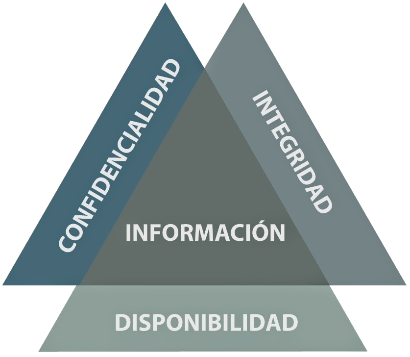

# Introducción a la seguridad informática

## Importancia de la seguridad informática

El espectacular auge de Internet y de los servicios telemáticos ha convertido los equipos informáticos y las redes de comunicación de datos en elementos cotidianos en nuestras vidas.

Los sistemas de información son esenciales para el funcionamiento de la mayoría de las empresas. El uso de tecnologías de la información ha permitido a las organizaciones gestionar de manera eficiente su **información** y prestar **servicios** a través de Internet. Estos servicios pueden servir como soporte operacional para la empresa o ser el producto final que se vende a los clientes.

Sin embargo, en muchos casos, la **seguridad informática** es ignorada hasta que ocurre un incidente. Existe una falsa sensación de seguridad cuando no se ha sufrido un ataque visible, lo que lleva a las empresas a postergar las inversiones en medidas de protección. A menudo, estas decisiones reactivas no se toman hasta que se produce un incidente grave que impacta las operaciones y genera pérdidas considerables.

¿Por qué es crucial gestionar el **riesgo** de estos sistemas de información? Si las empresas dependen de ellos para su funcionamiento, deben evaluar hasta qué punto pueden confiar en sus sistemas, identificar lo que podría fallar y estar preparadas para restaurar la operatividad en un tiempo y costo aceptables en caso de un incidente.

El primer paso en la gestión del riesgo consiste en valorar la situación actual de la empresa mediante un **análisis de riesgos**. Este proceso determina los posibles problemas que podrían surgir, identificando los activos de la empresa, sus vulnerabilidades, las amenazas a las que están expuestos y el riesgo asociado. En otras palabras, se debe calcular el daño económico potencial que un incidente de seguridad podría causar, así como la probabilidad de que ocurra.

Una vez realizada esta evaluación, el siguiente paso es determinar si la situación es aceptable o si es necesario **tratar los riesgos** mediante la implementación de medidas o controles que mitiguen los efectos de las amenazas. Aunque no es posible eliminar todos los riesgos, es fundamental tomar las medidas razonables para que los daños potenciales sean asumibles por la organización. El objetivo es alcanzar un **equilibrio entre el costo de la protección y el valor del activo protegido**. No tiene sentido gastar más de lo que vale el activo, pero tampoco se puede dejar un activo desprotegido y exponerse a los daños por no haber invertido lo suficiente en su protección.

Además, las amenazas son dinámicas: tanto la empresa como su entorno cambian constantemente. Esto hace que el proceso de gestión de riesgos deba realizarse de forma continua, siguiendo un **ciclo de mejora constante**. Dado que los sistemas de información y las amenazas evolucionan, la gestión del riesgo debe adaptarse continuamente a estos cambios para garantizar una protección adecuada y efectiva.

## Seguridad absoluta

No es posible lograr una **seguridad informática total** debido a varios factores inherentes a la naturaleza de los sistemas, las amenazas y las limitaciones humanas. A continuación se exponen algunas de las principales razones:

1. **Complejidad de los sistemas**

Los sistemas informáticos modernos son extremadamente complejos y están formados por una gran cantidad de componentes (software, hardware, redes, usuarios). Esta complejidad aumenta la posibilidad de que existan vulnerabilidades no detectadas, configuraciones incorrectas o errores humanos que puedan ser explotados por atacantes.

2. **Evolución constante de las amenazas**

Las ciberamenazas están en constante evolución. Los atacantes desarrollan continuamente nuevas técnicas para explotar vulnerabilidades, lo que significa que las medidas de seguridad actuales pueden quedar obsoletas rápidamente. Siempre existe la posibilidad de que se descubran nuevos tipos de ataques para los cuales no se han desarrollado contramedidas.

3. **Factores humanos**

Los seres humanos son a menudo el eslabón más débil en la cadena de seguridad. Los errores humanos, como el uso de contraseñas débiles, la falta de capacitación adecuada o el caer en trampas de ingeniería social (phishing, por ejemplo), son difíciles de prevenir completamente. Además, los empleados malintencionados o con acceso privilegiado pueden representar amenazas internas difíciles de mitigar.

4. **Recursos limitados**

Las organizaciones tienen recursos limitados, tanto en términos de tiempo como de presupuesto, para implementar y mantener las medidas de seguridad necesarias. El equilibrio entre costos y seguridad lleva a compromisos que pueden dejar ciertos aspectos menos protegidos.

5. **Nuevas vulnerabilidades**

Los desarrolladores de software y hardware cometen errores, y continuamente se descubren nuevas vulnerabilidades (zero-day). Estas fallas pueden ser explotadas antes de que se publiquen parches o soluciones, lo que deja a los sistemas temporalmente expuestos.

6. **Equilibrio entre usabilidad y seguridad**

A menudo, aumentar la seguridad reduce la usabilidad de un sistema, lo que lleva a una menor eficiencia o una experiencia de usuario más frustrante. Las organizaciones tienden a buscar un equilibrio, lo que puede dejar brechas en la seguridad para mejorar la funcionalidad y la accesibilidad de los sistemas.

7. **Dependencia de terceros**

Las organizaciones a menudo dependen de servicios o productos de terceros (como proveedores de software, infraestructura en la nube, etc.). Si alguno de estos terceros tiene una vulnerabilidad o falla en sus medidas de seguridad, esto puede comprometer la seguridad de toda la organización.

### 8. **Imposibilidad de predecir todas las amenazas**

No es posible prever todas las formas en que los atacantes intentarán comprometer los sistemas, especialmente en un entorno tan dinámico como el digital. La seguridad debe adaptarse constantemente, pero siempre habrá nuevas amenazas desconocidas que no pueden preverse con antelación.

### 9. **Confianza en la criptografía**

Muchos aspectos de la seguridad dependen de la criptografía, pero ningún sistema criptográfico es completamente invulnerable. Con el avance de la tecnología, como la computación cuántica, es posible que se desarrollen nuevas formas de romper cifrados que hoy consideramos seguros.

En resumen, la **seguridad total no es alcanzable** debido a la naturaleza dinámica y compleja del entorno tecnológico y a las limitaciones humanas. Sin embargo, la seguridad se puede gestionar y mejorar continuamente para minimizar los riesgos y responder eficazmente a las amenazas emergentes.

## Definición de Seguridad de la información

La **seguridad de la información** se refiere a la protección de la información y de los sistemas que la procesan, almacenan y transmiten, contra cualquier tipo de amenaza que pueda comprometer su **confidencialidad, integridad y disponibilidad**. Estos tres principios forman la base de la seguridad de la información y son comúnmente conocidos como la **tríada CIA** (por sus siglas en inglés: Confidentiality, Integrity, Availability).

{:class="center"}

### Confidencialidad

La **confidencialidad** implica garantizar que la información sea accesible únicamente por las personas, procesos o entidades autorizadas, protegiendo los datos sensibles contra accesos no autorizados. 

### Integridad

La **integridad** se refiere a la exactitud y completitud de la información, así como a la protección contra modificaciones no autorizadas. La integridad protege los datos de modificaciones que puedan comprometer su precisión o confiabilidad.

### Disponibilidad

La **Disponibilidad** asegura que la información sea accesible y utilizable cuando sea necesario. La disponibilidad es crucial para que los usuarios autorizados puedan acceder a los recursos sin interrupciones.

## Definición de Seguridad de la Información Extendida

La tríada CIA (Confidencialidad, Integridad y Disponibilidad) constituye el núcleo de la seguridad de la información, pero en varias normas y marcos se amplía la definición de seguridad de la información con dos dimensiones adicionales: **Autenticidad** y **Trazabilidad**

Reconociendo que la protección de los datos también depende de garantizar la legitimidad de la información y la capacidad de rastrear sus movimientos y modificaciones a lo largo del tiempo.

### Autenticidad

La **autenticidad** se refiere a la garantía de que la información, así como sus fuentes y usuarios, son genuinos y pueden ser verificados. Asegurar la autenticidad implica que los datos no han sido alterados desde su creación y que provienen de una fuente confiable.

En el contexto de la seguridad de la información, la autenticidad es fundamental para prevenir fraudes y asegurar que tanto la información como las comunicaciones sean legítimas.

### Trazabilidad

La **trazabilidad** se refiere a la capacidad de rastrear la historia, aplicación o localización de lo que se está considerando. En el ámbito de la seguridad de la información, la trazabilidad está relacionada con la capacidad de seguir el rastro de las actividades y transacciones que se realizan en un sistema, lo que incluye el seguimiento de accesos y modificaciones. Esto es crucial para la **auditoría** y la **responsabilidad**, permitiendo identificar quién hizo qué, cuándo y cómo. 

La trazabilidad está alineada con el principio de **no repudio**, que asegura que las acciones realizadas por un usuario o sistema puedan ser probadas, de modo que nadie pueda negar haber realizado una acción específica.

## Conceptos Fundamentales: Activo, Vulnerabilidad, Amenaza, Riesgo y Controles

En la gestión de la seguridad de la información, es fundamental comprender varios conceptos clave que forman la base para identificar y mitigar los riesgos a los que están expuestos los recursos de una organización. Estos conceptos incluyen **activo**, **vulnerabilidad**, **amenaza**, **riesgo** y **controles**. A continuación, se explican estos términos y su interrelación.

### Activo

Un **activo** es cualquier recurso de valor para la organización que necesita ser protegido. Los activos pueden ser tangibles o intangibles y abarcan desde la información misma hasta los sistemas que la procesan, almacenan y transmiten. Ejemplos de activos incluyen:

- **Datos y bases de datos**: Información crítica, como registros de clientes, propiedad intelectual, planes estratégicos, etc.
- **Sistemas de información**: Hardware, software, redes y servidores.
- **Recursos humanos**: Personal con conocimientos especializados.
- **Infraestructura física**: Edificios, centros de datos, instalaciones de telecomunicaciones.

El valor de un activo depende de su importancia para la operación y el éxito de la organización, así como del impacto que tendría su pérdida, daño o compromiso.

> **Activo**: Componente o funcionalidad de un sistema de información susceptible de ser atacado deliberada o accidentalmente con consecuencias para la organización. Incluye: información,  datos, servicios, aplicaciones (software), equipos (hardware), comunicaciones, recursos administrativos, recursos físicos y recursos humanos. [UNE 71504:2008]

### Vulnerabilidad

Una **vulnerabilidad** es una debilidad o deficiencia en un activo o en las medidas de seguridad que lo protegen, que podría ser explotada por una amenaza para causar daño. Las vulnerabilidades pueden ser de naturaleza técnica, física, o humana. Ejemplos de vulnerabilidades incluyen:

- **Fallos de software**: Bugs o configuraciones inseguras que pueden ser explotadas por un atacante.
- **Controles de acceso inadecuados**: Contraseñas débiles o mal gestionadas.
- **Deficiencias físicas**: Áreas no aseguradas o dispositivos sin protección física adecuada.
- **Errores humanos**: Falta de formación del personal o errores operacionales.

La existencia de una vulnerabilidad no implica necesariamente que se vaya a sufrir un daño, pero sí aumenta el potencial de que una amenaza se materialice.

### Amenaza

Una **amenaza** es cualquier circunstancia o evento con el potencial de explotar una vulnerabilidad y causar daño a un activo. Las amenazas pueden ser intencionales, como los ataques cibernéticos, o no intencionales, como los desastres naturales. Ejemplos de amenazas incluyen:

- **Ciberataques**: Malware, phishing, ataques DDoS, etc.
- **Desastres naturales**: Inundaciones, terremotos, incendios.
- **Fallos técnicos**: Caídas de sistemas, fallos de hardware.
- **Errores humanos**: Borrado accidental de datos, divulgación no autorizada de información.

El impacto de una amenaza puede variar, dependiendo de la vulnerabilidad que explote y del valor del activo afectado.

### Riesgo

El **riesgo** es la posibilidad de que una amenaza explote una vulnerabilidad y cause un impacto negativo sobre un activo. En términos simples, el riesgo puede ser entendido como la probabilidad de que ocurra un evento adverso y la magnitud de sus consecuencias. El riesgo se calcula generalmente como:

	Riesgo = Probabilidad de la amenaza × Impacto del evento

Los riesgos pueden ser categorizados en función de su gravedad y la urgencia de mitigación, lo que ayuda a las organizaciones a priorizar sus esfuerzos de seguridad.

### Controles

Los **controles** son las medidas y procedimientos implementados para mitigar o eliminar los riesgos, reduciendo la probabilidad de que una amenaza explote una vulnerabilidad o minimizando el impacto si ocurre un incidente de seguridad. Los controles pueden ser de varios tipos, incluidos:

- **Controles preventivos**: Destinados a evitar que ocurran incidentes de seguridad (por ejemplo, firewalls, políticas de acceso, autenticación multifactor).
- **Controles detectivos**: Diseñados para identificar incidentes de seguridad cuando ocurren (por ejemplo, sistemas de detección de intrusiones, registros de auditoría).
- **Controles correctivos**: Orientados a mitigar el daño y recuperar la funcionalidad tras un incidente (por ejemplo, planes de recuperación ante desastres, copias de seguridad).

Los controles deben ser seleccionados y diseñados en función del análisis de riesgos y alineados con los objetivos de la organización, garantizando que sean adecuados para proteger los activos de forma eficaz y eficiente.

Es posible que los controles no siempre consigan el efecto pretendido.

Los controles también son denominados **salvaguardas**, **medidas** de seguridad o contramedidas.

### Interrelación de los Conceptos

La relación entre estos conceptos es fundamental para la gestión de la seguridad de la información. Un activo valioso que presenta una vulnerabilidad puede estar en riesgo si existe una amenaza que pueda explotarlo. Los controles se implementan para reducir estos riesgos, protegiendo así los activos de la organización. La evaluación continua de los riesgos y la actualización de los controles es esencial para mantener la seguridad en un entorno cambiante.

{:class="center" width=80%}

## Seguridad Física y Seguridad Lógica

La **seguridad física** y la **seguridad lógica** son dos aspectos fundamentales de la seguridad de la información, cada uno con enfoques, objetivos y mecanismos distintos, pero complementarios. Ambos tipos de seguridad son esenciales para proteger los activos de una organización, pero lo hacen de maneras diferentes.

### Seguridad Física

La **seguridad física** se refiere a las medidas diseñadas para proteger los elementos tangibles de una organización, tales como el hardware, las instalaciones, el personal y otros recursos físicos, contra amenazas físicas. El objetivo principal de la seguridad física es evitar el acceso no autorizado, el daño o la destrucción de estos activos.

Algunos ejemplos de medidas de seguridad física incluyen:

- **Control de acceso físico**: Uso de tarjetas de identificación, cerraduras electrónicas, guardias de seguridad, y sistemas de vigilancia para restringir el acceso a áreas sensibles.
- **Videovigilancia**: Cámaras de seguridad para monitorear y grabar actividades en áreas críticas.
- **Sistemas de detección y alarma**: Detectores de humo, sistemas contra incendios, alarmas de intrusión y sensores de movimiento.
- **Protección contra desastres**: Medidas para proteger las instalaciones contra incendios, inundaciones, terremotos, y otras amenazas naturales.

La seguridad física es esencial para evitar que personas no autorizadas accedan o dañen los recursos que contienen o procesan información crítica, como servidores, centros de datos, o dispositivos de almacenamiento.

Algunas medidas de seguridad física son el estudio de de la ubicación correcta, medidas preventivas contra incidentes como incendios o inundaciones o el controles de acceso físico. 

### Seguridad Lógica

La **seguridad lógica** se refiere a las medidas utilizadas para proteger los sistemas informáticos y la información que almacenan o procesan, mediante la implementación de controles en el software, datos, y procesos informáticos. Este tipo de seguridad se enfoca en proteger los activos digitales contra amenazas cibernéticas, como el acceso no autorizado, la modificación o destrucción de datos, y el robo de información.

Ejemplos de medidas de seguridad lógica incluyen:

- **Autenticación y control de acceso**: Uso de contraseñas, autenticación de múltiples factores, y sistemas de gestión de identidades para garantizar que solo los usuarios autorizados puedan acceder a los sistemas y datos.
- **Cifrado**: Protege la confidencialidad de los datos mediante la codificación de la información para que solo pueda ser leída por usuarios con la clave correcta.
- **Cortafuegos (firewalls) y sistemas de detección de intrusiones**: Monitorean y controlan el tráfico de red para bloquear accesos no autorizados y detectar actividades sospechosas.
- **Software antivirus y antimalware**: Protege los sistemas contra virus, spyware, ransomware, y otros tipos de software malicioso.
- **Políticas de seguridad y gestión de parches**: Definen las reglas para el uso seguro de los sistemas y aseguran que todos los componentes de software estén actualizados para prevenir vulnerabilidades.

### Complementariedad entre Seguridad Física y Lógica

La seguridad física y la seguridad lógica deben trabajar en conjunto para proporcionar una protección integral de la información. Por ejemplo, aunque un servidor pueda estar protegido por cifrado (seguridad lógica), si un intruso puede acceder físicamente al dispositivo, podría extraer los datos directamente. Del mismo modo, si un centro de datos tiene controles de acceso físicos estrictos, pero carece de seguridad lógica adecuada, un atacante podría explotar vulnerabilidades de software para acceder a la información.

Por lo tanto, para garantizar la seguridad de la información de manera efectiva, es crucial que las organizaciones adopten un enfoque holístico que combine tanto medidas de seguridad física como lógica. La siguiente figure ilustra la relación entre los diferentes elementos a proteger:

{:class="center"}

## Seguridad Activa y Seguridad Pasiva

En el ámbito de la seguridad de la información, las estrategias para proteger los activos de una organización pueden clasificarse en dos categorías principales: **seguridad activa** y **seguridad pasiva**. Ambas son complementarias y juegan un papel crucial en la defensa contra amenazas y en la mitigación de riesgos.

### Seguridad Activa

La **seguridad activa** se refiere a las medidas y mecanismos que se implementan de manera proactiva para detectar, prevenir y responder a incidentes de seguridad en tiempo real. Estas acciones están diseñadas para intervenir activamente en la protección de los sistemas, haciendo frente a las amenazas antes o mientras ocurren.

**Ejemplos comunes de seguridad activa:**

- **Sistemas de detección y prevención de intrusiones (IDS/IPS)**: Estos sistemas monitorizan el tráfico de red y los sistemas en busca de actividades sospechosas o patrones de ataque, y pueden bloquear automáticamente las amenazas detectadas.
- **Firewalls**: Los firewalls filtran el tráfico entrante y saliente basado en reglas de seguridad predefinidas, evitando que el tráfico malicioso acceda a la red.
- **Antivirus y antimalware en tiempo real**: Estos programas escanean los archivos y actividades del sistema en busca de software malicioso y lo eliminan antes de que cause daño.
- **Autenticación multifactor (MFA)**: Al requerir múltiples formas de verificación (como contraseñas, tokens físicos, o datos biométricos) para acceder a un sistema, se reduce significativamente la posibilidad de acceso no autorizado.
- **Respuesta a incidentes**: Equipos dedicados y herramientas especializadas para gestionar y mitigar incidentes de seguridad a medida que ocurren, minimizando el impacto en la organización.

### Seguridad Pasiva

La **seguridad pasiva** se refiere a las medidas que están diseñadas para resistir o mitigar los efectos de un ataque o incidente de seguridad sin requerir una intervención activa en tiempo real. Estas medidas no previenen activamente los ataques, pero aseguran que, si ocurre un incidente, el daño se minimice y la recuperación sea posible.

**Ejemplos comunes de seguridad pasiva:**

- **Cifrado de datos**: El cifrado protege la confidencialidad de la información almacenada o transmitida, de modo que, aunque los datos sean interceptados o robados, no puedan ser leídos sin la clave de descifrado.
- **Backups (copias de seguridad)**: La creación regular de copias de seguridad garantiza que la información crucial pueda ser restaurada en caso de pérdida, daño o corrupción de datos.
- **Políticas de control de acceso**: Estas políticas definen quién tiene acceso a qué información y recursos, limitando la exposición de datos sensibles.
- **Seguridad física**: Aunque no es proactiva contra ataques cibernéticos, la seguridad física, como las cerraduras, los sistemas de videovigilancia, y los controles de acceso a las instalaciones, previene el acceso no autorizado a los componentes físicos de los sistemas de información.
- **Redundancia de sistemas**: La implementación de sistemas y recursos redundantes asegura que si un componente falla, otro puede tomar su lugar sin interrupción del servicio.

### Complementariedad entre Seguridad Activa y Pasiva

Ambas formas de seguridad son necesarias para una protección integral. La **seguridad activa** permite responder rápidamente a las amenazas y detener los ataques en curso, mientras que la **seguridad pasiva** asegura que, en caso de que una amenaza pase desapercibida o no pueda ser detenida, los daños sean mínimos y se pueda garantizar la continuidad del servicio y la recuperación de los datos.

Por ejemplo, un sistema que combina **cifrado de datos** (seguridad pasiva) con un **IDS/IPS** (seguridad activa) está mejor protegido contra una gama más amplia de amenazas que uno que solo utiliza una de estas estrategias. De este modo, se logra un enfoque más robusto y resiliente frente a los diversos riesgos que enfrenta la organización en el entorno digital actual.

# Alta Disponibilidad

La **alta disponibilidad** es un enfoque estratégico en la arquitectura de sistemas que garantiza que un servicio o sistema esté operativo y accesible la mayor parte del tiempo, **minimizando las interrupciones y el tiempo de inactividad**. Esto es especialmente crítico para aplicaciones y servicios que requieren funcionamiento continuo, como plataformas de comercio electrónico, sistemas financieros o infraestructuras críticas.

Para lograr alta disponibilidad, se utilizan diversas técnicas, como la redundancia de hardware y software, la replicación de datos, el uso de balanceadores de carga, y la implementación de mecanismos de failover que aseguren que, en caso de fallo de uno de los componentes, otro pueda tomar su lugar sin interrumpir el servicio.

## Cálculo del nivel de disponibilidad

La disponibilidad se calcula como la proporción del tiempo en que un sistema está operativo respecto al tiempo total (sumando el tiempo de operación y el tiempo de reparación). La fórmula expresa la disponibilidad como el cociente entre el tiempo medio entre fallos y la suma del tiempo medio entre fallos y el tiempo medio de reparación.

$$D=\frac{MTBF}{MTTR + MTBF}$$

En este contexto, $$D$$ representa la disponibilidad de un sistema, $$MTBF$$ es el **Mean Time Between Failures** o **Tiempo Medio Entre Fallos**, y $$MTTR$$ es el **Mean Time To Repair** o **Tiempo Medio de Reparación**.

## Los Nueves de la Alta Disponibilidad

Los "nueves" se refieren al porcentaje de tiempo que un sistema está disponible durante un año, y es una forma común de medir la **disponibilidad** de un sistema. Cuantos más "nueves" haya, mayor es la disponibilidad, y por lo tanto, menor el tiempo de inactividad. Las **aplicaciones críticas** generalmente requieren una disponibilidad de **5 nueves.**

- **99% de disponibilidad (dos nueves)**: Aproximadamente 3,65 días de inactividad al año.
- **99.9% de disponibilidad (tres nueves)**: Aproximadamente 8,76 horas de inactividad al año.
- **99.99% de disponibilidad (cuatro nueves)**: Aproximadamente 52,56 minutos de inactividad al año.
- **99.999% de disponibilidad (cinco nueves)**: Aproximadamente 5,26 minutos de inactividad al año.
- **99.9999% de disponibilidad (seis nueves)**: Aproximadamente 31,5 segundos de inactividad al año.

### Ejemplos Relevantes

1. **Google Cloud y Amazon Web Services (AWS)**: Ambos ofrecen servicios con SLA (Service Level Agreement) que garantizan entre el 99.95% y el 99.99% de disponibilidad, dependiendo del servicio. Estos proveedores implementan alta disponibilidad a través de centros de datos distribuidos geográficamente, redundancia y sistemas automatizados de failover.
    
2. **Sistemas Financieros**: Las plataformas de transacciones financieras, como las redes de cajeros automáticos o las aplicaciones bancarias en línea, a menudo requieren cinco nueves de disponibilidad para asegurar que los clientes puedan acceder a sus fondos y realizar transacciones en cualquier momento.
    
3. **Servicios de Salud**: Los sistemas de información hospitalaria (HIS) y las aplicaciones de monitoreo de pacientes en tiempo real necesitan operar con alta disponibilidad para asegurar que los médicos tengan acceso continuo a la información crítica, incluso durante emergencias.
    

La alta disponibilidad es esencial para garantizar que los sistemas críticos continúen operando sin interrupciones, ofreciendo a los usuarios un servicio confiable y continuo, independientemente de las condiciones adversas que puedan presentarse.

## Tipos de interrupciones

En el ámbito tecnológico, las interrupciones que pueden afectar el funcionamiento de los sistemas se dividen en dos grandes categorías: las **previstas** y las **imprevistas**.

Por un lado, las **interrupciones previstas** son aquellas que se pueden anticipar, generalmente porque están relacionadas con acciones programadas o planificadas. Entre estas se encuentran los **cambios o mejoras en el hardware**, que pueden implicar la sustitución o actualización de componentes físicos, y las **actualizaciones de software**, que conllevan mejoras en los programas o sistemas operativos para optimizar su rendimiento o corregir errores.

Por otro lado, las **interrupciones imprevistas** son aquellas que ocurren de manera sorpresiva y sin previo aviso, por lo que no se pueden planificar con antelación. Ejemplos de estas interrupciones son **apagones** o cortes de energía que afectan la operatividad de los sistemas, **errores en el hardware o software**, que pueden surgir por fallas internas de los equipos o programas, **problemas de seguridad**, que pueden involucrar ciberataques o vulnerabilidades explotadas por terceros, **desastres naturales**, como terremotos o inundaciones que impactan las infraestructuras, y las **caídas involuntarias del sistema**, que ocurren cuando los sistemas dejan de funcionar de manera inesperada por diversas razones.

Estas interrupciones, tanto previstas como imprevistas, requieren de estrategias y planes de contingencia adecuados para minimizar su impacto y garantizar la continuidad del servicio.

# Ejercicios

- [Ej q1.1 Análisis de riesgos](../exercises/1.1.ariesgos.md)
- [Ej 1.2 Instalación de Almalinux](exercises/1.2.almalinux.md)

<!---

# Introducción

## Razones para la seguridad informática

## Seguridad informática

### Definición de seguridad informática

Según la norma ISO27002 “La seguridad de la información se puede caracterizar por la preservación de la confidencialidad, integridad y la disponibilidad”.

Según INFOSEC Glosssary 2000: “Seguridad informática son las medidas y controles que aseguran la confidencialidad, integridad y disponibilidad de los activos de los sistemas de información, incluyendo hardware, software, firmware y aquella información que procesan, almacenan y comunican”.

### Objetivos de la seguridad informática

La seguridad informática consiste en asegurar que los recursos de sistemas de información de una organización sean utilizados de la manera que se decidió y que el acceso a la información allí contenida, así como su modificación, sólo sea posible a las personas que se encuentran acreditadas y dentro de los límites de su autorización.  

Los principales objetivos de la seguridad informática por tanto son:

* Garantizar la adecuada utilización de los recursos y de las aplicaciones de los sistemas
* Detectar los posibles problemas y amenazas a la seguridad, minimizando y gestionando riesgos
* Limitar las pérdidas y conseguir la adecuada recuperación del sistema en caso de un incidente de seguridad
* Cumplir con el marco legal y con los requisitos impuestos a nivel organizativo

### CID: Confidencialidad, Integridad y Disponibilidad

A grandes rasgos se entiende que mantener un sistema seguro (o fiable) consiste básicamente en garantizar 3 aspectos: disponibilidad, confidencialidad e integridad.

* **Confidencialidad**: cualidad de un mensaje, comunicación o datos, para que sólo se entiendan de manera comprensible o sean leídos por la persona o sistema que esté autorizado (privacidad y protección).
* **Integridad**: cualidad de mensaje, comunicación o datos, que permite comprobar que no se ha producido manipulación alguna en el original, es decir, que no ha sido alterado.
* **Disponibilidad**: capacidad de un servicio, de unos datos o de un sistema, a ser accesible y utilizable por los usuarios (o procesos) autorizados cuando estos lo requieran (evitar pérdidas o bloqueos).

{:class="center"}

Junto a estos 3 conceptos se suelen estudiar la autenticación y el no repudio.

* **Autenticación**: verificar que un documento ha sido elaborado (o pertenece) a quien el documento indica. Se suele realizar mediante un usuario o login y una contraseña o password.
* **No repudio o irrenunciabilidad:** estrechamente relacionado con la autenticación, permite probar la participación de las partes en una comunicación. Existen 2 posibilidades:
	* **No repudio en origen:** el emisor no puede negar el envío. La prueba la crea el emisor y la recibe el destinatario.
	* **No repudio en destino:** el receptor no puede negar que recibió el mensaje porque el emisor tiene pruebas de la recepción. La prueba la crea el receptor y la recibe el emisor.

Si la autenticidad prueba quien es el autor de un documento y cuál es el destinatario, el no repudio prueba que es el mismo autor quien envía la comunicación (no repudio en origen) y que el destinatario la recibió (no repudio en destino).

-->

<!--
### Alta disponibilidad
La alta disponibilidad se refiere a la capacidad de que servicios e información se encuentren operativos los la mayor parte del tiempo. Para ello se deben evitar las interrupciones.

Se distinguen 2 tipos de interrupciones:

* Interrupciones **previstas**, que se realizan cuando paralizamos el sistema para realizar cambios o mejoras en nuestro hardware o software.
* Interrupciones **imprevistas**, que suceden por acontecimientos imprevistos (un apagón, un error del hardware o del software, problemas de seguridad, desastre natural, virus, accidentes, caídas involuntarias del sistema)

La disponibilidad se define a partir del tiempo medio que un sistema es capaz de estar funcionando sin fallar (Mean Time Between Failure o **MTBF**) y del tiempo medio que se tarda en reparar o sustituir en caso de fallo (Mean Time To Repair o **MTTR**). La disponibilidad (D) se define con la siguiente ecuación:

$$\\D=\frac{MTBF}{MTTR + MTBF}$$

**La disponibilidad suele expresarse por el número de nueves**: disponibilidad de 3 nueves significa que D = 99,9%. En aplicaciones críticas se suele exigir una disponibilidad de 5 nueves, lo que significa que en promedio el sistema sólo estará caído 315 segundos al año.
-->

<!---

### Elementos vulnerables a proteger

>SISTEMA DE SEGURIDAD = TECNOLOGÍAS + PERSONAS + OPERACIONES

La seguridad informática necesita que a nivel organizativo se establezcan unas normas y pautas comunes para los **usuarios** de sistemas dentro de una empresa, por mucha tecnología de seguridad que se implante, si no se educa a los usuarios no se conseguirán los objetivos de seguridad perseguidos.

Los 3 elementos principales a proteger en cualquier sistema informático son: software, hardware y datos.
**Los datos constituyen el principal elemento a proteger**, ya que es el más amenazado y el más difícil de recuperar.

Los objetivos principales de la seguridad informática son proteger los **activos** informáticos:

* **La información contenida:** Uno de los elementos más importantes del sistema. Se debe evitar que usuarios externos o no autorizados puedan acceder a ella y que los usuarios autorizados puedan acceder en cualquier momento.
  
* **La infraestructura física:** Se debe velar porque los equipos funcionen de la forma adecuada previendo medidas en caso de robo, incendio, accidentes o desastres naturales...

{:class="center"}

# Amenazas

Lamentablemente **la seguridad absoluta no es posible**, el elemento de riesgo está siempre presente independientemente de las medidas que tomemos. **El riesgo puede reducirse, pero no eliminarse**.
Hablaremos siempre de niveles de seguridad. Así, diremos que la seguridad informática es un conjunto de técnicas encaminadas a obtener **niveles de seguridad aceptables** en los sistemas informáticos.
La determinación de este nivel dependerá en gran medida de los objetivos concretos de la organización, del valor de sus activos, de su dimensión y presupuesto de seguridad

Teniendo en cuenta esto, la definición de seguridad se suaviza pasando a hablar de **fiabilidad**: probabilidad de que un sistema se comporte tal y como se espera de él. Esto es, se habla de tener sistemas fiables en lugar de sistemas seguros.

Contrariamente a lo que tiende a pensarse, ni todas las amenazas de seguridad se deben a ataques maliciosos ni todos los ataques provienen desde el exterior. 
En primer lugar, la mayoría de problemas de seguridad reales a las que se ven expuestos los activos no tienen que ver con ataques informáticos, sino con **fallos de hardware o software**, errores de programación o administración, robo, fraude y extorsión, demandas legales, infracción de derechos de autor o ingeniería social, por citar algunas. 
En segundo lugar, los **usuarios internos** suponen la mayor fuente de amenazas: son los que mejor conocen el sistema, poseen acceso a veces ilimitado al mismo, saben cuáles son los activos más valiosos, en definitiva, pueden causar el daño mayor y con la mayor impunidad. 
En consecuencia, no todas las medidas de seguridad ni las más importantes deben basarse en la tecnología y por tanto en la adquisición de software o hardware de seguridad, sino también en la **organización de tareas y responsabilidades**, en la gestión racional de procesos y en la formación y concienciación del personal. La seguridad de la información requiere un enfoque holístico, que implique la participación coordinada de tecnología, personas y operaciones. Su objetivo no es conseguir sistemas 100% seguros, espejismo imposible de alcanzar, sino sistemas tan seguros como sea necesario para proteger los activos con un nivel que se corresponda con las expectativas. 

#

# Ejercicios

Ej1: [Análisis de riesgos en 5 minutos (INCIBE)](exercises/1.1.ariesgos.md)

# Bibliografía

<!--
https://www.iso27000.es/
-->

* 

<!--
* https://iuriscj.com/rgpd/

https://www.cookiebot.com/es/lopdgdd/?gclid=CjwKCAjw74b7BRA_EiwAF8yHFOO_BwtzrlXz_sMDd0dK_8KQNBauO3WdMHBfWyYpiD4-6xSXEY7zWhoCKb0QAvD_BwE
-->

* Instituto nacional de ciberseguridad (INCIBE): [https://www.incibe.es/](https://www.incibe.es/)

*  INCIBE - Gestión de riesgos [https://www.incibe.es/sites/default/files/contenidos/guias/doc/guia_ciberseguridad_gestion_riesgos_metad.pdf](https://www.incibe.es/sites/default/files/contenidos/guias/doc/guia_ciberseguridad_gestion_riesgos_metad.pdf)

* Centro criptográfico nacional (CCN): [https://www.ccn-cert.cni.es/](https://www.ccn-cert.cni.es/)
	

<!--
* Oficina de seguridad del internauta (OSI): [https://www.osi.es/es/contrasenas](https://www.osi.es/es/contrasenas)
-->

<!--
https://www.jesusninoc.com/bastionado-de-redes-y-sistemas/
-->

<!--

Posibles actividades

Plan director de seguridad INCIBE
https://www.incibe.es/protege-tu-empresa/que-te-interesa/plan-director-seguridad

Evalúa los riesgos de tu empresa en 5 minutos
https://www.incibe.es/protege-tu-empresa/blog/evalua-los-riesgos-tu-empresa-tan-solo-5-minutos

-->
