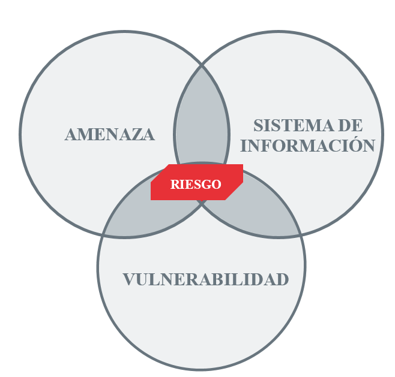
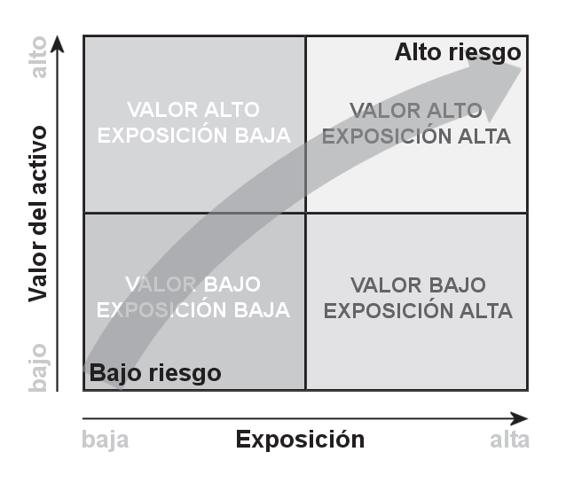
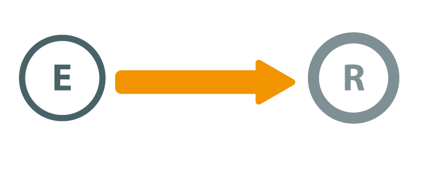
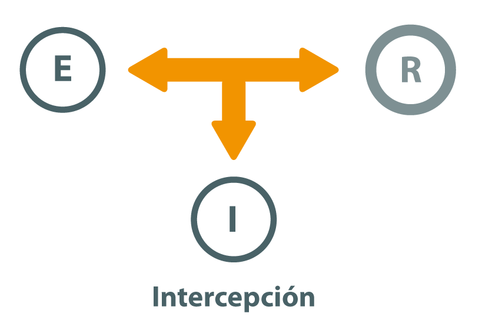
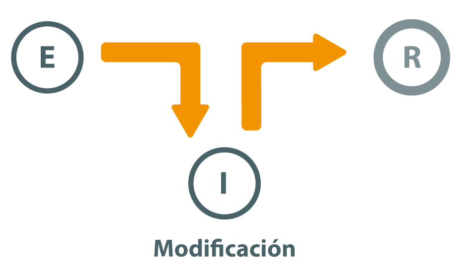
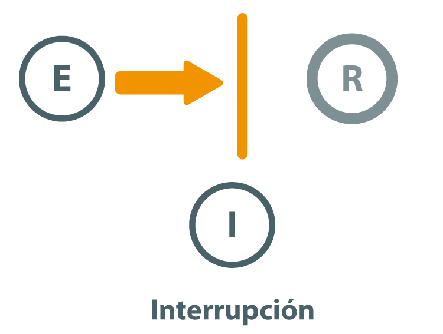
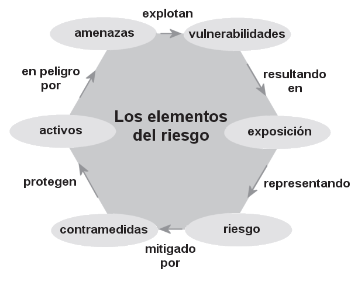
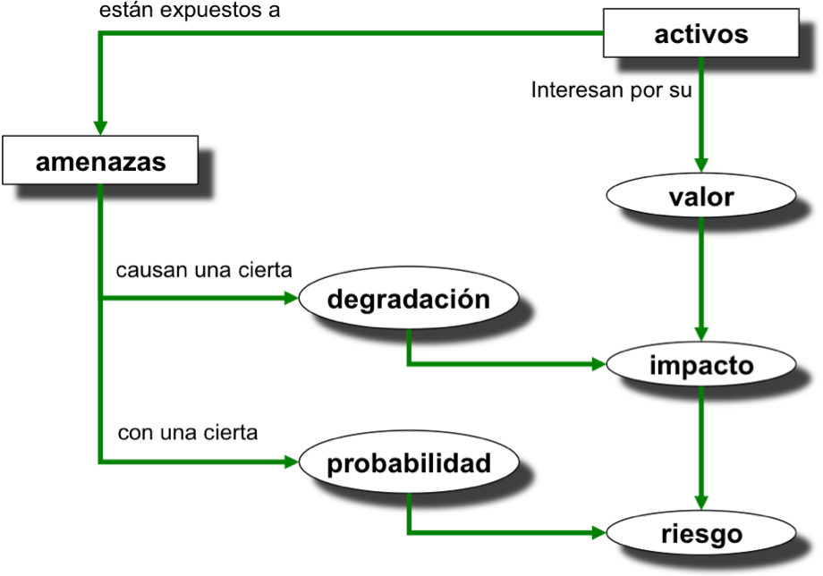

# Vulnerabilidades,  Amenazas y Exploits

En ciberseguridad, los conceptos de **vulnerabilidad**, **amenaza** y **exploit** están profundamente interrelacionados y son clave para entender los riesgos a los que se enfrenta un sistema. Vamos a definirlos y mostrar cómo se conectan entre sí:

### 1. **Vulnerabilidad**

Una vulnerabilidad es una **debilidad** o fallo en un sistema, software o proceso que puede ser explotado por un atacante. Esta debilidad puede estar en el diseño del software, en la configuración incorrecta de un sistema o incluso en un comportamiento humano (como el uso de contraseñas débiles). Las vulnerabilidades no causan daño por sí mismas, pero actúan como una **puerta de entrada** para posibles ataques.

- **Ejemplo**: Un fallo de seguridad en un sistema operativo que permite que usuarios no autorizados obtengan acceso a datos sensibles.

### 2. **Amenaza**

Una amenaza es cualquier entidad o circunstancia que tenga el **potencial** de aprovecharse de una vulnerabilidad para causar daño. Las amenazas pueden ser personas (hackers), eventos (un apagón eléctrico) o incluso fallos internos del sistema.

- **Ejemplo**: Un cibercriminal que intenta acceder a un sistema para robar información o un ataque de malware diseñado para explotar un fallo en el sistema.

### 3. **Exploit**

Un exploit es una **herramienta** o técnica específica que un atacante utiliza para aprovecharse de una vulnerabilidad. Es el método mediante el cual una amenaza se convierte en un ataque real. Los exploits pueden ser programas, scripts o secuencias de comandos que están diseñados para tomar ventaja de una debilidad en un sistema.

- **Ejemplo**: Un código de ataque que se ejecuta en un servidor vulnerable para obtener privilegios de administrador.

### Relación entre los conceptos:

- Una **vulnerabilidad** es una debilidad que puede ser aprovechada.
- Una **amenaza** es cualquier cosa que tiene la intención de explotar esa vulnerabilidad.
- Un **exploit** es el mecanismo o herramienta utilizada para explotar la vulnerabilidad.

**Ejemplo práctico**: Imagina que en una aplicación web hay una vulnerabilidad en la validación de entradas de usuario (por ejemplo, no se sanitizan correctamente los datos ingresados). Un hacker (amenaza) podría escribir un script (exploit) que aproveche esta vulnerabilidad para inyectar código malicioso en la base de datos (ataque de inyección SQL).

Estos conceptos son clave en la gestión de la seguridad informática, ya que identificar las vulnerabilidades y estar consciente de las amenazas potenciales es crucial para proteger los sistemas y prevenir que se utilicen exploits en su contra.

# Clasificación de vulnerabilidades

## 1. **Vulnerabilidades según su tipo**:

### 1. **Vulnerabilidades de software**

Estas vulnerabilidades surgen debido a fallos en el desarrollo o diseño de un programa o sistema operativo.

- **Errores de programación**: Bugs o fallos en el código.
    - Ejemplo: Desbordamiento de búfer (_Buffer Overflow_), que permite la ejecución de código no deseado.
- **Fallo en la validación de entradas**: Cuando no se comprueban adecuadamente los datos ingresados por los usuarios.
    - Ejemplo: Inyección SQL.

Podemos distinguir 3 situaciones en relación a las vulnerabilidades software:

* Vulnerabilidades reconocidas por el suministrador del software y para las cuales ya tiene un parche. (Ejemplo: Vulnerabilidades conocidas en versiones antiguas de Windows)
* Vulnerabilidades reconocidas por el suministrador del software y para las cuales no tiene todavía un parche. Algunas veces se proporciona una solución temporal (*workaround*), pero es mejor desactivar el servicio hasta tener el parche que lo solucione.
* Vulnerabilidades no reconocidas por el suministrador del software ([**Zero-Day**](../incidentes/zeroday.md)). Podemos estar expuestos y no ser conscientes de ello.

### 2. **Vulnerabilidades de configuración**

Estas aparecen cuando un sistema está mal configurado o no sigue las mejores prácticas de seguridad.

- **Configuración por defecto**: Uso de configuraciones preestablecidas inseguras.
    - Ejemplo: Credenciales por defecto como "admin/admin".
- **Exposición innecesaria de servicios**: Servicios innecesarios activados que amplían la superficie de ataque.
    - Ejemplo: Dejar el puerto de administración de una base de datos accesible desde internet.

**Ejemplo**: [2016 Botnet Mirai](../incidentes/2016.botnet_mirai.md)

### 3. **Vulnerabilidades físicas**

Estas se deben a fallos en la seguridad física de los sistemas o dispositivos.

- **Acceso físico no controlado**: Permitir acceso físico a servidores, equipos o dispositivos sin las debidas protecciones.
    - Ejemplo: Un atacante tiene acceso físico a un servidor y lo manipula directamente. Robo de dispositivos, sabotaje físico, extracción de datos.
- **Seguridad débil en redes locales**: Falta de medidas de protección en redes físicas o conexiones locales.
    - Ejemplo: Redes Wi-Fi sin cifrado adecuado.

### 3. **Vulnerabilidades de la red**

Debilidades en la configuración de la red o los protocolos que permiten interceptación o modificación del tráfico. Ejemplos: ataques _Man-in-the-Middle_ (MitM), falsificación de ARP, ataques DDoS.

**Ejemplo**: Ataque _Man-in-the-Middle_ (MitM)

- **Descripción**: Un atacante intercepta la comunicación entre dos partes (como un usuario y un servidor), permitiéndole espiar, modificar o suplantar la comunicación.
- **Impacto**:
    - **Confidencialidad**: El atacante puede leer información privada, como credenciales o datos financieros.
    - **Integridad**: Los mensajes pueden ser modificados sin que las partes lo detecten.
    - **Disponibilidad**: En ciertos casos, el atacante puede interrumpir la comunicación o negarla (DoS).

### **5. Vulnerabilidades de hardware**: 

Deficiencias o errores en el diseño del hardware que pueden ser explotados. Ejemplos: vulnerabilidades en procesadores (_Meltdown_, _Spectre_).

- **Descripción**: Estas vulnerabilidades afectan a microprocesadores y permiten que un atacante acceda a la memoria sensible, como contraseñas o claves de cifrado, mediante la ejecución de código malicioso.
- **Impacto**:
    - **Confidencialidad**: Permite el acceso a información sensible que debería ser inaccesible.
    - **Integridad**: Aunque su principal impacto es sobre la confidencialidad, también puede permitir la modificación de datos en memoria.
    - **Disponibilidad**: No afecta directamente la disponibilidad, pero los parches para estas vulnerabilidades pueden reducir el rendimiento del sistema.

**Ejemplo**: [_Spectre_ y _Meltdown_ ](../incidentes/2018.spectre_meltdown.md)

### **6. Vulnerabilidades humanas**: 
Errores o fallos humanos que los atacantes explotan, como una falta de capacitación o mala práctica de seguridad.
- Ejemplos: ingeniería social, phishing, contraseñas débiles.

**Ejemplo**: Phishing

- **Descripción**: Los atacantes engañan a los usuarios para que revelen información sensible, como contraseñas, haciéndose pasar por entidades legítimas (bancos, redes sociales, etc.).
- **Impacto**:
    - **Confidencialidad**: El acceso no autorizado a cuentas puede comprometer información privada.
    - **Integridad**: El atacante podría modificar datos almacenados en las cuentas comprometidas.
    - **Disponibilidad**: El atacante podría bloquear al usuario legítimo de su cuenta (cambio de contraseñas, bloqueo de acceso).

## 2. **Vulnerabilidades según su origen**:

### **1. Vulnerabilidades inherentes**

Errores o defectos que vienen desde el diseño o desarrollo del sistema. Ejemplo: funciones mal implementadas, fallos en la autenticación.

- **Ejemplo**: Error de validación de entradas en una aplicación web
    - **Descripción**: La aplicación no valida correctamente las entradas del usuario, permitiendo la ejecución de código malicioso (_cross-site scripting_ o XSS).
    - **Impacto**:
        - **Confidencialidad**: Se pueden robar datos del navegador, como cookies de sesión.
        - **Integridad**: El atacante puede modificar la apariencia o funcionalidad de una página web.
        - **Disponibilidad**: Una aplicación comprometida puede ser utilizada para atacar otras partes del sistema.

Ejemplo Real: [Incidente CrowdStrike](../incidentes/2024.crowdstrike.md)

### **2. Vulnerabilidades introducidas**: 

Vulnerabilidades que surgen tras la implementación, como consecuencia de **errores de configuración o mantenimiento** inadecuado. Ejemplos: puertos abiertos innecesariamente, uso de software no actualizado.

**Ejemplo**: Puerto abierto innecesario en un servidor

- **Descripción**: Durante la configuración del servidor, se deja abierto un puerto innecesario, lo que permite que un atacante lo use para acceder al sistema.
- **Impacto**:
    - **Confidencialidad**: Un atacante puede obtener acceso no autorizado a los datos almacenados en el servidor.
    - **Integridad**: El atacante puede modificar archivos o bases de datos.
    - **Disponibilidad**: El servidor puede quedar fuera de servicio debido a un ataque a través del puerto.

### **3. Vulnerabilidades derivadas**: 

Vulnerabilidades que aparecen como consecuencia de interacciones entre diferentes sistemas, software o componentes. Ejemplo: incompatibilidades entre módulos de software o bibliotecas de terceros que causan problemas de seguridad.

- **Ejemplo**: Incompatibilidad entre un plugin y el software base
    - **Descripción**: Un plugin de terceros no es completamente compatible con la versión del software en uso, creando una brecha de seguridad.
    - **Impacto**:
        - **Confidencialidad**: Los datos que maneja el plugin pueden ser filtrados.
        - **Integridad**: El plugin puede corromper datos o provocar fallos en el software base.
        - **Disponibilidad**: El software podría fallar o no funcionar correctamente, afectando la operación del sistema.

### **4. Vulnerabilidades explotadas a través de terceros**: 

Cuando proveedores o servicios externos (software o hardware) tienen debilidades que pueden comprometer el sistema.

- **Ejemplo**: Ataques a la cadena de suministro
    - **Descripción**: Un proveedor de software legítimo es comprometido, permitiendo que un atacante inserte código malicioso en las actualizaciones de software.
    - **Impacto**:
        - **Confidencialidad**: Los datos de todos los clientes que utilicen ese software pueden ser comprometidos.
        - **Integridad**: Los atacantes pueden modificar archivos o código de los sistemas comprometidos.
        - **Disponibilidad**: Un ataque masivo puede interrumpir el funcionamiento de los sistemas de los clientes.

Ejemplo Real: [Incidente SolarWinds en 2020](../incidentes/2020.solarwinds.md)

# Amenazas Comunes y Medidas Básicas de Protección

En el panorama actual de la seguridad de la información, las organizaciones se enfrentan a una amplia gama de amenazas que pueden comprometer la confidencialidad, integridad y disponibilidad de sus activos digitales. A continuación, se describen algunas de las amenazas más comunes y las medidas básicas que se pueden adoptar para mitigarlas.

## 1. **Malware**

El **malware** (software malicioso) es un término general que abarca virus, gusanos, troyanos, ransomware, spyware, y otros tipos de software diseñado para dañar, interrumpir o robar información de sistemas informáticos. Una de las formas más peligrosas de malware es el **ransomware**, que cifra los archivos de la víctima y exige un rescate para restaurar el acceso.

**Medidas básicas de protección:**

- **Uso de software antivirus y antimalware**: Instalar y mantener actualizado un software de seguridad que escanee y elimine malware de los sistemas.
- **Actualización regular de software**: Aplicar parches y actualizaciones de seguridad para corregir vulnerabilidades en el sistema operativo y aplicaciones.
- **Educación del usuario**: Capacitar a los empleados para que reconozcan correos electrónicos sospechosos y eviten hacer clic en enlaces o descargar archivos de fuentes no confiables.

## 2. **Phishing**

El **phishing** es una técnica de ingeniería social en la que los atacantes se hacen pasar por entidades confiables para engañar a las víctimas y hacer que revelen información confidencial, como contraseñas, números de tarjetas de crédito o datos personales. Esta amenaza es comúnmente ejecutada a través de correos electrónicos fraudulentos.

**Medidas básicas de protección:**

- **Autenticación multifactor (MFA)**: Implementar MFA para proteger las cuentas, de modo que incluso si las credenciales se ven comprometidas, el acceso no autorizado es más difícil.
- **Filtros de correo electrónico**: Configurar filtros de spam y phishing en los sistemas de correo electrónico para reducir la cantidad de correos electrónicos fraudulentos que llegan a los usuarios.
- **Concienciación y formación**: Capacitar a los empleados para identificar correos electrónicos de phishing y enseñarles a verificar la autenticidad de las solicitudes antes de proporcionar cualquier información.

## 3. **Ataques de Denegación de Servicio (DoS) y DDoS**

Los ataques de **Denegación de Servicio (DoS)** y **Denegación de Servicio Distribuida (DDoS)** tienen como objetivo sobrecargar un sistema, red o servicio con una cantidad abrumadora de tráfico, haciéndolo inaccesible para los usuarios legítimos. Los ataques DDoS, en particular, utilizan múltiples sistemas comprometidos para amplificar el impacto.

**Medidas básicas de protección:**

- **Implementación de firewalls y sistemas de detección de intrusiones**: Utilizar cortafuegos avanzados y sistemas de detección/prevención de intrusiones para filtrar el tráfico malicioso y mitigar los ataques antes de que afecten a la red.
- **Servicios de mitigación DDoS**: Contratar servicios especializados que monitorean y mitigan ataques DDoS en tiempo real.
- **Redundancia y distribución de servicios**: Diseñar la infraestructura para que sea escalable y distribuida, reduciendo la vulnerabilidad a un ataque DoS.

## 4. **Ataques de Fuerza Bruta**

Los ataques de **fuerza bruta** intentan acceder a una cuenta o sistema adivinando las contraseñas mediante la prueba sistemática de combinaciones posibles. Estos ataques pueden ser efectivos si se utilizan contraseñas débiles o si no se han implementado medidas de seguridad adecuadas.

**Medidas básicas de protección:**

- **Contraseñas seguras**: Implementar políticas de contraseñas que requieran combinaciones complejas y actualizar las contraseñas regularmente.
- **Limitación de intentos de inicio de sesión**: Configurar los sistemas para bloquear o retrasar temporalmente las cuentas después de varios intentos fallidos de inicio de sesión.
- **Autenticación multifactor (MFA)**: Utilizar MFA para agregar una capa adicional de seguridad más allá de las contraseñas.

## 5. **Exfiltración de Datos**

La **exfiltración de datos** ocurre cuando un atacante logra acceder y extraer información confidencial de un sistema sin autorización. Esto puede ocurrir mediante el uso de malware, phishing, o explotación de vulnerabilidades en la red.

**Medidas básicas de protección:**

- **Cifrado de datos**: Asegurar que los datos sensibles estén cifrados tanto en tránsito como en reposo, para que incluso si son robados, no puedan ser leídos sin la clave de cifrado.
- **Monitorización continua**: Implementar herramientas de monitorización de la red para detectar actividades anómalas que puedan indicar exfiltración de datos.
- **Políticas de acceso mínimo**: Adoptar un enfoque de “mínimo privilegio”, asegurando que los usuarios solo tengan acceso a la información necesaria para realizar sus tareas.

## 6. **Ingeniería Social**

La **ingeniería social** se basa en la manipulación psicológica para engañar a las personas y hacer que revelen información confidencial o realicen acciones que comprometan la seguridad. Aparte del phishing, otras tácticas incluyen el **pretexting** (creación de una historia falsa para obtener información) y **tailgating** (seguimiento no autorizado a alguien para acceder a una ubicación restringida).

**Medidas básicas de protección:**

- **Concienciación y capacitación**: Educar a los empleados sobre las tácticas de ingeniería social y cómo evitar ser manipulados.
- **Políticas claras de seguridad**: Establecer y comunicar políticas claras sobre la divulgación de información y la verificación de solicitudes sospechosas.
- **Verificación de identidad**: Asegurarse de que todas las solicitudes de información confidencial sean verificadas a través de canales oficiales.

## Conclusión

Las amenazas en la seguridad de la información son diversas y en constante evolución, pero la adopción de medidas básicas y efectivas puede reducir significativamente los riesgos. La combinación de tecnología, procesos de seguridad y la concienciación del personal es clave para proteger a la organización contra las amenazas más comunes.

# Ejercicio

## [Ej 2.1 Análisis de amenazas](exercises/2.1.amenazas.md)

<!--
# Vulnerabilidad, amenaza y riesgo.

{:class="center"}

Por tanto, las vulnerabilidades son las condiciones y características propias de los sistemas de una organización que la hacen susceptible a las amenazas. El problema es que en el mundo real, si existe una vulnerabilidad, siempre existirá alguien que intentará explotarla, es decir, sacar provecho de su existencia.  

Una vez que tenemos clara la diferencia entre amenaza y vulnerabilidad, es interesante introducir el concepto de riesgo. El **riesgo** es la probabilidad de que se produzca un incidente de seguridad, materializándose una amenaza y causando pérdidas o daños. Se mide asumiendo que existe una cierta vulnerabilidad frente a una determinada amenaza, como puede ser un hacker, un ataque de denegación de servicios, un virus... El riesgo depende entonces de los siguientes factores: la probabilidad de que la amenaza se materialice aprovechando una vulnerabilidad y produciendo un daño o impacto. El producto de estos factores representa el riesgo.

{:class="center"}

### Vulnerabilidades en software.

## Tipos de amenazas.

Las amenazas pueden ser provocadas por: personas, condiciones físicas-ambientales y software o lógicas.

### Amenazas físicas-ambientales   

Las amenazas físicas y ambientales afectan a las instalaciones y/o el hardware contenido en ellas y suponen el primer nivel de seguridad a proteger para garantizar la disponibilidad de los sistemas. Hay que tener en cuenta aspectos como:

* Robos, sabotajes, destrucción de sistemas
* Cortes, subidas y bajadas bruscas de suministro eléctrico
* Condiciones atmosféricas adversas. Humedad relativa excesiva o temperaturas extremas
* Catástrofes (naturales o artificiales) terremotos, inundaciones, incendios , humo o atentados de baja magnitud, ...
* Interferencias electromagnéticas que afecten al normal comportamiento de circuitos y comunicaciones

### Amenazas software o lógicas  

Una amenaza lógica es software o código que de alguna manera puede afectar o dañar a nuestro sistema, creados de forma intencionada para ello. Entre otro software malicioso o malware encontramos:

* **Herramientas de seguridad:** Existen herramientas para detectar y solucionar fallos en los sistemas que se pueden usar para detectar esos fallos y, al mismo tiempo, aprovechar para atacarlos.
* **Rogueware o falsos programas de seguridad:** También denominados Rogue, FakeAVs, Badware, Scareware, son falsos antivirus o antiespías.
* **Puertas traseras o backdoors:** Los programadores insertan atajos de acceso o administración, en ocasiones con poco nivel de segundad.
* **Virus:** Secuencia de código que se inserta en un fichero ejecutable (denominado huésped), de forma que cuando el archivo se ejecuta, el virus también lo hace.
* **Gusano o Worm:** Programa capaz de ejecutarse y propagarse por sí mismo a través de redes, normalmente mediante correo electrónico basura o spam.
* **Troyanos o Caballos de Troya:** Aplicaciones con instrucciones escondidas de forma que éste parezca realizar las tareas que un usuario espera de él, pero que realmente ejecute funciones ocultas sin el conocimiento del usuario
* **Programas conejo o bacterias:** Programas que no hacen nada útil, simplemente se dedican a reproducirse hasta que el número de copias acaba con los recursos del sistema, produciéndose una negación de servicio
* **Canales cubiertos:** Canales de comunicación que permiten a un proceso transferir información de forma que viole la política de seguridad del sistema

### Amenazas provocadas por personas

La mayoría de ataques a un sistema provienen de personas que, intencionadamente o no, pueden causar enormes pérdidas.  

Estos atacantes se dividen en 2 grandes grupos: los atacantes pasivos que fisgonean el sistema sin modificar ni destruir nada; y los atacantes activos que dañan el objetivo atacado o lo modifican en su favor:

* **Personal**: Dentro de una organización, el propio personal puede producir un ataque intencionado
* **Hacker**: Experto o gurú en aspectos técnicos relacionados con la informática. Se distinguen 2 tipos, los que actúan con carácter constructivo, informativo o sólo intrusivo, denominados hackers o white hat; o los que actúan de forma destructiva denominados crackers o black hat. Los que andan entre un tipo y otro se denominan grey hat.
* **Crackers o black hat**: Hacker que quiere causar daño u obtener beneficio.
* **Sniffers:** Analizan el tráfico de la red para obtener información de los paquetes trasmitidos.
* **Ciberterrorista**: Experto informático que trabaja para países u organizaciones como espías o saboteadores.
* **Programadores de virus**: Crean programas dañinos para los sistemas o aplicaciones.
* **Carders**: Atacan sistemas de tarjetas de crédito.

Otras categorías son:

* **Newbie**: Hacker novato
Wannaber: Interesados por el hacking pero que aún no han sido reconocidos por la élite
* **Lammer** o **Script-Kiddies**: Pretenden hacer hacking sin tener conocimientos de informática. Se suelen dedicar a buscar y descargar programas de hacking para luego ejecutarlos
* **Luser** (looser + user): Término utilizado por los hackers para referirse a los usuarios comunes (como burla).
*  **Pirata informático**, ciberdelincuente o delincuente informático: Personas dedicadas a realizar actos delictivos y perseguidos legalmente.

## Categorías generales de ataques

Las amenazas a la información en una red pueden caracterizarse modelando el sistema como un flujo de información desde una fuente, como por ejemplo un archivo o una región de la memoria principal, a un destino, como por ejemplo otro archivo o un usuario. Las cuatro categorías generales de ataques son las siguientes:

* Interceptación 
* Modificación
* Interrupción
* Fabricación

En el flujo normal de la información se intenta garantizar:

* Confidencialidad: nadie no autorizado accede a la información.
* Integridad: los datos enviados no se modifican en el camino.
* Disponibilidad: la recepción y acceso es correcto.

###  Interceptación  

Interceptación consiste en el acceso a la información por parte de personas no autorizadas. Uso de privilegios no adquiridos.

Detección difícil, no deja huellas.
Se garantiza:

* Integridad.
* Disponibilidad

No se garantiza:

* Confidencialidad: es posible que alguien no autorizado acceda a la información

Ejemplos:

* Copias ilícitas de programas
* Escucha en línea de datos

###  Modificación  

Modificación consiste en el acceso no autorizado que cambia el entorno para su beneficio.

Detección difícil según circunstancias.
Se garantiza:

* Disponibilidad: la recepción es correcta.
No se garantiza:

* Integridad: los datos enviados pueden ser modificados en el camino.
* Confidencialidad: alguien no autorizado accede a la información.

Ejemplos:

* Modificación de bases de datos
* Modificación de elementos del HW

###  Interrupción  

Los ataques de interrupción pueden provocar que un objeto del sistema se pierda, quede no utilizable o no disponible.

Detección inmediata.
Se garantiza:

* Confidencialidad: nadie no autorizado accede a la información.
* Integridad: los datos enviados no se modifican en el camino.

No se garantiza:

* Disponibilidad: puede que la recepción no sea correcta.

Ejemplos:

* Destrucción del hardware
* Borrado de programas, datos
* Fallos en el sistema operativo

###  Fabricación  

La Fabricación puede considerarse como un caso concreto de modificación ya que se consigue un objeto similar al atacado de forma que no resulte sencillo distinguir entre objeto original y el fabricado.

Detección difícil. Delitos de falsificación.
En este caso se garantiza:

* Confidencialidad: nadie no autorizado accede a la información.

* Disponibilidad: la recepción es correcta.

No se garantiza:

* Integridad: los datos recibidos no fueron emitidos en el camino.

Ejemplos:

* Añadir transacciones en red
* Añadir registros en base de datos

## Técnicas de ataque

Los tipos de amenazas también pueden clasificarse en función de la técnica que se emplea para realizar el ataque:

* **Malware**: Programas malintencionados que afectan a los sistemas con pretensiones como: controlarlo o realizar acciones remotas, dejarlo inutilizable, reenvío de spam, etc.
* **Ingeniería social**: Se obtiene información confidencial de una persona para utilizarla con fines maliciosos, o se influye en su comportamiento para propiciar la realización de ataques.
* **Scam:** Estafa electrónica por medio del engaño como donaciones, transferencias, compra de productos fraudulentos,... Las cadenas de correo electrónico engañosas pueden ser scam si hay pérdida monetaria y hoax cuando sólo hay engaño.
* **Spam:** Correo o mensaje basura, no solicitados, no deseados o de remitente no conocido, habitualmente de tipo publicitario, enviados en grandes cantidades que perjudican de alguna o varias maneras al receptor.
* **Sniffing:** Rastrear monitorizando el tráfico de una red para hacerse con información confidencial.
* **Spoofing:** Suplantación de identidad de un equipo o falsificación, por ejemplo, existe IP, MAC, ARP, web o mail Spoofing.
* **Pharming:** Redirigir un nombre de dominio a otra máquina distinta falsificada y fraudulenta.
* **Phishing:** estafa basada en la suplantación de identidad y la ingeniería social para adquirir acceso a cuentas bancarias o comercio electrónico ilícito.
* **Password cracking:** Descifrar contraseñas de sistemas o comunicaciones. Los métodos más comunes son mediante sniffing, observando directa la introducción de credenciales (shoulder surfing), ataques por fuerza bruta y de diccionario.
* **Botnet:** Conjunto de robots informáticos o bots, que se ejecutan de manera autónoma y automática, en multitud de hosts, normalmente infectados. Permite controlar todos los ordenadores/servidores infectados de forma remota. Sus fines, normalmente, son rastrear información confidencial o incluso cometer actos delictivos.
* **Denegación de servicio o Denial of Service (DoS):** Causar que un servicio o recurso sea inaccesible a los usuarios legítimos. Una ampliación del ataque DoS es el llamado ataque distribuido de denegación de servicio, **DDoS**, a través de una botnet, siendo esta técnica el ciberataque más usual y eficaz.
* **Keyloggers**: Almacenan lo que se teclea e incluso hacen capturas de pantalla para averiguar contraseñas.

# Protección

El objetivo final de la seguridad es proteger lo que la empresa posee. Todo aquello que es propiedad de la empresa se denomina **activo**. Un activo es tanto el mobiliario de la oficina, como los equipos informáticos, como los datos que se manejan. Cualquier daño que se produzca sobre estos activos tendrá un impacto en la empresa.

Para proteger nuestro sistema hemos de realizar un análisis de las amenazas potenciales que puede sufrir, las pérdidas que podrían generar y la probabilidad de su ocurrencia. Este análisis se realiza normalmente mediante **auditorías de seguridad**.

Antes de lanzarse ciegamente a implantar medidas de seguridad que no se sabe muy bien qué es lo que van a proteger ni contra qué, se debe realizar una labor previa de análisis de riesgos:

* Identificar cuáles son los **activos** a proteger de la organización: ¿Qué activos son los más valiosos? ¿Cuál es su valor? ¿Cuánto cuesta reponerlos si se pierden o degradan? ¿Es posible reponerlos?
* Identificar las **amenazas** a que están expuestos los activos: ¿Cuáles son las amenazas naturales y humanas? ¿Qué agentes pueden realizar esas amenazas? ¿En qué circunstancias pueden producirse?
* Identificar los **riesgos** que suponen las amenazas para los activos: ¿Cuál es la **probabilidad** de que ocurra una amenaza? ¿Cuál es el coste tangible o intangible para la organización si la amenaza se materializa en un ataque?
* Identificar y evaluar el **coste** de las **contramedidas o salvaguardas** a implantar para reducir o mitigar el riesgo: ¿De qué manera puede mitigarse el riesgo? ¿Cuánto cuesta implantar una contramedida? ¿Cuál es su eficacia?

{:class="center"}

## Auditoría de seguridad de sistemas de información

Una auditoría de seguridad informática o auditoría de sistemas de información es el estudio que comprende el análisis y gestión de sistemas para identificar y posteriormente corregir las diversas vulnerabilidades que pudieran presentarse en una revisión exhaustiva de las estaciones de trabajo, redes de comunicaciones o servidores.

Obtenidos los resultados, se detallan, archivan y reportan a los responsables quienes deberán establecer medidas preventivas de refuerzo.
Los objetivos de una auditoría de seguridad de los sistemas de información son: 

* Revisar la seguridad de los entornos y sistemas
* Verificar el cumplimiento de la normativa
* Elaborar un informe independiente

{:class="center"}

Una auditoría se realiza basándose en un conjunto de directrices o buenas prácticas sugeridas. Existen estándares orientados a servir como base para auditorías de informática. Uno de ellos es COBIT (Objetivos de Control de las Tecnologías de la Información) y adicionalmente a él encontramos el estándar ISO 27002, que supone un código internacional de buenas prácticas de seguridad de la información. Otros estándares, como el ISO 27001, definen los requisitos de auditoría y sistemas de gestión de seguridad.
Los servicios de auditoría constan de las siguientes fases:

* Enumeración de sistemas operativos, servicios,, aplicaciones, topologías y protocolos de red
* Detección, comprobación y evaluación de vulnerabilidades
* Medidas específicas de corrección
* Recomendaciones sobre implantación de medidas preventivas

### Tipos de auditoría

Los servicios de auditoría pueden ser de distinta índole:

* **Auditoría de seguridad interna:** se contrasta el nivel de seguridad de las redes locales y corporativas de carácter interno
* **Auditoría de seguridad perimetral:** se estudia el perímetro de la red local o corporativa, conectado a redes públicas
* **Test de intrusión:** se intenta acceder a los sistemas, para comprobar el nivel de resistencia a la intrusión no deseada
* **Análisis forense:** análisis posterior de incidentes, mediante el que se trata de reconstruir cómo se ha penetrado en el sistema, a la vez que se valoran los daños ocasionados. Si los daños han provocado la inoperabilidad del sistema, se llama análisis post mórtem.
* **Auditoría de código de aplicaciones:** análisis del código independientemente del lenguaje empleado, comprobando vulnerabilidades.
Los sistemas deben estar continuamente verificados mediante auditoría.

## Mecanismos de seguridad

A partir de los análisis realizados mediante auditorías, hemos de diseñar una política de seguridad que defina responsabilidades y reglas a seguir para evitar amenazas o minimizar sus efectos en caso de que se produzcan.
A los mecanismos utilizados para implementar esta política de seguridad se les denomina mecanismos de seguridad (también **salvaguardas** o **contramedidas**), son la parte más visible de nuestro sistema de seguridad y se convierten en la herramienta básica para garantizar la protección de los sistemas o de la propia red. 

Un mecanismo de seguridad informática es una técnica o herramienta que se utiliza para fortalecer la confidencialidad , la integridad y la disponibilidad de un sistema informático. 

Se pueden clasificar según su función en:

* **Preventivos:** Actúan antes de que un hecho ocurra y su función es detener agentes no deseados.  
* **Detectivos:** Actúan también antes de que un hecho ocurra pero su función es revelar la presencia de agentes no detectados en algún elemento del sistema.  
* **Correctivos:** Actúan después de que haya ocurrido el hecho y su función es corregir las consecuencias.

{:class="center"}

## Ejemplos de salvaguardas software o lógicas

Cortafuegos, antivirus, antispam, utilización de números de serie, protección anticopia, encriptación de la información, uso de contraseñas, formación de usuarios del sistema.

### Ejemplos de salvaguardas hardware o físicas

SAI, extintores, cámaras de seguridad, control de acceso físico al sistema, controles de acceso con tarjetas de identificación, control de la temperatura y la humedad de la habitación donde se encuentran los ordenadores.

## Pautas generales de protección para nuestro sistema

* Localizar los activos a proteger: equipos, aplicaciones, datos y comunicaciones.
  
* Redactar y revisar regularmente los planes de actuación ante catástrofes.

* No instalar nada innecesario

* Estar al día de los informes de seguridad que vayan surgiendo y actualizar parches de seguridad

* Formar a los usuarios

* Instalar Firewall

* Llevar una buena política de copias de seguridad

* Gestionar y revisar los logs del sistema.

* Revisar las listas de usuarios activos.

-->