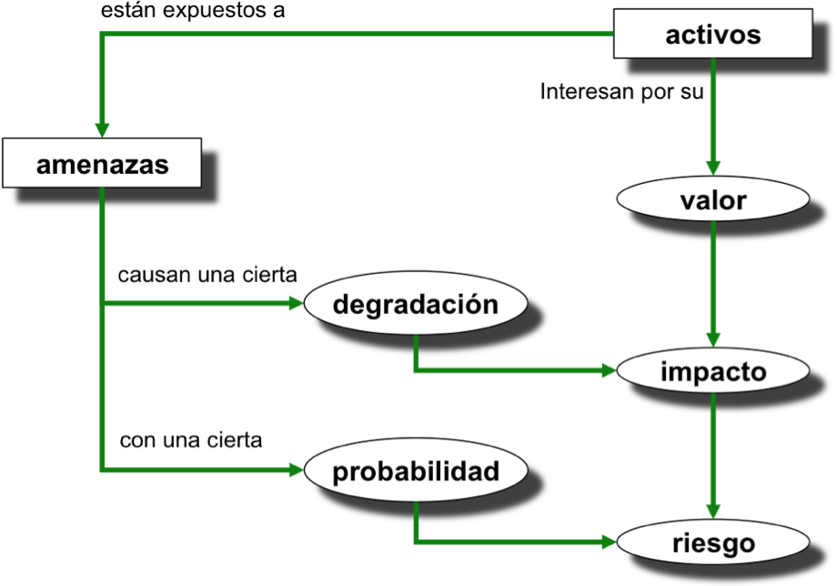

# Auditorías de seguridad: Análisis y gestión de riesgos

## Introducción

### Auditorías de seguridad: Análisis y gestión de riesgos

## Introducción

Una **auditoría de seguridad** es un proceso sistemático diseñado para evaluar la seguridad de los sistemas de información de una organización y las medidas de protección que tiene implementadas. Su objetivo principal es identificar vulnerabilidades, riesgos y oportunidades de mejora en la protección de los activos críticos, como los datos, la infraestructura tecnológica y los procesos organizativos.

### Componentes clave de una auditoría de seguridad

1. **Evaluación de Políticas de Seguridad:** Se revisan las políticas y procedimientos de seguridad para verificar su alineación con las mejores prácticas y las normativas aplicables.
    
2. **Identificación de Vulnerabilidades:** Se realizan pruebas para detectar fallos en la infraestructura tecnológica (redes, servidores, sistemas), que podrían ser explotados por atacantes.
    
3. **Análisis de la Gestión de Riesgos:** Se revisan los procesos de gestión de riesgos para evaluar si se identifican, gestionan y mitigan adecuadamente.
    
4. **Pruebas de Penetración (Pentesting):** Se simulan ciberataques controlados para evaluar la resistencia de los sistemas ante intentos de intrusión.
    
5. **Revisión de la Configuración de Sistemas:** Se verifica si los sistemas, redes y dispositivos están configurados conforme a los estándares de seguridad, y si los controles de acceso son adecuados.
    
6. **Cumplimiento Normativo:** Se evalúa si la organización cumple con las normativas vigentes, como el **RGPD** (Reglamento General de Protección de Datos) en la Unión Europea.
    
7. **Auditoría de Usuarios y Accesos:** Se revisan las cuentas de usuario y los permisos de acceso, asegurando que solo personas autorizadas accedan a los recursos críticos.
    
8. **Informe de Resultados y Recomendaciones:** Tras la auditoría, se elabora un informe que detalla los hallazgos, identificando vulnerabilidades y proponiendo acciones para mejorar la seguridad.
    

### Beneficios de una auditoría de seguridad

- **Detección temprana de vulnerabilidades:** Identificar fallos antes de que puedan ser explotados.
- **Mejora continua:** Facilitar la protección de activos críticos mediante la actualización de controles de seguridad.
- **Cumplimiento normativo:** Asegurar que la organización cumple con las normativas legales y sectoriales.
- **Reducción de riesgos:** Minimizar la probabilidad de sufrir un ataque o incidente de seguridad.

Una auditoría de seguridad proporciona una visión clara del estado de la ciberseguridad en una organización, permitiendo tomar decisiones fundamentadas para proteger sus activos frente a amenazas internas y externas.

### Gestión del riesgo

La **gestión del riesgo** en los sistemas de información es fundamental para las organizaciones que dependen de la tecnología. No solo necesitan saber qué puede salir mal, sino también cómo recuperar su operatividad en un tiempo y coste razonables en caso de incidente.

El primer paso es realizar un **análisis de riesgos** para determinar los posibles problemas, identificando los activos de la empresa, sus vulnerabilidades y las amenazas que pueden afectarlos. Este proceso también evalúa la probabilidad de que se materialicen esos riesgos y el impacto económico resultante de un incidente de seguridad.

Una vez que se conoce la situación de riesgo, se deben tomar **medidas de control** para mitigar los riesgos identificados. Aunque no es posible eliminar todos los riesgos, es esencial encontrar un **equilibrio entre el coste de la protección y el valor del activo protegido**. No tiene sentido gastar más en protección de lo que vale el activo, pero tampoco se debe subestimar el riesgo de no proteger adecuadamente.

El entorno de las amenazas es dinámico: los sistemas, las organizaciones y las amenazas evolucionan. Por lo tanto, la gestión del riesgo debe realizarse de manera continua, adaptándose a los cambios y utilizando un enfoque basado en el **ciclo de mejora continua**.

# Estándares de securización de sistemas y redes

En este apartado se introducen las principales normas nacionales e internacionales relacionadas con la seguridad de la información y la gestión del riesgo.

## ISO/IEC 31000 - Gestión del riesgo

<!-- https://www.isotools.org/normas/riesgos-y-seguridad/iso-31000/ -->

La **ISO/IEC 31000** establece un marco para que organizaciones de cualquier tamaño gestionen eficazmente los riesgos, incluyendo los relacionados con la seguridad de la información. Aunque no es certificable, esta norma proporciona buenas prácticas para integrar la gestión de riesgos en todas las actividades organizativas. Como complemento, la **ISO 31010** describe técnicas para la evaluación de riesgos.

## Familia de normas ISO/IEC 27000 (SGSI)

La familia de normas **ISO/IEC 27000** establece los requisitos para los Sistemas de Gestión de Seguridad de la Información (SGSI). La **ISO/IEC 27001** es certificable y define los requisitos para implementar un SGSI, mientras que la **ISO/IEC 27002** ofrece directrices para los controles de seguridad. Otras normas de esta familia incluyen:

 Las normas ISO/IEC no son de libre difusión, están protegidas por leyes de protección intelectual, para el acceso al texto completo deben ser adquiridas:
 
> * Originales en inglés en Tienda ISO: [https://www.iso.org/store.html](https://www.iso.org/store.html)
> * En español AENOR: [https://tienda.aenor.com/](https://tienda.aenor.com/)

{:class="center"}

| Norma         | Descripción                                                                                      |
| ------------- | ------------------------------------------------------------------------------------------------ |
| ISO **27000** | Define términos y conceptos clave en la gestión de la seguridad de la información  |
| ISO **27001** | Requisitos de un SGSI. **Certificable**.                            |
| ISO **27002** | Buenas prácticas para la implementación de controles de seguridad.   |
| ISO **27005** | Gestión de los Riesgos en la Seguridad de la Información.                                    |
| ISO 27017     | Seguridad en servicios en la nube.                                                                  |

Table: Principales normas de la familia ISO/IEC 27001

### ISO/IEC 27000

Esta norma proporciona una visión general de la familia de normas que componen la serie 27000, y define la **terminología** utilizada. Establece la importancia de la la implantación de un SGSI, una introducción a los Sistemas de Gestión de Seguridad de la Información, una breve descripción de los pasos para el establecimiento, monitorización, mantenimiento y mejora de un SGSI .

> Disponible para la descarga de forma pública: [https://standards.iso.org/ittf/PubliclyAvailableStandards/c073906_ISO_IEC_27000_2018_E.zip](https://standards.iso.org/ittf/PubliclyAvailableStandards/c073906_ISO_IEC_27000_2018_E.zip)

### ISO/IEC 27001

**Es la norma principal de la serie** y contiene los **requisitos del sistema de gestión de seguridad de la información**. Define qué debería tener un SGSI, pero no define cómo implementarlo.
Es la norma con arreglo a la cual se certifican por auditores externos los SGSIs de las organizaciones. 
 
En su Anexo A, enumera en forma de resumen los objetivos de control y controles que desarrolla la norma **ISO/IEC 27002**. A pesar de no ser obligatoria la implementación de todos los controles, cada organización deberá argumentar sólidamente la no aplicabilidad de los controles no implementados.

> Existe una edición puesta a libre disposición pública por "Industria Conectada 4.0" de la versión [UNE-ISO/IEC 27001:2017 (https://www.industriaconectada40.gob.es/difusion/Paginas/enlaces-interes.aspx](https://www.industriaconectada40.gob.es/difusion/Paginas/enlaces-interes.aspx) que es una edición consolidada de la traducción del 2013 y que incorpora las correcciones de 2015.

## Esquema Nacional de Seguridad (ENS)

El **Esquema Nacional de Seguridad (ENS)** establece las políticas de seguridad para la protección de la información y los servicios ofrecidos por las administraciones públicas españolas. Estas políticas incluyen medidas de protección, cumplimiento normativo y auditoría de seguridad. El objetivo del ENS es asegurar el uso seguro de medios electrónicos y promover un enfoque homogéneo y coordinado en la gestión de la seguridad.

> Publicado en el Real Decreto 311/2022, de 3 de mayo, por el que se regula el Esquema Nacional de Seguridad: [https://www.boe.es/eli/es/rd/2022/05/03/311](https://www.boe.es/eli/es/rd/2022/05/03/311)

## NIST Cybersecurity Framework

El **NIST Cybersecurity Framework** es una guía de ciberseguridad ampliamente utilizada para gestionar los riesgos en redes y sistemas. Se centra en cinco funciones clave:

1. **Identificar:** Inventario de activos, riesgos y amenazas.
2. **Proteger:** Implementación de controles de seguridad.
3. **Detectar:** Detección de eventos de seguridad.
4. **Responder:** Respuesta ante incidentes.
5. **Recuperar:** Recuperación de servicios críticos tras un incidente.

El framework se organiza en **niveles de implementación** que permiten a las organizaciones medir su grado de madurez y capacidad de adaptación a las amenazas emergentes.
{:class="center"}

# Guías de buenas prácticas

A continuación, se detallan diversas guías de buenas prácticas clave para la securización de sistemas y redes. Estas guías proporcionan un marco sólido y probado para la protección de los activos de información, ayudando a las organizaciones a enfrentar los desafíos actuales de la ciberseguridad.

## ISO/IEC 27002

La norma **ISO/IEC 27002** establece un **Código de prácticas para los controles de seguridad de la información**. Este estándar proporciona una serie de buenas prácticas que describen los objetivos de control y los **controles** recomendados para garantizar la seguridad de la información en las organizaciones. Cabe destacar que esta norma **no es certificable**, ya que su finalidad es ofrecer directrices más que establecer requisitos formales.

>Una versión pública de la **UNE-ISO/IEC 27002:2017**, que es una edición consolidada con las correcciones de 2015, está disponible a través de "Industria Conectada 4.0": [UNE-ISO/IEC 27002:2017](https://www.industriaconectada40.gob.es/difusion/Paginas/enlaces-interes.aspx). La última actualización de esta norma es de 2022.

La versión de 2013 de la **ISO/IEC 27002** describía 14 dominios principales que abarcaban 35 objetivos de control y 114 controles. Aunque proporciona un marco integral, cada organización debe adaptar estos controles a sus necesidades específicas.

> Más detalles sobre los dominios y controles de **ISO/IEC 27002:2013** pueden consultarse aquí: [Controles ISO 27002:2013](https://www.iso27000.es/assets/files/ControlesISO27002-2013.pdf).

Los 14 dominios de la versión de 2013 son:

1. **Políticas de Seguridad:** Establece la dirección en materia de seguridad de la información.
2. **Organización de la Seguridad de la Información:** Trata la seguridad organizacional, dispositivos móviles y teletrabajo.
3. **Seguridad de los Recursos Humanos:** Cubre las fases de pre-contratación, empleo y finalización de contratos.
4. **Gestión de los Activos:** Asegura la responsabilidad y la protección de los activos.
5. **Control de Accesos:** Gestiona el acceso a la información y sistemas.
6. **Cifrado:** Controla el uso del cifrado para proteger la información.
7. **Seguridad Física y Ambiental:** Garantiza la protección física de los sistemas.
8. **Seguridad de las Operaciones:** Establece procedimientos operativos, protecciones contra malware y gestión de copias de seguridad.
9. **Seguridad de las Comunicaciones:** Protege la transmisión segura de información.
10. **Adquisición, Desarrollo y Mantenimiento de Sistemas:** Integra la seguridad en el ciclo de vida de los sistemas.
11. **Relaciones con los Proveedores:** Gestiona la seguridad en las interacciones con terceros.
12. **Gestión de Incidentes de Seguridad de la Información:** Proporciona directrices para manejar incidentes de seguridad.
13. **Continuidad del Negocio y Seguridad de la Información:** Garantiza la continuidad del negocio ante incidentes.
14. **Cumplimiento:** Asegura el cumplimiento de la normativa legal y contractual.

El 15 de febrero se publicó una nueva versión de la norma, la **ISO 27002:2022**. Se puede ver el esquema en la tienda de ISO :[https://www.iso.org/standard/75652.html](https://www.iso.org/standard/75652.html) Han sido varios los cambios que ha sufrido:

En **febrero de 2022** se publicó una actualización significativa de la norma: la **ISO 27002:2022**, que ha reducido el número de controles de 114 a 93, incorporando 11 nuevos controles adaptados a las tecnologías emergentes:

* Inteligencia de amenazas
* Seguridad de la información en la nube
* Continuidad del negocio
* Seguridad física y su supervisión
* Configuración
* Eliminación de la información
* Encriptación de datos
* Prevención de fugas de datos
* Seguimiento y monitoreo
* Filtrado web
* Codificación segura

Además, se ha reestructurado la clasificación de los controles, reduciendo los dominios de 14 a 4:

1. **Controles organizacionales** (37)
2. **Controles de personas** (8)
3. **Controles físicos** (14)
4. **Controles tecnológicos** (34)

## CCN 

El **Centro Criptológico Nacional (CCN)**, dependiente del Centro Nacional de Inteligencia (CNI), es responsable de elaborar y difundir normas, guías y recomendaciones para garantizar la seguridad de los sistemas TIC en España.

El **CCN** publica diversas guías de seguridad conocidas como **Guías CCN-STIC**, que son fundamentales para el cumplimiento del **Esquema Nacional de Seguridad (ENS)**, aplicable en el ámbito público y en proveedores que trabajen con administraciones públicas.

> Se pueden consultar las guías del CCN en: [Guías CCN-STIC](https://www.ccn-cert.cni.es/guias/guias-series-ccn-stic).

Adicionalmente, el CCN ha desarrollado diversos **informes de buenas prácticas**, así como un **decálogo de ciberseguridad** y un **decálogo de prevención proactiva**, destinados a mejorar la postura de seguridad de las organizaciones.

> Enlaces útiles:
> 
> - [Decálogo de Ciberseguridad](https://www.ccn-cert.cni.es/documentos-publicos/1153-decalogo-de-ciberseguridad/file.html)
> - [Decálogo de Prevención Proactiva](https://angeles.ccn-cert.cni.es/index.php/es/docman/documentos-publicos/372-infografia-decalogo-prevencion-proactiva/file).

## INCIBE (Instituto Nacional de Ciberseguridad)

El **INCIBE**, organismo dependiente del Ministerio de Asuntos Económicos y Transformación Digital de España, se ha consolidado como entidad de referencia para la **ciberseguridad y confianza digital** en sectores estratégicos, PYMEs y ciudadanos.

El **INCIBE** ofrece múltiples guías y recursos diseñados para ayudar a las PYMEs a mejorar su seguridad informática. Estos materiales incluyen guías específicas y un **decálogo de ciberseguridad**.

> Recursos disponibles en: [INCIBE - Protege tu Empresa](https://www.incibe.es/protege-tu-empresa/que-te-interesa)  
> Decálogo de ciberseguridad: [Decálogo de Ciberseguridad](https://www.incibe.es/sites/default/files/contenidos/guias/doc/guia_decalogo_ciberseguridad_metad.pdf).

## NIST SP 800-53

El **NIST SP 800-53**, desarrollado por el Instituto Nacional de Estándares y Tecnología (NIST) de Estados Unidos, es una guía de controles de seguridad destinada a mejorar la seguridad y eficiencia de los sistemas. Esta guía establece un ciclo de mejora continua basado en los procesos clave de la ciberseguridad:

1. **Identificar**
2. **Proteger**
3. **Detectar**
4. **Responder**
5. **Recuperar**

El enfoque del NIST en la mejora continua ayuda a las organizaciones a gestionar riesgos cibernéticos de manera más efectiva.

> Para más detalles: [NIST SP 800-53](https://nvlpubs.nist.gov/nistpubs/SpecialPublications/NIST.SP.800-53r5.pdf).

# Gestión del Riesgo

La gestión de riesgos es un proceso cíclico y continuo, que se compone de dos partes fundamentales:

> **Gestión de riesgos = Análisis de riesgos + Tratamiento de riesgos**

### 1. **Análisis de Riesgos**

El **análisis de riesgos** es una actividad clave y compleja, especialmente en el ámbito de los sistemas de información. Esta complejidad requiere un enfoque metódico, tratándolo como un proyecto que involucra tareas, entregables y puntos de control. Para que el análisis sea eficaz, es esencial seguir una **metodología estándar** que permita comparar y explicar los resultados, además de estandarizarlos.

### 2. **Tratamiento de Riesgos**

El **tratamiento de los riesgos** consiste en la creación de un **Plan de Seguridad** o un **Plan de Mejora de la Seguridad**, que incluye acciones dirigidas a mitigar los riesgos identificados en el análisis previo. El objetivo es corregir los puntos donde el riesgo es excesivo y garantizar que los recursos dedicados a proteger los activos sean proporcionales al valor de dichos activos.

## Sistema de Gestión de Seguridad de la Información (SGSI)

El establecimiento de un **Sistema de Gestión de Seguridad de la Información (SGSI)** depende de factores como las necesidades de la organización, sus objetivos, requisitos de seguridad, y su tamaño y estructura. Estos factores son dinámicos y pueden evolucionar con el tiempo.

El propósito de un SGSI es **preservar la confidencialidad, integridad y disponibilidad de la información**, mediante un proceso de **gestión de riesgos** que inspire confianza a todas las partes interesadas en la correcta gestión de los riesgos de seguridad.

Un SGSI debe estar **integrado en los procesos y la estructura de la organización**. Es crucial que la seguridad de la información se contemple desde el diseño de los procesos y sistemas, asegurando que los controles implementados se adapten a las necesidades específicas de la organización.

### Fuentes principales de requisitos de seguridad

1. **Evaluación de riesgos:** Identificación de amenazas, vulnerabilidades y posibles impactos, en línea con los objetivos y estrategias del negocio.
    
2. **Requisitos legales y contractuales:** Cumplimiento de regulaciones locales e internacionales, así como obligaciones contractuales con socios y proveedores.
    
3. **Objetivos y necesidades del negocio:** La gestión de la información debe alinearse con los objetivos de la organización y sus operaciones.
    

El uso adecuado de recursos debe balancear el nivel de protección con el valor de los activos protegidos. Los resultados del análisis de riesgos guiarán las decisiones para mitigar los riesgos más críticos.

## Principios para la Gestión de Riesgos

Según la norma **ISO/IEC 31000**, la gestión de riesgos debe seguir estos principios:

- **Crear y proteger valor:** Mejorando la seguridad, cumpliendo requisitos legales, y garantizando la sostenibilidad del negocio.
- **Integración en los procesos organizativos:** La gestión de riesgos debe ser parte de las actividades diarias, no una actividad aislada.
- **Soporte en la toma de decisiones:** Ayuda a evaluar las alternativas y sus posibles riesgos.
- **Abordar la incertidumbre:** Proporciona un marco para gestionar la incertidumbre inherente a las decisiones.
- **Enfoque sistemático y estructurado:** Para obtener resultados consistentes y confiables.
- **Basado en la mejor información disponible:** Considerando experiencias pasadas y conocimiento de expertos.
- **A medida de la organización:** Adaptado al contexto y perfil de riesgos específicos.
- **Considerar factores humanos y culturales:** Teniendo en cuenta la percepción y capacidad de las personas implicadas.
- **Transparente e inclusiva:** Implicando a todas las partes interesadas en la gestión de riesgos.
- **Dinámica y adaptable:** Capaz de ajustarse a los cambios internos y externos.
- **Mejora continua:** Desarrollar estrategias para una mejora constante.

## Metodologías para la gestión del riesgo

Existen diversas metodologías que guían la gestión de riesgos. Algunas de las más relevantes son:

### ISO/IEC 27005

Proporciona un enfoque estructurado para la gestión de riesgos en la seguridad de la información. Incluye:

- Establecer el contexto del proceso de gestión de riesgos. 
	- Para ello se identifica el alcance, las obligaciones legales y contractuales y criterios como la tolerancia al riesgo de la organización.
- Evaluar los riesgos de forma cuantitativa o cualitativa.
- Definir un tratamiento de riesgos basado en métricas claras.
- Mantener informadas a las partes interesadas durante el proceso.
- Monitorizar y revisar el contexto, los riesgos y las obligaciones continuamente para adaptaras a los cambios.

### MARGERIT v3

Es una metodología desarrollada por la administración española para la gestión de riesgos en el ámbito del **Esquema Nacional de Seguridad (ENS)**. Proporciona un marco para la toma de decisiones informadas, basadas en el análisis de riesgos derivados del uso de tecnologías de la información.

MAGERIT es una metodología de carácter público que puede ser utilizada libremente y no requiere autorización previa. Interesa principalmente a las entidades en el ámbito de aplicación del Esquema Nacional de Seguridad (ENS)

Libros de MAGERIT v3: "[Método", "Catálogo de Elementos" y "Guía de Técnicas"](https://administracionelectronica.gob.es/pae_Home/pae_Documentacion/pae_Metodolog/pae_Magerit.html). 

## Marco de trabajo

El éxito en la gestión de riesgos requiere un compromiso fuerte por parte de la dirección. La integración de la gestión de riesgos en los procesos empresariales es esencial para que sea efectiva.

Para lograrlo, el marco de trabajo debe:

- Entender la organización y su contexto.
- Establecer una **política de gestión de riesgos** clara.
- Definir las autoridades y responsabilidades.
- Alinear la gestión de riesgos con los objetivos estratégicos.
- Proporcionar los recursos necesarios (personas, procesos, herramientas).
- Implementar mecanismos de comunicación efectivos.

Este marco de trabajo se implementará definiendo un **calendario** y estrategia de implementación y revisión que permita:
* establecer y desarrollar los objetivos
* aplicar la política y el proceso
* cumplir con la legislación y normativa
* organizar la formación y la comunicación y consulta a los interesados

### Política de Gestión de Riesgos

La política de gestión de riesgos debe aclarar:

- Los motivos para gestionar los riesgos.
- Cómo se relaciona con otras políticas.
- Las responsabilidades y los recursos disponibles.
- Compromiso con la revisión y mejora continua del marco de trabajo.

## Proceso de gestión del riesgo

La siguiente figura muestra las etapas del proceso de gestión del riesgo según la norma ISO 31000:

{:class="center"}

El proceso de gestión del riesgo, según **ISO 31000**, incluye las siguientes etapas:

### 1. Comunicación y Consulta

La participación de las partes interesadas es esencial en todas las fases de la gestión de riesgos.

### 2. Determinar el Contexto

Definir los factores internos y externos que influyen en la gestión de riesgos, incluyendo la cultura organizacional, los recursos, y el entorno legislativo.

### 3. Valoración del Riesgo

Identificación, análisis y evaluación de los riesgos, determinando las amenazas, la probabilidad de ocurrencia y los impactos sobre los activos críticos.

### 4. Tratamiento del Riesgo

Identificación de las opciones para tratar los riesgos: evitarlos, mitigarlos, transferirlos o aceptarlos.

### 5. Seguimiento y Revisión

Supervisar y revisar el proceso para asegurar su eficacia y adaptarlo a los cambios en el entorno.

# Análisis de riesgos

El análisis de riesgos es un enfoque metódico que sigue una serie de pasos estructurados para identificar, evaluar y gestionar los riesgos a los que está expuesta una organización. Los pasos fundamentales en este proceso son:

1. **Identificación de activos relevantes**: Determinar los activos clave de la organización, analizar sus interrelaciones y estimar su valor, evaluando el impacto potencial en caso de que se vean afectados.
    
2. **Identificación de amenazas**: Evaluar las amenazas que podrían afectar a esos activos, tanto externas como internas.
    
3. **Evaluación de salvaguardas**: Examinar las medidas de protección existentes y evaluar su eficacia frente a las amenazas identificadas.
    
4. **Estimación del impacto**: Medir el daño que podría ocasionar una amenaza si se materializa, teniendo en cuenta el valor del activo afectado.
    
5. **Estimación del riesgo**: Calcular el riesgo combinando el impacto potencial con la probabilidad de que la amenaza se materialice.
    

El siguiente diagrama refleja este proceso:

{:class="center"}

## Identificación de activos

En un sistema de información existen dos tipos de **activos esenciales**:

1. **Información**: Representa los datos que maneja el sistema.
2. **Servicios**: Las funciones que el sistema proporciona.

Estos activos clave definen los requisitos de seguridad para todos los componentes del sistema. Además de los activos esenciales, hay otros activos relevantes, como:

- **Datos**: Los cuales materializan la información manejada.
- **Servicios auxiliares**: Necesarios para el funcionamiento del sistema.
- **Software**: Aplicaciones que permiten gestionar los datos.
- **Hardware**: Equipos informáticos que hospedan datos, aplicaciones y servicios.
- **Soportes de información**: Dispositivos de almacenamiento.
- **Equipamiento auxiliar**: Material que complementa el hardware.
- **Redes de comunicaciones**: Facilitan el intercambio de datos.
- **Instalaciones**: Infraestructuras físicas que albergan los sistemas.
- **Personas**: Operadores y usuarios de los elementos anteriores.

### Dependencias entre activos

Los activos esenciales dependen de otros activos para su seguridad. Estas interdependencias se pueden visualizar mediante un **grafo de dependencias**, que muestra cómo la seguridad de un activo superior depende de los activos inferiores.

{:class="center"}

Un activo superior depende de un activo inferior cuando la seguridad del primero se ve afectada por la del segundo. Los activos inferiores, en este contexto, se consideran los pilares que sostienen la seguridad de los activos superiores.

## Valoración de activos

La **valoración de activos** puede parecer simple, pero es un proceso complejo que requiere experiencia. Cada activo debe tener un propietario responsable de tomar decisiones sobre su protección. La valoración de los activos se puede realizar utilizando:

- **Métodos cualitativos**: Escalas de valor (Ej.: Alto, Medio, Bajo).
- **Métodos cuantitativos**: Valor en términos económicos (Ej.: Euros).

El valor de un activo puede ser **propio** o **acumulado**, en función de si un activo inferior acumula el valor de los activos superiores que dependen de él. Generalmente, el valor de un sistema de información radica en la **información** que maneja y en los **servicios** que presta, con los demás activos subordinados a estos.

La valoración cuantitativa es útil para tomar decisiones presupuestarias, pero es difícil calcular con precisión los valores de eventos que aún no han ocurrido. Además, existen **intangibles** como la reputación y la pérdida de oportunidades, que no siempre pueden cuantificarse de forma directa.

### Dimensiones de Valoración

Los activos se pueden valorar desde diferentes dimensiones, entre ellas:

- **Confidencialidad**: ¿Qué daño causaría que una persona no autorizada accediera a la información?
- **Integridad**: ¿Qué perjuicio supondría que la información fuera dañada o corrompida?
- **Disponibilidad**: ¿Qué consecuencias habría si el activo no estuviera disponible o no pudiera utilizarse?

### Valoración Cualitativa

Las **escalas cualitativas** permiten una evaluación rápida, posicionando los activos en un orden relativo. Estas escalas pueden basarse en “órdenes de magnitud” que permiten estimar el nivel de riesgo sin necesidad de comparaciones numéricas precisas. Sin embargo, su limitación es que no permiten sumar o cuantificar los valores de manera absoluta.

### Valoración Cuantitativa

Las **valoraciones cuantitativas** requieren un esfuerzo significativo, pero permiten comparar valores numéricos y realizar estudios económicos. Estas valoraciones ayudan a responder preguntas como:

- ¿Es rentable invertir en una salvaguarda?
- ¿Qué medidas optimizan la inversión en seguridad?
- ¿Cuál es el retorno de la inversión?
- ¿Qué coste debería tener una póliza de seguro?

## Determinación de Amenazas

El siguiente paso es identificar las **amenazas** que pueden afectar a cada activo. Estas pueden clasificarse en:

- **Origen natural**: Accidentes naturales como terremotos o inundaciones.
- **Entorno industrial**: Desastres industriales como fallos eléctricos o contaminación.
- **Defectos de aplicaciones**: Problemas en el diseño o implementación de sistemas.
- **Errores humanos no intencionados**: Fallos cometidos por personas con acceso al sistema.
- **Ataques deliberados**: Acciones maliciosas de individuos que buscan perjudicar o explotar el sistema.

Una vez identificadas las amenazas, es necesario evaluar su impacto sobre el valor del activo, considerando dos factores:

- **Degradación**: El grado de daño que la amenaza puede causar.
- **Probabilidad**: La probabilidad de que la amenaza se materialice.

### Valoración de la Probabilidad

La probabilidad de ocurrencia se puede expresar numéricamente como una **frecuencia de ocurrencia** anual, con valores típicos como:

|Probabilidad|Valor|Frecuencia|
|---|---|---|
|MA (Muy Alta)|100|Muy frecuente, a diario|
|A (Alta)|10|Frecuente, mensualmente|
|M (Media)|1|Normal, una vez al año|
|B (Baja)|1/10|Poco frecuente, cada varios años|
|MB (Muy Baja)|1/100|Muy poco frecuente, siglos|

### Valoración de la Degradación

La degradación se expresa como una **fracción del valor del activo**, normalmente en porcentaje. Se puede limitar a una escala, por ejemplo:

|Degradación|Valor|Descripción|
|---|---|---|
|MA (Muy Alta)|100%|Destrucción completa|
|A (Alta)|90%|Degradación importante|
|M (Media)|50%|Impacto medio|
|B (Baja)|10%|Daños menores|
|MB (Muy Baja)|1%|Daños insignificantes|

---

## Evaluación de las Salvaguardas

SLas **salvaguardas** o controles son los mecanismos que reducen el riesgo. Estos pueden ser:

- **Preventivos**: Reducen la probabilidad de que una amenaza se materialice.
- **Correctivos**: Limitan el daño causado cuando una amenaza se concreta.

### Valoración de las Salvaguardas

Para evaluar las salvaguardas se utiliza un **modelo de madurez**, que clasifica la efectividad de los controles en distintos niveles de gestión:

### Valoración de salvaguardas

Para evaluar la calidad de las medidas de protección desplegadas para enfrentar a las amenazas, se recurre a un modelo de madurez para calificar procesos basado en la idea de que con el tiempo los procesos pasan de informales a profesionalizados.

{:class="center"}

Los niveles de madurez asignan una eficacia según la gestión de los controles:

|Nivel|Eficacia|Descripción|
|---|---|---|
|**NA**|0%|No aplica, no es necesario.|
|**L0**|0%|Control inexistente, debería estar presente pero no lo está.|
|**L1**|10%|Control instalado pero no gestionado.|
|**L2**|50%|Gestión informal, eficacia moderada.|
|**L3**|90%|Gestión sistemática, controles formalizados y efectivos.|
|**L4**|95%|Controles medidos, evaluados regularmente.|
|**L5**|100%|Mejora continua, eficacia máxima.|

Un planteamiento **informal** es el que se basa en la intuición y buena voluntad de las
personas involucradas. Es un buen punto de partida. 

Avanzando, pasaríamos a un proceso que está **planificado y gestionado**; o sea, que
se encarga a una persona para que se haga cargo del tema. 

Un punto de inflexión importante es cuando los **procedimientos están formalizados** por
escrito y dejamos de depender de la interpretación pasando a la concreción de quién debe
hacer qué cosa. 

Más allá de escribir los procedimientos se debe medir su desempeño: ¿en qué
medida son eficaces frente a las amenazas? y ¿en qué medida el consumo de recursos es
eficiente y proporcionado al beneficio que nos deparan?  

Y la situación óptima o que se considera inmejorable, es cuando entramos en un ciclo de
excelencia o de mejora continua, adaptando los procesos a los resultados medidos.

## Estimación del Impacto

El **impacto** es el daño que podría sufrir un activo si una amenaza se materializa. Se calcula teniendo en cuenta el valor del activo y la degradación que causaría la amenaza.

{:class="center"}

### Impacto Residual

Tras aplicar las salvaguardas, el **impacto residual** es el impacto reducido que permanece. Se recalcula tomando en cuenta la eficacia de las salvaguardas implementadas. Este impacto residual se puede calcular de manera acumulativa en los activos inferiores o repercutir en los activos superiores.

## Estimación del riesgo

El **riesgo** se define como la combinación del impacto y la probabilidad de ocurrencia:

> **Riesgo = Impacto x Probabilidad**

{:class="center"}

### Riesgo Residual

El **riesgo residual** es el riesgo que queda después de aplicar las salvaguardas. Se recalcula el riesgo tomando en cuenta el impacto y la probabilidad residual.

# Tratamiento de los riesgos: Plan de seguridad

Una vez analizados los riesgos se pasa a la siguiente etapa de la gestión de riesgos que consiste el tratamiento de los riesgos, que consiste en decidir qué hacer con cada uno de los riesgos en función de su valoración y de los criterios establecidos. Es decir, se deberá establecer un umbral de tolerancia al riesgo.

Se realizará una evaluación basada en las **consecuencias sobre el negocio** de los problemas técnicos. A continuación, se **priorizarán los riesgos** más peligrosos, bien por su alta probabilidad o bien por su alto impacto. Para tratarlos, o bien se eliminan las vulnerabilidades técnicas que los causan, o se despliegan medidas de seguridad para contenerlos. Siempre evaluado costes de las diferentes opciones para asegurar que es viable económicamente y que el gasto compensa económicamente.

El tratamiento se materializará en un **Plan de Seguridad**, entendido como conjunto de acciones a acometer para que el riesgo esté acotado en los valores que los órganos de gobierno determinen adecuados para la organización.

## Evaluación del riesgo

Una vez analizados los riesgos, se realizará la evaluación que no es sino **interpretar este análisis en términos de negocio** para entender las consecuencias últimas, que no técnicas, de los posibles riesgos. Es importante usar unas métricas que permitan comparar nuestros riesgos operacionales con otros riesgos que afectan a la organización, y que se deberán gestionar de forma integral.

Una vez evaluados los riesgos, es decisión de los órganos de gestión y gobierno decidir si el riesgo es asumible o si hay que corregirlo. Esta es una decisión política compleja, donde hay que determinar el **punto de equilibrio entre riesgos, recursos y oportunidades**. 

No se debería gastar más en proteger que el posible perjuicio de no proteger. No se deberían asumir riesgos sin una contrapartida en los beneficios. Pero sobre todo, lo más complicado son las decisiones frente a los riesgos intangibles o de difícil cuantificación como son los reputacionales.

Si se decide tratar los riesgos, entramos en un periodo de tratamiento que se traduce en la ejecución de un plan de seguridad.

### Análisis de situación

Es el resultado obtenido del análisis de riesgos, explica cómo se combinan las amenazas y las salvaguardas sobre nuestros activos. Proporciona una visión global de riesgo, relativizando la importancia de cada activo e informado de las vulnerabilidades del sistema de información y de los controles desplegados para atajarlas.

## Priorizar riesgos

Una forma efectiva de tomar decisiones de tratamiento de la seguridad es ver la posición del riesgo sobre el diagrama 2D de riesgo en función del impacto y la probabilidad. Se distinguen 4 zonas:

{:class="center"}

* **Zona 1** – Caliente. Riesgos muy probables y de muy alto impacto; posiblemente nos planteemos sacarlos de esta zona

* **Zona 2** – Templada. Riesgos de probabilidad relativa e impacto medio; se puede permanecer o intentar llevar a zona 3

* **Zona 3** – Fría (**Deseable técnicamente**). Riesgos improbables y de bajo impacto; o los dejamos como están, o permitimos que aumenten si ello nos ofreciera alguna ventaja o beneficio en otro terreno (por optimización de recursos o por aprovechamiento de oportunidades de negocio)

* **Zona 4** – Riesgos improbables pero de muy alto impacto; suponen un reto de decisión pues su improbabilidad no justifica que se tomen medidas preventivas, pero su elevado impacto exige que tengamos algo previsto para reaccionar; es decir, hay que poner el énfasis en medidas de reacción para limitar el daño y de recuperación del desastre si ocurriera.

Cabe destacar que la decisión de en qué zona se quiere estar no es una decisión técnica ni es una decisión inmutable en el tiempo. Son decisiones que se deben tomar para adaptar la organización a sus circunstancias.

## Criterios de decisión

Cabe destacar que la decisión de en qué zona se quiere estar no es una decisión técnica ni es una decisión inmutable en el tiempo. Son decisiones que se deben tomar para adaptar la organización a sus circunstancias.

A la hora de determinar cuánto se gasta en salvaguardas y en qué punto es más juicioso asumir el **riesgo residual**, se pueden emplear diferentes técnicas de interpretación del riesgo para tomar decisiones prudentes.

Un procedimiento que puede ser útil es el llamado diagrama ALARP. Esta técnica de interpretación coloca los riesgos en una escala lineal. 

ALARP es un análisis coste-beneficio, acrónimo del inglés "As Low As Reasonably Practicable", (en español, "tan bajo como sea razonablemente factible"), es un término común en la normativa británica en el campo de la seguridad laboral y en particular la seguridad de sistemas críticos. El principio ALARP es que el riesgo residual debe ser tan bajo como sea razonablemente factible.

La zona superior, muy caliente, ubica aquellos riesgos que son inaceptables desde todo punto de vista y de los que debemos huir en cuanto sea posible. Son escenarios de desastre.

En la zona inferior, fría, aparecen aquellos riesgos que son despreciables, por sí mismos o porque los hemos mitigado con salvaguardas. En esta zona se puede vivir tranquilo, pero vigilante porque todo esto es papel y hay que asegurarse de que la realidad no contradice a la teoría.
 
Y hay una amplia zona intermedia, templada, donde la decisión de mitigar o asumir es opinable y se tomará a la vista de otros parámetros como coste en equipamiento, productividad del sistema, percepción de cómo actúa la competencia para no estar en desventaja, y un largo etcétera. El analista de riesgos se limita a informar para que la organización tome la decisión que considere oportuna y óptima para su misión (que, recuérdese siempre, no es proteger el sistema de información, sino sus objetivos de negocio que sólo indirectamente dependen de la seguridad operacional).

{:class="center"}

## Desiciones posibles

Hay 4 formas básicas de tratar el riesgo: evitarlo, mitigarlo, compartirlo y aceptarlo.

| Coste-Beneficio                                                                          | Tratamiento                                                                                                                                           |
|------------------------------------------------------------------------------------------|-------------------------------------------------------------------------------------------------------------------------------------------------------|
| El coste del tratamiento es muy superior a los beneficios.                               | **Evitar el riesgo**, por ejemplo, dejando de realizar esa actividad.                                                                                   |
| El coste del tratamiento es adecuado a los beneficios.                                 | **Reducir o mitigar el riesgo**: seleccionando e implementando los controles o medidas adecuadas que hagan que se reduzca la probabilidad o el impacto. |
| El coste del tratamiento por terceros es más beneficioso que el tratamiento directo. | **Transferir el riesgo**, por ejemplo, contratando un seguro o subcontratando el servicio.                                                              |
| El nivel de riesgo está muy alejado del nivel de tolerancia.                             | **Retener o aceptar el riesgo** sin implementar controles adicionales. Monitorizarlo para confirmar que no se incrementa.                               |

<!-- Table: Ejemplo de criterios para el tratamiento de riesgos -->

En sistemas nuevos o poco maduros, a veces es posible **evitar** el riesgo, bien eliminando activos cuyo riesgo no compensa el beneficio que aportan, bien cambiando la arquitectura del sistema. Cabe destacar que las vulnerabilidades de origen técnico, defectos de los equipos, pueden atajarse parcheando o actualizando los elementos afectados.
Por ejemplo, es frecuente en sistemas que tratan datos de carácter personal, eliminar algunos datos que no son imprescindibles para evitar las obligaciones que conllevarían. Es habitual en sistemas sofisticados introducir líneas de defensa en profundidad para alejar los sistemas sensibles de los atacantes potenciales. Estas tácticas cambian el inventario y el grafo de dependencias, obligando a un nuevo análisis de los riesgos.

Lo habitual es que los activos sean los que son y que las opciones se limiten a instalar y mejorar las salvaguardas, pasando a una mayor eficacia protectora y a unos mejores indicadores residuales.

A partir de un cierto punto, las mejoras de las salvaguardas no compensan los recursos que consumen y habrá que pasar a una fase de **transferencia** del riesgo o a **compartirlo** con otra organización que lo encaje mejor que la propia. Típico escenario de externalización, donde se dejan una serie de activos en manos de profesionales que disponen de recursos para hacerse cargo.
Una variante a los servicios gestionados de seguridad son los **seguros** de cobertura de incidentes. Estos seguros cambian los cálculos del valor a proteger pues las consecuencias de un incidente se compensan con la colaboración de la empresa aseguradora.
Por último, antes o después, se llegará a un punto en que seguir mejorando el riesgo no compensa lo que cuesta y simplemente se **asumirá**. Hay que advertir que la asunción no es pasiva (sea lo que Dios quiera) sino vigilante de forma que lo que no pudimos evitar o acotar lo detectemos y pongamos en marcha actividades de supervivencia. Es parte del plan de seguridad planificar estas actividades dotándolas de recursos (estén efectivamente desembolsados o simplemente previstos) y entrenándonos para el día que haya que ejercitarlas.

Es importante destacar que la seguridad informática no es perfecta y que los fallos técnicos deben enmarcarse en un escenario más rico de gestión de riesgos, involucrando a otros departamentos como puede ser el legal para acotar daños o resarcirse por otros medios. En cierto punto el análisis del equipamiento técnico debe continuarse con otros medios para que los incidentes de origen técnico no tumben a la organización.

## Situación objetivo

Con el plan de tratamiento definimos una situación objetivo, con sus activos a proteger, sus posibles amenazas y el conjunto de medidas de protección desplegadas. De todo ello calculamos la posición de riesgo que llamaremos riesgo residual. Este riesgo residual es el que deberán aceptar los órganos directivos. Es decir, van unidas la aprobación del Plan de seguridad y la aceptación del riesgo residual.

## Costes

Protegerse cuesta dinero y consume recursos.
Hay que adquirir soluciones, instalarlas y mantenerlas.
Hay que educar a los usuarios del sistema, e incluso es posible que haya que contratar nuevas habilidades.
Y, frecuentemente, la mayor seguridad ralentiza los procesos y apreciemos una merma de productividad derivada del mayor control de lo que hacen los sistemas. Y también es posible que se renuncie a oportunidades de negocio porque se prefiera estar más seguros que asumir ciertas incertidumbres.

{:class="center"}

### Equilibrio Valor-Coste

Para tomar decisiones de gasto en salvaguardas puede ser útil dibujar el efecto del gasto de seguridad en el riesgo residual.

{:class="center"}

La línea negra muestra la evolución del gasto en seguridad. La línea roja, la evolución del riesgo residual.
La línea negra empieza con una pendiente moderada, pero va creciendo. Es una regla de Pareto, que refleja el hecho de que las medidas básicas de protección son baratas (por ejemplo, contraseñas) pero que según vamos pasando a medidas más sofisticadas, su coste se dispara (por ejemplo, biometría).
La línea roja también es de tipo Pareto. Al principio reducimos el riesgo a grandes pasos; pero según estamos mejor y mejor, más reducida es la mejora marginal.
La suma de ambas curvas (en verde) sugiere un punto óptimo de equilibrio que es el que denominaríamos de proporcionalidad o gasto prudente.

De la misma gráfica podemos comentar dos tipos de imprudencias: gastar poco y dejar a la organización expuesta a un gran riesgo, y gastar de forma desproporcionada al riesgo que reducimos.

Debe tenerse en cuenta que esta figura peca de teórica pues en la práctica no es posible tener un cálculo tan fino con líneas continuas de gasto y riesgo residual. Lo que existirá serán unas pocas opciones concretas que estarán situadas sobre estas líneas.

## Toma de decisiones

El proceso de toma de decisiones puede esquematizarse en el gráfico adjunto. Una decisión clara es aceptar el riesgo y operar el sistema debidamente monitorizado.

{:class="center"}

Si el riesgo es inaceptable, hay que desarrollar opciones que eviten, mitiguen o transfieran el riesgo. Cada opción hay que analizarla para decidir si nos vale y podemos aceptar el riesgo residual.
Y si no está claro, hay que analizar otros aspectos para determinar la ecuación de riesgos y beneficios para la organización.

## Aceptación del riesgo

Aceptar un riesgo prudente es honrado y habitualmente necesario.
Lo bueno del análisis de riesgos es que informa lo mejor posible de qué es lo que se está aceptando.

**La decisión de aceptación es responsabilidad del propietario del riesgo**, persona, física o colegiada, que aúna las funciones de aceptación del riesgo residual y de asignación de recursos para el tratamiento que se considere oportuno.

La aceptación del riesgo es una decisión de órganos de alto nivel dentro de la organización, pues tiene que decidir entre oportunidades (upside risk) y peligros (downside risk).

## Monitorización

Periódicamente se revisará el valor de los activos, impactos, amenazas, vulnerabilidades y probabilidaes en busca de posibles cambios.
Los riesgos no son estáticos y pueden cambiar de forma radical sin previo aviso. Por ello es necesaria una supervisión continua que detecte:

* nuevos activos o modificaciones en el valor de los activos n nuevas amenazas
* cambios o aparición de nuevas vulnerabilidades
* aumento de las consecuencias o impactos
* incidentes de seguridad de la información

De forma análoga se revisará el propio proceso de gestión de riesgos para adecuarlo al contexto. Esta revisión afecta entre otros a:

* las categorías de activos
* los criterios de evaluación de riesgos
* los niveles de clasificación de los impactos 
* las escalas de aceptación de riesgos
* los recursos necesarios

<!--
## Soporte en herramientas
-->

## Conclusiones

Un riesgo puede ser aceptado cuando el impacto sobre el negocio es bajo y asumible; pero a veces hay que aceptar riesgos porque no se dispone de recursos para atajarlos o, simplemente, el remedio es más costoso que el peligro.

Los riegos inaceptables hay que tratarlos, bien evitando la situación, mitigando la probabilidad o el impacto, o transfiriéndolo a otro sujeto. Hay acciones preventivas que reducen las probabilidades de que se dé el caso; y acciones correctivas que acotan el impacto caso de que ocurriera. También se puede optar por medidas de detección y reacción cuando el incidente tiene una dimensión temporal y si se reacciona a tiempo el impacto es reducido.
En general, las acciones preventivas son las más deseadas, pero también suelen ser las más incómodas para el uso ágil del sistema. Por ello hay que llegar a un equilibrio.
Y todo esto hay que hacerlo una y otra vez para adaptarse a los cambios de la organización y los de su entorno.

# Bibliografía

* ISO/IEC 27000: Descripción de las normas de la familia y definiciones de vocabulario [https://standards.iso.org/ittf/PubliclyAvailableStandards/c073906_ISO_IEC_27000_2018_E.zip](https://standards.iso.org/ittf/PubliclyAvailableStandards/c073906_ISO_IEC_27000_2018_E.zip)

* European Union Agency for Cybersecurity (ENISA): [https://www.enisa.europa.eu/](https://www.enisa.europa.eu/)
	*  [Gestión de riesgos ENISA.](https://www.enisa.europa.eu/topics/threat-risk-management/risk-management)
	* [Listado de metodologías para la gestión del riesgo de ENISA:](https://www.enisa.europa.eu/topics/risk-management/current-risk/risk-management-inventory/rm-ra-methods)

* ALARP: [https://www.sciencedirect.com/topics/engineering/as-low-as-reasonably-practicable-process-safety](https://www.sciencedirect.com/topics/engineering/as-low-as-reasonably-practicable-process-safety)

* Libros de MAGERIT v3: "[Método", "Catálogo de Elementos" y "Guía de Técnicas"](https://administracionelectronica.gob.es/pae_Home/pae_Documentacion/pae_Metodolog/pae_Magerit.html). 

<!--

Posibles actividades

Plan director de seguridad INCIBE
https://www.incibe.es/protege-tu-empresa/que-te-interesa/plan-director-seguridad

Evalúa los riesgos de tu empresa en 5 minutos
https://www.incibe.es/protege-tu-empresa/blog/evalua-los-riesgos-tu-empresa-tan-solo-5-minutos

-->
