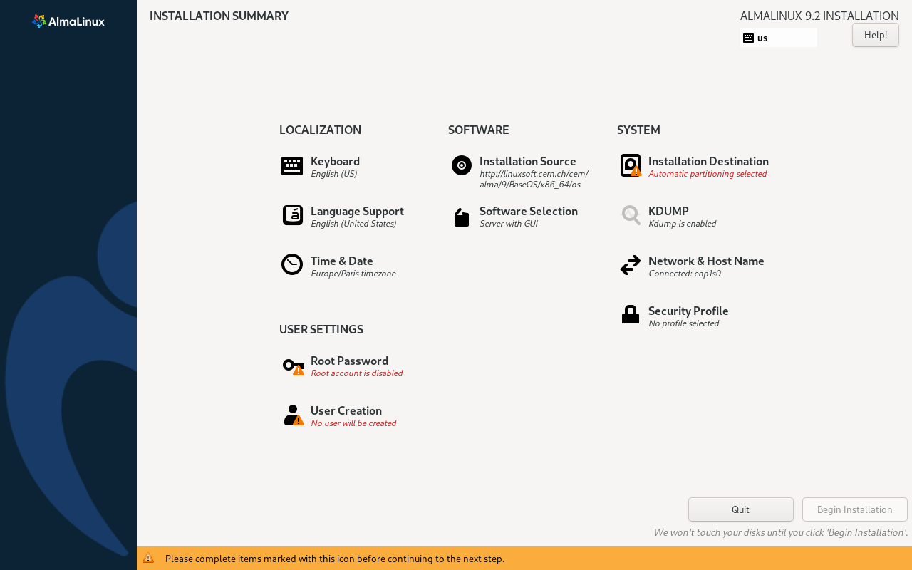

# Instalación de máquina virtual con AlmaLinux

En este ejercicio vamos a preparar una máquina virtual para usarla en prácticas posteriores. Usaremos como entorno de virtualización VirtualBox.

[https://www.oracle.com/es/virtualization/virtualbox/](https://www.oracle.com/es/virtualization/virtualbox/)

Derivado gratuito de RHEL: AlmaLinux

Se recomienda descargar la versión más reciente "**Minimal ISO**" adecuada a tu procesador

* **Crea un usuario durante la instalación cuyo nombre sea la inicial de tu nombre seguida de tu primer apellido**. Por ejemplo, para Francisco Pérez el usuario que se debería crear es fperez.

{:class="center"}

* Cuando hayas instalado la máquina guarda una _snapshot_ desde VirtualBox para poder volver al estado inicial si fuera necesario.

* Más adelante usaremos esta máquina para diferentes pruebas, puedes ver cómo instalar y configurar diferentes servicios en la siguiente página.

[Instrucciones para instalar y configurar diferentes servicios en AlmaLinux.](https://www.server-world.info/en/note?os=AlmaLinux_9&p=httpd&f=1)

## Información Almalinux

**AlmaLinux** es una distribución Linux gratuita y de código abierto que se creó como una alternativa a CentOS después de que CentOS cambiara a CentOS Stream. Aquí tienes una breve descripción:

- **Compatibilidad**: AlmaLinux está diseñada para ser binariamente compatible con Red Hat Enterprise Linux (RHEL). Esto significa que el software y las aplicaciones que funcionan en RHEL deberían funcionar de manera idéntica en AlmaLinux.
    
- **Desarrollador**: La distribución es mantenida por la Fundación AlmaLinux, una organización sin fines de lucro dedicada a proporcionar una alternativa estable y gratuita a RHEL.
    
- **Soporte y Actualizaciones**: AlmaLinux ofrece soporte comunitario y actualizaciones de seguridad continuas. Tiene un ciclo de vida similar al de RHEL, con un enfoque en la estabilidad y la seguridad a largo plazo.
    
- **Uso Ideal**: Es adecuada para entornos empresariales, servidores y cualquier situación donde se requiera una plataforma estable y confiable sin el costo de una suscripción a RHEL.

AlmaLinux busca ofrecer una solución de reemplazo sólido para aquellos que estaban utilizando CentOS y necesitan una distribución que continúe ofreciendo estabilidad y soporte a largo plazo.

**AlmaLinux OS Foundation**. Esta fundación se estableció para garantizar la sostenibilidad y el desarrollo continuo de AlmaLinux como una alternativa gratuita y compatible con Red Hat Enterprise Linux (RHEL).

- **AlmaLinux OS Foundation**: Es una organización independiente que se encarga de coordinar y mantener AlmaLinux. Su misión es proporcionar una distribución de Linux estable y de alto rendimiento, garantizando su longevidad y la disponibilidad de actualizaciones y soporte comunitario.
    
- **Patrocinadores y Socios**: La fundación cuenta con el apoyo de varias empresas y patrocinadores que contribuyen al desarrollo y mantenimiento de AlmaLinux. Entre estos patrocinadores, el principal es **CloudLinux**, que también contribuye al desarrollo de AlmaLinux y proporciona recursos y soporte.
    
La existencia de la fundación y el respaldo de empresas como CloudLinux aseguran que AlmaLinux tenga el soporte necesario para continuar siendo una opción viable y confiable para los usuarios que buscan una alternativa a RHEL sin costo.

## Información RHEL y derivados

[Política de actualizaciones de Red Hat](https://access.redhat.com/support/policy/updates/errata)

# **Red Hat Enterprise Linux (RHEL)**

1. **Propósito y Público Objetivo**:
    
    - Diseñado para entornos empresariales y servidores.
    - Orientado a empresas que requieren estabilidad, soporte técnico y garantías de seguridad.
2. **Soporte y Actualizaciones**:
    
    - Ofrece soporte comercial y mantenimiento a largo plazo.
    - Las actualizaciones de seguridad y los parches están garantizados durante el **ciclo de vida del producto (generalmente 10 años).**
3. **Costo**:
    
    - Requiere una suscripción paga para obtener soporte y actualizaciones.
4. **Ciclo de Lanzamiento**:
    
    - Tiene un ciclo de lanzamiento largo con versiones estables y bien probadas.
    - Las nuevas versiones se lanzan aproximadamente cada 3-5 años.
5. **Configuración y Personalización**:
    
    - Menos enfoque en la última tecnología; más énfasis en la estabilidad y la compatibilidad.

### **Fedora**

1. **Propósito y Público Objetivo**:
    
    - Diseñado para desarrolladores y entusiastas que desean experimentar con las últimas tecnologías.
    - Actúa como un campo de pruebas para nuevas tecnologías que eventualmente pueden ser incorporadas en RHEL.
2. **Soporte y Actualizaciones**:
    
    - Ofrece soporte comunitario con actualizaciones rápidas y frecuentes.
    - Tiene un ciclo de vida más corto, con versiones nuevas cada 6 meses aproximadamente.
3. **Costo**:
    
    - Es completamente gratuito, no requiere suscripción.
4. **Ciclo de Lanzamiento**:
    
    - Versión rolling release (cambios continuos y nuevas versiones cada **6 meses**).
    - Los usuarios siempre tienen acceso a la última versión estable.
5. **Configuración y Personalización**:
    
    - Enfocado en la incorporación de nuevas tecnologías y características, lo que puede llevar a una mayor inestabilidad en comparación con RHEL.

### **CentOS (hasta CentOS 8)**

1. **Propósito y Público Objetivo**:
    
    - Creado como una versión gratuita de RHEL sin soporte comercial.
    - Ideal para usuarios que desean la estabilidad de RHEL sin el costo asociado.
2. **Soporte y Actualizaciones**:
    
    - Basado en el código fuente de RHEL, pero sin soporte oficial. Las actualizaciones se basan en la comunidad.
    - La política de actualizaciones y soporte era similar a RHEL, pero sin garantías de soporte.
3. **Costo**:
    
    - Totalmente gratuito y de código abierto.
4. **Ciclo de Lanzamiento**:
    
    - Las nuevas versiones se lanzan en paralelo con RHEL y siguen su ciclo de vida.
    - CentOS 8 se alineaba con las versiones de RHEL, pero su ciclo de vida terminó en 2021, dando paso a CentOS Stream.
5. **Configuración y Personalización**:
    
    - Muy similar a RHEL, pero con menos soporte directo.

### **CentOS Stream (la evolución de CentOS)**

1. **Propósito y Público Objetivo**:
    
    - Actúa como una versión rolling release de RHEL, adelantándose ligeramente a la versión estable de RHEL.
    - Diseñado para proporcionar una vista previa de las futuras versiones de RHEL, útil para desarrolladores y administradores de sistemas que necesitan estar al tanto de los cambios futuros.
2. **Soporte y Actualizaciones**:
    
    - Actualizaciones continuas y no tiene un ciclo de vida fijo como RHEL o CentOS tradicional.
    - Las actualizaciones llegan más rápido que en RHEL, pero el soporte oficial es limitado en comparación con RHEL.
3. **Costo**:
    
    - Gratis y de código abierto, como CentOS anterior.
4. **Ciclo de Lanzamiento**:
    
    - Rolling release, con actualizaciones continuas que reflejan las próximas versiones de RHEL.
5. **Configuración y Personalización**:
    
    - Más adecuado para pruebas y desarrollo en lugar de producción estable.

En resumen:

- **RHEL** es para entornos empresariales que requieren estabilidad y soporte.
- **Fedora** es para quienes desean experimentar con la última tecnología y características.
- **CentOS** (hasta CentOS 8) era una alternativa gratuita de RHEL con soporte comunitario.
- **CentOS Stream** es una versión rolling release que anticipa las futuras versiones de RHEL, útil para quienes desean estar a la vanguardia de las próximas características.

# Ciclos de vida de otras distribuciones

[Ubuntu lifecycle:](https://ubuntu.com/about/release-cycle)