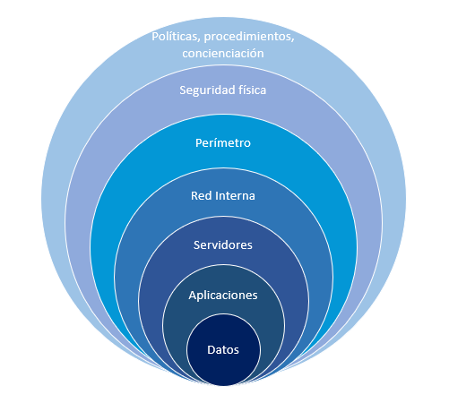

<!-- .slide: data-background="#000000" -->
# Seguridad y alta disponibilidad

## Introducción a la Seguridad Informática

---

# Introducción

--

## Antigua máxima en seguridad:

>**"Cuando no ocurre nada, nos quejamos de lo mucho que gastamos en seguridad. Cuando ocurre algo, nos quejamos de lo poco que gastamos en seguridad."**
*Bruce Schneier*, un reconocido experto en criptografía y ciberseguridad.

Lamentablemente no se es consciente de la falta de seguridad hasta que ya es demasiado tarde:

--

## Introducción: Copias de seguridad

>“**Existen dos tipos de personas, las que hacen copias de seguridad y las que todavía no han perdido alguna vez todos sus datos**.”

* ¿De qué tipo sois? 

--

## Introducción: Contraseñas

* ¿Son vuestras **contraseñas** seguras?
	* Comprobad vuestro email en:  https://haveibeenpwned.com/  
* ¿Reutilizas contraseñas en diferentes servicios? <!-- .element: class="fragment"  fade-up -->

--

## Introducción: Punto de vista empresarial

>"Se necesitan 20 años para construir una reputación y unos minutos de ciberataque para arruinarla". *Stephane Nappo*, CISO de Société Générale International Banking.

Es muy difícil recobrarse de determinados daños, especialmente los que cambian la percepción de los clientes.

---

## La seguridad absoluta no es posible

> "**El único sistema verdaderamente seguro es uno que está apagado, guardado dentro de un bloque de hormigón y sellado en una habitación revestida de plomo llena de guardias armados - y aún así tengo mis dudas.**"  
> *Gene Spafford*

> "The only truly secure system is one that is powered off, cast in a block of concrete and sealed in a lead-lined room with armed guards - and even then I have my doubts.”  
> *Gene Spafford*

--

## Hablaremos de niveles de riesgo

* Se deben analizar el posible impacto de un incidente y la probabilidad de que se produzca.
* Teniendo en cuenta el coste.
* Habrá riesgos con los que conviviremos

---

## Elementos vulnerables a proteger

Los elementos principales a proteger :

* Hardware 
* Software
* **Información**
* Personas

--
  
> **La información constituye el principal elemento a proteger**, ya que es el más amenazado y el más difícil de recuperar.

--

- Las personas son, generalmente, el eslabón más débil de la cadena.
- Gran cantidad de ataques basados en ingeniería social.

---

## Capas de protección en una ciudad medieval

<!-- ::: notes
https://es.wikipedia.org/wiki/Carcasona
::: -->

---

## Capas de protección de un sistema informático

---

## Razones para la seguridad informática

* Las empresas han generado fuertes dependencias relacionadas con las tecnologías de la información:
	* Ordenadores y **dispositivos móviles**
	* **Redes** de comunicaciones 
	* **Servicios** telemáticos

--  

### Un fallo o mal funcionamiento puede producir:
	* Grandes **pérdidas económicas**
	* Pérdidas irreparables de reputación

---

# Seguridad absoluta

* **No se puede conseguir la seguridad absoluta**
	* Debemos intentar alcanzar un **nivel de seguridad** razonable
	* Diremos que un sistema es **fiable** e lugar de seguro

---

## Objetivos de seguridad informática

Los principales objetivos de la seguridad informática son:

* Garantizar la **adecuada utilización** de los recursos y de las aplicaciones de los sistemas
* Detectar los posibles problemas y amenazas a la seguridad, minimizando y **gestionando riesgos**
* **Limitar las pérdidas** y conseguir la adecuada recuperación del sistema en caso de un incidente de seguridad
* Cumplir con el **marco legal** y con los requisitos impuestos a nivel organizativo

---

## Definición de seguridad informática

--  

### Según la norma ISO27002: 

> “La seguridad de la información se puede caracterizar por la preservación de la **confidencialidad, integridad y la disponibilidad**”.

--

### Según INFOSEC Glosssary 2000: 

> “Seguridad informática son las medidas y controles que aseguran la **confidencialidad, integridad y disponibilidad** de los activos de los sistemas de información, incluyendo hardware, software, firmware y aquella información que procesan, almacenan y comunican”.

---

## Triada CIA: Confidencialidad, Integridad y Disponibilidad

Mantener un sistema seguro (o **fiable**) consiste básicamente en garantizar 3 aspectos: 

--

### Confidencialidad

>La **confidencialidad** implica garantizar que la información sea accesible únicamente por las personas, procesos o entidades autorizadas

* Protege los datos sensibles contra accesos no autorizados. 

--

### Integridad

>La **integridad** se refiere a la exactitud y completitud de la información, así como a la protección contra modificaciones no autorizadas.

* Protege los datos de modificaciones que puedan comprometer su precisión o confiabilidad.

---

### Disponibilidad

>La **Disponibilidad** asegura que la información sea accesible y utilizable cuando sea necesario. 

La disponibilidad es crucial para que los usuarios autorizados puedan acceder a los recursos sin interrupciones.

---

## Ampliación de la definición

* Autenticidad
* Trazabilidad

--

### Autenticidad

>La **autenticidad** se refiere a la garantía de que la información, así como sus fuentes y usuarios, son genuinos y pueden ser verificados. 

* Los datos no han sido alterados desde su creación 
* La fuente es confiable, y las comunicaciones legítimas
* Fundamental para  prevenir fraudes 

### Trazabilidad

>La **trazabilidad** se refiere a la capacidad de rastrear as actividades y transacciones que se realizan en un sistema.

* Incluye:
	* Seguimiento de accesos 
	* Seguimiento de modificaciones. 
* Crucial para la **auditoría** y el **no repudio**, permitiendo identificar quién hizo qué, cuándo y cómo. 

---

# Conceptos Fundamentales

--

### Activo

>Un **activo** es cualquier recurso de **valor** para la organización. 
Los activos pueden ser tangibles o intangibles.

* Algunos ejemplos:
	- **Datos y bases de datos**: Información crítica, como registros de clientes, propiedad intelectual, planes estratégicos, etc.
	- **Sistemas de información**: Hardware, software, redes y servidores.
	- **Recursos humanos**: Personal con conocimientos especializados.
	- **Infraestructura física**: Edificios, centros de datos, instalaciones de telecomunicaciones.

--

### Vulnerabilidad

Una **vulnerabilidad** es una debilidad o deficiencia en un activo o en las medidas de seguridad que lo protegen, que podría ser explotada por una amenaza para causar daño. Las vulnerabilidades pueden ser de naturaleza técnica, física, o humana. Ejemplos de vulnerabilidades incluyen:

- **Fallos de software**: Bugs o configuraciones inseguras que pueden ser explotadas por un atacante.
- **Controles de acceso inadecuados**: Contraseñas débiles o mal gestionadas.
- **Deficiencias físicas**: Áreas no aseguradas o dispositivos sin protección física adecuada.
- **Errores humanos**: Falta de formación del personal o errores operacionales.

La existencia de una vulnerabilidad no implica necesariamente que se vaya a sufrir un daño, pero sí aumenta el potencial de que una amenaza se materialice.

--

### Amenaza

Una **amenaza** es cualquier circunstancia o evento con el potencial de explotar una vulnerabilidad y causar daño a un activo. Las amenazas pueden ser intencionales, como los ataques cibernéticos, o no intencionales, como los desastres naturales. Ejemplos de amenazas incluyen:

- **Ciberataques**: Malware, phishing, ataques DDoS, etc.
- **Desastres naturales**: Inundaciones, terremotos, incendios.
- **Fallos técnicos**: Caídas de sistemas, fallos de hardware.
- **Errores humanos**: Borrado accidental de datos, divulgación no autorizada de información.

El impacto de una amenaza puede variar, dependiendo de la vulnerabilidad que explote y del valor del activo afectado.

--

### Riesgo

El **riesgo** es la posibilidad de que una amenaza explote una vulnerabilidad y cause un impacto negativo sobre un activo. En términos simples, el riesgo puede ser entendido como la probabilidad de que ocurra un evento adverso y la magnitud de sus consecuencias. El riesgo se calcula generalmente como:

	Riesgo = Probabilidad de la amenaza × Impacto del evento

Los riesgos pueden ser categorizados en función de su gravedad y la urgencia de mitigación, lo que ayuda a las organizaciones a priorizar sus esfuerzos de seguridad.

--

### Controles

Los **controles** son las medidas y procedimientos implementados para mitigar o eliminar los riesgos, reduciendo la probabilidad de que una amenaza explote una vulnerabilidad o minimizando el impacto si ocurre un incidente de seguridad. Los controles pueden ser de varios tipos, incluidos:

- **Controles preventivos**: Destinados a evitar que ocurran incidentes de seguridad (por ejemplo, firewalls, políticas de acceso, autenticación multifactor).
- **Controles detectivos**: Diseñados para identificar incidentes de seguridad cuando ocurren (por ejemplo, sistemas de detección de intrusiones, registros de auditoría).
- **Controles correctivos**: Orientados a mitigar el daño y recuperar la funcionalidad tras un incidente (por ejemplo, planes de recuperación ante desastres, copias de seguridad).

Los controles deben ser seleccionados y diseñados en función del análisis de riesgos y alineados con los objetivos de la organización, garantizando que sean adecuados para proteger los activos de forma eficaz y eficiente.

Es posible que los controles no siempre consigan el efecto pretendido.

Los controles también son denominados **salvaguardas**, **medidas** de seguridad o contramedidas.

--

### Interrelación de los Conceptos

{:class="center", width=80%}

---

# Alta Disponibilidad

---

## Alta disponibilidad: Definición

**Disponibilidad:** porcentaje del tiempo que un servicio o dispositivo está operativo:

$$D=\frac{MTBF}{MTTR + MTBF}$$

* **MTBF:** Mean Time Between Failure
* **MTTR:** Mean Time To Repair

--  
  
* La disponibilidad **se expresa en número de nueves**: 
	* Disponibilidad de 3 nueves significa que D = 99,9%. 
	* Aplicaciones **críticas** exigen una disponibilidad de **5 nueves**, 
		* Sistema caído sólo 315 segundos al año.

---

## Alta disponibilidad: Interrupciones

Existen 2 **tipos de interrupciones**:
  
* Interrupciones **previstas**:
	* Cambios o mejoras en nuestro **hardware**
	* Actualizaciones **software**
  
  	
* Interrupciones **imprevistas**:
	* Un apagón
	* Un error del hardware o del software
	* Problemas de seguridad
	* Desastre natural
	* Caídas involuntarias del sistema

<!--
::: notes
$$\\D=\frac{MTBF}{MTTR + MTBF}$$

La disponibilidad se define a partir del tiempo medio que un sistema es capaz de estar funcionando sin fallar (Mean Time Between Failure o **MTBF**) y del tiempo medio que se tarda en reparar o sustituir en caso de fallo (Mean Time To Repair o **MTTR**). La disponibilidad (D) se define con la siguiente ecuación:

**La disponibilidad suele expresarse por el número de nueves**: disponibilidad de 3 nueves significa que D = 99,9%. En aplicaciones críticas se suele exigir una disponibilidad de 5 nueves, lo que significa que en promedio el sistema sólo estará caído 315 segundos al año.

:::
-->

---

<!-- .slide: data-background="#AA0000" -->
# Ejercicios

--

