<!-- .slide: data-background="#2C3E50" -->
# Seguridad y Alta disponibilidad
## Auditorías de seguridad
### Análisis y gestión de riesgos

---

# Auditoría de Seguridad

--

## ¿Qué es una Auditoría de Seguridad?

Una **auditoría de seguridad** en una organización es un proceso sistemático y metódico que tiene como objetivo evaluar la seguridad de los sistemas de información y las medidas de protección implementadas.

- Evalúa el estado actual de la seguridad.
- Identifica vulnerabilidades, riesgos y áreas de mejora.
- Protege activos como datos, infraestructura y procesos.

--

## Componentes de una Auditoría de Seguridad

1. **Evaluación de Políticas de Seguridad**  
   Se revisan las políticas y procedimientos para verificar su alineación con las mejores prácticas.

2. **Identificación de Vulnerabilidades**  
   Se detectan fallos en la infraestructura que podrían ser aprovechados por atacantes.

3. **Análisis de la Gestión de Riesgos**  
   Se revisan los procesos de gestión para asegurar un tratamiento adecuado de los riesgos.

--

## Componentes de una Auditoría (cont.)

4. **Pruebas de Penetración (Pentesting)**  
   Simulan ciberataques para medir la resistencia de los sistemas ante intentos de intrusión.

5. **Revisión de la Configuración de los Sistemas**  
   Se verifica si la configuración de redes, sistemas y dispositivos cumple con los estándares de seguridad.

6. **Comprobación del Cumplimiento Normativo**  
   Se evalúa el cumplimiento de normativas como el RGPD (UE).

--

## Componentes de una Auditoría (cont.)

7. **Auditoría de Usuarios y Accesos**  
   Se revisan las cuentas de usuario y los permisos para asegurar un acceso controlado a los recursos críticos.

8. **Informe final de Resultados y Recomendaciones**  
   Resume los hallazgos e incluye recomendaciones para mejorar la seguridad.

--

## Beneficios de una Auditoría de Seguridad

- **Detección de vulnerabilidades:**  
  Descubre fallos antes de que sean explotados.

- **Mejora continua:**  
  Identifica oportunidades de mejora en la protección de activos.

- **Cumplimiento normativo:**  
  Garantiza que la organización cumple con la ley.

- **Reducción de riesgos:**  
  Minimiza la probabilidad de sufrir un ataque de seguridad.

---

# Gestión de riesgos

--

## Introducción a la gestión de riesgos

- Las auditorías de seguridad 
	- suponen un proceso  continuo: cuando terminan vuelven a empezar.
	- implican la implantación de un Sistema de Gestión de Seguridad de la Información. (**SGSI**)

- Tareas fundamentales:
	- Análisis de riesgos
	- Tratamiento de riesgos

--

## Análisis de Riesgos

El primer paso en la gestión del riesgo es realizar un **análisis de riesgos**, que incluye:

1. **Identificación de activos** de la empresa.
2. Detección de **vulnerabilidades** de esos activos.
3. Reconocimiento de las **amenazas** a las que están expuestos.
4. Evaluación del **riesgo** que suponen estas amenazas.

Con el fin de determinar:

- **Daño económico** resultante en caso de producirse un incidente de seguridad.
- **Probabilidad** de que dicho incidente ocurra.

--

## Tratamiento de los Riesgos

- Una vez identificados los riesgos, se evalúa si es necesario **tratar** los riesgos.
- Se pueden establecer **medidas** o **controles** para mitigar los efectos de las amenazas.

--

### Equilibrio entre protección y coste

- No es posible eliminar **todos los riesgos**.
- Se busca un **equilibrio** entre:
  - El **coste de la protección**.
  - El **valor del activo** protegido.

--

### Ciclo de Mejora Continua

- Las **amenazas** son dinámicas y la empresa evoluciona y el contexto cambia.
- La gestión del riesgo debe ser un **ciclo continuo** para adaptarse a los cambios constantes.
- Se debe mantener un **equilibrio entre gasto y nivel de riesgo**.

---

<!-- .slide: data-background="#A8DADC" -->
# Estándares de securización 

Principales normas sobre **seguridad de la información y la gestión del riesgo**:

* ISO/IEC 31000 - Gestión del riesgo
* Familia de normas **ISO/IEC 27000** - SGSI
* Esquema Nacional de Seguridad (ENS)
* NIST Cybersecurity Framework

---

## ISO/IEC 31000: 2018 - Gestión del riesgo 

**Objetivo**: Que organizaciones de todos tipo y tamaño gestionen los riesgos  de forma efectiva

- **ISO** (International Organization for Standardization) 
- **IEC** (The International Electrotechnical Commission)
  
  * recomienda que las organizaciones desarrollen, implanten y **mejoren continuamente** un **marco de trabajo** cuyo objetivo es **integrar el proceso de gestión de riesgos en cada una de sus actividades**.

--

* La norma ISO 31000 **no es certificable**
	- Consiste en una serie de buenas prácticas. 
	- estándar de aplicación general, no profundiza en una metodología especifica para atender un determinado sector o un área concreta ( como sí lo hace ISO 27001.)
  
* **Aborda cualquier tipo de riesgo**
	- los vinculados a la seguridad de la información
	-  pero también, los referentes a la continuidad del negocio, 
	-  los riesgos operacionales, los riesgos ambientales, etc. 

---

## Familia de normas ISO/IEC 27000 (**SGSI**)

Establece los requisitos que deben cumplir los **Sistemas de gestión de la Seguridad de la Información** **(SGSI)**. 

* La norma principal es la **ISO/IEC 27001** 
	* Es **certificable**. 
	* Cumplimiento es de carácter voluntario.
	* Define los requisitos que debería cumplir un SGSI

--

## Tiendas de normas

 Las normas ISO/IEC no son de libre difusión, están protegidas por leyes de protección intelectual, para el acceso al texto completo deben ser adquiridas:
 
 * Originales en inglés en Tienda ISO: [https://www.iso.org/store.html](https://www.iso.org/store.html)
 * En español AENOR: [https://tienda.aenor.com/](https://tienda.aenor.com/)

--

## Familia de normas ISO/IEC 27000 (SGSI)

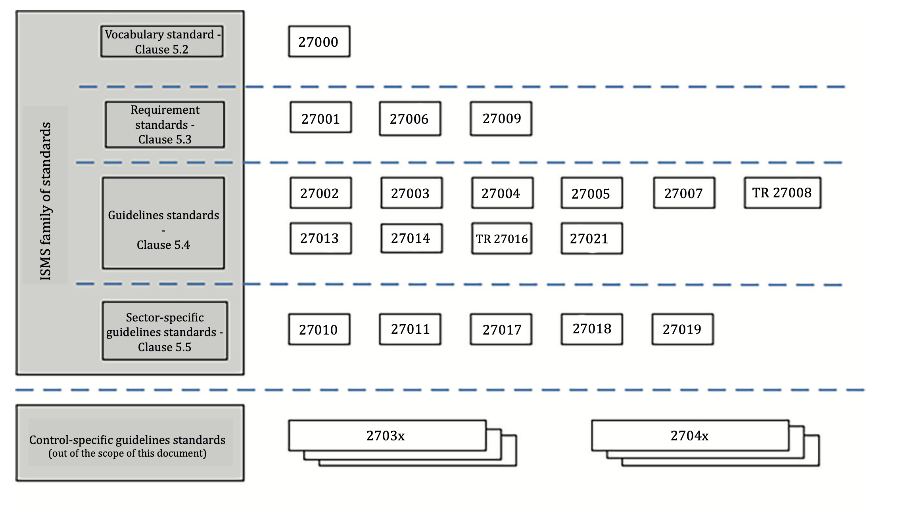

--

## Principales normas de la familia 

|  Norma | Descripción                               |
|-------|-------------------------------|
| ISO **27000** | Define términos y conceptos clave en la gestión de la seguridad de la información. |
| ISO **27001** | Requisitos de un SGSI. **Certificable**  |
| ISO **27002** | Buenas prácticas para la implementación de controles de seguridad. |
| ISO **27005** | Gestión de los Riesgos en la Seguridad de la Información. |
| ISO **27017** | Seguridad para servicios en la nube. |

--

## ISO/IEC 27000 - SGSI

Esta norma proporciona una **visión general** de la familia de normas que componen la serie 27000, y define la **terminología** utilizada. 
 
* Introducción a los Sistemas de Gestión de Seguridad de la Información (**SGSI**) 
* Breve descripción de los pasos para el establecimiento, monitorización, mantenimiento y mejora de un SGSI .

  Descarga pública gratuita: [ISO/IEC 27000](https://standards.iso.org/ittf/PubliclyAvailableStandards/c073906_ISO_IEC_27000_2018_E.zip) 

--

## ISO/IEC 27001 - Requisitos

**Es la norma principal de la serie** y contiene los **requisitos del sistema de gestión de seguridad de la información**. 

* Define qué debería tener un SGSI, pero no define cómo implementarlo.
* **Es certificable**. 
 
* Anexo A, enumera los controles de **ISO/IEC 27002**. 
	* No es obligatoria la implementación de todos los controles
	* Se deberá argumentar sólidamente la no aplicabilidad de los controles no implementados.

-- 

## ISO/IEC 27001 - Descarga pública

 Existe una edición puesta a libre disposición pública por "Industria Conectada 4.0" de [UNE-ISO/IEC 27001:2017](https://www.industriaconectada40.gob.es/difusion/Paginas/enlaces-interes.aspx) que es una edición consolidada de la traducción del 2013 y que incorpora las correcciones de 2015.

---

## Esquema Nacional de Seguridad (ENS)

Establece la **política de seguridad para la protección adecuada de la información y los servicios** prestados 
	
* **por las administraciones públicas**, 
* así como los **proveedores del sector privado** que prestan servicio a las administraciones publicas. 
  
Determina  planteamiento común de **principios, requisitos, medidas de protección, mecanismos de conformidad y monitorización** para todas las entidades en el alcance.

 Publicado en el [Real Decreto 311/2022](https://www.boe.es/eli/es/rd/2022/05/03/311)

--

## Objetivos del ENS:

* Crear las condiciones necesarias de seguridad en el uso de los medios electrónicos. Promover la gestión continuada de la seguridad
* Promover la prevención, detección y corrección
* Promover un tratamiento homogéneo de la seguridad
* Servir de modelo de buenas prácticas

[Esquema Nacional de Seguridad](https://administracionelectronica.gob.es/pae_Home/pae_Estrategias/pae_Seguridad_Inicio/pae_Esquema_Nacional_de_Seguridad.html)

<!--
https://administracionelectronica.gob.es/pae_Home/pae_Estrategias/pae_Seguridad_Inicio/pae_metodos_instrumentos_y_normas.html
-->

---

## NIST Cybersecurity Framework (CSF)

**[NIST](https://www.nist.gov/)**: National Institute of Standards and Technology, depende del gobierno de Estados Unidos
  
* Marco de ciberseguridad creado para ayudar a las empresas de todos los tamaños a

	* comprender, gestionar y reducir los riesgos cibernéticos 
	* proteger sus redes y datos, 

Proporcionana un lenguaje común y un resumen de las mejores prácticas en ciberseguridad.

--

## NIST CFS: Procesos
  

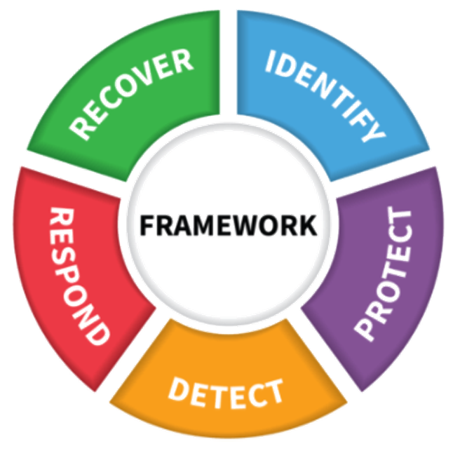

--

## NIST CSF: Procesos 

* **IDENTIFICAR**: Identificar amenazas, vulnerabilidades y riesgos a activos

* **PROTEGER**: garantizar la entrega de servicios.

* **DETECTAR**: identificar cuando ocurra un evento de ciberseguridad

* **RESPONDER**: tomar acción en relación con un evento de ciberseguridad detectado.

* **RECUPERAR**:  mantener planes para la resiliencia y reestablecimiento tras un un evento de ciberseguridad.

> Para más detalles: [NIST SP 800-53](https://nvlpubs.nist.gov/nistpubs/SpecialPublications/NIST.SP.800-53r5.pdf).

---

<!-- .slide: data-background="#A8DADC" -->
# Guías de buenas prácticas

---

## ISO/IEC 27002 

Define un **Código de prácticas para los controles de seguridad de la información**.

* Describe los objetivos de control y **controles** recomendables.
* **No es certificable**. 

* Aunque cada organización debe decidir los aplicables según sus propias necesidades.
* Para cada uno de los controles se indica asimismo una guía para su implantación.

--

## ISO/IEC 27002:2017

* Establece 14 dominios, 35 objetivos de control Y 114 controles. 
* Existe una edición puesta a libre disposición pública por "Industria Conectada 4.0" de la versión [UNE-ISO/IEC 27002:2017](https://www.industriaconectada40.gob.es/difusion/Paginas/enlaces-interes.aspx)  
	* es una edición consolidada de la traducción del 2013 
	* incorpora las correcciones de 2015. 
* La última versión es de 2022.

--

<!--

## 14 Dominios ISO/IEC 27002:2013 {.allowframebreaks}

1. **Políticas de Seguridad**
	1. Gestión directiva en seguridad
2. **Organización de la Seguridad de la Información** 
	1. Organización interna
	2. Dispositivos móviles y teletrabajo
3. **Seguridad de los Recursos Humanos**
	1. Pre contratación
	2. Durante el contrato
	3. Finalización y cambio de contrato
4. **Gestión de los Activos**
	1. Responsabilidad por los activos
	2. Clasificación de la información
	3. Manejo de los medios de comunicación
5. **Control de Accesos**
	1. Gestión del acceso en usuarios
	2. Responsabilidades del usuario
	3. Control de acceso en sistemas y aplicaciones
6. **Cifrado**
	1. Controles en el cifrado
7. **Seguridad Física y Ambiental**
	1. 	Áreas seguras
	1. 	Equipamiento
8. **Seguridad de las Operaciones**
	1. Procedimientos y responsabilidades operativas
	1. Protección ante malware
	1. Copias de seguridad
	1. Registros y monitoreo
	1. Control del software operacional
	1. Gestión de las vulnerabilidades técnicas
	1. Consideraciones en auditorias de sistemas
9. **Seguridad de las Comunicaciones**
	1. Gestión de la seguridad en red
	1. Transferencia de información
10. **Adquisición de sistemas, desarrollo y mantenimiento**
	1. Requisitos de seguridad en sistemas de la información
	1. Seguridad en el desarrollo y proceso de soporte
	1. Pruebas
11. **Relaciones con los Proveedores**
	1. Seguridad de la información en las relaciones con proveedores
	1. Gestión de la entrega con proveedores
12. **Gestión de Incidencias que afectan a la Seguridad de la Información**
	1. Gestión de incidentes y mejoras
13. **Aspectos de Seguridad de la Información para la Gestión de la Continuidad del Negocio**
	1. Continuidad en la seguridad de la información
	1. Redundancias
14. **Cumplimiento**
	1. Cumplimiento con la ley y los requisitos de contratos
	1. Revisiones en la seguridad de la información
	
-->

## ISO/IEC 27002:2022

El 15 de febrero se publicó una nueva versión de la norma, la **ISO 27002:2022**. 

* El número de controles se ha visto reducido de 114 a 93. 
* La ISO 27002:2022 incorpora 11 nuevos controles para adaptar la norma a las nuevas tecnologías 
* El resto de los controles han sido agrupados o renombrados

--

## ISO/IEC 27002:2022 Dominios

El número de dominios se ha reducido asimismo de 14 a 4 (se ha reestructurado su clasificación).

1. Controles organizacionales (37)
1. Controles de personas (8)
1. Controles físicos (14)
1. Controles Tecnológicos (34)
  
 Se puede ver el esquema en la muestra de la tienda de ISO :[https://www.iso.org/standard/75652.html](https://www.iso.org/standard/75652.html) 

--

## ISO/IEC 27002:2022 Nuevos Controles

* Inteligencia de amenazas
* Seguridad de la información en la nube
* Continuidad del negocio
* Seguridad física y su supervisión
* Configuración
* Eliminación de la información
* Encriptación de datos
* Prevención de fugas de datos
* Seguimiento y monitoreo
* Filtrado web
* Codificación segura

---

## El Centro Criptológico Nacional (CCN) 

[**El Centro Criptológico Nacional**](https://www.ccn.cni.es/index.php/es/menu-ccn-es/funciones-del-ccn), depende del Centro Nacional de Inteligencia (CNI).

* Se encarga de elaborar y difundir normas, instrucciones, guías y recomendaciones para garantizar la seguridad de los sistemas TIC.

--

### CCN: Enlaces a algunas de sus publicaciones:

* [Guías CCN-STIC, incluidas ENS](https://www.ccn-cert.cni.es/es/guias.html)
* [Informes de buenas prácticas](https://www.ccn-cert.cni.es/informes/informes-de-buenas-practicas-bp.html)
* [Decálogo de ciberseguridad](https://www.ccn-cert.cni.es/documentos-publicos/1153-decalogo-de-ciberseguridad/file.html)
* [Decálogo de prevención proactiva](https://angeles.ccn-cert.cni.es/index.php/es/docman/documentos-publicos/372-infografia-decalogo-prevencion-proactiva/file)

---

## INCIBE

El Instituto Nacional de CIBErseguridad de España (INCIBE), 

* anteriormente Instituto Nacional de Tecnologías de la Comunicación,
* depende del Ministerio de Asuntos Económicos y Transformación Digital a través de la Secretaría de Estado de Digitalización e Inteligencia Artificial 
* consolidada como entidad de referencia para el desarrollo de la ciberseguridad y de la confianza digital de ciudadanos, red académica y de investigación, profesionales, empresas y especialmente para sectores estratégicos.

--

### INCIBE: GUÍAS

Dispone de multitud de guías y materiales para ayudar a las pymes a mejorar su nivel de ciberseguridad:  

* [Guías INCIBE](https://www.incibe.es/empresas/guias)

* [Decálogo de ciberseguridad
](https://www.incibe.es/empresas/herramientas/decalogo-ciberseguridad-empresas)

---

## NIST SP 800-53

Desarrollada por el Instituto Nacional de Estándares y Tecnología de Estados Unidos (NIST).   
La  Special Publication (SP) SP 800-53

* Define una serie de controles para desarrollar sistemas más seguros y eficientes. 
* Se trata de guías tanto operacionales como técnicas. Para la gestión de la ciberseguridad de las organizaciones, 
* Utiliza un ciclo de mejora continua basado en procesos:
	-  Identificar – Proteger – Detectar – Responder – Recuperar

[NIST SP 800-53](https://nvlpubs.nist.gov/nistpubs/SpecialPublications/NIST.SP.800-53r5.pdf)

---

<!-- .slide: data-background="#A8DADC" -->
# Gestión del Riesgo

---

## Gestión de riesgos

La gestión de riesgos es un proceso cíclico y continuo, que se compone de dos partes fundamentales:

> **Gestión de riesgos = Análisis de riesgos + Tratamiento de riesgos**

--

### 1. Análisis de Riesgos

- El **análisis de riesgos** es una actividad clave y compleja, especialmente en el ámbito de los sistemas de información.

- Para que el análisis sea eficaz, es esencial seguir una **metodología estándar** que permita comparar y explicar los resultados.

--

### 2. Tratamiento de Riesgos

- El **tratamiento de los riesgos** consiste en la creación de un **Plan de Seguridad** o un **Plan de Mejora de la Seguridad**.

- El objetivo es corregir los puntos donde el riesgo es excesivo y garantizar que los recursos dedicados a proteger los activos sean proporcionales a su valor.

---

## Sistema de Gestión de Seguridad de la Información (SGSI)

El propósito de un **SGSI** es **preservar la confidencialidad, integridad y disponibilidad de la información** mediante un proceso de **gestión de riesgos**.

--

### Factores de un SGSI

El establecimiento de un SGSI depende de factores como las **necesidades**, los **objetivos** y los **requisitos** de seguridad de la organización, entre otros.

--

### Fuentes principales de requisitos de seguridad

1. **Evaluación de riesgos:** Amenazas, vulnerabilidades y posibles impactos.
2. **Requisitos legales y contractuales:** Cumplimiento de regulaciones y contratos.
3. **Objetivos y necesidades del negocio:** Gestión alineada con las operaciones y estrategias.

---

## Principios para la Gestión de Riesgos

--

### Norma **ISO/IEC 31000**

La norma **ISO/IEC 31000** establece varios principios para la gestión de riesgos:

### Principios Clave

- **Crear y proteger valor:** Cumplir requisitos legales y garantizar la sostenibilidad.
- **Integración en los procesos organizativos:** La gestión de riesgos debe ser parte de las actividades diarias.
- **Enfoque sistemático y estructurado:** Resultados consistentes y confiables.

-- 

### Más Principios

- **Basado en la mejor información disponible:** Experiencia pasada y expertos.
- **A medida de la organización:** Adaptado al contexto y perfil de riesgos.
- **Mejora continua:** Desarrollar estrategias de mejora constante.

---

## Metodologías para la gestión del riesgo

--

### ISO/IEC 27005

Proporciona un enfoque estructurado para la gestión de riesgos en la seguridad de la información.

--

### MAGERIT v3

Es una metodología española para la gestión de riesgos en el ámbito del **Esquema Nacional de Seguridad (ENS)**.

Incluye el análisis de riesgos derivados del uso de tecnologías de la información.

---

## Marco de trabajo

El éxito en la gestión de riesgos requiere un fuerte compromiso por parte de la dirección.

--

### Factores del Marco de Trabajo

El marco de trabajo debe:

- Entender la **organización** y su **contexto**.
- Establecer una **política de gestión de riesgos**.
- **Alinear** la gestión de riesgos con los **objetivos estratégicos**.

--

### Política de Gestión de Riesgos

Debe incluir:

- **Motivos** para gestionar los riesgos.
- Cómo se relaciona con otras **políticas**.
- **Responsabilidades** y **recursos** disponibles.
- Compromiso con la **mejora continua**.

---

## Proceso de gestión del riesgo 
## ISO 31000

--
#### Proceso de gestión del riesgo ISO 31000

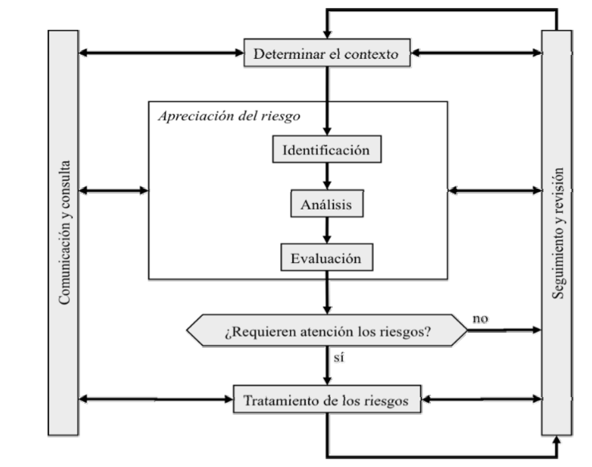<!-- .element height="50%" width="50%" -->

--

 1. Comunicación y Consulta
	 - La participación de las partes interesadas es esencial en todas las fases de la gestión de riesgos.
2. Determinar el Contexto
	- Definir los factores internos y externos que influyen en la gestión de riesgos.
3. Valoración del Riesgo
	- Identificación, análisis y evaluación de los riesgos: amenazas, probabilidad e impacto.
4. Tratamiento del Riesgo
	- Opciones: evitarlos, mitigarlos, transferirlos o aceptarlos.
5. Seguimiento y Revisión
	- Supervisar y revisar el proceso para asegurar su eficacia y adaptarlo a los cambios.

---

<!-- .slide: data-background="#A8DADC" -->
# Análisis de riesgos

---

## Análisis de riesgos

El análisis de riesgos sigue una serie de pasos estructurados para identificar, evaluar y gestionar los riesgos.

--

### Pasos del Análisis de Riesgos

1. **Identificación de activos relevantes**: Determinar los activos clave y su valor.
2. **Identificación de amenazas**: Evaluar las amenazas que pueden afectar a los activos.
3. **Evaluación de salvaguardas**: Examinar la eficacia de las medidas de protección.
4. **Estimación del impacto**: Medir el daño potencial de las amenazas.
5. **Estimación del riesgo**: Combinar el impacto con la probabilidad de ocurrencia.

--

- 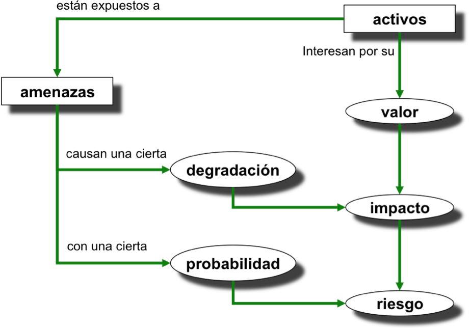

---

## Identificación de activos

Existen dos tipos de **activos esenciales** en un sistema de información:

1. **Información**: Los datos manejados.
2. **Servicios**: Funciones que proporciona el sistema.

--

### Otros Activos Relevantes

- **Datos**: Información almacenada.
- **Servicios auxiliares**: Funcionamiento del sistema.
- **Software**: Gestión de datos.
- **Hardware**: Hospeda datos y aplicaciones.
- **Soportes de información**: Dispositivos de almacenamiento.
- **Redes de comunicaciones**: Facilitan el intercambio de datos.
- **Instalaciones**: Infraestructura física.
- **Personas**: Usuarios y operadores del sistema.

--

## Dependencias entre activos

Los activos esenciales dependen de otros activos. Esto se visualiza en un **grafo de dependencias**, mostrando cómo la seguridad de un activo superior depende de los activos inferiores.

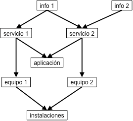

--

## Valoración de activos

La **valoración de activos** puede ser cualitativa o cuantitativa:

### Métodos de valoración

- **Cualitativos**: Escalas de valor (Ej.: Alto, Medio, Bajo).
- **Cuantitativos**: Valor económico (Ej.: Euros).

El valor puede ser **propio** o **acumulado** según las dependencias entre activos.

--

### Dimensiones de Valoración

- **Confidencialidad**: Daño por acceso no autorizado.
- **Integridad**: Daño por corrupción de datos.
- **Disponibilidad**: Consecuencias de la falta de disponibilidad del activo.

---

## Determinación de Amenazas

Las amenazas que afectan a los activos pueden clasificarse en:

- **Naturales**: Terremotos, inundaciones.
- **Industriales**: Fallos eléctricos, contaminación.
- **Defectos de aplicaciones**: Errores de diseño.
- **Errores humanos**: Fallos no intencionados.
- **Ataques deliberados**: Acciones maliciosas.

--

### Valoración de la Probabilidad

|Probabilidad|Valor|Frecuencia|
|---|---|---|
|MA (Muy Alta)|100|Diario|
|A (Alta)|10|Mensual|
|M (Media)|1|Anual|
|B (Baja)|1/10|Cada varios años|
|MB (Muy Baja)|1/100|Siglos|

--

### Valoración de la Degradación

|Degradación|Valor|Descripción|
|---|---|---|
|MA (Muy Alta)|100%|Destrucción completa|
|A (Alta)|90%|Degradación importante|
|M (Media)|50%|Impacto medio|
|B (Baja)|10%|Daños menores|
|MB (Muy Baja)|1%|Daños insignificantes|

---

## Evaluación de las Salvaguardas

Las **salvaguardas** o controles reducen el riesgo. Pueden ser:

- **Preventivos**: Reducen la probabilidad de la amenaza.
- **Correctivos**: Limitan el daño cuando ocurre.

--

### Valoración de las Salvaguardas

Se utiliza un **modelo de madurez** para clasificar la efectividad de los controles:

--

|Nivel|Eficacia|Descripción|
|---|---|---|
|**NA**|0%|No aplica.|
|**L0**|0%|Inexistente.|
|**L1**|10%|Instalado, no gestionado.|
|**L2**|50%|Gestión informal.|
|**L3**|90%|Formalizados y efectivos.|
|**L4**|95%|Medidos y evaluados.|
|**L5**|100%|Mejora continua.|

--

### Modelo de madurez de controles

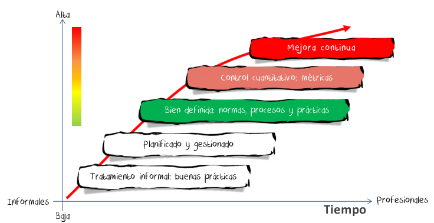

---

## Estimación del Impacto

El **impacto** se mide combinando el valor del activo y la degradación causada por una amenaza.

--

### Impacto Residual

Después de aplicar las salvaguardas, el **impacto residual** es el daño que aún permanece.

---

## Estimación del riesgo

El **riesgo** se define como la combinación de impacto y probabilidad:

> **Riesgo = Impacto x Probabilidad**

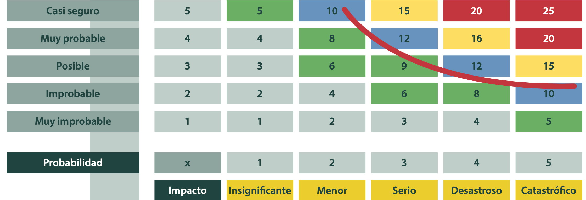

--

### Riesgo Residual

El **riesgo residual** es el riesgo que queda después de aplicar las salvaguardas. Se recalcula teniendo en cuenta el impacto y la probabilidad residual.

---

<!-- .slide: data-background="#A8DADC" -->
# Tratamiento de los riesgos

## Plan de seguridad

--

## Tratamiento de riesgos

Una vez completado el análisis de riesgos, el siguiente paso es **decidir qué hacer con cada riesgo** basado en su valoración y los criterios predefinidos.

--

### Plan de Seguridad

El tratamiento de riesgos se materializa en un **Plan de Seguridad**, un conjunto de acciones para mantener los riesgos en un nivel aceptable.

---

## Evaluación del riesgo

La evaluación del riesgo debe **interpretarse en términos de negocio**, para entender las consecuencias globales de los riesgos.

- El objetivo es decidir si un riesgo es **asumible** o si necesita **corrección**.

--

### Decisión Estratégica

La decisión sobre el tratamiento de un riesgo debe encontrar un **equilibrio** entre:

- Gastos en seguridad.
- Impacto del riesgo.
- Oportunidades.

---

## Análisis de situación

El análisis de situación ofrece una **visión global del riesgo** al explicar cómo se combinan las **amenazas y salvaguardas** en torno a los activos de la organización.

---

## Priorizar riesgos

Una forma eficaz de priorizar los riesgos es usar un **diagrama 2D**, en el que se posicionan según su **impacto** y **probabilidad**.

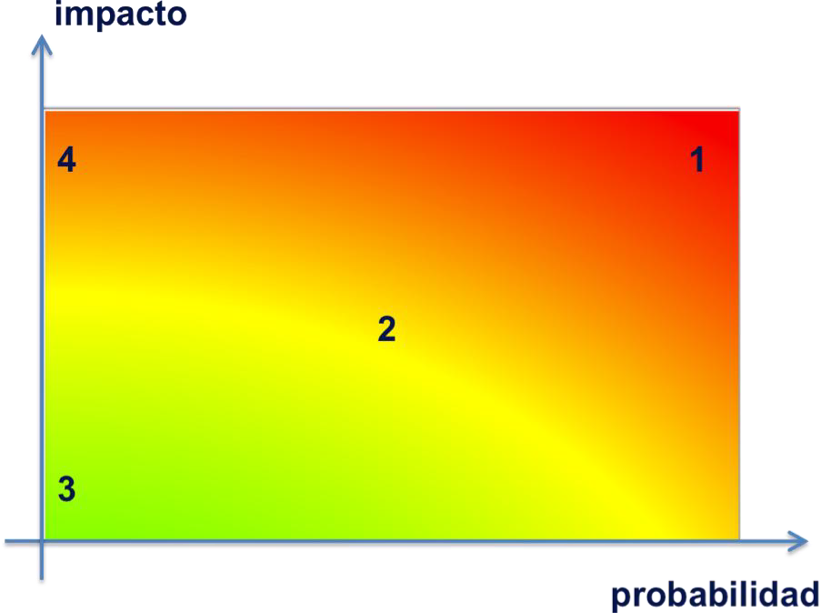<!-- .element height="50%" width="50%" -->

--

### Zonas de riesgo

- **Zona 1 - Caliente**: Riesgos muy probables y de alto impacto. Deben eliminarse o reducirse urgentemente.
- **Zona 2 - Templada**: Riesgos moderados, pueden ser gestionados o reducidos.
- **Zona 3 - Fría**: Riesgos improbables y de bajo impacto, aceptables tal como están.
- **Zona 4**: Riesgos improbables pero de alto impacto. Se requiere un plan de reacción.

---

## Criterios de decisión

El **diagrama ALARP** ayuda a analizar el riesgo desde un enfoque de **coste-beneficio**.

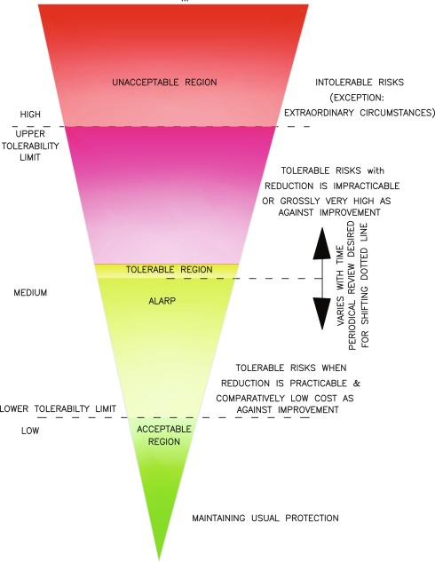<!-- .element height="50%" width="50%" -->

--

### Zonas de ALARP

- **Zona superior**: Riesgos inaceptables, deben ser eliminados.
- **Zona intermedia**: Riesgos debatibles, depende del coste de las salvaguardas.
- **Zona inferior**: Riesgos despreciables, mitigados adecuadamente.

---

## Opciones de Tratamiento del Riesgo

Existen cuatro formas principales de tratar un riesgo:

|**Coste-Beneficio**|**Tratamiento**|
|---|---|
|Coste mayor que beneficio.|**Evitar el riesgo**|
|Coste proporcional al beneficio.|**Mitigar el riesgo**|
|Tratamiento externo rentable.|**Transferir el riesgo**|
|Nivel de tolerancia aceptable.|**Aceptar el riesgo**|

---

## Situación Objetivo

El **plan de tratamiento** define una **situación objetivo**: los activos que proteger, las amenazas y las medidas de protección.

--

## Costes

La seguridad requiere inversión en **soluciones, formación y mantenimiento**. A menudo, mayor seguridad implica menor productividad.

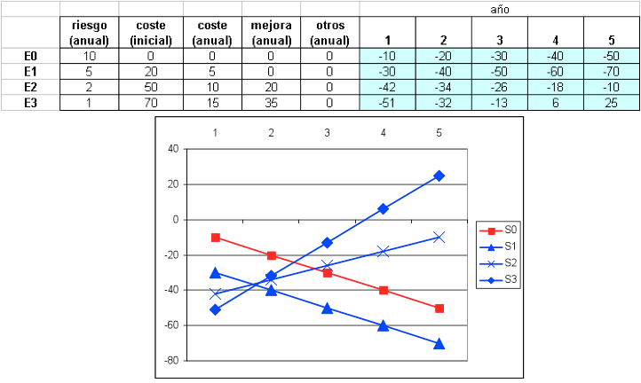

--

### Equilibrio entre Valor y Coste

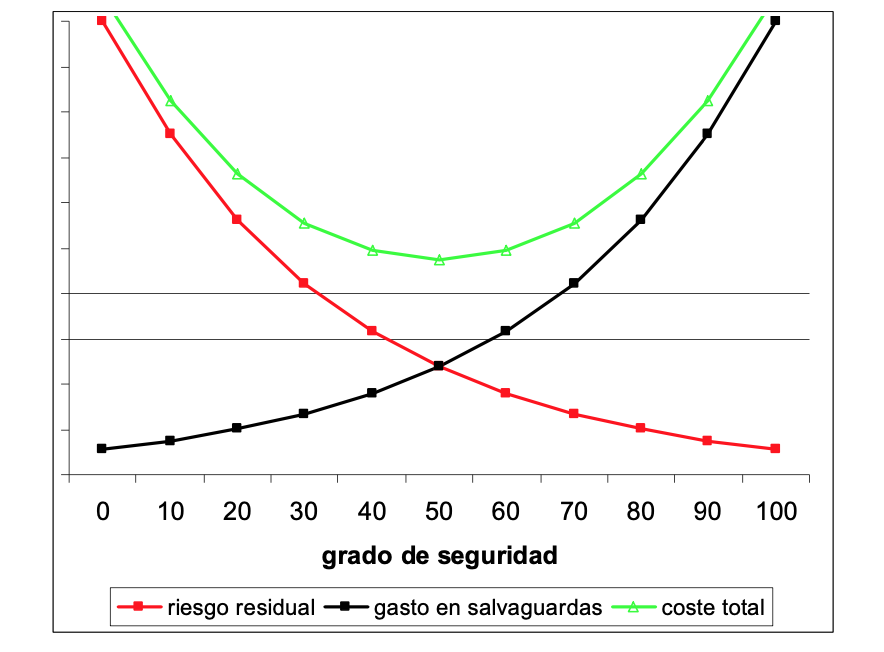

El gráfico muestra el **punto óptimo de gasto** en seguridad, donde se obtiene la mayor reducción de riesgo por el menor coste.

---

## Toma de Decisiones

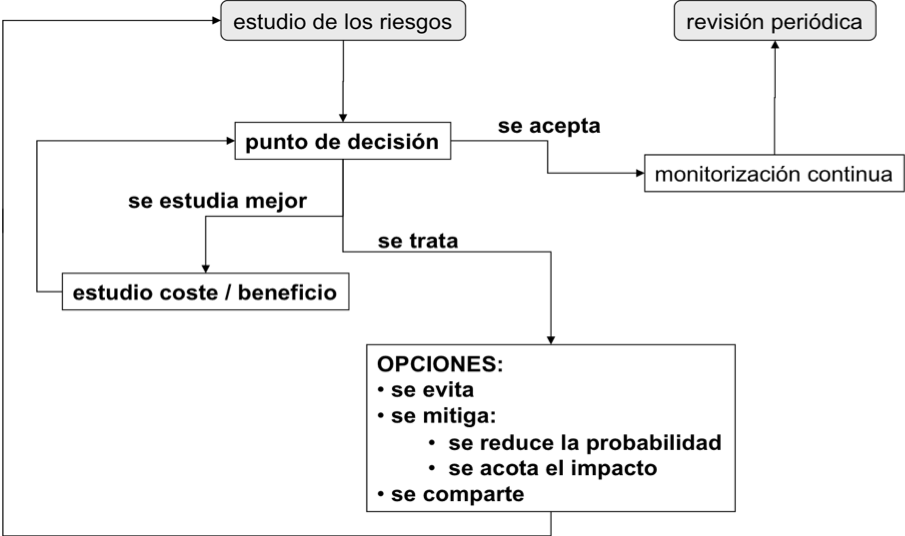

--

## Aceptación del riesgo

Aceptar un riesgo prudente es a menudo la mejor opción. El **propietario del riesgo** debe asignar los recursos adecuados.

--

## Monitorización

Los riesgos cambian con el tiempo, por lo que es necesario una **monitorización continua** para detectar:

- Nuevos activos o cambios en los existentes.
- Nuevas amenazas o vulnerabilidades.
- Cambios en las consecuencias o impactos.

---

## Conclusiones

Un riesgo puede aceptarse cuando su impacto es bajo y asumible. 
Los riesgos inaceptables deben tratarse mediante acciones preventivas, correctivas o de reacción, manteniendo un equilibrio entre seguridad y operatividad.
