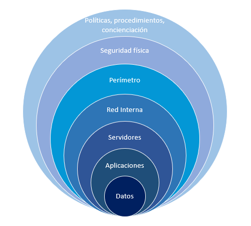

<!-- .slide: data-background="#000000" -->

# Seguridad y alta disponibilidad

## Conceptos básicos de Seguridad Informática

---

## Introducción

Antigua máxima en seguridad:

> **Cuando no ocurre nada, nos quejamos de lo mucho que gastamos en seguridad.** 
> 
> **Cuando algo sucede, nos lamentamos de no haber invertido más.**

<!--
"Existen dos tipos de personas: los que hacen copias de seguridad y los que se lamentan de no haberlas hecho"
-->

--

Lamentablemente no se es consciente de la falta de seguridad hasta que ya es demasiado tarde:

* ¿Quién hace **copias de seguridad**?

* ¿Son vuestras **contraseñas** seguras?

* ¿Reutilización de contraseñas en diferentes servicios?

---

## La seguridad absoluta no es posible

> "**El único sistema verdaderamente seguro es uno que está apagado, guardado dentro de un bloque de hormigón y sellado en una habitación revestida de plomo llena de guardias armados - y aún así tengo mis dudas.**"  
> *Gene Spafford*
> 
>  
> 
> "The only truly secure system is one that is powered off, cast in a block of concrete and sealed in a lead-lined room with armed guards - and even then I have my doubts.”  
> *Gene Spafford*

---

## Razones para la seguridad informática

* Las empresas han generado fuertes dependencias relacionadas con las tecnologías de la información:
	* Ordenadores y **dispositivos móviles**
	* **Redes** de comunicaciones 
	* **Servicios** telemáticos
  
* Un fallo o mal funcionamiento puede producir:
	* Grandes **pérdidas económicas**

--

* **No se puede conseguir la seguridad absoluta**
	* Debemos intentar alcanzar un **nivel de seguridad** razonable
	* Diremos que un sistema es **fiable** e lugar de seguro

---

## Objetivos de seguridad informática

Los principales objetivos de la seguridad informática son:

* Garantizar la **adecuada utilización** de los recursos y de las aplicaciones de los sistemas
* Detectar los posibles problemas y amenazas a la seguridad, minimizando y **gestionando riesgos**
* **Limitar las pérdidas** y conseguir la adecuada recuperación del sistema en caso de un incidente de seguridad
* Cumplir con el **marco legal** y con los requisitos impuestos a nivel organizativo

---

## Definición de seguridad informática
  
Según la norma ISO27002: 

> “La seguridad de la información se puede caracterizar por la preservación de la **confidencialidad, integridad y la disponibilidad**”.

--

Según INFOSEC Glosssary 2000: 

> “Seguridad informática son las medidas y controles que aseguran la **confidencialidad, integridad y disponibilidad** de los activos de los sistemas de información, incluyendo hardware, software, firmware y aquella información que procesan, almacenan y comunican”.

---

## CID: Confidencialidad, Integridad y Disponibilidad

Mantener un sistema seguro (o **fiable**) consiste básicamente en garantizar 3 aspectos: 

--

* **Confidencialidad**: solamente personas o sistemas autorizados acceden a los datos
* **Integridad**:  datos no han sido alterados
* **Disponibilidad**: datos accesibles (evitar pérdidas o bloqueos)

--

{:width=40%}

<!--
* **Confidencialidad**: cualidad de un mensaje, comunicación o datos, para que sólo se entiendan de manera comprensible o sean leídos por la persona o sistema que esté autorizado (privacidad y protección).
* **Integridad**: cualidad de mensaje, comunicación o datos, que permite comprobar que no se ha producido manipulación alguna en el original, es decir, que no ha sido alterado.
* **Disponibilidad**: capacidad de un servicio, de unos datos o de un sistema, a ser accesible y utilizable por los usuarios (o procesos) autorizados cuando estos lo requieran (evitar pérdidas o bloqueos).
-->

---

## CIDAN: Autenticación y No repudio

Junto al CID se suelen estudiar la autenticación y el no repudio.

* **Autenticación**: verificar que un documento ha sido elaborado (o pertenece) a quien el documento indica. 
	* Se suele realizar mediante un usuario o login y una contraseña o password.
* **No repudio o irrenunciabilidad:** estrechamente relacionado con la autenticación, permite probar la participación de las partes en una comunicación. Existen 2 posibilidades:
	* **No repudio en origen:** el emisor no puede negar el envío. La prueba la crea el emisor y la recibe el destinatario.
	* **No repudio en destino:** el receptor no puede negar que recibió el mensaje porque el emisor tiene pruebas de la recepción. La prueba la crea el receptor y la recibe el emisor.
<!--
::: notes
Si la autenticidad prueba quien es el autor de un documento y cuál es el destinatario, el no repudio prueba que es el mismo autor quien envía la comunicación (no repudio en origen) y que el destinatario la recibió (no repudio en destino).
:::
-->

---

## Alta disponibilidad: Definición

**Disponibilidad:** porcentaje del tiempo que un servicio o dispositivo está operativo:

$$D=\frac{MTBF}{MTTR + MTBF}$$

* **MTBF:** Mean Time Between Failure
* **MTTR:** Mean Time To Repair

--  
  
* La disponibilidad **se expresa en número de nueves**: 
	* Disponibilidad de 3 nueves significa que D = 99,9%. 
	* Aplicaciones **críticas** exigen una disponibilidad de **5 nueves**, 
		* Sistema caído sólo 315 segundos al año.

---

## Alta disponibilidad: Interrupciones

Existen 2 **tipos de interrupciones**:
  
* Interrupciones **previstas**:
	* Cambios o mejoras en nuestro **hardware**
	* Actualizaciones **software**
  
  	
* Interrupciones **imprevistas**:
	* Un apagón
	* Un error del hardware o del software
	* Problemas de seguridad
	* Desastre natural
	* Caídas involuntarias del sistema

<!--
::: notes
$$\\D=\frac{MTBF}{MTTR + MTBF}$$

La disponibilidad se define a partir del tiempo medio que un sistema es capaz de estar funcionando sin fallar (Mean Time Between Failure o **MTBF**) y del tiempo medio que se tarda en reparar o sustituir en caso de fallo (Mean Time To Repair o **MTTR**). La disponibilidad (D) se define con la siguiente ecuación:

**La disponibilidad suele expresarse por el número de nueves**: disponibilidad de 3 nueves significa que D = 99,9%. En aplicaciones críticas se suele exigir una disponibilidad de 5 nueves, lo que significa que en promedio el sistema sólo estará caído 315 segundos al año.

:::
-->

---

## Elementos vulnerables a proteger

Los 3 elementos principales a proteger :

* Hardware 
* Software
* **Datos**

--
  
> **Los datos constituyen el principal elemento a proteger**, ya que es el más amenazado y el más difícil de recuperar.

---

## Capas de protección en una ciudad medieval

<!-- ::: notes
https://es.wikipedia.org/wiki/Carcasona
::: -->

---

## Capas de protección de un sistema informático

---

# Ejercicios

--

