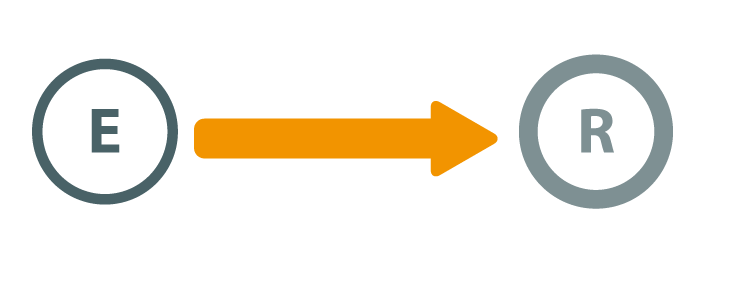
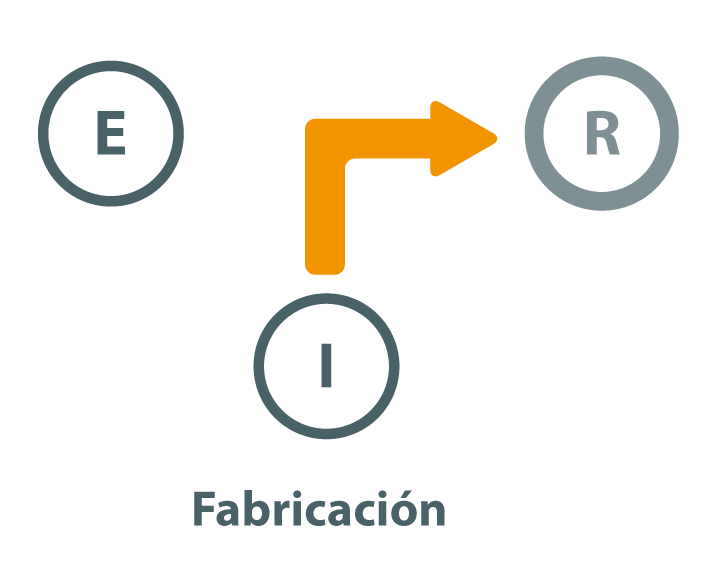

# Conceptos básicos de Seguridad Informática

---

## Introducción

Antigua máxima en seguridad:

> **Cuando no ocurre nada, nos quejamos de lo mucho que gastamos en seguridad.** 
> 
> **Cuando algo sucede, nos lamentamos de no haber invertido más.**

<!--
"Existen dos tipos de personas: los que hacen copias de seguridad y los que se lamentan de no haberlas hecho"
-->

--

Lamentablemente no se es consciente de la falta de seguridad hasta que ya es demasiado tarde:

* ¿Quién hace **copias de seguridad**?

* ¿Son vuestras **contraseñas** seguras?

* ¿Reutilización de contraseñas en diferentes servicios?

---

## ¿Es posible la seguridad absoluta?

--

> "**El único sistema verdaderamente seguro es uno que está apagado, guardado dentro de un bloque de hormigón y sellado en una habitación revestida de plomo llena de guardias armados - y aún así tengo mis dudas.**"  
> *Gene Spafford*
> 
>  
> 
> "The only truly secure system is one that is powered off, cast in a block of concrete and sealed in a lead-lined room with armed guards - and even then I have my doubts.”  
> *Gene Spafford*

---

## Razones para la seguridad informática

* Las empresas han generado fuertes dependencias relacionadas con las tecnologías de la información:
	* Ordenadores y **dispositivos móviles**
	* **Redes** de comunicaciones 
	* **Servicios** telemáticos
  
* Un fallo o mal funcionamiento puede producir:
	* Grandes **pérdidas económicas**
  
--
  
* **No se puede conseguir la seguridad absoluta**
	* Debemos intentar alcanzar un **nivel de seguridad** razonable
	* Diremos que un sistema es **fiable** e lugar de seguro

---

## Objetivos de seguridad informática

Los principales objetivos de la seguridad informática son:

* Garantizar la **adecuada utilización** de los recursos y de las aplicaciones de los sistemas
* Detectar los posibles problemas y amenazas a la seguridad, minimizando y **gestionando riesgos**
* **Limitar las pérdidas** y conseguir la adecuada recuperación del sistema en caso de un incidente de seguridad
* Cumplir con el **marco legal** y con los requisitos impuestos a nivel organizativo

---

## Definición de seguridad informática
  
Según la norma ISO27002: 

> “La seguridad de la información se puede caracterizar por la preservación de la **confidencialidad, integridad y la disponibilidad**”.

--

Según INFOSEC Glosssary 2000: 

> “Seguridad informática son las medidas y controles que aseguran la **confidencialidad, integridad y disponibilidad** de los activos de los sistemas de información, incluyendo hardware, software, firmware y aquella información que procesan, almacenan y comunican”.

---

## CID: Confidencialidad, Integridad y Disponibilidad

Mantener un sistema seguro (o **fiable**) consiste básicamente en garantizar 3 aspectos: 

--

* **Confidencialidad**: solamente personas o sistemas autorizados acceden a los datos
* **Integridad**:  datos no han sido alterados
* **Disponibilidad**: datos accesibles (evitar pérdidas o bloqueos)

--

{width=40%}

<!--
* **Confidencialidad**: cualidad de un mensaje, comunicación o datos, para que sólo se entiendan de manera comprensible o sean leídos por la persona o sistema que esté autorizado (privacidad y protección).
* **Integridad**: cualidad de mensaje, comunicación o datos, que permite comprobar que no se ha producido manipulación alguna en el original, es decir, que no ha sido alterado.
* **Disponibilidad**: capacidad de un servicio, de unos datos o de un sistema, a ser accesible y utilizable por los usuarios (o procesos) autorizados cuando estos lo requieran (evitar pérdidas o bloqueos).
-->

---

## CIDAN: Autenticación y No repudio

Junto al CID se suelen estudiar la autenticación y el no repudio.

* **Autenticación**: verificar que un documento ha sido elaborado (o pertenece) a quien el documento indica. 
	* Se suele realizar mediante un usuario o login y una contraseña o password.
* **No repudio o irrenunciabilidad:** estrechamente relacionado con la autenticación, permite probar la participación de las partes en una comunicación. Existen 2 posibilidades:
	* **No repudio en origen:** el emisor no puede negar el envío. La prueba la crea el emisor y la recibe el destinatario.
	* **No repudio en destino:** el receptor no puede negar que recibió el mensaje porque el emisor tiene pruebas de la recepción. La prueba la crea el receptor y la recibe el emisor.
<!--
::: notes
Si la autenticidad prueba quien es el autor de un documento y cuál es el destinatario, el no repudio prueba que es el mismo autor quien envía la comunicación (no repudio en origen) y que el destinatario la recibió (no repudio en destino).
:::
-->

---

## Alta disponibilidad: Definición

**Disponibilidad:** porcentaje del tiempo que un servicio o dispositivo está operativo:

$$D=\frac{MTBF}{MTTR + MTBF}$$

* **MTBF:** Mean Time Between Failure
* **MTTR:** Mean Time To Repair

--  
  
* La disponibilidad **se expresa en número de nueves**: 
	* Disponibilidad de 3 nueves significa que D = 99,9%. 
	* Aplicaciones **críticas** exigen una disponibilidad de **5 nueves**, 
		* Sistema caído sólo 315 segundos al año.

---

## Alta disponibilidad: Interrupciones

Existen 2 **tipos de interrupciones**:
  
* Interrupciones **previstas**:
	* Cambios o mejoras en nuestro **hardware**
	* Actualizaciones **software**
  
  	
* Interrupciones **imprevistas**:
	* Un apagón
	* Un error del hardware o del software
	* Problemas de seguridad
	* Desastre natural
	* Caídas involuntarias del sistema

<!--
::: notes
$$\\D=\frac{MTBF}{MTTR + MTBF}$$

La disponibilidad se define a partir del tiempo medio que un sistema es capaz de estar funcionando sin fallar (Mean Time Between Failure o **MTBF**) y del tiempo medio que se tarda en reparar o sustituir en caso de fallo (Mean Time To Repair o **MTTR**). La disponibilidad (D) se define con la siguiente ecuación:

**La disponibilidad suele expresarse por el número de nueves**: disponibilidad de 3 nueves significa que D = 99,9%. En aplicaciones críticas se suele exigir una disponibilidad de 5 nueves, lo que significa que en promedio el sistema sólo estará caído 315 segundos al año.

:::
-->

---

## Elementos vulnerables a proteger

Los 3 elementos principales a proteger :

* Hardware 
* Software
* **Datos**

--
  
> **Los datos constituyen el principal elemento a proteger**, ya que es el más amenazado y el más difícil de recuperar.

---

## Capas de protección en una ciudad medieval

{height=90%}

::: notes
https://es.wikipedia.org/wiki/Carcasona
:::

### Capas de protección de un sistema informático

{width=80%}

---

# Amenazas

---

## Nivel de seguridad

* **La seguridad absoluta no es posible**
* **El riesgo puede reducirse, pero no eliminarse**
* Hablaremos siempre de niveles de seguridad
	* **Niveles de seguridad aceptables** en los sistemas informáticos
	* El nivel adecuado dependerá de cada organización
* No hablaremos de sistemas seguros, sino de sistemas **fiables** (hasta cierto nivel)

  
--

> **Fiabilidad**: probabilidad de que un sistema se comporte tal y como se espera de él.

---

## Origen de las amenazas
> **Ni todas las amenazas de seguridad se deben a ataques maliciosos ni todos los ataques provienen del exterior**

* La mayoría de problemas de seguridad:
	* No tienen que ver con ataques informáticos
	* Provienen de **fallos de hardware o software**, errores de programación o administración, robo, fraude y extorsión, demandas legales, infracción de derechos de autor o ingeniería social, etc.

--

**Los usuarios internos suponen la mayor fuente de amenazas**:

* Son los que mejor conocen el sistema
* Poseen acceso a veces ilimitado al mismo
* Saben cuáles son los activos más valiosos
* Pueden causar el daño mayor y con la mayor impunidad

---

## Ámbito de las Medidas de seguridad

>**Sistema de seguridad** = Tecnologías + Personas + Operaciones

Medidas de seguridad:

* Personas: Formación y concienciación del personal
* Operaciones: Gestión racional de procesos, **organización de tareas y responsabilidades**
* Tecnologías: Adquisición de software o hardware de seguridad
  
--
  
La seguridad de la información requiere un enfoque global:

* Participación coordinada de tecnología, personas y operaciones. 
* **El objetivo no es conseguir sistemas 100%** seguros
* El objetivo es proteger los activos con un nivel que se corresponda con las expectativas

---

## Vulnerabilidad, amenaza y riesgo

* **Vulnerabilidad:** debilidad o fallo en un sistema que pone en riesgo la integridad, disponibilidad o confidencialidad de la información
	*  Es necesario encontrarlas y mitigarlas
	*  Orígenes: fallos de diseño, errores de configuración o carencias de procedimientos

* **Amenaza:** toda acción que aprovecha una vulnerabilidad para atentar contra la seguridad de un sistema de información. 
	* Origen: ataques, desastres naturales, negligencias, etc.
	* Pueden ser tanto **internas** como **externas**.

* **Riesgo** probabilidad de que se produzca incidente de seguridad al materializarse una amenaza
	* Se mide como una **probabilidad**
	* Tiene asociado un **daño o impacto**

---

## Relación entre amenaza y vulnerabilidad

{width=75%}

---
 
## Vulnerabilidades en software.

Una **vulnerabilidad software** es un defecto en una aplicación

*  puede ser aprovechado por un atacante 
*  para programar un **exploit** que utilice esa vulnerabilidad 

--

Hay 3 tipos según su grado de reconocimiento por el desarrollador:

* **Vulnerabilidades reconocidas con parche**

* **Vulnerabilidades reconocidas sin parche (todavía)** 
	* Algunas veces se proporciona una solución temporal (*workaround*)
	* mejor desactivar el servicio hasta tener el parche

* **Vulnerabilidades no reconocidas** por el desarrollador 
	* Podemos estar expuestos y no ser conscientes de ello 
 

<!--
::: notes
Por tanto, las vulnerabilidades son las condiciones y características propias de los sistemas de una organización que la hacen susceptible a las amenazas. El problema es que en el mundo real, si existe una vulnerabilidad, siempre existirá alguien que intentará explotarla, es decir, sacar provecho de su existencia. 
:::
-->

---

## Amenazas de tipo físicas-ambientales   

* **Afectan a las instalaciones y/o el hardware** 
* Primer nivel de seguridad para garantizar la **disponibilidad**. 

--

### Aspectos a tener en cuenta

* Robos, sabotajes, destrucción de sistemas
* Suministro eléctrico
	* Cortes, subidas y bajadas bruscas de tensión
* Condiciones atmosféricas adversas. 
	* Humedad relativa excesiva o temperaturas extremas
* Catástrofes (naturales o artificiales) 
	* terremotos, inundaciones, incendios, humo, etc. 
* Interferencias electromagnéticas 
	* Afectan electrónica y Comunicaciones

---

## Amenazas de tipo software o lógicas

Software malicioso creado para dañor nuestro sistema. Se denomina **malware**. 
Algunos ejemplos son:

* **Herramientas de seguridad:** Herramientas para detectar y solucionar fallos, y al mismo tiempo aprovechan para atacarlos.
* **Rogueware (o  Rogue, FakeAVs, Badware, Scareware):** Son falsos programas de seguiridad (antivirus o Antispyware).
* **Puertas traseras o backdoors:**  Los programadores insertan atajos de acceso o administración, en ocasiones con poco nivel de seguridad.  

--

* **Virus:**  Secuencia de código que se inserta en un fichero ejecutable (denominado huésped).
* **Gusano o Worm:** Programa capaz de ejecutarse y propagarse por sí mismo a través de redes.
* **Troyanos o Caballos de Troya:** Aplicaciones con funcionalidad deseada por el usuario, que ejecutan funciones ocultas sin el conocimiento del usuario
* **Programas conejo o bacterias:** Programas que se dedican a reproducirse hasta que el número de copias acaba con los recursos del sistema
* **Canales cubiertos:** Canales de comunicación que permiten a un proceso transferir información de forma que viole la política de seguridad del sistema

---

## Amenazas provocadas por personas I
La mayoría de ataques, intencionadamente o no, provienen de personas.

> **atacantes pasivos**: fisgonean sin modificar ni destruir nada
> **atacantes activos**: dañan el objetivo atacado o lo modifican

* **Personal**: El propio personal de una organización puede producir un ataque intencionado
* **Hacker**: Experto o gurú en aspectos técnicos relacionados con la informática. Se distinguen 2 tipos: 
	* **Hackers o white hat**:  actúan con carácter constructivo, informativo o sólo intrusivo; 
	* **Crackers o black hat**: actúan de forma destructiva
	* **grey hat**: andan entre un tipo y otro 
	
---

## Amenazas provocadas por personas II

* **Sniffers:**  Analizan el tráfico de la red para obtener información de los paquetes trasmitidos.
* **Ciberterrorista**: Experto informático que trabaja para países u organizaciones como espías o saboteadores.
* **Programadores de virus**: Crean programas dañinos para los sistemas o aplicaciones.
* **Carders**:  Atacan sistemas de tarjetas de crédito.
* **Newbie**: Hacker novato Wannaber: Interesados por el hacking pero que aún no han sido reconocidos por la élite

---

## Amenazas provocadas por personas III
* **Lammer** o **Script-Kiddies**: Pretenden hacer hacking sin tener conocimientos de informática. Se suelen dedicar a buscar y descargar programas de hacking para luego ejecutarlos
* **Luser** (looser + user): Término utilizado por los hackers para referirse a los usuarios comunes (como burla).
*  **Pirata informático:** ciberdelincuente o delincuente informático: Personas dedicadas a realizar actos delictivos y perseguidos legalmente.

---

## Categorías generales de ataques

Las cuatro categorías de ataques generales, dependiendo de como alteran el flujo de información,  son las siguientes:

* Interceptación 
* Modificación
* Interrupción
* Fabricación

---

## Categorías generales de ataques: Flujo normal

{width=30%}

* Aspectos de la seguridad
	* Confidencialidad
		* Nadie no autorizado accede a la información.
	* Integridad
		* Los datos enviados no se modifican en el camino.
	* Disponibilidad
		* La recepción y acceso es correcto.

---

## Categorías generales de ataques: Interceptación  

Acceso a la información por parte de personas no autorizadas. 
Uso de privilegios no adquiridos.
Detección difícil, no deja huellas

--

* Aspectos de la seguridad
	* Integridad
	* Disponibilidad
	* ~~Confidencialidad~~: 
		* alguien no autorizado accede a la información

* Ejemplos:
	* Copias ilícitas de programas
	* Escucha en línea de datos

---

## Categorías generales de ataques: Modificación

\begin{wrapfigure}{r}{0.3\textwidth}
  \begin{center}
    \includegraphics[width=0.3\textwidth]{../img/01/modificacion.png}
  \end{center}  
\end{wrapfigure}

Acceso no autorizado que cambia el entorno para su beneficio.
Detección difícil según circunstancias.

* Aspectos de la seguridad
	* Disponibilidad
	* ~~Integridad~~: 
		* los datos enviados pueden ser modificados en el camino
	* ~~Confidencialidad~~: 
		* alguien no autorizado accede a la información

* Ejemplos:
	* Modificación de bases de datos
	* Modificación de elementos del HW

---

## Categorías generales de ataques: Interrupción  

Producen que un elemento del sistema se pierda, quede no utilizable o no disponible.
Detección inmediata.

* Aspectos de la seguridad
	* Confidencialidad:
		* no hay acceso no autorizado
	* Integridad: 
		* los datos enviados no se modifican
	* ~~Disponibilidad~~
		* recepción deja de producirse

* Ejemplos:
	* Destrucción del hardware
	* Borrado de programas, datos
	* Fallos en el sistema operativo

---

### Categorías generales de ataques: Fabricación  

Se genera un objeto que no existía previamente.
Caso concreto de modificación
Detección difícil. Delitos de falsificación.

--

* Aspectos de la seguridad
	* Confidencialidad: 
		* nadie no autorizado accede a la información.
	* Disponibilidad: 
		* la recepción es correcta.
	* ~~Integridad~~: 
		* los datos recibidos no fueron emitidos

* Ejemplos:
	* Añadir transacciones en red
	* Añadir registros en base de datos

<!-- ::: notes
caso concreto de modificación
::: -->

---

## Amenazas: Técnicas de ataque I

* **Malware**: software malintencionado que afecta a los sistemas con pretensiones como: controlarlo o realizar acciones remotas, dejarlo inutilizable, reenvío de spam, etc.
* **Ingeniería social**: Se obtiene información confidencial de una persona para utilizarla con fines maliciosos, o se influye en su comportamiento para propiciar la realización de ataques.
* **Scam:** Estafa electrónica por medio del engaño como donaciones, transferencias, compra de productos fraudulentos,... Las cadenas de correo electrónico engañosas pueden ser scam si hay pérdida monetaria y **hoax** cuando sólo hay engaño.

---

## Amenazas: Técnicas de ataque II

* **Spam:** Correo o mensaje basura, no solicitados, no deseados o de remitente no conocido, habitualmente de tipo publicitario.
* **Sniffing:** Rastrear monitorizando el tráfico de una red para hacerse con información confidencial.
* **Spoofing:** Suplantación de identidad de un equipo o falsificación, por ejemplo, existe IP, MAC, ARP, web o mail Spoofing.
* **Pharming:** Redirigir un nombre de dominio a otra máquina distinta falsificada y fraudulenta.
* **Phishing:** estafa basada en la suplantación de identidad y la ingeniería social para adquirir acceso a cuentas bancarias o comercio electrónico ilícito.

---

## Amenazas: Técnicas de ataque III

* **Password cracking:** Descifrar contraseñas de sistemas o comunicaciones. Los métodos más comunes son mediante sniffing, observando directa la introducción de credenciales (shoulder surfing), ataques por fuerza bruta y de diccionario.
* **Botnet:** Conjunto de robots informáticos o bots, que se ejecutan de manera autónoma y automática, en multitud de hosts, normalmente infectados. Permite controlar todos los ordenadores/servidores infectados de forma remota. Sus fines, normalmente, son rastrear información confidencial o incluso cometer actos delictivos.

---

## Amenazas: Técnicas de ataque IV

* **Denegación de servicio o Denial of Service (DoS):** Causar que un servicio o recurso sea inaccesible a los usuarios legítimos. Una ampliación del ataque DoS es el llamado ataque distribuido de denegación de servicio, **DDoS**, a través de una botnet, siendo esta técnica el ciberataque más usual y eficaz.
* **Keyloggers**: Almacenan lo que se teclea e incluso hacen capturas de pantalla para averiguar contraseñas.

---

# Protección

---

## Auditorías de seguridad

Objetivo de seguridad: proteger activos

> Un activo es todo aquello que posee la empresa, desde oficinas, mobiliario hasta equipos, software y datos.

La protección se realiza mediante **auditorías de seguridad** en las que se realiza un **análisis de riesgos**:

* Enumeración de sistemas operativos, servicios, aplicaciones, topologías y protocolos de red
* Detección, comprobación y evaluación de vulnerabilidades
* Medidas específicas de corrección
* Recomendaciones sobre implantación de medidas preventivas

--

Obtenidos los resultados, se detallan, archivan y reportan a los responsables quienes deberán establecer medidas preventivas.

<!-- ::: notes
Una auditoría de seguridad informática o auditoría de sistemas de información es el estudio que comprende el análisis y gestión de sistemas para identificar y posteriormente corregir las diversas vulnerabilidades que pudieran presentarse en una revisión exhaustiva de las estaciones de trabajo, redes de comunicaciones o servidores.
::: -->

---

## Tipos de auditoría

* **Auditoría de seguridad interna:** 
	* se contrasta el nivel de seguridad de las redes locales y corporativas de carácter interno
* **Auditoría de seguridad perimetral:** 
	* se estudia el perímetro de la red local o corporativa, conectado a redes públicas
* **Test de intrusión:** 
	* comprobar el nivel de resistencia a la intrusión no deseada
* **Análisis forense:** 
	* análisis posterior de incidentes, se trata de reconstruir cómo se ha penetrado en el sistema, a la vez que se valoran los daños ocasionados.
* **Auditoría de código de aplicaciones:** 
	* análisis del código fuente comprobando vulnerabilidades.

---

## Elementos del riesgo

{width=80%}

---

## Análisis de riesgos:
* Identificar cuáles son los **activos** a proteger 
	* ¿Cuál es su valor? ¿Cuánto cuesta reponerlos? 
	* ¿Es posible reponerlos?
* Identificar las **amenazas** a que están expuestos los activos
	* ¿Cuáles son las amenazas naturales y humanas? 
	* ¿En qué circunstancias pueden materializarse?
* Identificar los **riesgos** que suponen las amenazas para los activos: 
	* ¿Cuál es la **probabilidad** de que ocurra una amenaza? 
	* ¿Cuál es el coste tangible o intangible si se produce?
* Evaluar el **coste** de las **contramedidas o salvaguardas**
	* ¿Qué contramedidas utilizar? ¿Cuál es su eficacia?
	* ¿Cuánto cuesta implantar una contramedida? 
	
---

## Matriz de riesgos
Cuanto mayor es el valor del activo y mayor es su grado de exposición a amenazas, mayor es su riesgo y más prioritaria la exigencia de protegerlo.

{width=65%}

---

## Esquema de análisis de riesgos
Existen estándares orientados a servir como base para auditorías de informática. Método Margerit:

{width=85%}

<!-- ::: notes
Una auditoría se realiza basándose en un conjunto de directrices o buenas prácticas sugeridas. Existen estándares orientados a servir como base para auditorías de informática. Uno de ellos es COBIT (Objetivos de Control de las Tecnologías de la Información) y adicionalmente a él encontramos el estándar ISO 27002, que supone un código internacional de buenas prácticas de seguridad de la información. Otros estándares, como el ISO 27001, definen los requisitos de auditoría y sistemas de gestión de seguridad.
Los servicios de auditoría constan de las siguientes fases:
::: -->

---

## Mecanismos de seguridad

Auditoría de seguridad -> análisis de riesgos

Definición de una **política de seguridad** que:

* defina responsabilidades y 
* reglas a seguir para evitar amenazas 

--

A los mecanismos utilizados para implementar esta política de seguridad se les denomina **mecanismos de seguridad** (también **salvaguardas** o **contramedidas**)

> Un mecanismo de seguridad informática es una técnica o herramienta que se utiliza para fortalecer la confidencialidad, la integridad y la disponibilidad de un sistema informático. 

---

## Tipos de mecanismos de seguridad:

* **Preventivos:** Actúan antes de que un hecho ocurra y su función es detener agentes no deseados.  
* **Detectivos:** Actúan también antes de que un hecho ocurra pero su función es revelar la presencia de agentes no detectados en algún elemento del sistema.  
* **Correctivos:** Actúan después de que haya ocurrido el hecho y su función es corregir las consecuencias.

--

{width=45%}

---

## Ejemplos de salvaguardas software o lógicas

* Cortafuegos
* antivirus
* antispam
* protección anticopia
* encriptación de la información
* uso de contraseñas
* formación de usuarios del sistema

---

## Ejemplos de salvaguardas hardware o físicas

* SAI
* extintores
* cámaras de seguridad
* control de acceso físico al sistema
* controles de acceso con tarjetas de identificación
* control de la temperatura y la humedad de la sala

---

## Pautas generales de protección de un sistema
* Localizar los activos a proteger: equipos, aplicaciones, datos y comunicaciones
* Redactar y revisar regularmente los planes de actuación ante catástrofes
* No instalar nada innecesario
* Estar al día de los informes de seguridad que vayan surgiendo y actualizar parches de seguridad
* Formar a los usuarios
* Instalar Firewall
* Definir y ejecutar una buena política de copias de seguridad
* Gestionar y revisar los logs del sistema
* Revisar las listas de usuarios activos

---

## Clasificación de las salvaguardas 

* Según el recurso a proteger
	* **Seguridad física**
		* Protege  el Hardware 	  
	* **Seguridad lógica**
		* Protege el Software y la información	  

* Según el momento de aplicación
	* **Seguridad activa**
		* Evitar amenazas **antes** de que se produzcan 
	* **Seguridad pasiva**
		* Minimizar daños **después** de que se produzcan

---

## Clasificación de las salvaguardas: Seguridad física{.allowframebreaks}   

La seguridad física trata de proteger el hardware, teniendo en cuenta, entre otros, la ubicación y las amenazas de tipo físico.  

|   **Amenaza**				|  **Salvaguarda**             |
|----------------------	|----------------------------------|
|  	Incendios		|   Mobiliario ignífugo, Evitar localización peligrosa, Sistemas antiincendios, detectores de incendios, ...               |
|  	Inundaciones		|       Evitar plantas bajas Impermeabilización de paredes, techos, sellado de puertas...           |
| 	Robos	|       Puertas con medidas biométricas, cámaras, vigilantes, ...           |
| 	Señales electromagnéticas	|    Evitar lugares con radiaciones electromagnéticas Filtros o cableado especial. La fibra óptica no es sensible a esto  |
|  	Apagones		|       SAI           |
|  	Sobrecargas eléctricas		|      SAI. También estabilizan la señal eléctrica            |
|  	Desastres naturales		|    Estar en contacto con los organismos que proporcionan información sobre terremotos o desastres meteorológicos              |

---
 
## Clasificación de las salvaguardas: Seguridad lógica{.allowframebreaks}  

Protege el software tanto a nivel de sistema operativo como de aplicación, incluyendo la información o datos de usuario.

|   **Amenaza**				|  **Salvaguarda**                |
|----------------------	|----------------------------------|
| Robos	|      Cifrado, Contraseñas, Sistemas biométricos     |
| Perdida de información	| Copia de seguridad (distintas ubicaciones), Sistemas tolerantes a fallos,Discos redundantes     |
| Perdida de integridad de la información|     Programas de chequeo del equipo, Firma digital, Comando sfc      |
| 	Entrada de virus|  Antivirus |
| Ataques desde la red	|  Firewall, Programas de monitorización Proxys |
| Modificaciones no autorizadas	|  Contraseñas Listas de control de acceso Cifrar documentos |

---

## Clasificación de las salvaguardas: Seguridad activa{.allowframebreaks} 

Medidas para detectar y evitar amenazas antes de que se produzcan.  
Son de este tipo todas las medidas de seguridad lógica.  

|   **Técnicas**				|  **¿Qué previene?**                                              |
|----------------------	|---------------------------------------------------------|
| Contraseñas	|   Previene el acceso a recursos a usuarios no autorizados      |
| Listas de control de acceso						|Previene acceso a ficheros a usuarios no autorizados       |
| Encriptación	|Evita a personas no autorizadas interpretar la información|
|Software de seguridad	|  Evita virus y accesos no deseados al sistema|
|	Firmas y certificados digitales|  Comprueba la procedencia, autenticidad e integridad de los mensajes|
|Sistemas de ficheros tolerantes a fallos| Previene fallos de integridad |
|	Cuotas de disco|Previene el uso excesivo de disco por parte de algún usuario|

---

## Clasificación de las salvaguardas: Seguridad pasiva  

Medidas utilizadas para minimizar los daños después de que se produzca el ataque o fallo.
Son correctivas, minimizan el impacto y los efectos causados por accidentes.  

|   **Técnicas**				|  **Resultado**                                              |
|----------------------	|---------------------------------------------------------|
| Discos redundantes	|   Restaurar datos que han quedado inconsistentes        |
| SAI						|Proporcionan energía durante un periodo de tiempo        |
| Copias de seguridad	|Podemos recuperar información en caso de pérdida de datos|

---

# Legislación

---

## Normativa de protección de datos

* REGLAMENTO (UE) 2016/679 DEL PARLAMENTO EUROPEO Y DEL CONSEJO de 27 de abril de 2016. 
	* Conocido como **RGPD** (*Reglamento General de Protección de Datos*)

	
> RGPD es el reglamento europeo relativo a la protección de las personas físicas en lo que respecta al **tratamiento de sus datos personales y a la libre circulación de estos datos**.

* Ley orgánica de *Protección de Datos Personales y garantía de los derechos digitales (LO 03/2018)* 
	* Conocida como **LOPDGDD**. 

> El objetivo de la LOPDGDD es adaptar la legislación española a la normativa europea definida por el RGPD.  
> **En España, la norma de referencia es la LOPDGDD.**

---

## Normativa de los sistemas de información y comercio electrónico

Regulado por la Comisión del Mercado de las Telecomunicaciones. **Ley 34/2002**.
Aspectos más importantes:

* Las empresas deben proporcionar información sobre n**ombre, domicilio, dirección de correo electrónico, número de identificación fiscal y precio** de los productos.
* **Exculpa** de responsabilidad siempre que no tengan conocimiento de la información contenida en sus servidores a aquellas **empresas que ofrecen alojamiento web**.
* Los **contratos** realizados por vía electrónica son válidos.

---

## LOPDGDD: ¿Qué entendemos por dato personal?
Cualquier información relacionada con una **persona física** que se puede utilizar para identificarla directa o indirectamente tales como:

* nombre
* sexo
* edad 
* número de teléfono 
* correo electrónico 
* fotos
* datos bancarios 
* menciones en redes sociales 
* dirección desde la que se conecta un ordenador
* etc, etc, etc

---

## LOPDGDD: Derechos de los ciudadanos europeos

> Se suelen denominar derechos **ARCO** (**Acceso, Rectificación, Cancelación y Oposición**)

El RGPD desarrolla y ofrece a los residentes en la Unión Europea derecho de 

* acceso
* rectificación
* oposición
* al olvido
* a la limitación del tratamiento
* portabilidad
* información y a no ser objeto de decisiones individualizadas

---

## LOPDGDD: Consentimiento expreso
 
Todo ciudadano europeo deberá dar **su consentimiento expreso** para que una empresa pueda utilizar sus datos personales. 

> * El consentimiento debe ser **inteligible y de fácil acceso**.
> * No da lugar a opciones preparadas ni consentimientos tácitos para el uso de los datos. 
> * Consentimiento por separado **para cada finalidad**.

---

## LOPDGDD: ¿A quién afecta?

Esta normativa afecta a todos aquellos autónomos y empresas que:
**recojan, guarden, traten, usen o gestionen algún dato de los ciudadanos europeos** 

>* Independientemente del país desde el que los traten y de la actividad.

>* Afecta a todas las personas físicas que residen en la Unión Europea.

---

## LOPDGDD: ¿Cómo afecta a los autónomos y las PYMES?

 
* Designación del **DELEGADO DE PROTECCIÓN DE DATOS** (DPD) 
	* si es obligatorio para la empresa 
	* si lo asume voluntariamente.
	* En caso de no ser necesario:
		* Identificar responsables de COORDINAR LA ADAPTACIÓN.
* Elaborar el REGISTRO ACTIVIDADES DE TRATAMIENTO
* Realizar un ANÁLISIS DE RIESGOS
* Revisar MEDIDAS DE SEGURIDAD 
* Establecer mecanismos y procedimiento de NOTIFICACIÓN DE QUIEBRAS DE SEGURIDAD
* EVALUACIÓN DE IMPACTO EN LA PROTECCIÓN DE DATOS

---

## Novedades LOPDGDD respecto RGPD

* Eleva la edad de consentimiento de un menor de 13 a 14 años
* Amplía individuos con acceso a datos de personas fallecidas. 
	* Personas jurídicas en conflicto con el fallecido pueden acceder a esos datos
* Impone la obligatoriedad de designar un **delegado de protección de datos (DPD)** en caso de:
	1. si el procesamiento de dichos datos por un **organismo público**
	1. si las actividades incluyen **seguimiento continuado y a gran escala**
	1. si las operaciones tienen relación con el procesamiento y seguimiento de datos referentes a **delitos y condenas judiciales**
* Reconocimiento de una carta de derechos digitales
* Precisión a la hora de exponer las **infracciones** su cuantía

---

## Infracciones LOPDGDD

* Muy Graves
* Graves
* Leves

## Infracciones muy graves

Las que conlleven un **incumplimiento substancial** del procesamiento de datos personales y estén relacionadas con los siguientes supuestos:

* Uso de datos con una **finalidad distinta** de la expuesta
* **Omisión de informar** al afectado
* **Exigencia de pago** por acceder a los datos
* Transferencia de internacional de información sin garantías

  
> La cuantía de las multas por este tipo de infracción va desde los 300.000 EUR hasta los 20 Millones EUR (del 2% al 4% de la facturación total de la empresa) y prescribe a los 3 años.

---

## Infracciones graves

Aquellas que entrañan una **vulneración substancial** del tratamiento y estén relacionadas con:

* Datos de un menor recabados sin consentimiento
* Falta de medidas técnicas y organizativas para el debido tratamiento de los datos personales
* Omisión del nombramiento del delegado de protección de datos

 
> En este caso, las sanciones van desde los 40.001 EUR hasta los 300.000 EUR. Estos delitos prescriben a los dos años.

### Infracciones leves

Esta tipología abarca el resto de las faltas que no pueden ser incluidas dentro de los otros dos supuestos:

* Falta de transparencia en la información dada
* No informar al afectado
* Incumplimiento de sus obligaciones por parte del delegado de protección de datos

> Las faltas leves prescribirán al año de su cumplimiento y conllevarán una multa máxima de 40.000 EUR.

