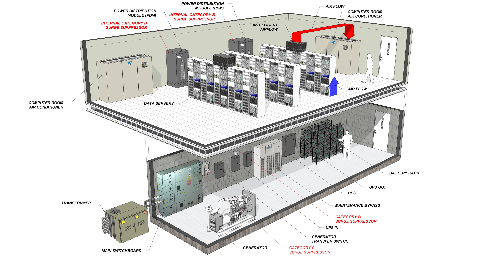
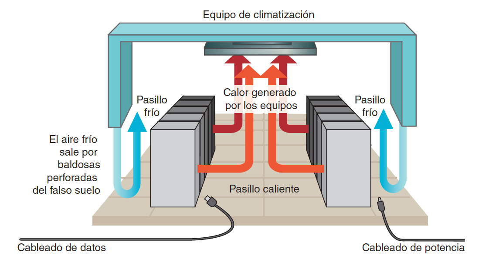

Claro, aquí tienes los apuntes del tema, redactados en párrafos sin listas:

# Seguridad Física en Centros de Procesamiento de Datos (CPD)

## Introducción

La seguridad pasiva es esencial para proteger los activos físicos de una organización, especialmente los equipos informáticos y los datos almacenados en un Centro de Procesamiento de Datos (CPD). Un adecuado almacenamiento y ubicación de estos equipos garantiza la continuidad del negocio y la protección de la información crítica.

## Ubicación de los Equipos

### Centro de Procesamiento de Datos (CPD)

Ubicar los equipos importantes en un CPD centralizado permite varios beneficios. En primer lugar, se logra un ahorro en costes al reducir gastos en vigilancia, refrigeración y mantenimiento, ya que no es necesario duplicar recursos en diferentes ubicaciones. Además, se optimizan las comunicaciones entre servidores al facilitar conexiones más eficientes mediante el uso de cables cortos. También se mejora la eficiencia operativa del personal de tecnología de la información, reduciendo desplazamientos y aumentando la efectividad en sus tareas.

{:class="center"}

### Plan de Recuperación ante Desastres

Es crucial contar con un plan de recuperación ante desastres, un documento escrito preparado con antelación para responder a cualquier problema que pueda surgir en el CPD. Durante una crisis, no hay tiempo para reflexionar, por lo que tener procedimientos establecidos es vital. Este plan debe actualizarse continuamente ante cualquier cambio en el CPD, como la incorporación de nuevos servicios o equipos.

El plan debe detallar el hardware utilizado, incluyendo un inventario de los modelos de máquinas actuales, como servidores y equipos de red, y las alternativas disponibles en caso de fallos. También debe especificar cómo se instalarán y configurarán estos equipos. En cuanto al software, es necesario describir los sistemas operativos y aplicaciones en uso, con detalles sobre versiones y configuraciones, incluyendo permisos y usuarios. Para los datos, se debe explicar el sistema de almacenamiento utilizado, como discos locales o cabinas, y los procedimientos para respaldos y copias de seguridad.

## Protección del CPD

### Ubicación del Edificio

La elección de la ubicación del edificio es fundamental para minimizar riesgos. Es recomendable seleccionar zonas con baja probabilidad de desastres naturales, como terremotos, inundaciones o ciclones. También se debe evitar la proximidad a ríos, playas, presas, aeropuertos, autopistas, bases militares o centrales nucleares. Es importante alejarse de edificios cercanos que pertenezcan a empresas con actividades potencialmente peligrosas, como aquellas que manejan gases inflamables o explosivos.

### Ubicación dentro del Edificio

Dentro del edificio, es preferible situar el CPD en plantas intermedias. Esto evita riesgos asociados con la planta baja, como sabotajes o impactos de vehículos; las plantas subterráneas, que son más susceptibles a inundaciones; y las plantas superiores, que podrían verse afectadas por accidentes aéreos o incendios en plantas inferiores. Además, el edificio debería tener dos accesos por calles diferentes para garantizar la entrada en caso de que una de ellas quede inaccesible por obras o incidentes.

### Medidas Recomendadas

Es aconsejable no señalizar la ubicación del CPD para dificultar su localización por parte de posibles atacantes, de modo que solo los empleados autorizados conozcan su ubicación. Los pasillos de acceso al CPD deben ser anchos para facilitar el movimiento de equipos voluminosos, y es conveniente disponer de un muelle de carga y descarga. El acceso a la sala debe estar estrictamente controlado, permitiendo únicamente la entrada al personal autorizado.

En cuanto a la infraestructura física, es útil utilizar pintura antiestática en las paredes, lo que facilita la limpieza y evita la generación de polvo. El uso de falso suelo y techo facilita la distribución del cableado y mejora la ventilación. Una altura elevada de la sala permite acomodar estas características y aprovechar el espacio vertical para instalar más equipos. En situaciones de alta seguridad, recubrir el CPD con un cofre de hormigón puede proteger contra intrusiones externas.

Los sistemas de seguridad deben incluir detectores de humo y sistemas automáticos de extinción de incendios, preferiblemente utilizando gases inertes para evitar daños por agua. Es importante que el mobiliario esté fabricado con materiales ignífugos y antiestáticos para reducir riesgos.

### Aislamiento y Protección Ambiental

Es esencial proteger los circuitos electrónicos del CPD frente a factores ambientales. La temperatura debe ser controlada, ya que los equipos generan calor, especialmente cuando hay una alta densidad de equipos en poco espacio. La humedad también debe mantenerse en niveles adecuados para evitar daños en los equipos, utilizando sistemas de control de humedad cuando sea necesario.

Las interferencias electromagnéticas pueden afectar el funcionamiento de los equipos, por lo que el CPD debe estar alejado de motores y generadores eléctricos, y utilizar blindaje electromagnético si es necesario. El ruido generado por los ventiladores y equipos puede ser perjudicial para el personal, por lo que se recomienda implementar aislamiento acústico.

## Ventilación y Climatización

Los CPD no suelen tener ventanas, ya que la ventilación natural es insuficiente para el calor generado y existe riesgo de intrusiones desde el exterior. Es crucial mantener la temperatura entre 20 y 24 grados Celsius. Para lograrlo, se deben instalar equipos de climatización redundantes (N+1) y sistemas de control ambiental que regulen tanto la temperatura como la humedad.

En CPD de gran tamaño, es común la configuración de pasillos fríos y calientes. Los pasillos fríos suministran aire frío a través del falso suelo y están orientados hacia el frente de los racks. Los pasillos calientes están en la parte trasera de los racks y extraen el aire caliente hacia los sistemas de climatización. El cableado de potencia se ubica en los pasillos fríos para evitar sobrecalentamiento, mientras que el cableado de datos se coloca en los pasillos calientes.

{:class="center"}

## Suministro Eléctrico

La redundancia en la alimentación eléctrica es vital. Se deben contar con al menos dos fuentes de energía independientes y asegurarse de que los equipos tengan fuentes de alimentación redundantes. El suministro eléctrico del CPD debe estar separado del resto de la empresa para evitar que problemas externos afecten a los servidores. Los Sistemas de Alimentación Ininterrumpida (SAI/UPS) protegen contra cortes y fluctuaciones de energía, y es recomendable disponer de generadores eléctricos para garantizar la continuidad en caso de fallos prolongados en el suministro.

## Comunicaciones

Para asegurar la continuidad de las comunicaciones, es recomendable contratar servicios con dos proveedores de Internet distintos. El segundo proveedor debe ofrecer una tecnología diferente para minimizar la posibilidad de fallos simultáneos. Además, es importante que las rutas de comunicación sean independientes y que las entradas al edificio estén en diferentes puntos. Considerar una tercera opción inalámbrica puede proporcionar cobertura adicional en caso de problemas físicos en la infraestructura.

## Control de Acceso y Seguridad

La seguridad en el CPD es fundamental. En instalaciones importantes, se puede contar con un equipo de seguridad propio y especializado en el control de acceso. La instalación de sensores de presencia, cámaras de vídeo y sistemas de monitoreo contribuye a una vigilancia efectiva. Los detectores de metales y escáneres evitan el acceso con objetos peligrosos y previenen la sustracción de equipos. Los sistemas biométricos, como la identificación por huellas digitales, reconocimiento facial o iris, aumentan el nivel de seguridad. Es esencial mantener registros detallados de acceso para auditorías y cumplimiento normativo.

## Centro de Respaldo (CR)

### Necesidad del CR

Es fundamental prever la posibilidad de que una catástrofe destruya el CPD principal, ya sea por inundación, terremoto o sabotaje. La empresa no debe depender de un solo punto de fallo, por lo que es necesario contar con un centro de respaldo.

### Implementación del CR

Si el presupuesto lo permite, se debe instalar un segundo CPD que funcione como centro de respaldo y ofrezca los mismos servicios que el CPD principal. Si la inversión es elevada, se puede optar por limitarse a los servicios principales o ofrecer los mismos servicios con menores prestaciones. Es crucial que el CR esté ubicado físicamente alejado del CP para evitar que una misma catástrofe afecte a ambos.

### Operación del CR

El centro de respaldo está en espera (stand-by) para sustituir al CP en caso de fallo. Los usuarios no deben notar el cambio al CR. Para lograrlo, es necesario implementar mecanismos de replicación de información en tiempo real, prestando especial atención a las bases de datos. Esto requiere excelentes comunicaciones entre el CP y el CR. Además, se deben tener procedimientos de conmutación documentados y probados regularmente, incluyendo la recuperación posterior del CP. Realizar pruebas anuales de cambio al CR asegura que tanto los documentos como el personal estén preparados para una eventual emergencia.

## Entornos de Producción y Preproducción

El CP y el CR constituyen los centros de producción que dan servicio a empleados y clientes. Es importante gestionar adecuadamente los cambios en las aplicaciones, evitando instalarlos directamente en producción. Los fallos no detectados pueden bloquear áreas de la empresa, por lo que se utilizan entornos de preproducción o pruebas para validar los cambios. La implementación de prácticas DevOps y pipelines de Integración Continua y Despliegue Continuo (CI/CD) permite automatizar y controlar los despliegues, reduciendo riesgos y mejorando la eficiencia.

## Conclusiones

La seguridad pasiva en un CPD es esencial para garantizar la continuidad del negocio y proteger los activos críticos de una organización. La implementación de medidas adecuadas en la ubicación, protección física, control ambiental, suministro eléctrico, comunicaciones y control de acceso es fundamental. Además, contar con un centro de respaldo y prácticas sólidas de gestión de cambios asegura que la empresa pueda recuperarse ante desastres y mantener sus operaciones sin interrupciones significativas.

## Ejercicios

**Ej1**: En el siguiente enlace puedes encontrar un vídeo en el que se detallan seis capas de seguridad en los DataCenters de Google.

[Segurdad en DataCenters de Google](https://www.google.com/about/datacenters/data-security/)

¿Describe las 6 capas de seguridad que se detallan en el vídeo?