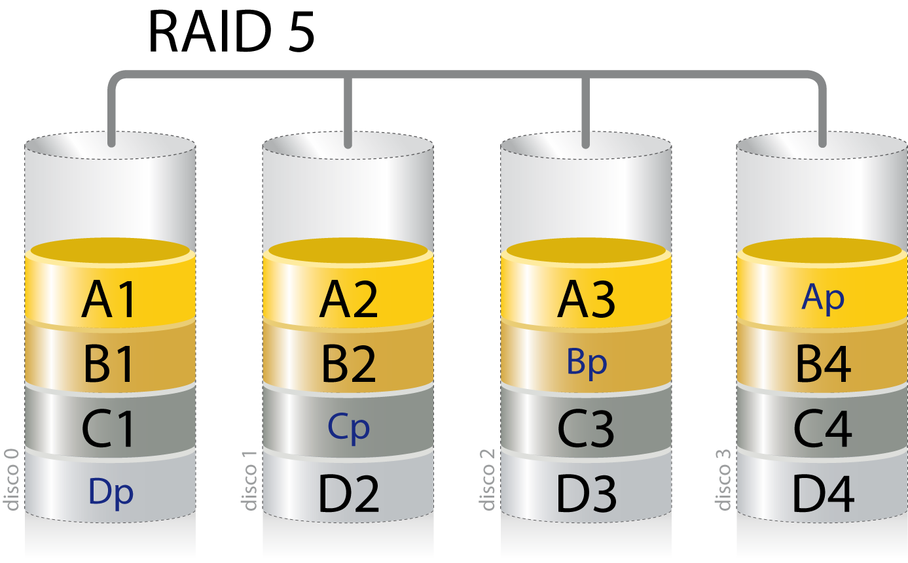
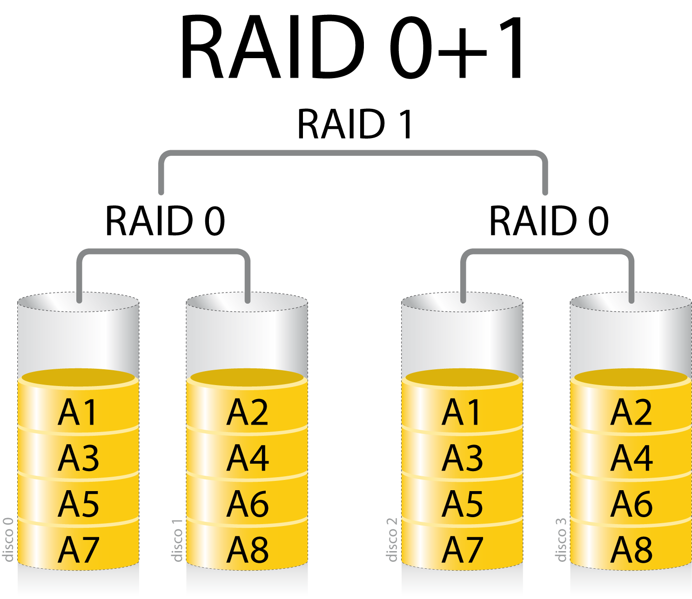

# Almacenamiento de la Información

La información es uno de los activos más valiosos para cualquier organización, y su protección es de vital importancia. En este tema, nos centraremos en cómo se almacena físicamente la información y en las mejores prácticas para protegerla de manera adecuada.

Los cuatro aspectos fundamentales que debemos considerar al tratar la seguridad física de la información son:

* **Capacidad:** Cantidad de información que pueden almacenar los dispositivos. Comprender la capacidad de almacenamiento es esencial para planificar las necesidades presentes y futuras de la organización, asegurando que haya suficiente espacio para los datos actuales y para el crecimiento esperado.

* **Rendimiento:** Velocidad a la que puede ser guardada y recuperada la información. Depende de la tecnología utilizada en el dispositivo de almacenamiento y afecta directamente a la eficiencia operativa. Un rendimiento óptimo es crucial para aplicaciones que requieren acceso rápido a grandes volúmenes de datos.

* **Disponibilidad:** Capacidad de los sistemas para funcionar con las menores interrupciones posibles. Implementar sistemas tolerantes a fallos y con redundancia aumenta la disponibilidad, asegurando que la información esté accesible cuando se necesite, incluso en caso de fallos en el hardware o software.

* **Acceso a la información:** Tiempo necesario para acceder a los datos. Por ejemplo, una unidad que permite la lectura aleatoria de datos proporciona un acceso más rápido y flexible que otra que solo permite lectura secuencial, como las cintas magnéticas.

Para optimizar estos aspectos, existen diversas tecnologías y técnicas, como los sistemas RAID, que combinan múltiples discos para mejorar el rendimiento y la redundancia, y las arquitecturas SAN y NAS, que permiten la centralización y el acceso eficiente al almacenamiento en red.

## Tipos de Almacenamiento

### Unidades Físicas de Almacenamiento

* **Discos Duros (HDD):** Utilizan platos magnéticos y cabezales móviles para leer y escribir datos. Son ampliamente utilizados debido a su alta capacidad y costo relativamente bajo por gigabyte.

* **Unidades de Estado Sólido (SSD):** Basadas en memoria flash, sin partes móviles. Ofrecen velocidades de lectura y escritura significativamente más altas que los HDD y menores tiempos de acceso, aunque a un costo mayor por gigabyte.

* **Cintas Magnéticas:** Utilizadas principalmente para copias de seguridad y archivado a largo plazo. Ofrecen una alta capacidad de almacenamiento a un costo muy bajo, pero con tiempos de acceso más lentos y operaciones de lectura/escritura secuenciales.

### Configuraciones RAID

Las configuraciones RAID (Redundant Array of Independent Disks) permiten combinar múltiples discos para mejorar el rendimiento, la disponibilidad o ambas. Existen varios niveles de RAID, cada uno con sus propias ventajas y desventajas:

* **RAID 0 (Striping):** Divide los datos entre dos o más discos, mejorando el rendimiento pero sin redundancia. Si un disco falla, se pierde toda la información.

* **RAID 1 (Mirroring):** Duplica los datos en dos o más discos, ofreciendo alta redundancia. Si un disco falla, los datos permanecen disponibles en el disco duplicado.

* **RAID 5:** Combina striping con paridad distribuida, permitiendo la recuperación de datos si falla un disco. Requiere al menos tres discos y ofrece un equilibrio entre rendimiento, capacidad y redundancia.

* **RAID 6:** Similar a RAID 5, pero con paridad adicional, lo que permite la falla de hasta dos discos. Requiere al menos cuatro discos.

* **RAID 10 (1+0):** Combina mirroring y striping. Ofrece alta redundancia y rendimiento, pero requiere al menos cuatro discos y tiene una eficiencia de almacenamiento del 50%.

### Almacenamiento en Red (Centralización del Almacenamiento)

* **NAS (Network Attached Storage):** Es un dispositivo de almacenamiento conectado a una red que permite el acceso a datos a nivel de archivo. Es ideal para compartir archivos entre múltiples usuarios y dispositivos en una red local.

* **SAN (Storage Area Network):** Es una red dedicada de almacenamiento que proporciona acceso a dispositivos de almacenamiento a nivel de bloque. Es más compleja y costosa que NAS, pero ofrece un rendimiento superior y es adecuada para aplicaciones empresariales críticas que requieren acceso rápido y confiable a los datos.

### Almacenamiento en la Nube

El almacenamiento en la nube implica la deslocalización del almacenamiento, ofreciendo escalabilidad y accesibilidad remota. Los datos se almacenan en servidores remotos mantenidos por proveedores de servicios en la nube y son accesibles a través de internet.

**Ventajas:**

* **Escalabilidad:** Capacidad de aumentar o disminuir el almacenamiento según las necesidades.
* **Accesibilidad:** Acceso a los datos desde cualquier lugar con conexión a internet.
* **Costo Operativo Reducido:** Minimiza la necesidad de invertir en infraestructura física de almacenamiento.

**Desafíos:**

* **Seguridad y Privacidad:** Es fundamental asegurar que los datos estén protegidos y cumplan con las regulaciones de privacidad.
* **Dependencia del Proveedor:** La disponibilidad y rendimiento dependen del proveedor de servicios.
* **Latencia:** Puede haber retrasos en el acceso a los datos debido a la distancia y la calidad de la conexión.

## Unidades de Almacenamiento

### Características Principales

Al seleccionar unidades de almacenamiento, es importante considerar las siguientes características:

* **Capacidad:** Medida en bytes y sus múltiplos, determina cuánto puede almacenar la unidad. Es crucial para satisfacer las necesidades de almacenamiento actuales y futuras.

* **Velocidad:** Incluye la velocidad de lectura y escritura, tanto secuencial como aleatoria. Afecta el rendimiento general del sistema, especialmente en aplicaciones que requieren acceso rápido a los datos.

* **Precio:** Factor importante en la planificación de recursos y presupuesto. Es necesario equilibrar el costo con las necesidades de rendimiento y capacidad.

* **Fiabilidad:** Se refiere a la probabilidad de que la unidad funcione correctamente durante un período de tiempo. Las métricas comunes incluyen:

  * **MTBF (Mean Time Between Failures):** Tiempo medio entre fallos, expresado en horas.
  * **AFR (Annualized Failure Rate):** Tasa anualizada de fallos, expresada como un porcentaje.

* **Durabilidad:** Especialmente relevante en SSD, donde la vida útil está determinada por el número de ciclos de escritura que las celdas de memoria pueden soportar.

* **Consumo de Energía:** Importante para reducir costos operativos y en entornos donde la eficiencia energética es crucial.

### Tipos de Almacenamiento Físico

#### Discos Duros (HDD)

Los HDD son dispositivos electromecánicos que almacenan datos en platos giratorios recubiertos de material magnético. Sus principales características incluyen:

* **Altas Capacidades:** Pueden almacenar varios terabytes de datos a un costo bajo por gigabyte.
* **Velocidades Variables:** Las RPM comunes son 5,400, 7,200 y 10,000, afectando el tiempo de acceso y la tasa de transferencia.
* **Partes Móviles:** Son susceptibles a daños físicos por golpes o vibraciones, lo que puede afectar su fiabilidad.
* **Aplicaciones Comunes:** Almacenamiento masivo, servidores de archivos y sistemas donde el costo es un factor clave.

#### Unidades de Estado Sólido (SSD)

Las SSD utilizan memoria flash para almacenar datos, ofreciendo varias ventajas:

* **Velocidades Superiores:** Lecturas y escrituras más rápidas, con tiempos de acceso casi instantáneos.
* **Sin Partes Móviles:** Mayor resistencia a impactos y vibraciones, y menor riesgo de fallos mecánicos.
* **Consumo Energético Menor:** Generan menos calor y requieren menos energía, beneficioso en dispositivos móviles y centros de datos.
* **Tipos de Memoria Flash:**
  * **SLC (Single-Level Cell):** Almacena un bit por celda, ofreciendo mayor durabilidad y rendimiento, pero a un costo más alto.
  * **MLC (Multi-Level Cell):** Almacena dos bits por celda, equilibrando costo y rendimiento.
  * **TLC (Triple-Level Cell):** Almacena tres bits por celda, con mayor capacidad a menor costo, pero con menor durabilidad.
  * **QLC (Quad-Level Cell):** Almacena cuatro bits por celda, aumentando la capacidad y reduciendo el costo, pero con menor rendimiento y durabilidad.
* **Aplicaciones Comunes:** Sistemas operativos, aplicaciones que requieren alto rendimiento, dispositivos móviles y servidores que necesitan tiempos de respuesta rápidos.

#### Cintas Magnéticas

Las cintas magnéticas son un medio de almacenamiento tradicional que sigue siendo relevante para ciertas aplicaciones:

* **Alta Capacidad y Bajo Costo:** Excelente para almacenar grandes volúmenes de datos a largo plazo.
* **Larga Vida Útil:** Las cintas bien almacenadas pueden conservar datos durante décadas.
* **Lectura/Escritura Secuencial:** No son adecuadas para acceso aleatorio; el tiempo de acceso es significativamente mayor que en HDD o SSD.
* **Aplicaciones Comunes:** Copias de seguridad, archivado de datos históricos y almacenamiento de datos que rara vez se acceden.

### Capacidad: Múltiplos Binarios

Es importante distinguir entre los prefijos decimales y binarios al medir la capacidad de las unidades de almacenamiento:

| Múltiplo     | Prefijo Decimal (SI) | Valor Decimal       | Prefijo Binario (IEC) | Valor Binario        |
|--------------|----------------------|---------------------|-----------------------|----------------------|
| Kilobyte (kB) | kilo                 | 10³ bytes           | Kibibyte (KiB)        | 2¹⁰ bytes (1,024)    |
| Megabyte (MB) | mega                 | 10⁶ bytes           | Mebibyte (MiB)        | 2²⁰ bytes (1,048,576)|
| Gigabyte (GB) | giga                 | 10⁹ bytes           | Gibibyte (GiB)        | 2³⁰ bytes (1,073,741,824)|
| Terabyte (TB) | tera                 | 10¹² bytes          | Tebibyte (TiB)        | 2⁴⁰ bytes            |
| Petabyte (PB) | peta                 | 10¹⁵ bytes          | Pebibyte (PiB)        | 2⁵⁰ bytes            |
| Exabyte (EB)  | exa                  | 10¹⁸ bytes          | Exbibyte (EiB)        | 2⁶⁰ bytes            |
| Zettabyte (ZB)| zetta                | 10²¹ bytes          | Zebibyte (ZiB)        | 2⁷⁰ bytes            |
| Yottabyte (YB)| yotta                | 10²⁴ bytes          | Yobibyte (YiB)        | 2⁸⁰ bytes            |

Los fabricantes suelen indicar las capacidades usando los prefijos decimales (base 10), lo que resulta en números más grandes. Sin embargo, los sistemas operativos y aplicaciones a menudo usan prefijos binarios (base 2), lo que puede generar discrepancias en la capacidad reportada. Por ejemplo, un disco etiquetado como 1 TB (10¹² bytes) puede mostrarse como aproximadamente 931 GiB (2³⁰ bytes) en el sistema operativo.

### Fiabilidad

La fiabilidad es un aspecto crítico en el almacenamiento de información, ya que los fallos pueden resultar en pérdida de datos importantes. Las principales métricas utilizadas para evaluar la fiabilidad son:

#### MTBF (Mean Time Between Failures)

Es una medida estadística que indica el tiempo medio esperado entre fallos durante la operación normal. Se expresa en horas y se calcula en condiciones controladas. Es importante notar que el MTBF no predice la vida útil exacta de un dispositivo individual, sino que es una estimación basada en un gran número de unidades.

#### AFR (Annualized Failure Rate)

Es el porcentaje estimado de dispositivos que fallarán en un año de operación continua. Se deriva del MTBF y proporciona una perspectiva más práctica sobre la probabilidad de fallos en un período determinado.

Es esencial implementar estrategias de respaldo y redundancia para mitigar los riesgos asociados con fallos de hardware, independientemente de las métricas de fiabilidad.

### Velocidad

La velocidad de una unidad de almacenamiento influye directamente en el rendimiento del sistema y en la eficiencia de las operaciones de lectura y escritura. Los factores que afectan la velocidad incluyen:

* **Tipo de Interfaz:**
  * **SATA (Serial ATA):** Común en HDD y SSD de consumo, con velocidades de hasta 600 MB/s (SATA III).
  * **SAS (Serial Attached SCSI):** Utilizado en entornos empresariales, ofrece mayor fiabilidad y velocidades de hasta 12 Gb/s.
  * **NVMe (Non-Volatile Memory Express):** Protocolo diseñado para SSD, utiliza el bus PCIe, permitiendo velocidades de varios GB/s y baja latencia.

* **Velocidad de Rotación en HDD:**
  * **RPM (Revoluciones por Minuto):** Discos con mayores RPM tienen tiempos de acceso y tasas de transferencia más rápidas.
  * **Valores Comunes:** 5,400 RPM (bajo consumo), 7,200 RPM (equilibrio), 10,000 RPM y 15,000 RPM (alto rendimiento).

* **Tecnología de Memoria en SSD:**
  * **Tipo de NAND Flash:** SLC, MLC, TLC, QLC, afectando la velocidad y durabilidad.
  * **Controlador y Caché:** Un buen controlador y el uso de caché DRAM pueden mejorar significativamente el rendimiento.

### Estadísticas SMART

La tecnología SMART es una herramienta de diagnóstico que permite monitorear el estado de salud de los dispositivos de almacenamiento.

**Aspectos Clave:**

* **Monitoreo de Atributos:** SMART rastrea parámetros como:
  * **Errores de Lectura/Escritura:** Indican problemas en la superficie del disco o en los mecanismos de lectura/escritura.
  * **Sectores Reasignados:** Sectores defectuosos que han sido reemplazados por sectores de reserva.
  * **Tiempo de Arranque:** Retrasos pueden indicar problemas mecánicos.
  * **Temperatura Operativa:** Temperaturas altas pueden reducir la vida útil del dispositivo.

* **Alertas Preventivas:** Los sistemas pueden configurar alertas cuando ciertos umbrales se superan, permitiendo al usuario tomar medidas antes de un fallo crítico.

* **Limitaciones:** Aunque SMART es útil, no detecta todos los tipos de fallos. Algunos problemas pueden ocurrir repentinamente sin señales previas.

**Buenas Prácticas:**

* **Monitoreo Regular:** Utilizar software que supervise los atributos SMART y notifique anomalías.
* **Respaldo Frecuente:** Mantener copias de seguridad actualizadas para prevenir pérdida de datos.
* **Mantenimiento Preventivo:** Reemplazar dispositivos que muestren signos de degradación antes de que fallen completamente.

Según un estudio de Google titulado "[Tendencias de Fallos en una Gran Población de Unidades de Disco](https://research.google/pubs/pub32774/)", se encontró que el 36% de los discos que fallaron no mostraron ningún error SMART previo. Esto resalta la importancia de no depender exclusivamente de SMART y de implementar estrategias adicionales de protección de datos.

## Almacenamiento Redundante (RAID)

Un **RAID** (Redundant Array of Independent Disks) es un sistema que utiliza múltiples discos duros o SSD para mejorar el rendimiento y/o la tolerancia a fallos mediante la distribución y/o replicación de datos.

Los sistemas RAID pueden ser implementados por **hardware** (controladoras RAID dedicadas) o por **software** (gestión del RAID por el sistema operativo). La implementación por hardware suele ofrecer mejor rendimiento y funcionalidades avanzadas como intercambio de discos en caliente (hot swapping).

Además, en entornos empresariales es común utilizar discos **hot spare**, que son discos de reserva que se activan automáticamente en caso de fallo de uno de los discos activos, sin necesidad de intervención manual.

### Ventajas del RAID

* **Mayor Capacidad:** Combinación de múltiples discos para aumentar el espacio de almacenamiento disponible.
* **Mayor Tolerancia a Fallos:** Redundancia de datos que permite continuar operando incluso si uno o varios discos fallan.
* **Mayor Seguridad:** Protección de datos mediante redundancia, aumentando la disponibilidad y la integridad.
* **Mayor Velocidad:** Distribución de datos que permite realizar operaciones de lectura/escritura en paralelo.

### Niveles de RAID Comunes

### **RAID 0 (Striping)**

- **Características:** Distribuye los datos equitativamente entre dos o más discos sin información redundante ni paridad.
- **Número mínimo de discos:** 2
- **Ventajas:**
    - Aumento significativo del rendimiento de lectura y escritura.
    - Utilización completa de la capacidad de almacenamiento disponible.
- **Desventajas:**
    - Sin tolerancia a fallos; la avería de un solo disco resulta en la pérdida total de datos.
- **Uso recomendado:**
    - Aplicaciones donde el rendimiento es crítico y la pérdida de datos es aceptable, como en estaciones de trabajo para edición de vídeo o renderizado.

{:style="width: 30%;" class="center"}

#### RAID 1 (Mirroring)

- **Características:** Duplica los datos en dos o más discos, creando copias idénticas.
- **Número mínimo de discos:** 2
- **Ventajas:**
    - Alta disponibilidad y tolerancia a fallos; los datos permanecen accesibles si falla un disco.
    - Recuperación sencilla y rápida en caso de fallo.
- **Desventajas:**
    - Capacidad efectiva reducida al 50% del total de discos, ya que se utiliza la mitad para la duplicación.
    - No mejora el rendimiento de escritura; el rendimiento de lectura puede mejorar si se implementa lectura simultánea.
- **Uso recomendado:**
    - Sistemas críticos que requieren alta disponibilidad y fiabilidad, como servidores de bases de datos y aplicaciones financieras.

{:style="width: 30%;" class="center"}

#### RAID 5 (Striping con Paridad Distribuida)

* **Características:** Combina striping con paridad distribuida, permitiendo reconstruir datos en caso de fallo de un disco.
- **Número mínimo de discos:** 3
- **Ventajas:**
    - Equilibrio entre rendimiento, capacidad y tolerancia a fallos.
    - Capacidad de continuar operando tras el fallo de un disco.
- **Desventajas:**
    - Rendimiento de escritura más lento debido al cálculo y escritura de paridad.
    - Tiempo de reconstrucción prolongado en caso de fallo, lo que puede afectar al rendimiento.
- **Uso recomendado:**
    - Servidores de archivos y aplicaciones donde se requiere un balance entre seguridad de datos y capacidad de almacenamiento.

{:class="center"}

### **RAID 6 (Striping con Paridad Doble Distribuida)**

- **Características:** Similar a RAID 5, pero con paridad doble, permitiendo tolerar el fallo simultáneo de dos discos.
- **Número mínimo de discos:** 4
- **Ventajas:**
    - Mayor tolerancia a fallos en comparación con RAID 5.
    - Adecuado para sistemas con grandes volúmenes de datos y discos de gran capacidad.
- **Desventajas:**
    - Rendimiento de escritura aún más lento que RAID 5 debido al cálculo adicional de paridad.
    - Reducción adicional de la capacidad efectiva por el almacenamiento de paridad extra.
- **Uso recomendado:**
    - Entornos donde la disponibilidad y la integridad de los datos son extremadamente críticas, como en grandes sistemas de almacenamiento y servidores empresariales.

{:class="center"}

### RAID Anidados

#### RAID 10 (RAID 1+0, Mirroring y Striping)

* **Características:** Combina mirroring y striping, ofreciendo lo mejor de RAID 0 y RAID 1.
- **Número mínimo de discos:** 4
- **Ventajas:**
    - Alto rendimiento en lectura y escritura.
    - Excelente tolerancia a fallos; puede soportar múltiples fallos de discos siempre que no sean del mismo espejo.
- **Desventajas:**
    - La capacidad efectiva es la mitad del total debido al mirroring.
    - Coste elevado por la necesidad de más discos para obtener la misma capacidad utilizable.
- **Uso recomendado:**
    - Aplicaciones empresariales críticas que requieren alto rendimiento y disponibilidad, como servidores de bases de datos transaccionales y entornos de virtualización.

{:class="center"}

#### RAID 0+1

* **Características:**
    * Se realiza striping de los datos y luego mirroring del conjunto.
    * Ofrece alto rendimiento y tolerancia a fallos, pero es menos robusto que RAID 10 en caso de múltiples fallos.
    * Requiere al menos cuatro discos.
* **Uso Recomendado:** Similar al RAID 10, pero con diferencias en cómo se manejan los fallos múltiples.

{:class="center"}

## Almacenamiento en Red

El almacenamiento en red es fundamental para centralizar la gestión y el acceso a los datos en entornos empresariales, facilitando la escalabilidad, la administración eficiente y el intercambio de información entre usuarios y sistemas.

### NAS (Network Attached Storage)

#### Características

- **Acceso a Nivel de Archivo**: Los dispositivos NAS se conectan directamente a la red y proporcionan servicios de archivos mediante protocolos estándar como **NFS** (Network File System) para sistemas Unix/Linux y **SMB/CIFS** (Server Message Block/Common Internet File System) para sistemas Windows.
- **Implementación y Administración Sencillas**: Suelen ser soluciones plug-and-play con interfaces de gestión intuitivas, simplificando su configuración y mantenimiento.
- **Escalabilidad Modular**: Permiten añadir capacidad de almacenamiento de forma modular, adaptándose a las necesidades crecientes de la empresa.
- **Compatibilidad Multiplataforma**: Facilitan el acceso compartido a archivos desde diferentes sistemas operativos y dispositivos.

#### Uso Recomendado

- **Pequeñas y Medianas Empresas (PYMES)**: Organizaciones que necesitan compartir archivos y recursos entre múltiples usuarios sin la complejidad de una infraestructura de almacenamiento más robusta.
- **Entornos de Colaboración**: Departamentos o equipos que requieren acceder y compartir documentos, proyectos y recursos de manera simultánea.
- **Almacenamiento de Copias de Seguridad**: Para realizar copias de seguridad y restauraciones de datos de forma sencilla y rápida.

#### Tecnologías y Fabricantes Principales

- **Tecnologías**: Protocolos NFS, SMB/CIFS; sistemas de archivos distribuidos; soporte para RAID y redundancia.
- **Fabricantes**:
    - **Synology**: Reconocido por sus soluciones NAS versátiles y fáciles de usar.
    - **QNAP**: Ofrece dispositivos NAS con funcionalidades avanzadas y alto rendimiento.
    - **Netgear**: Proporciona soluciones NAS para pequeñas y medianas empresas.
    - **Dell EMC (Isilon)**: Especializado en almacenamiento en red escalable para empresas.
    - **HPE (StoreEasy)**: Combina facilidad de uso con características empresariales.
    - **NetApp (Serie FAS)**: Líder en soluciones de almacenamiento unificado con alta eficiencia.

---
### SAN (Storage Area Network)

### Características

- **Acceso a Nivel de Bloque**: Una SAN es una red dedicada que conecta servidores a dispositivos de almacenamiento a través de protocolos como **Fibre Channel**, **iSCSI** o **FCoE** (Fibre Channel over Ethernet), permitiendo un acceso de alto rendimiento y baja latencia.
- **Elevada Escalabilidad y Rendimiento**: Diseñadas para manejar grandes volúmenes de datos y cargas de trabajo intensivas, como bases de datos empresariales y aplicaciones críticas.
- **Alta Disponibilidad y Redundancia**: Incluyen características avanzadas como replicación, instantáneas y tolerancia a fallos.
- **Gestión Centralizada**: Facilitan la administración de recursos de almacenamiento desde una única interfaz.

### Uso Recomendado

- **Grandes Organizaciones y Centros de Datos**: Empresas con necesidades masivas de almacenamiento y aplicaciones que requieren acceso rápido y constante a grandes volúmenes de datos.
- **Aplicaciones Críticas de Negocio**: Sistemas ERP, CRM y bases de datos transaccionales que demandan alto rendimiento y disponibilidad.
- **Entornos Virtualizados y de Nube Privada**: Donde la consolidación y eficiencia del almacenamiento son esenciales.

### Tecnologías y Fabricantes Principales

- **Tecnologías**: **Fibre Channel**, **iSCSI**, **FCoE**, **NVMe over Fabrics (NVMe-oF)**; protocolos de almacenamiento definidos por software.
- **Fabricantes**:
    - **Dell EMC (PowerMax, Unity XT)**: Ofrece soluciones SAN de alto rendimiento y escalabilidad.
    - **HPE (3PAR StoreServ, Primera)**: Proporciona sistemas de almacenamiento con inteligencia integrada.
    - **IBM (FlashSystem)**: Especializado en almacenamiento flash para acelerar aplicaciones empresariales.
    - **NetApp (Serie AFF)**: Soluciones all-flash para rendimiento extremo.
    - **Hitachi Vantara (Serie VSP)**: Ofrece almacenamiento de nivel empresarial con alta resiliencia.

---

### Convergencia de SAN y NAS

La convergencia entre SAN y NAS se ha logrado gracias al avance de tecnologías basadas en **IP y Ethernet**. Esto ha permitido que los sistemas de almacenamiento ofrezcan acceso tanto a nivel de bloque como de archivo desde una única plataforma, conocida como **Almacenamiento Unificado**.

#### Ventajas de la Convergencia

- **Gestión Simplificada**: Una única infraestructura para administrar diferentes tipos de acceso al almacenamiento.
- **Flexibilidad**: Capacidad para soportar múltiples protocolos y tipos de datos.
- **Optimización de Recursos**: Mejor utilización de la capacidad de almacenamiento y reducción de costes operativos.

#### Fabricantes y Soluciones Destacadas

- **NetApp**: Líder en soluciones de almacenamiento unificado con su sistema **ONTAP**.
- **Dell EMC**: Ofrece plataformas unificadas como **Unity XT**.
- **HPE**: Con **Nimble Storage** y sistemas que soportan múltiples protocolos.
- **IBM**: Con su familia de productos **Storwize** y **Spectrum Virtualize**.
	- **Pure Storage (FlashArray)**: Reconocido por su innovación en almacenamiento flash.

## Almacenamiento en la Nube

El almacenamiento en la nube proporciona soluciones deslocalizadas y escalables, accesibles a través de internet, con modelos de **pago por uso** que permiten a las empresas ajustar sus costes a las necesidades reales.

### Tipos de Almacenamiento en la Nube

- **Almacenamiento de Objetos**: Ideal para grandes cantidades de datos no estructurados.
    - **Ejemplos**: Amazon S3, Azure Blob Storage, Google Cloud Storage.
- **Almacenamiento de Bloques**: Similar al almacenamiento en una SAN, utilizado para aplicaciones que requieren acceso de bajo nivel.
    - **Ejemplos**: Amazon EBS, Azure Disk Storage.
- **Almacenamiento de Archivos**: Proporciona acceso compartido a archivos a través de protocolos estándar.
    - **Ejemplos**: Amazon EFS, Azure Files.

### Ventajas

- **Escalabilidad y Flexibilidad**: Capacidad para aumentar o disminuir recursos rápidamente.
- **Reducción de Costes de Infraestructura**: Eliminación de inversiones iniciales en hardware y mantenimiento.
- **Accesibilidad Global**: Acceso a datos desde cualquier ubicación con conexión a internet.
- **Resiliencia y Disponibilidad**: Altos niveles de redundancia y disponibilidad garantizados por los proveedores.

### Desafíos

- **Seguridad y Privacidad**: Preocupaciones sobre la protección de datos sensibles y cumplimiento de regulaciones como el **RGPD** (Reglamento General de Protección de Datos).
- **Dependencia de la Conectividad**: Requiere conexiones estables y de alta velocidad a internet.
- **Control y Gobernanza de Datos**: Necesidad de políticas claras para la gestión y ubicación de los datos.

### Principales Proveedores y Tecnologías

- **Amazon Web Services (AWS)**: Lidera el mercado con servicios como **S3**, **EBS**, **EFS**.
- **Microsoft Azure**: Ofrece **Azure Blob Storage**, **Disk Storage** y **Files**.
- **Google Cloud Platform (GCP)**: Proporciona **Cloud Storage**, **Persistent Disk** y **Filestore**.
- **IBM Cloud**, **Oracle Cloud**, **Alibaba Cloud**: También ofrecen soluciones competitivas en almacenamiento en la nube.

## Tendencias Actuales en Almacenamiento Empresarial

### Almacenamiento Definido por Software (SDS)

Permite la gestión del almacenamiento a través de software independiente del hardware subyacente, ofreciendo mayor flexibilidad y reducción de costes.

### Infraestructura Hiperconvergente (HCI)

Combina computación, almacenamiento y redes en una única solución integrada, simplificando la gestión y escalabilidad.

### NVMe y NVMe-oF

La tecnología **NVMe** (Non-Volatile Memory Express) y su extensión sobre redes (**NVMe over Fabrics**) proporcionan velocidades de acceso a datos extremadamente rápidas, aprovechando las capacidades de las memorias flash y SSD de última generación.

### Inteligencia Artificial y Machine Learning en Almacenamiento

El uso de **IA y ML** para optimizar el rendimiento, la gestión y la seguridad del almacenamiento, permitiendo análisis predictivos y automatización de tareas.

## Consideraciones para la Selección de Soluciones de Almacenamiento

- **Necesidades Actuales y Futuras**: Evaluar la capacidad y el rendimiento requeridos, considerando el crecimiento previsto.
- **Presupuesto y Coste Total**: Incluir costes de adquisición, operación, mantenimiento y posibles actualizaciones.
- **Integración y Compatibilidad**: Asegurar que la solución sea compatible con la infraestructura existente y las aplicaciones críticas.
- **Seguridad y Cumplimiento**: Garantizar que las soluciones cumplan con las políticas internas y las regulaciones externas aplicables.
- **Soporte y Servicios del Fabricante**: Considerar la reputación del proveedor, el soporte técnico y los servicios adicionales ofrecidos.

# Ejercicios

[Ejercicio 1: Investigación de Especificaciones de Fiabilidad de Discos Duros y Unidades SSD](exercises/especificaciones_fiabilidad.md)
[especificaciones_fiabilidad](exercises/especificaciones_fiabilidad.md)

[Ejercicio2: Comprensión de la Fiabilidad de los Discos Duros según el Estudio de Google](exercises/fiabilidadDiscosGoogle.md)

# Bibliografía

* [https://es.wikipedia.org/wiki/S.M.A.R.T](https://es.wikipedia.org/wiki/S.M.A.R.T)
* [https://es.wikipedia.org/wiki/RAID](https://es.wikipedia.org/wiki/RAID)
* [https://es.wikipedia.org/wiki/Red_de_%C3%A1rea_de_almacenamiento](https://es.wikipedia.org/wiki/Red_de_%C3%A1rea_de_almacenamiento)
* [https://www.synology.com/es-es/knowledgebase/DSM/help/DSM/StorageManager/storage_pool_what_is_raid](https://www.synology.com/es-es/knowledgebase/DSM/help/DSM/StorageManager/storage_pool_what_is_raid)
* [https://www.backblaze.com/blog/history-hard-drives/](https://www.backblaze.com/blog/history-hard-drives/)
* [https://www.synology.com/es-es/support/RAID_calculator](https://www.synology.com/es-es/support/RAID_calculator)
- [https://static.googleusercontent.com/media/research.google.com/es//archive/disk_failures.pdf](https://static.googleusercontent.com/media/research.google.com/es//archive/disk_failures.pdf)
* [https://www.seagate.com/es/es/support/kb/hard-disk-drive-reliability-and-mtbf-afr-174791en/](https://www.seagate.com/es/es/support/kb/hard-disk-drive-reliability-and-mtbf-afr-174791en/)
* [https://es.wikipedia.org/wiki/Serial_Attached_SCSI](https://es.wikipedia.org/wiki/Serial_Attached_SCSI)