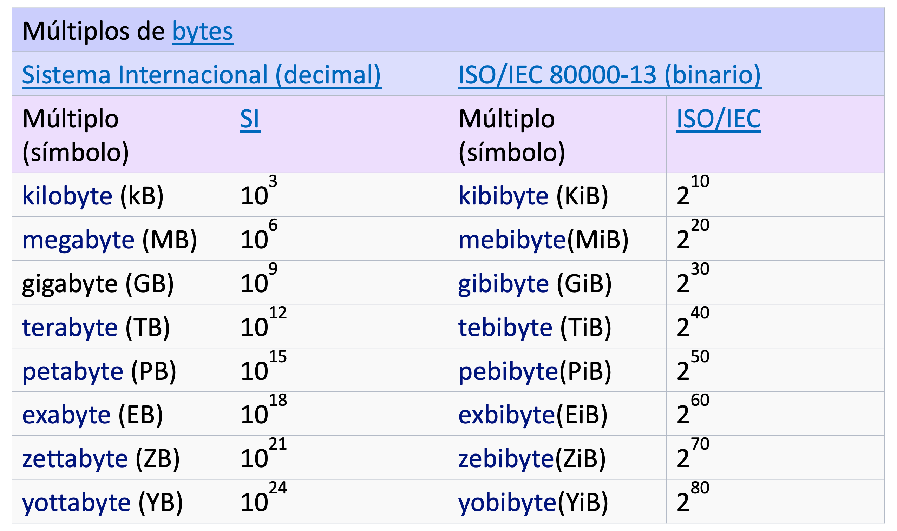
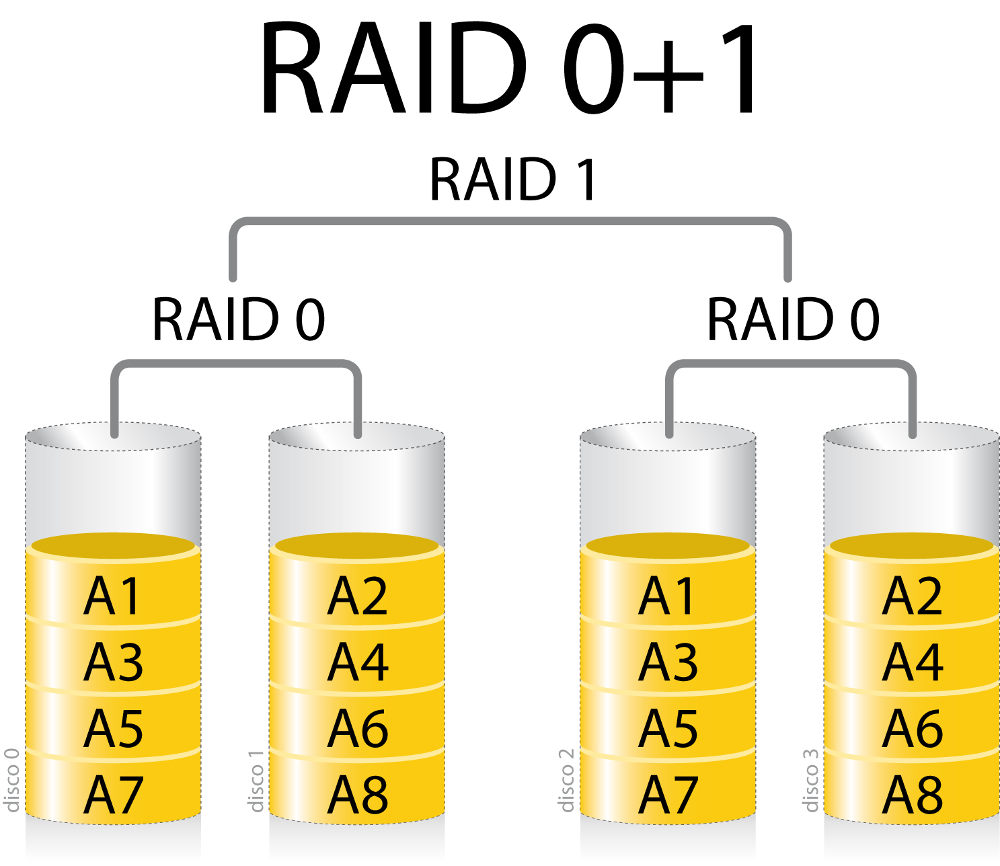

# Almacenamiento de la información

La información es el activo más valioso para una empresa, por lo que su seguridad es primordial. En este tema nos centraremos en cómo es almacenada físicamente la información.

Los tres aspectos más importantes que debemos tener en cuenta cuando tratemos la seguridad física de la información son:

* **Capacidad:** Cantidad de información que pueden almacenar.

* **Rendimiento:** Velocidad a la que puede ser guardada y recuperada la información. Depende de la tecnología en la que se basa el dispositivo de almacenamiento. 
  
* **Disponibilidad:** Capacidad de funcionar con las menores interrupciones posibles. Sistemas tolerantes a fallos y redundantes permiten aumentar este aspecto.
  
* **Acceso a la información:** tiempo necesario para acceder a la información. Por ejemplo, no es lo mismo una unidad que permita la lectura aleatoria de datos que otra que solamente permita la lectura secuencial de datos.

Existen numerosas técnicas que nos pueden proporcionar estas características, como los sistemas RAID y las arquitecturas SAN y NAS.

## Tipos de almacenamiento

* Tipos de unidades físicas de almacenamiento de información:
	* Discos duros
	* SSD
	* Cintas magnéticas

* Configuraciones en RAID
	*	Combinaciones de discos que permiten aumentar el rendimiento, la disponibilidad o ambas.

* Almacenamiento en red (centralización almacenamiento)
	* NAS (Almacenamiento en red)
	* SAN (Red de almacenamiento)

* Almacenamiento en la nube (deslocalización de almacenamiento)

## Unidades de almacenamiento

Características:

* Capacidad
* Velocidad
* Precio
* Fiabilidad
	* MTBF (Mean Time Between Failures)
	* AFR (Annualized Failure Rate) 

Tipos de almacenamiento físico:

* Discos duros
* Discos de estado sólido (SSD)
* Cintas magnéticas

### Capacidad: Múltiplos binarios

Unidades usadas para medir la capacidad de los discos de almacenamiento. Se pueden consultar en [Múltiplos binarios](https://es.wikipedia.org/wiki/Prefijo_binario)

{:class="center"}

Los fabricantes indican los tamaños de los discos duros usando multiplicadores en base 10 para que los números sean más grandes, pero en informática se mide el tamaño de los ficheros usando los multiplicadores en base 2.

### Fiabilidad

Se usan dos medidas que difieren en unidades. Decir que estas medidas son estadísticas sobre poblaciones grandes de discos y que no aseguran que un disco concreto las cumpla. En realidad  se basan en los mismos datos, pero representan la información usando unidades distintas.

#### MTBF

MTBF (Mean Time Between Failures) es el número medio de horas de servicio entre fallos.

Si un disco se ha roto en el primer día y otro a los 3 años, la media sería año y medio. Es una medida estadística y no garantiza que un determinado disco funcione sin errores un determinado tiempo.

#### AFR
AFR (Annualized Failure Rate), es el probable porcentaje de fallos de discos por año, basado en el total de unidades de determinado tipo del fabricante. 

AFR es una estimación del porcentaje de producto que fallarán mientras se usan a causa del fabricante en un año.

### Velocidad

SAS Serial Attached SCSI

### Discos duros (HDD)

### Discos de estado sólido (SDD)

### Estadísticas SMART

La tecnología SMART (Self Monitoring Analysis and Reporting Technology) permite la auto-monitorización del disco duro para avisar al usuario ante posibles fallos.

* Mantiene una serie de registros con información del disco
* **No es infalible**
* Hay fallos que no se pueden detectar antes de que sucedan
* Pero si recibes un aviso, más vale que tengas una copia de seguridad

Los valores de los atributos SMART van del número 1 al 253, siendo 1 el peor valor. Los valores normales son entre 100 y 200. Estos valores son guardados en un espacio reservado del disco duro.

Según el estudio de fiabilidad de discos duros publicado por Google ([Failure Trends in a Large Disk Drive Population](https://www.seagate.com/es/es/support/kb/hard-disk-drive-reliability-and-mtbf-afr-174791en/)) el 36 % de los discos que fallaron no dieron ningún error SMART.

Algunos de los parámetros que una vez aparecieron presentaban una alta probabilidad de error fueron:

* Scan errors
* Reallocation counts
* Offline reallocation counts
* Probational counts

## Almacenamiento redundante y distribuido (RAID)

Un **RAID** (Redundant Array of Independent Disks, antes Inexpensive Disks) es un sistema de almacenamiento que usa **múltiples discos duros** o SSD entre los que se distribuyen o replican los datos para proporcionar tolerancia a fallos. Tiene varias implementaciones y en función del uso es más conveniente una u otra.

Se pueden realizar por **hardware** o por **software**, siendo por hardware la opción más recomendada por rendimiento. Algunas controladoras RAID de servidores permiten cambiar los discos dañados en caliente sin apagar el servidor.

En los sistemas RAID de servidores es común hablar del disco **hot spare**, que es un disco de reserva que automáticamente forma parte activa del RAID si falla un disco, sin necesidad de intervenir el administrador.

**RAID** características:

* Mayor **capacidad**: Combinando varios discos más o menos económicos conseguimos una unidad de almacenamiento de una capacidad mucho mayor que la de los discos por separado.
* Mayor **tolerancia a fallos**: En caso de error, el sistema será capaz en algunos casos de recuperar la información perdida y seguir funcionando correctamente.
* Mayor **seguridad**: Al ser tolerante a fallos y mantener cierta duplicidad de la información, aumentaremos la disponibilidad y mejoraremos la integridad de los datos.
* Mayor **velocidad**: Cuando la información esté repetida y distribuida, se podrán realizar varias operaciones simultáneamente, lo que provocará mayor velocidad.

### RAID 0

Sus características principales son:

Volumen de datos lógico a partir de discos físicos (se conoce también como stripping)
No hay redundancia de datos ni tolerancia a fallos: si falla un disco, perdemos datos.
Mejora el rendimiento sobretodo en archivos grandes (p.ej: edición de vídeo)
Cada bloque se va escribiendo en un disco alternativamente
Se usan 2 o más discos

---

Los datos se distribuyen equilibradamente entre 2 o más discos, pero no hay redundancia de información.

{:class="center"}

Esta técnica favorece la velocidad cuando se lea o escriba un dato repartido en varios discos si éstos están gestionados por controladoras independientes.
No es tolerante a fallos, ya que no hay información redundante.

---

* Crea un disco grande combinando dos o más discos
* Los discos deben ser iguales, si no lo son, se usará el tamaño del más pequeño como límite
	* RAID 0 de dos discos 1Gb y 3Gb, tendrá tamaño de 2Gb
* No proporciona redundancia
	* Si un disco falla, perdemos todo
* Puede funcionar en dos modos
	* Striping, reparte los ficheros entre todos los discos (modo común)
Permite aumentar la velocidad de escritura y lectura
	* Spanning, cuando un disco se llena comienza a utilizar el siguiente (no utilizado)
* Al no calcular redundancias no tiene penalización de rendimiento

### RAID 1

Sus características principales son:

Consiste en una copia exacta de un disco físico a otro (también se conoce como espejo o mirroring)
Hay tolerancia a fallos y se pierde el tamaño de un disco (50%)
Mejora el rendimiento de lectura
Se forma con 2 discos

---

También conocido como disco espejo, consiste en mantener una copia idéntica de un disco en otro, de forma que el usuario ve sólo una unidad pero físicamente está siendo almacenada en dos o más discos.

{:class="center"}

Tolerante a fallos, si falla un disco, sigue funcionando con los otros mientras cambiamos el disco estropeado y rehacemos el espejo.

El inconveniente es que si toda la información está duplicada, reducimos nuestro espacio de almacenamiento a la mitad.

### RAID 5

Sus características principales son:

Divide los datos en bloques y usa paridad distribuida
La paridad permite recuperar los datos si se pierde un disco
Hay tolerancia a fallos y se pierde el tamaño de un disco (33% con 3 discos)
Mal rendimiento con escrituras pequeñas
Necesita mínimo 3 discos

---

Los bloques de datos que se almacenan en la unidad y la información redundante de dichos bloques (bloques de paridad) se distribuye cíclicamente entre todos los discos que forman el volumen (mínimo 3). Cada línea de datos se almacenará en bloques en los distintos discos dejando un disco para el bloque de paridad, que irá rotando para cada línea.

{:class="center"}

* De esta forma aumenta la velocidad ya que podemos acceder a varios discos a la vez (como en RAID 0) y el sistema es tolerante a fallos, ya que si se produce algún error en un disco, con el bloque de paridad se podría recuperar la información.

* El bloque de paridad se calcula a partir de los bloques de la misma línea, de forma que el primer bit será un 1 si hay un número impar de unos en el primer bit de los bloques de datos, y un 0 si hay un número par de unos.

Estos sistemas no son los únicos RAID. Existen más tipos, algunos de ellos que provienen de la combinación de dos tipos de sistema RAID, por ejemplo RAID 0+1 que combina RAID 0 con RAID 1, aprovechando la velocidad de uno con la tolerancia a fallos del otro.

### RAID 6
{:class="center"}

### RAID anidados

#### RAID 10 y RAID 01

Además existen los RAID anidados, que combinan varios tipos de RAID como el 10 o el 0+1. En ambos casos se necesita 4 discos mínimo y deben ser pares. En el caso del 10 primero se hace el mirroring de datos cada dos discos, y luego el stripping sobre los dos RAID1. En el 0+1 es a revés: primero stripping y luego mirroring:

{:class="center"}
{:class="center"}

## Almacenamiento en red

### NAS

### SAN

### Convergencia SAN vs. NAS
A medida que tecnologías como TCP / IP y Ethernet proliferan en todo el mundo, algunos productos SAN están haciendo la transición de canal de fibra a utilizar el mismo enfoque basado en IP que utiliza el NAS. Además, teniendo en cuenta los rápidos avances de la tecnología de almacenamiento en disco, los dispositivos NAS de hoy en día ofrecen capacidades y rendimientos sólo alcanzables hasta hace poco con SAN. Estos dos factores han dado lugar a una convergencia parcial de NAS y SAN en el almacenamiento en red.

## Borrado y recuperación

### Borrado

Cuando se borra un fichero del disco duro, la mayoría de los sistemas operativos lo que hacen es simplemente marcar como vacíos los sectores donde se encuentra alojado dicho fichero (quitando el puntero correspondiente), sin eliminar físicamente la información, que será alterada cuando se escriban encima nuevos datos. Por eso es posible con muchas herramientas disponibles, poder recuperar muchas veces la información borrada e incluso existen empresas especializadas que recuperan datos de discos duros tras un incendio.

Si queremos eliminar información confidencial o altamente sensible, es necesario utilizar procedimientos más avanzados que el simple borrado o formateo del disco. De todos estos métodos, el conocido como Gutmann es el más complejo y completo a la hora de proceder a un borrado seguro de la información. 

Programas para borrado seguroOcultar
Uno de los programas que permite utilizar este método es Eraser, que es software libre con licencia GPL e incluye el método Gutmann. Otro muy utilizado es SDelete, del conocido investigador de seguridad Mark Russinovich. SDelete implementa el estándar DOD 5220.22-M de limpieza y sanitización del Pentágono.

Otro mecanismo de borrado alternativo de un disco duro, es usar el comando dd de GNU/Linux, para llenar el disco de ceros, tal y como indica el siguiente artículo:

Procedimiento alternativo de sanitización para discos duros

En GNU/Linux también disponemos del paquete secure-delete que se basa en el paper  "Secure Deletion of Data from Magnetic and Solid-State Memory" de Gutmann e incluye utilidades como:

srm y sfill, para borrar de forma segura ficheros o espacio libre en nuestro sistema
sdmem, para borrar de forma segura la memoria RAM del sistema
sswap, para borrar de forma segura la memoria swap del sistema
Ocultar

El método Gutmann es un algoritmo desarrollado por el profesor de la Universidad de Auckland (Nueva Zelanda) Peter Gutmann y Colin Plumb en 1996. Su funcionamiento consiste en escribir sobre los datos originales una serie de 35 diferentes patrones, de tal forma que sea extremadamente difícil (o imposible, a efectos prácticos) recuperar el contenido original.

Sin embargo muchos expertos en seguridad aseguran que este método es un sobreesfuerzo inútil y con con dos o tres escrituras de datos aleatorios es suficiente.

El borrado seguro de datos es también una medida de seguridad activa, pues evita que por un descuido - como puede ser deshacerse de discos duros viejos sin borrar correctamente - los datos, puedan caer en manos ajenas

Sabías qué...Ocultar
El disco duro del ordenador de Luis Bárcenas fue borrado con este método, según asegura el asesor jurídico del PP, Alberto Durán.

<!-- Parte del tema de equipos -->
