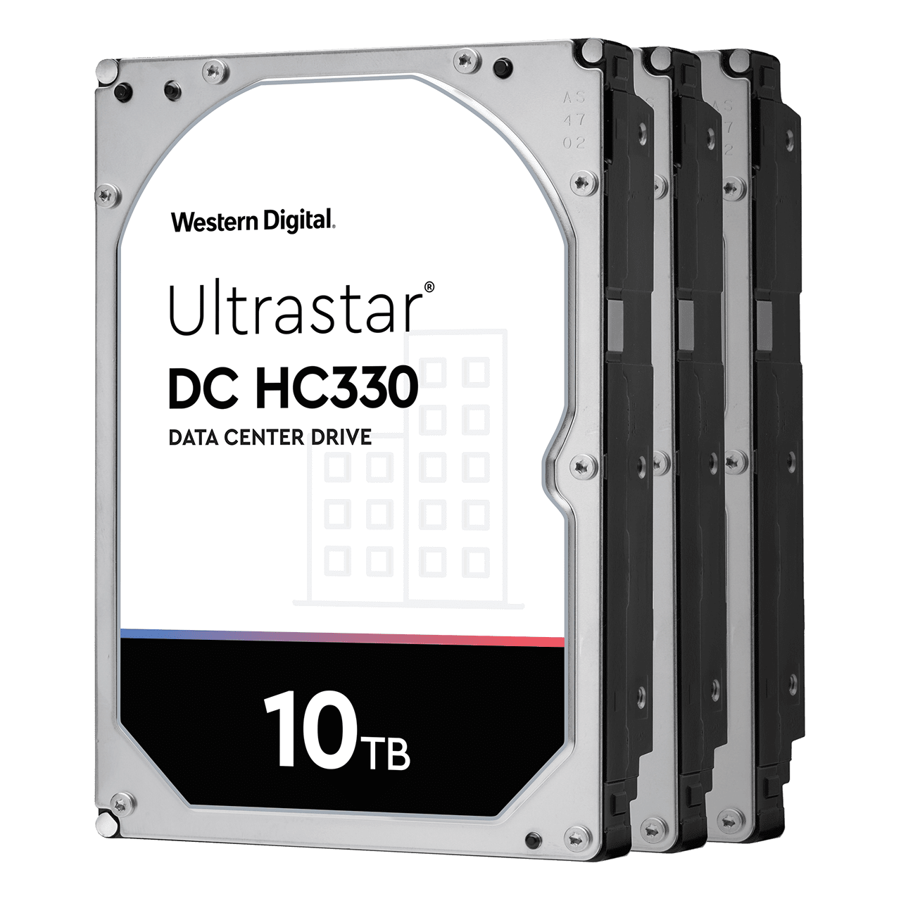
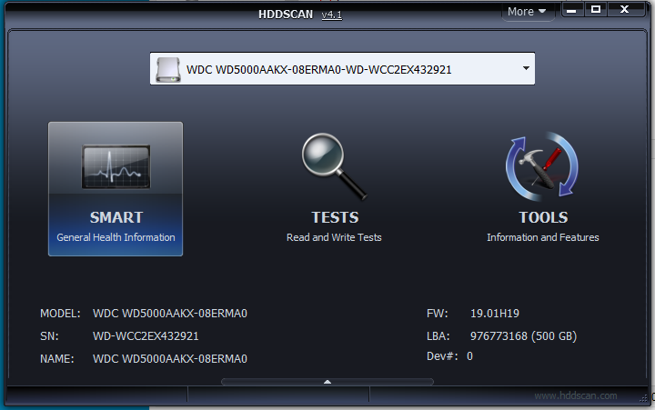

# Práctica 01: Dispositivos de almacenamiento de datos

<!--U02 Almacenamiento-->

En esta práctica vamos a familiarizarnos con las características de las unidades físicas de almacenamiento. Primero vamos a revisar las estadísticas SMART de nuestro disco duro.  
Después leeremos algunas de las conclusiones obtenidas por un estudio sobre fallos de discos duros publicado por Google.  
Finalmente tendrás que contestar a una serie de preguntas relacionadas con unidades de almacenamiento buscando información en Internet.

{width=30%}


## S.M.A.R.T

Vamos a familiarizarnos con la información de autodiagnóstico de los discos duros proporcionada por SMART (Self Monitoring Analysis and Reporting Technology).

Esta práctica se debe realizar **sobre una máquina real** para poder leer los registros SMART.

### Si usamos Linux:
Usaremos las utilidades de disco de gnome que están instaladas por defecto en Ubuntu. Si no las tuviéramos las podemos instalar mediante el siguiente comando:

```sh
sudo apt-get install gnome-disk-utility
```

Ejecutamos la utilidad de discos. 
Mucha precaución, podríamos borrar nuestro disco si pulsamos sobre las opciones equivocadas.

En el icono en forma de rueda dentada, situado arriba a la derecha, debemos elegir “Datos y pruebas Smart…” para ver las estadísticas

### Si usamos Windows:
Podemos usar el siguiente software que no necesita instalación, para leer las estadísticas SMART de nuestro disco duro:

> [https://hddscan.com/](https://hddscan.com/)

{width=40%}

Para ver las estadísticas SMART pulsaremos el botón situado más a la izquierda.

### Contesta a las siguientes preguntas
> @. Toma una captura de las estadísticas SMART de tu disco duro.
> @.	¿Cuál es el modelo y el estado general de tu disco?
> @. ¿Cuántas veces se ha encendido y apagado tu disco?
> @.	¿Cuanto tiempo ha estado encendido tu disco?
> @. ¿Qué temperatura tiene tu disco? 
> @.	Qué valores tienen las siguientes medidas:
> 
> * Reallocated Sectors Count
> * Reallocation Event Count
> * Spin Retry Count
> * Reported Uncorrectable Errors

## Estudio de discos de Google
Descarga el estudio sobre fallos de discos publicado por google:

> [https://static.googleusercontent.com/media/research.google.com/es//archive/disk_failures.pdf](https://static.googleusercontent.com/media/research.google.com/es//archive/disk_failures.pdf)

Responde a las siguientes preguntas:

> @. Según la figura 2 del estudio, ¿A qué edad es más probable que se comiencen a romper los discos duros?
> @. Según la figura 5 del estudio, ¿A qué temperaturas se rompen antes los discos, afecta igual a discos de todas las edades? ¿Si tuvieras que crear un data center a qué temperatura lo climatizarías?
> @. Según la figura 6 del estudio, ¿ Son los "scan errors" son un buen predictor de los fallos de disco?
> @. ¿Podemos estar seguros que nuestro disco no fallará si no tiene ningún error anotado en los parámetros SMART?


## HDD

> @.	Busca en Internet el PDF de especificaciones de 3 discos duros pensados para su uso en un centro de datos (puedes probar buscando *HDD data center* en google), **cada uno de ellos debe ser de un fabricante diferente**.
> 
> * Indica las URLs de dónde se pueden descargar los PDFs con sus especificaciones
> * Indica marca, modelo, e interfaz de conexión para cada disco.
> * Compara sus parámetros de fiabilidad ( MTBF y AFR) de los distintos discos.
> * Compara sus parámetros de rendimiento en la transferencia.
	

<!--

* WD
https://documents.westerndigital.com/content/dam/doc-library/en_us/assets/public/western-digital/product/data-center-drives/ultrastar-dc-hc300-series/data-sheet-ultrastar-dc-hc330.pdf
* Seagate
https://www.seagate.com/files/www-content/datasheets/pdfs/exos-x18-channel-DS2045-1-2007LA-es_ES.pdf

* Toshiba
https://toshiba.semicon-storage.com/content/dam/toshiba-ss-v2/master/en/storage/product/data-center-enterprise/eHDD_MG08_Product-Overview_rev2s.pdf

* HGST (Hitachi, fue comprada por WD en 2012)


* WD escritorio (Blue)
https://documents.westerndigital.com/content/dam/doc-library/es_mx/assets/public/western-digital/product/internal-drives/wd-blue-hdd/product-brief-western-digital-wd-blue-mobile-sata-hdd.pdf

-->


## SSD

> @.	Busca el nombre de 3 fabricantes de unidades de almacenamiento SSD.
> 
> @.	Busca las características de 2 modelos de SSD, anota el modelo y fabricante, velocidades de lectura y escritura, MTBF(Durabilidad), así como otras características que creas destacables. Indica la URL para descargar el PDF de especificaciones de cada una.
> 
> @.	Busca 3 dispositivos SSD que tengan interfaces de conexión distintas (EJ: SATA, PCI-Express, m2, etc). Busca información sobre cada una de las interfaces, anota las velocidades teóricas máximas de cada tipo de interfaz.
> 
> @.	¿En qué situaciones crees que se usa cada tipo de interfaz de conexión?
> 
> @.	Busca el SSD más rápido que puedas encontrar, anota su velocidad de lectura y escritura. ¿Qué interfaz de conexión tiene?
> 
> @.	Busca el SSD más grande que puedas encontrar, a qué precio te sale el GB. Busca el HDD más grande que puedas encontrar, a qué precio te sale el GB.

## NAS

> @.	Busca 3 fabricantes de dispositivos NAS. Incluye la URL de sus respectivas webs.
> 
> @.	Busca un dispositivo NAS para uso doméstico. Anota sus características: cuántas bahías para discos tiene, que RAIDs soporta, qué interfaces de red tiene. (Incluye URLs)
> 
> @.	Busca un dispositivo NAS para una empresa mediana. Anota sus características: cuántas bahías para discos tiene, que RAIDs soporta, qué interfaces de red tiene. (Incluye URLs)
> 
> @.	Busca un dispositivo NAS que soporte el uso de SSDs como caché. Anota la marca y modelo. Busca detalles del funcionamiento de la cache (se usa sólo en lectura, o lectura escritura, qué tamaño se recomienda, etc.).

## Bibliografía

### SMART en Windows

* https://hddscan.com/
* https://www.genbeta.com/herramientas/7-herramientas-gratis-para-comprobar-la-salud-de-tu-disco-duro
* https://crystalmark.info/en/software/crystaldiskinfo/

### SMART en Linux
* https://gsmartcontrol.sourceforge.io/home/
* http://bytecoders.net/content/monitorizar-los-discos-duros-smart-en-debian-con-smartmontools.html

### Parámetros SMART
* https://en.wikipedia.org/wiki/S.M.A.R.T.#Known_ATA_S.M.A.R.T._attributes