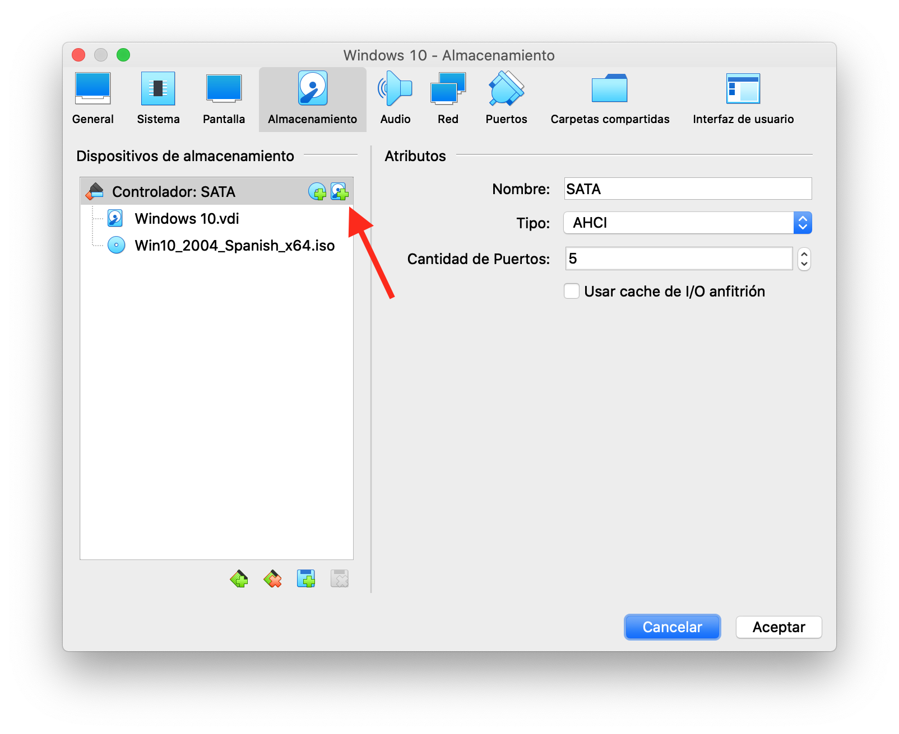

# Práctica 2: RAID en Windows10 Pro

{width=40%}

En esta práctica vamos a crear unidades RAID en Windows 10.

Las configuraciones RAID en Windows 10 se denominan **espacios de almacenamiento**.

## Tipos de espacio de almacenamiento

Antes de intentar contestar las preguntas, comienza revisando la documentación de **espacios de almacenamiento en Windows 10** en la página de Microsoft:

> [https://support.microsoft.com/es-es/help/12438/windows-10-storage-spaces](https://support.microsoft.com/es-es/help/12438/windows-10-storage-spaces)

> @. Según la documentación anterior, ¿Qué tipos intefaces de conexión pueden tener las  **unidades de disco** que se pueden usar para crear un espacio de almacenamiento?

La documentación dice que hay 3 tipos de espacio de almacenamiento. 
A Continuación, se copia literalmente la descripción de cada tipo de espacio:

* Los **espacios simples** están diseñados para aumentar el rendimiento, pero no protegen los archivos en caso de errores de la unidad. Son más indicados para datos temporales (como archivos de representación de vídeo), archivos temporales de editores de imagen y archivos de objeto de compilador intermedios. Los espacios simples requieren al menos dos unidades para ser útiles.
* Los **espacios de reflejo** están diseñados para aumentar el rendimiento y proteger los archivos contra errores de la unidad ya que guardan varias copias. Los espacios de reflejo doble realizan dos copias de los archivos y pueden tolerar errores en una unidad, mientras que los espacios de reflejo triple pueden tolerar errores en dos unidades. Los espacios de reflejo están indicados para almacenar una amplia variedad de datos, desde un recurso compartido de archivos de uso general a una biblioteca de VHD. Cuando un espacio de reflejo se formatea con el Sistema de archivos resistente (ReFS), Windows mantiene automáticamente la integridad de los datos, lo que hace que los archivos sean aún más resistentes ante errores de la unidad. Los espacios de reflejo doble necesitan al menos dos unidades, y los espacios de reflejo triple necesitan al menos cinco.
* Los **espacios de paridad** están diseñados para aumentar la eficiencia del almacenamiento y proteger los archivos en caso de errores de la unidad ya que guardan varias copias de ellos. Los espacios de paridad están indicados para el archivado de datos y para la retransmisión por streaming de medios, como música y vídeos. Este diseño de almacenamiento requiere al menos tres unidades para protegerte en caso de error de una unidad, y al menos siete unidades para protegerte en caso de error de dos unidades

> @. A partir de la descripción anterior, ¿qué tipo de RAID se estaría usando en cada uno de los diferentes espacios de almacenamiento que se enumeran a continuación? Razona tus respuesta para cada uno de los tipos.
> 
> * Espacio simple:
> * Espacio reflejo doble:
> * Espacio reflejo triple:
> * Espacios de paridad protege error de 1 disco:
> * Espacio de paridad protege error de 2 discos:

## Añadir unidades de disco a máquina virtual
Para crear conjuntos RAID vamos a necesitar añadir discos duros adicionales a nuestra máquina virtual.
Para añadir discos a una máquina virtual existente, ve a la **pestaña almacenamiento** dentro de la **configuración** de la máquina virtual. Después, presiona el icono que permite "agregar disco duro", tal como se muestra a continuación:

{width=60%}

## Espacio de almacenamiento de paridad

### Creación

> @. Añade 3 discos nuevos de 50 GB a la máquina virtual llámalos RAID3_1, RAID3_2, RAID3_3. Muestra una captura.
> 
> @. Crea un **grupo de almacenamiento de paridad** en windows con esos 3 discos. Cambia los **nombres del espacio de almacenamiento y del grupo  de almacenamiento** por tu **apellido** y Muestra una captura del gestor de espacios de almacenamiento en la que se pueda ver el espacio de almacenamiento y las unidades que lo componen.
> 
> @. ¿Qué espacio utilizable queda en el espacio de almacenamiento? ¿Cuánto espacio de los discos no se usa para datos?
> @. ¿Para qué se usa el espacio que no está disponible?
> @. Guarda un fichero pdf dentro el grupo de almacenamiento. Muestra una captura del explorador de archivos.

### Fallo de un disco y reparación

Apaga la máquina y borra uno de los discos del RAID  desde el administrador de la máquina virtual (**De este modo simulamos una rotura de disco**).
Inicia la máquina de nuevo y comprueba lo siguiente:

> @. ¿Sigue estando disponible el PDF? 
> 
> * ¿Se puede añadir contenido? ¿Cómo es posible?
> * ¿Se podría romper otro disco sin perder datos?
> 
> @. Revisa el estado del espacio de almacenamiento, ¿Hay alguna indicación de mal funcionamiento?. Muestra una captura.
> 
> @. Repara el espacio de almacenamiento:
> 
> * Añade un nuevo disco a la máquina, llámalo RAID3_4
> * Edita el grupo de almacenamiento y añade el nuevo disco y elimina el antiguo que fue borrado.
> * Muestra una captura del espacio de almacenamiento una vez reparado.

### Ampliación de capacidad

Imagina que estuvieras alcanzando el límite de capacidad del espacio de almacenamiento que has creado.

> @. ¿Es posible ampliar la capacidad del espacio sin perder los datos guardados actualmente? ¿Cómo?
> 
> @. Añade un nuevo disco de 50 GB al espacio de almacenamiento existente (Serán un total de 4 discos) Muestra captura.
> 
> * ¿Cuál es la nueva capacidad una vez ampliado el espacio de almacenamiento?
> @. ¿Hasta qué valor puedes ampliar el espacio de almacenamiento máximo del espacio de almacenamiento sin sobrepasar la capacidad total del grupo? (Muestra captura que lo demuestre)
> @. ¿Cuánto espacio se utiliza como redundancia en un RAID de este tipo?
> @. ¿Cuántos discos se pueden romper sin perder datos con tu configuración actual?

<!--
## Hot Spare
-->

## Evento fatal
Vamos a generar un evento catastrófico.

> @. Apaga la máquina y elimina dos de los discos del raid. Inicia de nuevo y comprueba el estado del espacio de almacenamiento.
> 
> * ¿Están disponibles los datos?
> * Muestra una captura del administrador de espacios de almacenamiento
> @. ¿Es posible la reparación del espacio de almacenamiento?

## Bibliografía

* https://support.microsoft.com/es-es/help/12438/windows-10-storage-spaces
* https://www.profesionalreview.com/2020/02/01/configurar-raid-en-windows-10/
* https://www.solvetic.com/tutoriales/article/3518-crear-configurar-espacios-almacenamiento-windows-10/