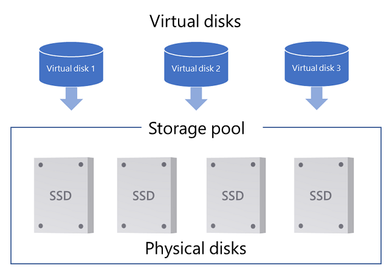
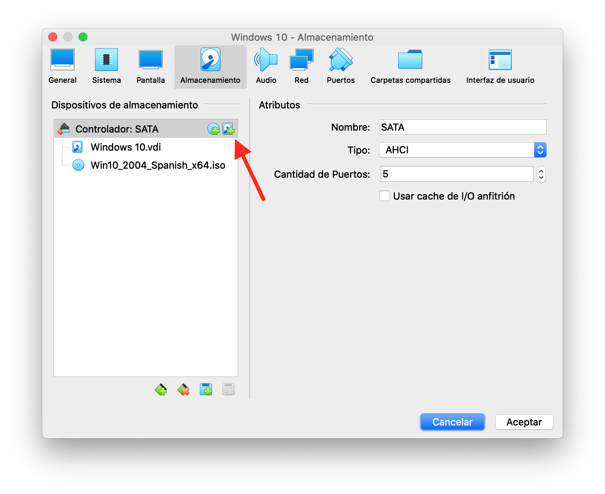
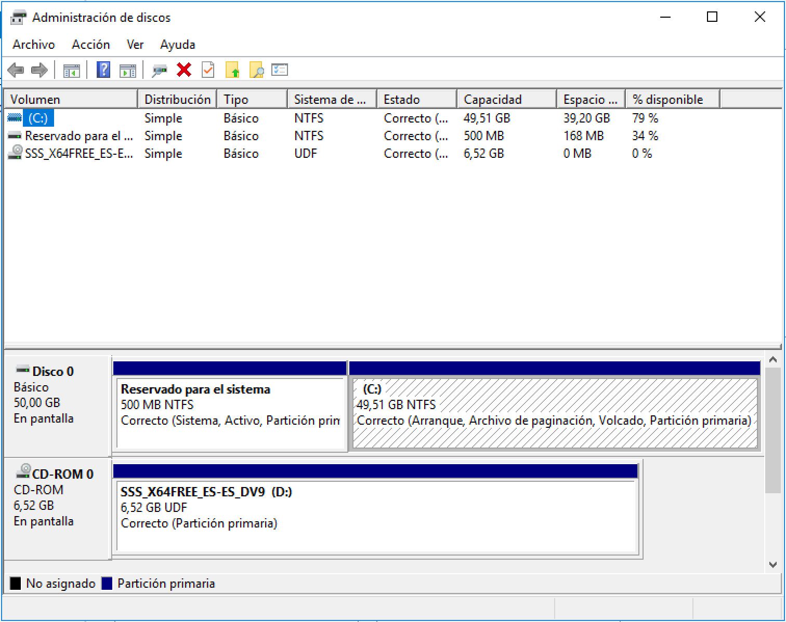
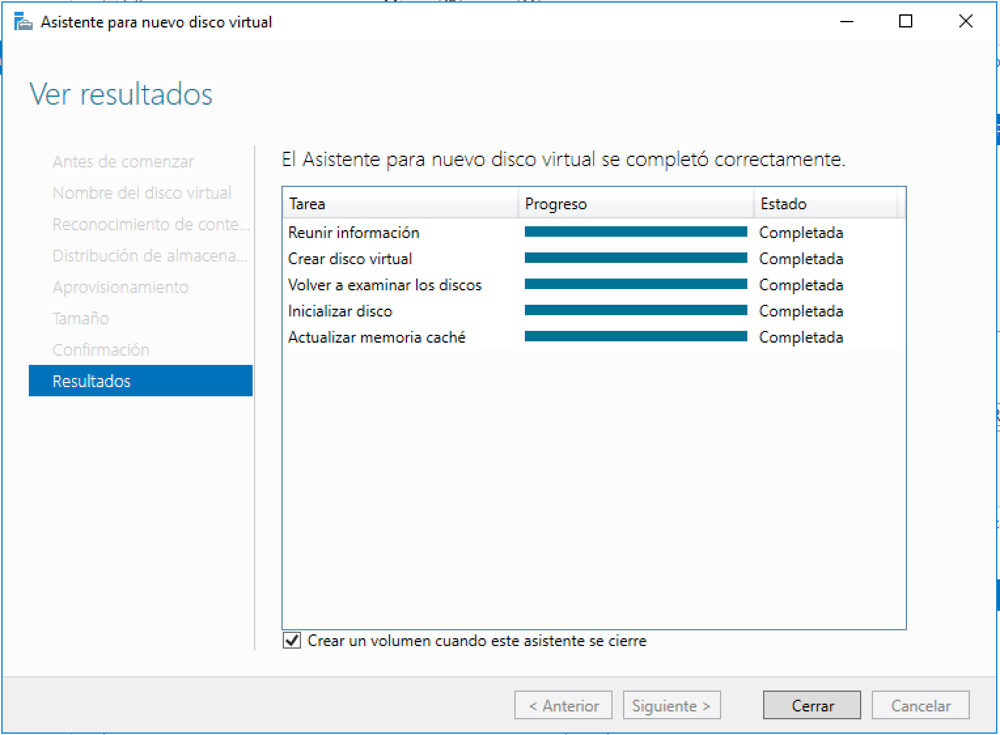
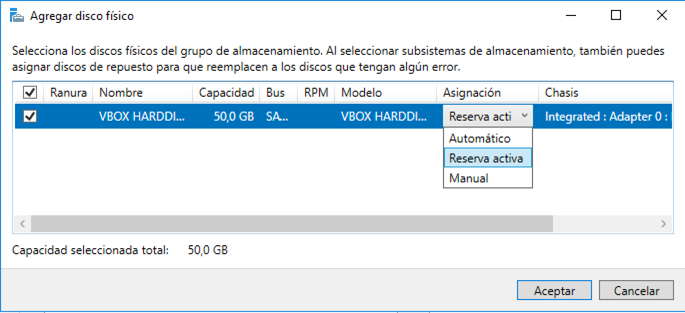

# Práctica 3: Espacios de almacenamiento en Windows Server

{width=60%}

En esta práctica vamos a crear unidades RAID en **Windows Server 2016**. Desde Widnows Server 2012 se incluyen los espacios de almacenamiento, vamos a trabajar en Windows Server 2016 (se hace igual en Windows Server 2019). 

## Añadir unidades de disco a máquina virtual
Para crear conjuntos RAID vamos a necesitar añadir discos duros adicionales a nuestra máquina virtual.
Para añadir discos a una máquina virtual existente, ve a la **pestaña almacenamiento** dentro de la **configuración** de la máquina virtual. Después, presiona el icono que permite "agregar disco duro", tal como se muestra a continuación:

{width=60%}

## Implementar espacios de almacenamiento en un servidor independiente

Tienes la documentación de Microsoft en el siguiente enlace:

> [https://docs.microsoft.com/es-es/windows-server/storage/storage-spaces/deploy-standalone-storage-spaces](https://docs.microsoft.com/es-es/windows-server/storage/storage-spaces/deploy-standalone-storage-spaces)

> @. ¿Qué tipo de bus pueden usar los discos que se utilicen en los espacios de almacenamiento según la documentación.?

La utilización de un RAID en Windows Server requiere los siguientes pasos:

* Paso 1: Crear un grupo de almacenamiento
* Paso 2: Crear un disco virtual
* Paso 3: Crear un volumen

Un **grupo de almacenamiento** es una colección de discos físicos. Un grupo de almacenamiento permite agregar almacenamiento, expandir la capacidad flexible y delegar la administración.

Un **espacio de almacenamiento** aparece en el sistema operativo Windows como un disco normal desde el que puedes crear volúmenes formateados.

Cuando creas un **disco virtual** a través de la interfaz de usuario de Servicios de archivos y almacenamiento, **puedes configurar el tipo de resistencia**, el **tipo de aprovisionamiento** y el tamaño.

En Windows puedes comprobar los volúmenes existentes desde el "**administrador de discos**", puedes abrirlo mediante click derecho en el botón de inicio y luego `administrador de discos`. Tiene el siguiente aspecto:

{width=70%}

### Paso 1: Crear un grupo de almacenamiento

> @. Añade 3 discos nuevos de 50 GB a la máquina virtual llámalos RAID1, RAID2, RAID3. **Muestra una captura**.
> 
> @. Comprueba con el `administrador de discos` que los discos se han añadido correctamente. **No los inicialices**.
> 
> @. Crea un nuevo grupo de almacenamiento con los 3 discos que has añadido en el punto anterior. Ponle tu **apellido** como nombre.
> 
> * `Administrador del servidor->Servicios de archivo y Almacenamiento->Grupos de almacenamiento`. 
> 	* Aparecerá el grupo `Primordial` que incluye los discos disponibles.
> * En Grupos de almacenamiento pulsa: `Tareas->Nuevo grupo de almacenamiento...`
> 
> @. Revisa el `administrador de discos` ¿Qué ha pasado con los discos que habíamos añadido? **Muestra una captura**.

### Paso 2: Crear un disco virtual

> @. Crea un `Disco Virtual`, ponle de nombre tu apellido 
> 
> * `Administrador del servidor->Servicios de archivo y Almacenamiento->Grupos de almacenamiento` 
> * En `Discos Virtuales` pulsa: `Tarea->Nuevo disco virtual..`
> 
> Deja las opciones por defecto hasta llegar a `Distribución de almacenamiento`. **Antes de elegir un tipo contesta a las siguientes preguntas**:
> 
> @. Contesta a las siguientes preguntas:
> 
> 1. ¿Qué tipos de **Distribución** hay disponibles?
> 	* ¿A qué tipo de RAID crees que se corresponden, por qué?
> 2. ¿Qué diferencia hay entre tipo de aprovisionamiento **Delgado** y **Fijo**?
> 
> 3. ¿Cuál es el tamaño máximo disponible? ¿En qué se usa el tamaño del disco que falta?
> 
> @. Elige las siguientes opciones:
> 
> * Distribución `Parity`. 
> * Selecciona tipo de aprovisionamiento `Fijo`.
> * Especificar el tamaño: `Tamaño máximo`.
> 
> Finalmente, en confirmación, pulsa `Crear`. Te aparecerá una ventana como la siguiente:
> 
> {width=70%}
> 
> Antes de pulsar `cerrar` contesta a la siguiente pregunta:
> 
> @. Revisa el `Administrador de discos` ¿Qué ha pasado con los discos que habías añadido?. **Muestra una captura**.

### Paso 3: Crear un volumen

> @. Sólo queda pulsar cerrar dejando marcada la casilla `Crear un volumen cuando este asistente se cierre`. Aparecerá el asistente para crear un volumen. 
> 
> * Asígnale una letra de unidad
> * Sístema de archivos `NTFS
> 
> * Muestra una captura de la ventana del asistente tras finalizar la inicialización del volumen. 
> * Muestra una captura del `administrador de discos una vez terminado`.

## Gestión del RAID

> @. Añade algún fichero a la unidad que acabas de crear, varias imágenes y un .txt con algo de contenido puede ser suficiente. **Muestra una captura.**

### Fallo de un disco y reparación

Apaga la máquina y borra uno de los discos del RAID  desde el administrador de la máquina virtual (**De este modo simulamos una rotura de disco**).
Inicia la máquina de nuevo y comprueba lo siguiente:

> @. Revisa el estado del grupo de almacenamiento, ¿Hay alguna indicación de mal funcionamiento?. **Muestra una captura**.
> 
> @. ¿Siguen estando disponibles los ficheros? 
> 
> * ¿Se puede añadir contenido? 
> * ¿Se podría romper otro disco sin perder datos? ¿Por qué?
> 
> @. Comprueba el estado del `Disco Virtual`, click derecho -> `Propiedades`.
> 
> * Toma captura de la pestaña `Mantenimiento`.
> 	* ¿Qué `Estado operativo` tiene el Disco Virtual?
> 
> @. Repara el espacio de almacenamiento:
> 
> * Añade un nuevo disco a la máquina , llámalo RAID4
> * Añade el nuevo disco al grupo de almacenamiento (click derecho y `Agregar disco físico..`. Deja la asignación en `Automático` ) 
> * Repara el disco virtual. Click derecho y `Reparar disco virutal`
> * Elimina el antiguo que fue borrado de `Discos Físicos`. Click derecho y `Quitar disco`
> * Muestra una captura del espacio de almacenamiento una vez reparado.
>
> @. Comprueba el estado del `Disco Virtual`, click derecho -> `Propiedades`.
> 
> * Toma captura de la pestaña `Mantenimiento`.
> 	* ¿Qué `Estado operativo` tiene el Disco Virtual?

### Añadir un Hot Spare

> @. Añade un ***hot spare*** (**reserva activa**, tal como se ha traducido en Windows).
> 
> * Apaga la máquina y añade un nuevo disco. Dale el nombre de **HotSpare**.
> * Agrega el nuevo disco al grupo de almacenamiento, con asignación `Reserva activa`. Tal como se muestra en la siguiente imagen:

### Probando el Hot Spare.

> @. Apaga y quita un disco que no sea el *hot spare*. Arranca y comprueba el estado del grupo de almacenamiento. Toma una captura.
> 
> @. Comprueba el estado del `Disco Virtual`, click derecho -> `Propiedades`.
> 
> * Toma captura de la pestaña `Mantenimiento`.
> 	* ¿Qué `Estado operativo` tiene el Disco Virtual?
> 
> @. ¿Qué ventaja tiene el uso de un disco *hot spare*?

### Ampliación de capacidad

Imagina que estuvieras alcanzando el límite de capacidad del espacio de almacenamiento que has creado.

 
> @. Añade un nuevo disco físico de 50 GB al espacio de almacenamiento existente con valor de asignación `Automático`(Serán un total de 4 discos) **Muestra captura**.
> 
> * ¿Cuál es la nueva capacidad una vez ampliado el espacio de almacenamiento?
> * ¿Ha aumentado la capacidad del disco virtual (Pulsa el botón de actualizar del administrador del servidor antes de comprobarlo) **Muestra una captura**?

## Evento fatal
Vamos a generar un evento catastrófico.

> @. Apaga la máquina y elimina dos de los discos del espacio de almacenamiento. Inicia de nuevo y comprueba el estado del espacio de almacenamiento.
> 
> * ¿Están disponibles los datos?
> * Muestra una captura del administrador de espacios de almacenamiento
>
> @. Comprueba el estado del `Disco Virtual`, click derecho -> `Propiedades`.
> 
> * Toma captura de la pestaña `Mantenimiento`.
> 	* ¿Qué `Estado operativo` tiene el Disco Virtual?

## Bibliografía

* https://docs.microsoft.com/es-es/windows-server/storage/storage-spaces/deploy-standalone-storage-spaces
* https://docs.microsoft.com/es-es/windows-server/storage/storage-spaces/storage-spaces-states
* https://www.youtube.com/watch?v=iD0GavMgg1k
* https://redmondmag.com/articles/2013/09/20/hot-spare-to-a-storage-pool.aspx#:~:text=Right%2Dclick%20on%20the%20storage,as%20shown%20in%20Figure%204.