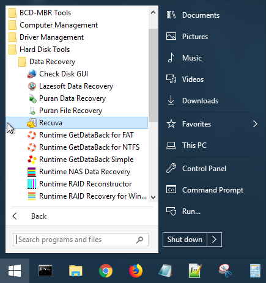
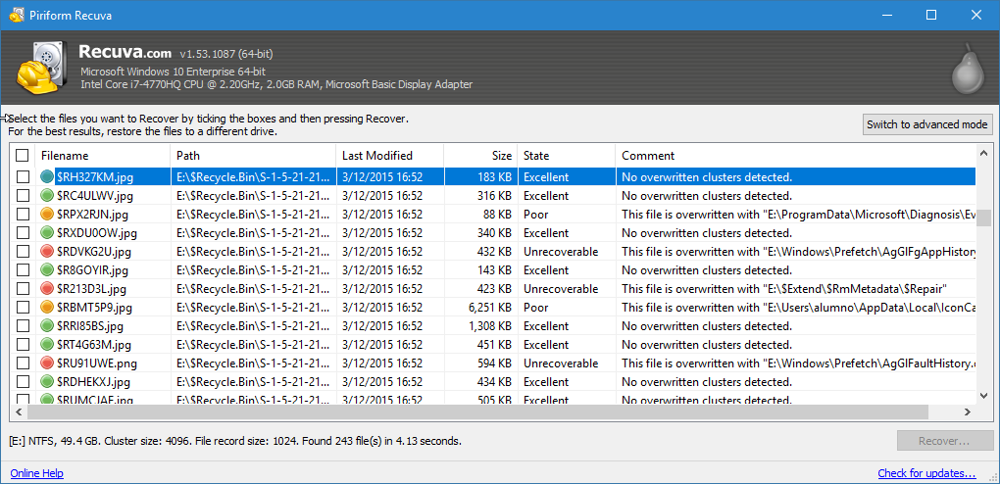
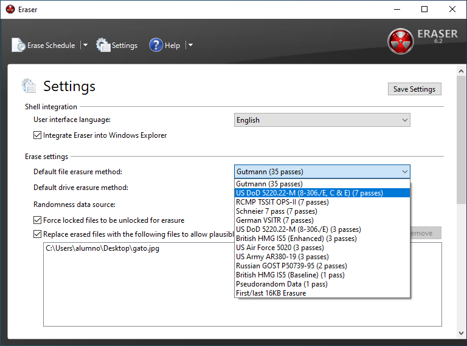
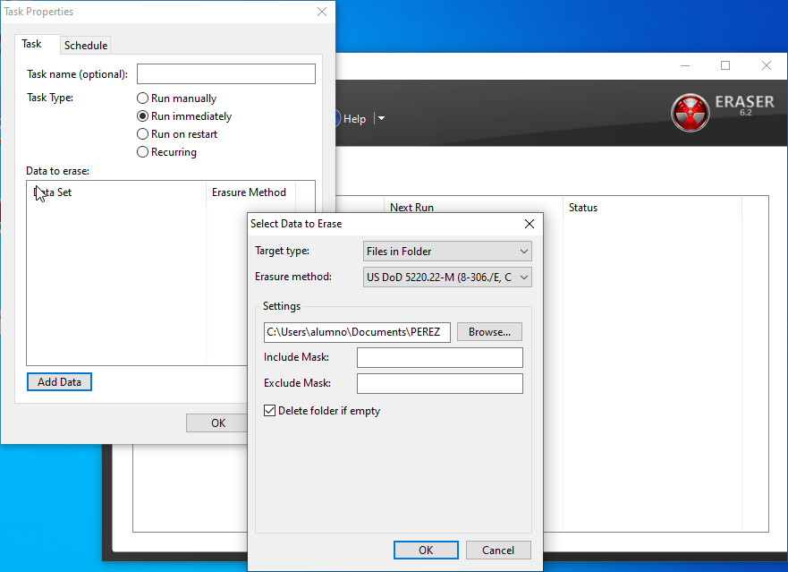

# Ejercicio: Recuperación de ficheros y borrado seguro

{width=40%}

En esta práctica vamos a comprobar que es posible recuperar ficheros que creíamos haber borrado del disco duro.

Después aprenderemos a borrar ficheros de forma segura para que no puedan ser recuperados.

## Recuperación de ficheros borrados

Usaremos una **máquina virtual usando Windows .**

Es posible recuperar ficheros borrados de un disco duro. Cuando borramos el fichero, en realidad no se borra físicamente, sólo se desecha el puntero que indicaba dónde comenzaba dicho fichero.

De esta forma, si borramos un fichero por error aún será posible la recuperación de su contenido (con suerte, si no se ha escrito nada encima).

Pasos para recuperar ficheros borrados: 

* **Dejar de usar el ordenador** con el disco que tiene los ficheros borrados. 
	* No debes instalar nada
	* No debes copiar nada 
* Cualquier escritura puede sobrescribir los ficheros que queremos rescatar.
* Se recomienda **apagar el ordenador** tan pronto como se sea consciente de la necesidad de recuperar ficheros. Piensa que Windows y otros programas descargan actualizaciones automáticamente, que podrían sobrescribir los datos borrados. 
* Arrancar el ordenador con alguna distribución live CD y usar una utilidad de recuperación de datos.
	* Nosotros usaremos **Recuva desde HBCD**
* Necesitaremos una unidad de disco adicional para que la recuperación sea exitosa.

> @. Añade una segunda unidad de disco a tu máquina virtual y dale formato, la usaremos durante el proceso de recuperación de datos para guardar los datos recuperados.
 

> @. Comencemos, Crea una **carpeta** dentro de `Documentos` **llamada como tu apellido**, dentro copia el contenido **descomprimido** del fichero .zip que te ha sido proporcionado (Consiste en numerosas imágenes). (**Muestra captura**)
> 
> * Ahora **borra los ficheros y vacía la papelera**. 
> * A continuación **apaga la máquina**.

Vamos a intentar recuperar los ficheros borrados usando **Hirens Boot CD y Recuva** (HBCD). Recuerda que puedes descargarlo desde [https://www.hirensbootcd.org/](https://www.hirensbootcd.org/).

{width=40%}

> @. Arranca con HBCD y ejecuta la utilidad **Recuva**
> 
> * Haz que busque todos los ficheros
> * Especifica la unidad dónde buscar (la de la instalación de windows)
> * Haz una captura de los ficheros encontrados por Recuva
> 	* **¿Qué significan los círculos de colores?**
> * Recupera los archivos .jpg que hagas encontrado
> 	* Usa una unidad distinta al disco principal (la que fue añadida al principio de la práctica) 
> 
> @. ¿Has podido recuperar todos correctamente? ¿Has tenido algún problema identificando los archivos?
> 
<!-- Los archivos no tienen el nombre por haber pasado por la papelera, además puede que algunos no hayan podido ser recuperados completamente a causa de sobrescrituras -->

{width=70%}

## Borrado seguro de ficheros

Supongamos ahora que queremos borrar los ficheros, pero asegurándonos de que nadie pueda recuperarlos. Para ello usaremos el programa *Eraser*.

En la máquina virutal, descaga e instala el software:

> [https://eraser.heidi.ie/](https://eraser.heidi.ie/)

Para aprender cómo usarlo puedes ver el siguiente vídeo (está en inglés):

> [https://www.youtube.com/watch?v=sBfTLPdlkbs&feature=emb_log](https://www.youtube.com/watch?v=sBfTLPdlkbs&feature=emb_logo)

El vídeo explica los diferentes métodos de borrado disponibles en el programa.

> @. Configura *Eraser* para usar el método de 7 pasadas del Departamento de defensa americano y para que reemplace lo borrado con otros ficheros. Para ello:
>  
> * Haz click sobre `Settings`
> 	* Selecciona método que comienza por `US DoD`
> 	* Marca la casilla `Replace erased files with the following files...`
> 	* Añade algún archivo para que sea copiado sobre las zonas borradas. Esto hace más difícil la detección del uso del programa de borrado.
> 
> {widht=70%}

Vuelve a copiar las imágenes del fichero .zip a la misma carpeta dentro de `Documentos`, igual que al principio de la práctica.

> @. Esta vez, borra el contenido de la carpeta usando *Eraser*
> 
> * Añade un `Erase Schedule` -> `New Task`
> * Elige el `Task Type`-> `Run immediately`
> * Añade el directorio con el botón `Add data`
> 	* Elige `Target type`-> `Files in folder`
> 	* Añade el directorio, no hace falta poner máscaras
> 	* **Muestra captura de la configuración de la tarea**
> * Finalmente realiza el borrado  
> * Comprueba que ya no están los datos en el directorio
> 
> 
> 
> @. **Intenta recuperar los ficheros borrados.**
> 
> * Repite el proceso de recuperación realizado al principio de la práctica con HBCD. 
> * ¿Has podido encontrar alguno de los ficheros borrados?
> (Muestra captura de los ficheros recuperados pro *Eraser*)

## Bibliografía:
* https://eraser.heidi.ie/
* https://www.aboutespanol.com/usar-hirens-boot-cd-para-recuperar-tus-datos-3507989
* https://www.youtube.com/watch?v=sBfTLPdlkbs&feature=emb_log

