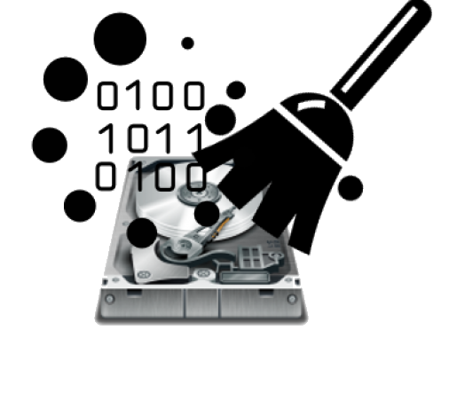

# Práctica 5: Recuperación de Ficheros y Borrado Seguro

{:style="width: 30%;" class="center"}

## Introducción

En esta práctica, aprenderás sobre la **recuperación de ficheros borrados** y cómo realizar un **borrado seguro de información** para evitar que los datos puedan ser recuperados. Estos conceptos son fundamentales en seguridad informática para proteger la confidencialidad y privacidad de la información.

La práctica se divide en dos partes:

1. **Recuperación de ficheros borrados**: Comprobarás que es posible recuperar ficheros eliminados del disco duro utilizando herramientas especializadas.
2. **Borrado seguro de ficheros**: Aprenderás a borrar ficheros de forma que no puedan ser recuperados, asegurando la eliminación definitiva de la información.

<!--

## Objetivos

- **Comprender** cómo funciona el borrado y recuperación de datos en sistemas de archivos.
- **Utilizar herramientas** para recuperar ficheros borrados y realizar un borrado seguro.
- **Analizar** las diferencias entre un borrado normal y un borrado seguro.
- **Reflexionar** sobre la importancia de estas prácticas en el contexto de la seguridad informática.
-->

## Parte 1: Recuperación de Ficheros Borrados

### Requisitos Previos

- **Máquina virtual con Windows** instalada.
- **Hiren's BootCD (HBCD)** descargado desde [hirensbootcd.org](https://www.hirensbootcd.org/).
- **Recuva**, herramienta de recuperación de datos incluida en HBCD.
- **Segunda unidad de disco virtual** añadida a tu máquina virtual para almacenar datos recuperados.
- Descarga estos [ficheros de imágenes](https://drive.google.com/file/d/1woS4RdwI2bYDDV7aSrlYSPVmO8EOTCoj/view?usp=sharing) comprimidos en `.zip` para usar como ficheros de prueba en la práctica

### Conceptos Clave

- **Borrado Lógico vs. Borrado Físico**: Cuando se borra un fichero, el sistema elimina la referencia en la tabla de archivos, pero los datos permanecen en el disco hasta que son sobrescritos.
- **Recuperación de Datos**: Es posible recuperar datos borrados si no han sido sobrescritos, utilizando herramientas especializadas.

### Pasos a Seguir

#### 1. Preparación del Entorno

1. **Añadir una Segunda Unidad de Disco**:
   - En la configuración de la máquina virtual, agrega una nueva unidad de disco duro virtual.
   - Inicia Windows y formatea la nueva unidad:
     - Ve a **Administración de discos** (`diskmgmt.msc`).
     - Inicializa y formatea la nueva unidad asignándole una letra de unidad (por ejemplo, `E:`).
     - Para que se pueda realizar la práctica la unidad no debe estar cifrada con `bitlocker`. Si es necesario desactiva el cifrado de `bitlocker` de la nueva unidad.

#### 2. Creación y Borrado de Ficheros

1. **Crear una Carpeta con Tu Apellido en la nueva unidad**:
   - En la Nueva unidad `E:`, crea una nueva carpeta llamada con tu **apellido**.
   - **Captura de pantalla**: Muestra la carpeta creada en la unidad`E:`.

2. **Copiar Ficheros**:
   - Descomprime el archivo `.zip` proporcionado, que contiene varias imágenes.
   - Copia las imágenes descomprimidas dentro de la carpeta con tu apellido.

3. **Borrar los Ficheros**:
   - Selecciona los ficheros en la carpeta y bórralos.
   - Vacía la **Papelera de Reciclaje** para eliminar los ficheros definitivamente.
   - **Importante**: No realices más acciones en el sistema para evitar sobrescribir los datos borrados.

4. **Apagar la Máquina Virtual**:
   - Apaga el sistema para prevenir cualquier actividad que pueda sobrescribir los ficheros borrados.

#### 3. Recuperación de Ficheros con Recuva

1. **Arrancar con Hiren's BootCD (HBCD)**:
   - Configura la máquina virtual para arrancar desde el ISO de HBCD.
   - Inicia HBCD y selecciona el modo **Mini Windows XP** o el entorno disponible.
   - Si tienes problemas arrancando desde el CD, una opción es desconectar el disco duro principal de la máquina.

2. **Ejecutar Recuva**:
   - En HBCD, ve al menú de utilidades y ejecuta **Recuva**.

3. **Configuración de Recuva**:
   - Al iniciar Recuva, selecciona la opción para buscar **Todos los archivos**.
   - Indica que la ubicación de los archivos es en una **ubicación específica** y selecciona la unidad donde estaban los ficheros borrados.

4. **Iniciar el Escaneo**:
   - Inicia el proceso de búsqueda de ficheros borrados.

5. **Análisis de Resultados**:
   - **Captura de pantalla**: Muestra los resultados encontrados por Recuva.
   - **Pregunta**: ¿Qué significan los círculos de colores?
     - **Respuesta**:
       - **Verde**: El archivo es recuperable y está en buen estado.
       - **Naranja**: El archivo es parcialmente recuperable; puede estar dañado.
       - **Rojo**: El archivo no es recuperable; está sobrescrito o dañado.

6. **Recuperar los Archivos `.jpg`**:
   - Selecciona los archivos `.jpg` que Recuva ha encontrado.
   - Haz clic en **Recuperar** y elige  **otra unidad de disco** para guardar los archivos recuperados. Podría ser una unidad USB, o puedes guardarlo en el escritorio (se guardará en RAM y por lo tanto no permanerán tras el apagado)

#### 4. Evaluación de la Recuperación

- **Pregunta**: ¿Has podido recuperar todos los archivos correctamente? ¿Tuviste algún problema al identificarlos?
  - **Posible respuesta**: Es posible que los nombres de los archivos hayan cambiado o que algunos archivos estén dañados debido a que los datos pudieron haberse sobrescrito parcialmente.

---

## Parte 2: Borrado Seguro de Ficheros

### Conceptos Clave

- **Borrado Seguro**: Proceso que implica sobrescribir el espacio que ocupaba un fichero con datos aleatorios o patrones específicos, impidiendo su recuperación.
- **Métodos de Sobrescritura**: Existen diferentes estándares (como el del Departamento de Defensa de EE.UU.) que especifican el número de pasadas y patrones de datos para sobrescribir.

### Herramienta Utilizada

- **Eraser**: Programa gratuito y de código abierto para Windows que permite realizar borrados seguros.
  - **Descarga**: [eraser.heidi.ie](https://eraser.heidi.ie/)

### Pasos a Seguir

#### 1. Instalación y Configuración de Eraser

1. **Descargar e Instalar Eraser**:
   - Descarga Eraser desde su sitio oficial.
   - Instala el programa siguiendo las instrucciones del asistente.

2. **Configurar Eraser**:
   - Abre Eraser y ve a `Settings` (Configuración).
   - En `Default file erasure method`, selecciona **US DoD 5220.22-M (7 passes)**.
   - Marca la opción `Replace erased files with the following files` (Reemplazar archivos borrados con los siguientes archivos).
   - Añade uno o varios archivos que serán usados para sobrescribir los datos borrados.
     - Esto dificulta la detección del uso de herramientas de borrado seguro.
   - **Captura de pantalla**: Muestra la configuración realizada en Eraser.

#### 2. Borrado Seguro de los Ficheros

1. **Preparar los Ficheros**:
   - Copia nuevamente las imágenes del archivo `.zip` a la carpeta con tu apellido en `Documentos`.

2. **Crear una Tarea en Eraser**:
   - En Eraser, ve a `Erase Schedule` y selecciona `New Task` (Nueva Tarea).
   - Configura la tarea:
     - **Task Type**: Selecciona `Run immediately` (Ejecutar inmediatamente).
     - Haz clic en `Add Data` para añadir los datos a borrar.
       - **Target Type**: Elige `Files in Folder`.
       - **Folder**: Selecciona la carpeta con tu apellido que contiene los datos.
       - **Include Subfolders**: Asegúrate de que esta opción esté marcada si hay subcarpetas.
   - **Captura de pantalla**: Muestra la configuración de la tarea en Eraser.

3. **Ejecutar la Tarea**:
   - Haz clic derecho en la tarea creada y selecciona `Run Task` (Ejecutar Tarea).
   - Espera a que el proceso de borrado seguro finalice.
   - Verifica que la carpeta esté vacía.

#### 3. Intento de Recuperación de Ficheros

1. **Arrancar con Hiren's BootCD (HBCD)**:
   - Reinicia la máquina virtual y arranca nuevamente desde HBCD.

2. **Ejecutar Recuva**:
   - Repite el proceso de búsqueda de ficheros borrados con Recuva, como en la Parte 1.

3. **Análisis de Resultados**:
   - **Captura de pantalla**: Muestra los resultados de Recuva tras el borrado seguro.
   - **Pregunta**: ¿Has podido encontrar alguno de los ficheros borrados?
     - **Posible respuesta**: No deberías encontrar los archivos borrados, o si aparecen, no serán recuperables.

---

## Conclusiones

- **Recuperación de Datos**: Los ficheros borrados de manera convencional pueden ser recuperados si no han sido sobrescritos.
- **Importancia del Borrado Seguro**: Para proteger información sensible y garantizar la confidencialidad, es esencial realizar un borrado seguro de los datos.
- **Herramientas Especializadas**: Programas como Eraser permiten sobrescribir los datos siguiendo estándares reconocidos, evitando su recuperación.
- **Buenas Prácticas en Seguridad**: Conocer y aplicar estos métodos es fundamental en la seguridad informática y en el manejo responsable de la información.

---

## Bibliografía

- **Eraser**: [eraser.heidi.ie](https://eraser.heidi.ie/)
- **Cómo usar Hiren's BootCD para recuperar tus datos**: [aboutespanol.com](https://www.aboutespanol.com/usar-hirens-boot-cd-para-recuperar-tus-datos-3507989)
- **Tutorial de Eraser en YouTube**: [youtu.be/sBfTLPdlkbs](https://www.youtube.com/watch?v=sBfTLPdlkbs&feature=emb_logo)

---

## Actividades Adicionales

- **Investigación**:
  - Busca otras herramientas de recuperación y borrado seguro de datos.
  - Investiga los diferentes métodos de borrado seguro y sus niveles de eficacia.
- **Reflexión**:
  - Analiza situaciones en las que el borrado seguro es crítico, como al desechar dispositivos o transferir equipos.
- **Práctica Avanzada**:
  - Experimenta con otras herramientas de borrado seguro y compara los resultados.

---

## Notas Importantes

- **Precaución**: Al utilizar herramientas de borrado seguro, asegúrate de no eliminar información importante. Estos procesos son irreversibles.
- **Ética y Legalidad**: Maneja la información de forma ética y cumpliendo con las normativas de protección de datos.
- **Seguridad**: Mantén tus sistemas actualizados y utiliza buenas prácticas de seguridad para proteger tus datos.

---

## Preguntas Frecuentes

1. **¿Por qué es posible recuperar ficheros borrados?**
   - Porque al borrar un fichero, el sistema operativo elimina la referencia en la tabla de archivos, pero los datos físicos permanecen en el disco hasta que son sobrescritos.

2. **¿Qué diferencia hay entre un borrado normal y un borrado seguro?**
   - El borrado normal elimina la referencia al fichero, mientras que el borrado seguro sobrescribe el espacio que ocupaba el fichero con datos aleatorios o patrones, impidiendo su recuperación.

3. **¿Es posible recuperar datos después de un borrado seguro?**
   - En condiciones normales, no. El borrado seguro está diseñado para prevenir la recuperación de datos incluso con herramientas avanzadas.
