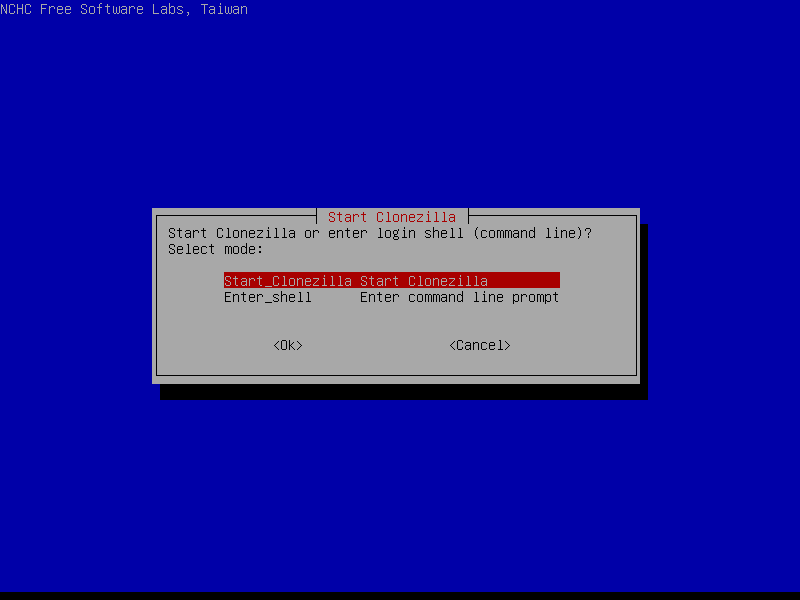

Claro, aquí tienes el texto original modificado para ser aplicable a un entorno **AlmaLinux 9**.

---

# Clonado de máquinas usando Clonezilla

{:class="center"}

En esta práctica vamos a clonar el contenido de un ordenador en otro. Para ello guardaremos una imagen del disco duro del ordenador, que es una copia exacta de su contenido. Después, en una máquina distinta restauraremos la imagen y obtendremos un ordenador con exactamente el mismo software y las mismas configuraciones que el que usamos para crear la imagen.

Este proceso resulta muy útil cuando tenemos que replicar instalaciones de software y configuraciones en un número elevado de equipos, por ejemplo: una clase, un departamento de una empresa.

## Preparación de máquina destino de copias

La imagen copia tiene que ser almacenada en algún lugar, hay diferentes opciones:

* Usar un medio externo (disco USB)
* Usar algún tipo de almacenamiento en red:
	* SSH
	* samba
	* NFS
	* webdav
	* S3

En esta práctica usaremos un servidor Linux con **SSH** como destino de la copia de seguridad.  
SSH tiene la ventaja de que es cifrado, y sería seguro la transmisión de la imagen aunque la tuviéramos que hacer a una máquina fuera de las instalaciones de nuestra empresa.

Como máquina destino de copia usaremos una **AlmaLinux 9** (puedes reutilizar alguna de prácticas anteriores). La máquina destino de copia sirve como servidor de archivos para almacenar y leer las imágenes que usará Clonezilla.

A continuación vamos a preparar la máquina destino de las copias de seguridad:

> @. Crea un usuario llamado `partimag` que usaremos para almacenar las copias. 
> 
> * usr: partimag
> * pass: copiaseguridad
> 
> Para ello, desde un terminal usa el siguiente comando para crearlo:
> 
> ```sh
> sudo adduser partimag
> ```

> @. Vamos a habilitar el servicio SSH en la máquina, ejecuta:
> 
> ```sh
> sudo dnf install openssh-server
> sudo systemctl start sshd
> sudo systemctl enable sshd
> ```

Es importante que tanto la máquina destino de copia como las que se van a replicar **estén conectadas a la misma red**. Se recomienda el uso de la red `sólo-anfitrión` de VirtualBox.

Para ello, comprueba que existe creada una red anfitrión mediante el menú `archivo->Administrador de red anfitrión...` desde la ventana principal de VirtualBox. Si no existe, crea una. Perderás la conexión a internet, así que instala SSH antes de cambiar la configuración del adaptador.

{:class="center"}

Después, en la configuración de la máquina virtual cambia la configuración del adaptador de red a modo `sólo-anfitrión`

{:class="center"}

> @. Comprobamos que podemos conectar desde la máquina que vamos a clonar a la máquina destino de copias mediante SSH, usando el comando:
> 
> ```sh
> ssh partimag@ip_maquina
> ```
> Para obtener la IP de la máquina podemos ejecutar en una consola el comando:
> 
> ```sh
> ip addr
> ```

## Creación de imagen

Una vez que tenemos las dos máquinas conectadas a la misma red y hemos comprobado que es posible la conexión mediante SSH, vamos a crear la imagen usando el programa `clonezilla`.

Necesitaremos tener una imagen de Clonezilla Live, que podemos obtener desde el siguiente enlace:

> [https://clonezilla.org/downloads.php](https://clonezilla.org/downloads.php)

Descarga una **ISO** adecuada a tu máquina virtual (las basadas en Debian pueden ser de 32 y 64 bits, las basadas en Ubuntu son sólo de 64 bits). Elige una de las versiones estables y asegúrate de marcar ISO en la descarga:

{:class="center"}

Arranca la máquina de la que quieres realizar un duplicado usando la ISO que acabas de descargar. 
Para ello, antes de arrancar, ve a `Configuración->Almacenamiento` y carga la ISO en la unidad de CD

{:class="center"}

A continuación, arrancamos la máquina. Debería aparecer Clonezilla. Los menús son en modo texto:

* Elegiremos opción con los cursores.
* Cambiaremos entre opciones y botones OK con la tecla *tabulador*.

Elegimos la primera opción en el menú que se muestra a continuación:

{:class="center"}

### Configuración del teclado

Si se deja la distribución por defecto se usará la configuración americana, afectando principalmente a los símbolos, tales como la barra (necesaria para escribir los paths de las imágenes). 

Se recomienda seguir los pasos que se muestran en las imágenes para configurar el teclado en español:

Elegimos cambiar configuración del teclado:

{:class="center"}

Dejamos el modelo de teclado sin cambiar:

{:class="center"}

Elegimos 'Other' en la disposición de teclado:

{:class="center"}

Elegimos `Spanish` como país de origen: 

{:class="center"}

Elegimos `Spanish` como layout del teclado:

{:class="center"}

Dejamos opciones por defecto en el resto de opciones de teclado:

{:class="center"}

{:class="center"}

### Inicio de Clonezilla

Una vez configurado el teclado, elegimos `Start Clonezilla`:

{:class="center"}

Elegiremos el primer modo de funcionamiento: `device-image`:

{:class="center"}

### Servidor SSH

En esta pantalla elegimos dónde vamos a almacenar las imágenes, como hemos comentado al principio elegiremos `ssh_server`:

{:class="center"}

Ahora es el momento de configurar la IP, en nuestro caso estamos usando `DHCP`:

{:class="center"}

Dirección IP de destino de la copia:

{:class="center"}

Puerto SSH, por defecto es `22`, y como no lo hemos cambiado lo dejamos así:

{:class="center"}

Nombre de usuario con el que nos conectaremos al servidor SSH, nosotros habíamos creado un usuario para este propósito llamado `partimag`:

{:class="center"}

Ruta absoluta del directorio donde guardar las imágenes, dejamos el que aparece, que se corresponde con el home de nuestro usuario:

{width=70%}

A continuación, se nos muestra un aviso que nos dice que tendremos que introducir el password, pulsamos `Ok`.

{:class="center"}

Pulsamos intro... y nos pedirá el password. Lo introducimos.

{:class="center"}

### Creación de imagen

Ahora nos pide el modo de funcionamiento, vamos a elegir el modo principiante: `Beginner`

{:class="center"}

Elegimos `savedisk` para guardar la imagen del ordenador en el servidor SSH.

{:class="center"}

> Debemos introducir el nombre de la imagen, en este caso yo he dejado el nombre por defecto, se recomienda poner un nombre que identifique la máquina origen de algún modo. Ej: ubuntu_laboratorio.
> 
> @. En nuestro caso debes usar tu apellido como nombre de la imagen. Toma una captura antes de pasar a la siguiente pantalla.

{width=70%}

Elegimos los dispositivos que vamos a incluir en la imagen, en este caso sólo hay uno:

{:class="center"}

Ahora nos da a elegir entre dos tipos de compresión, dejaremos la que aparece por defecto:

{width=70%}

Nos da la opción de verificar y reparar el sistema de ficheros antes de hacer la imagen, nosotros omitimos este paso. Elegimos la primera opción:

{:class="center"}

Verificación de imagen una vez creada, la dejamos en la opción por defecto que es sí:

{:class="center"}

Nos da la opción de cifrar la imagen, en este caso elegiremos que no:

{:class="center"}

Acción a realizar cuando termine la copia. Lleva un tiempo considerable crear las imágenes, nos da la opción de apagarse o reiniciarse al terminar. Esto puede ser muy útil si dejamos el equipo desatendido y nos vamos durante el proceso de copia. Nosotros vamos a dejar la opción que viene por defecto, que nos preguntará al terminar:

{:class="center"}

Antes de empezar la copia nos muestra el comando equivalente a nuestras opciones, pulsaremos enter para que comience la copia:

{:class="center"}

Antes de empezar a copiar nos pide confirmación, pulsaremos `y`:

{:class="center"}

Ahora se pondrá a hacer la imagen, el proceso lleva algo de tiempo, debemos esperar a que termine:

{:class="center"}

Verificación de imagen, nos muestra el resultado y nos pide pulsar intro para continuar:

{:class="center"}

Finalmente nos da la opción de apagar, reiniciar o volver a empezar, en nuestro caso elegimos apagar (`Poweroff`):

{:class="center"}

## Clonación de máquina

En este punto tenemos la imagen de la máquina almacenada en el servidor SSH.

Vamos a restaurar la imagen en una máquina diferente, debemos tener cuidado y **crear una máquina que tenga una unidad de disco del mismo tamaño que la máquina origen**.

Para restaurar la imagen iniciaremos la nueva máquina con la ISO de Clonezilla, del mismo modo que hicimos para guardar la imagen. Seguiremos las mismas opciones que usamos anteriormente para configurar el teclado y conectar al servidor SSH. Hasta llegar a la opción:

Elegimos el modo `device-image`:

{:class="center"}

Elegimos el modo principiante:

{:class="center"}

Como vamos a restaurar una imagen, elegimos la opción `restoredisk`:

{:class="center"}

> @. Nos aparecerá una lista de las imágenes que hay en la carpeta que hemos conectado por SSH, en nuestro caso solo estará la que hemos creado en el apartado anterior. Toma una captura antes de pasar de pantalla:

{:class="center"}

Selección de dispositivo sobre el que se restaurará la imagen:

{:class="center"}

Verificación de imagen antes de restauración, como la hemos verificado tras almacenarla, en esta ocasión vamos a saltarnos la comprobación:

{:class="center"}

Selección de acción al terminar la restauración, dejaremos la opción por defecto:

{:class="center"}

Nos muestra el comando equivalente a las opciones elegidas:

{:class="center"}

Verificación de opciones y confirmación para continuar, pulsaremos `y`:

{:class="center"}

Aviso de que se borrará el disco, pulsamos `y`:

{:class="center"}

Proceso de restauración, llevará un rato:

{:class="center"}

Mensaje al terminar, pulsaremos intro:

{:class="center"}

Finalmente elegimos `Reboot` para reiniciar el equipo. En el siguiente arranque aparecerá el sistema operativo que se replicó:

{:class="center"}

> @. Al arrancar la máquina deberías tener una copia exacta de la máquina original.

