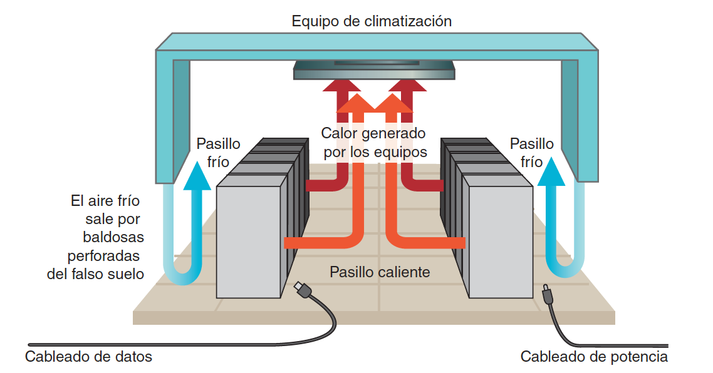

<!-- .slide: data-background="#2C3E50" -->
# Seguridad pasiva
## Ubicación Equipos

---

### CPD

Los equipos informáticos importantes para la empresa se sitúan en una sala especial llamada **CPD** (Centro de Proceso de Datos).

**La centralización permite:**

- Ahorrar en **costes** de protección y mantenimiento.
    - No se necesita duplicar vigilancia, refrigeración, etc.
- Optimizar las **comunicaciones** entre servidores.
    - Uso de cables cortos y eficientes.
- Aprovechar mejor los **recursos humanos** del departamento de informática.
    - Menos desplazamientos y mayor eficiencia operativa.

--
### CPD/Datacenter

<!-- .element height="80%" -->

---

### Plan de recuperación ante desastres 

Documento escrito **preparado con antelación**:

- Para recuperarse ante cualquier problema que pueda ocurrir en el CPD.
- **En una crisis no hay tiempo para reflexionar**.
- **Debe ser actualizado** cuando se efectúe un cambio en el CPD:
    - Nuevos servicios.
    - Nuevos equipos.

--
### Plan de recuperación ante desastres (cont.)

El plan debe incluir:

- **Hardware**
    - Qué modelos de máquinas actuales tenemos.
        - Servidores y equipamiento de red.
    - Qué modelos alternativos podemos utilizar.
    - Cómo se instalarán (conexiones, configuración).

--
### Plan de recuperación ante desastres (cont.)

El plan debe incluir:
- **Software**
    - Qué sistemas operativos y aplicaciones utilizamos.
        - Versiones y todas las opciones de configuración (permisos, usuarios, etc.).

--

### Plan de recuperación ante desastres (cont.)

El plan debe incluir:

- **Datos**
    - Qué sistemas de almacenamiento utilizamos.
        - Discos locales, cabinas de almacenamiento.
        - Configuración y procedimientos para respaldos de datos (copias de seguridad).

---

--
### Protección: Ubicación edificio

Si los servidores se detienen, la empresa se detiene.

El CPD debe estar protegido al máximo:

- Elegir un edificio en una zona con **baja probabilidad de desastres naturales**:
    - Terremotos, ciclones, inundaciones...
- Evitar la proximidad de:
    - Ríos, playas, presas, aeropuertos, autopistas, bases militares, centrales nucleares, etc.
- Evitar ubicaciones donde los **edificios vecinos** pertenezcan a empresas con **actividades potencialmente peligrosas**:
    - Gases inflamables, explosivos, etc.

--

### Protección: Ubicación dentro edificio

- Preferentemente **seleccionar las plantas intermedias del edificio**. Evitaremos:
    - La planta baja, expuesta a sabotajes desde el exterior (impacto de vehículos, asaltos, etc.).
    - Las plantas subterráneas, primeras afectadas por una inundación.
    - Las plantas superiores, expuestas a accidentes aéreos y afectadas en caso de incendio en plantas inferiores.
- El edificio debe tener **dos accesos por calles diferentes**:
    - Para garantizar entrada en caso de que una quede inaccesible (obras, incidentes, etc.).

--
### Medidas recomendadas I

- **Evitar señalizar la ubicación del CPD**:
    - Dificulta la localización a posibles atacantes.
    - Solo empleados autorizados conocen su ubicación.
- **Pasillos de acceso al CPD anchos**:
    - Los equipos son voluminosos; conviene dotar de un muelle de carga y descarga.
- **Acceso a la sala estrictamente controlado**.
- Utilizar **pintura antiestática** en paredes:
    - Facilita la limpieza y evita la generación de polvo.
- **Uso de falso suelo y falso techo**:
    - Facilita distribución de cableado y ventilación.

--

### Medidas recomendadas II

- **Altura elevada de la sala**:
    - Permite despliegue de falso suelo y techo.
    - Aprovecha el espacio vertical para más equipos.
- En alta seguridad, recubrir el CPD con un **cofre de hormigón**:
    - Protege contra intrusiones externas.
- Instalar **detectores de humo y sistemas automáticos de extinción de incendios**:
    - Preferiblemente con gases inertes para evitar daños por agua.
- Mobiliario con **materiales ignífugos y antiestáticos**.

--
### Aislamiento

Protección de los circuitos electrónicos del CPD frente a:

- **Temperatura**:
    - Equipos de alto rendimiento generan calor.
    - Alta densidad de equipos en poco espacio.
- **Humedad**:
    - Niveles inadecuados pueden dañar equipos.
    - Uso de sistemas de control de humedad.
- **Interferencias electromagnéticas**:
    - Alejarse de motores y generadores eléctricos.
    - Utilizar blindaje electromagnético si es necesario.
- **Ruido**:
    - Ventiladores generan mucho ruido.
    - Aislamiento acústico para proteger al personal.

---
### Ventilación I

Los CPD **no suelen tener ventanas**:

- Ventilación natural insuficiente para el calor generado.
- Riesgo de **intrusiones** desde el exterior.

La temperatura recomendable es de **20 a 24 grados Celsius**.

- Instalación de **equipos de climatización redundantes (N+1)**.
- Sistemas de control ambiental para temperatura y humedad.

--
### Ventilación II

**Configuración de pasillos fríos y calientes** en CPD grandes:

- **Pasillos fríos**:
    - Aire frío suministrado a través del falso suelo.
    - Frente de los racks orientado hacia el pasillo frío.
- **Pasillos calientes**:
    - Parte trasera de los racks expuesta al pasillo caliente.
    - Extracción de aire caliente hacia sistemas de climatización.
- **Cableado**:
    - Cableado de potencia en pasillos fríos para evitar sobrecalentamiento.
    - Cableado de datos en pasillos calientes.

--

### Ventilación III

<!-- .element height="80%" -->

---
### Suministro eléctrico

**Fuentes de alimentación redundantes**:

- Contar con al menos dos fuentes de energía independientes.
- **Suministro eléctrico del CPD separado** del resto de la empresa:
    - Evita que problemas externos afecten a los servidores.
- **Sistemas de Alimentación Ininterrumpida (SAI/UPS)**:
    - Protegen contra cortes y fluctuaciones de energía.
- **Generadores eléctricos** para sistemas críticos:
    - Garantizan continuidad en caso de fallos prolongados.

---
### Comunicaciones

**Redundancia en proveedores de Internet**:

- Contratar con dos ISP distintos.
- El **segundo proveedor** debe utilizar tecnología diferente:
    - Minimiza posibilidad de fallos simultáneos.
- Rutas de comunicación independientes y entradas al edificio por diferentes puntos.
- **Tercera opción inalámbrica**:
    - Cobertura en caso de problemas físicos en la infraestructura.

---
### Control de acceso

EMedidas en instalaciones importantes:

- **Equipo de seguridad propio**:
    - Control de acceso por personal especializado.
- **Sensores de presencia y cámaras de vídeo**.
- **Detectores de metales y escáneres**:
    - Evitan acceso con objetos peligrosos.
    - Previenen sustracción de equipos.
- **Sistemas biométricos**:
    - Huellas digitales, reconocimiento facial, iris.
- **Registros detallados de acceso**:
    - Para auditorías y cumplimiento normativo.

---

## Centro de respaldo

--

### Centro de respaldo 

> ¿Qué sucede si una catástrofe destruye nuestro CPD?
> 
>  Ej: inundación, terremoto, sabotaje

La empresa no puede depender de un **punto único de fallo**

--
### Centro de respaldo 

Si disponemos de presupuesto suficiente: **instalar un segundo CPD**.

- También llamado **centro de respaldo** (**CR**).
- **Ofrece los mismos servicios** que el centro principal (**CP**).
- Si la inversión es elevada:
    - Limitarse a servicios principales.
    - Ofrecer los mismos servicios con menos prestaciones.
- **Ubicación física alejada del CP**.

--

### Centro de respaldo 

<!-- .element height="80%" -->

--
### Centro de respaldo

El CR está en **stand-by** para sustituir al CP en caso de fallo.

- Los usuarios no deben notar el cambio.
- **Replicación de información** del CP al CR:
    - **Mecanismos de replicación en tiempo real**.
    - Especial atención a las **bases de datos**.
    - Requiere **excelentes comunicaciones** entre CP y CR.
- **Procedimiento de conmutación documentado y probado regularmente**.
    - Incluye recuperación posterior del CP.
- **Pruebas anuales de cambio al CPD de respaldo**:
    - Aseguran preparación de documentos y personal.

---

### Producción y Preproducción

- Los CP y CR constituyen los **centros de producción**:
    - Dan servicio a empleados y clientes.
- **Cambios en aplicaciones** no se instalan directamente en producción:
    - Fallos no detectados pueden bloquear áreas de la empresa.
- Uso de **entornos de preproducción o pruebas**:
    - Validación de cambios por el personal.
- Implementación de **prácticas DevOps** y **pipelines de CI/CD**:
    - Automatizan y controlan despliegues.

---

# DataCenters de Google

[Datos y seguridad en Centros de Datos de Google](https://www.google.com/about/datacenters/data-security/)

<iframe width="560" height="315" src="https://www.youtube.com/embed/kd33UVZhnAA?si=OzwRvQ_EcCVhFmR7"" frameborder="0" allowfullscreen></iframe>