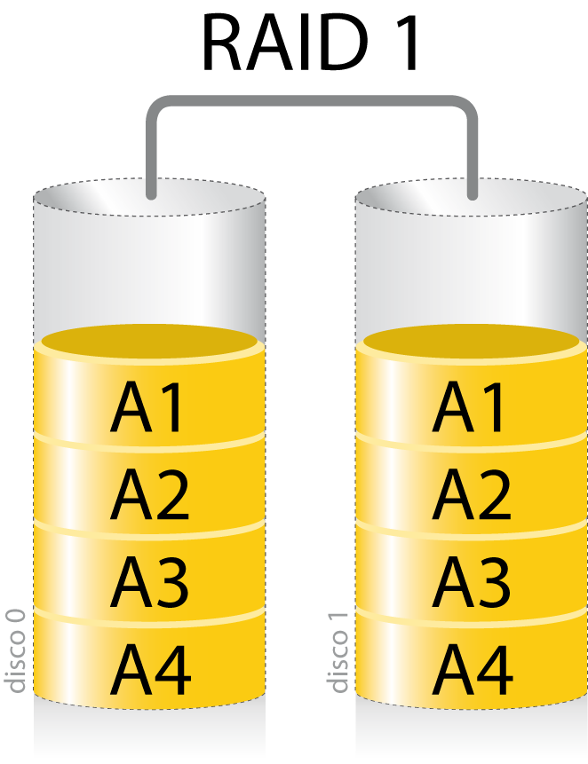
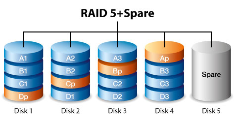

  
<!-- .slide: data-background="#2C3E50" -->
# Seguridad pasiva
## Almacenamiento

---

## Dispositivos de almacenamiento

--

### Características de dispositivos

* **Capacidad:** 
	* Cantidad de información que pueden almacenar.

* **Rendimiento:** 
	* Velocidad a la que puede ser guardada y recuperada la información. Depende de la tecnología usada. 
  
* **Disponibilidad:** 
	* Capacidad de funcionar con las menores interrupciones posibles. 
  
* **Acceso a la información:** Secuencial vs Aleatorio

--

### Tipos de almacenamiento de información I

* Dispositivos de almacenamiento físicos:
	* Discos duros (**HDD** Hard Drive Disk)
	* Unidades de Estado Sólido (**SSD** Solid State Disk)
	* **Cintas** magnéticas

* Configuraciones en **RAID**
	*	Combinaciones de discos que permiten mejorar el rendimiento, la disponibilidad o ambas

--
### Tipos de almacenamiento de información II 

* **Almacenamiento en red** (centralización almacenamiento)
	* **NAS** (Network Attached Storage)
	* **SAN** (Storage Area Network)

* Almacenamiento en la **nube** 
	* Deslocalización del almacenamiento que ofrece escalabilidad y accesibilidad remota.

---
<!-- .slide: data-background="#A8DADC" -->
## Unidades de Almacenamiento

---

## Características Principales

- **Capacidad:** Medida en bytes y sus múltiplos.
- **Velocidad:** Lectura/escritura secuencial y aleatoria.
- **Precio:** Importante en la planificación de recursos.
- **Fiabilidad:**
    - **MTBF (Mean Time Between Failures):** Tiempo medio entre fallos.
    - **AFR (Annualized Failure Rate):** Tasa anualizada de fallos.

--

### Capacidad: Múltiplos binarios

[Unidades capacidad binarias](https://es.wikipedia.org/wiki/Prefijo_binario)

| Múltiplos de [bytes](https://es.wikipedia.org/wiki/Byte "Byte")                                                                        |                                                                                                             |                                                                                           |         |
| -------------------------------------------------------------------------------------------------------------------------------------- | ----------------------------------------------------------------------------------------------------------- | ----------------------------------------------------------------------------------------- | ------- |
| [Sistema Internacional (decimal)](https://es.wikipedia.org/wiki/Sistema_Internacional_de_Unidades "Sistema Internacional de Unidades") |                                                                                                             | [ISO/IEC 80000-13 (binario)](https://es.wikipedia.org/wiki/ISO/IEC_80000 "ISO/IEC 80000") |         |
| Múltiplo (símbolo)                                                                                                                     | [SI](https://es.wikipedia.org/wiki/Prefijos_del_Sistema_Internacional "Prefijos del Sistema Internacional") | Múltiplo (símbolo)                                                                        | ISO/IEC |
| _[kilobyte](https://es.wikipedia.org/wiki/Kilobyte "Kilobyte")_ (kB)                                                                   | 10^3                                                                                                        | _[kibibyte](https://es.wikipedia.org/wiki/Kibibyte "Kibibyte")_ (KiB)                     | 2^10    |
| _[megabyte](https://es.wikipedia.org/wiki/Megabyte "Megabyte")_ (MB)                                                                   | 10^6                                                                                                        | _[mebibyte](https://es.wikipedia.org/wiki/Mebibyte "Mebibyte")_ (MiB)                     | 2^20    |
| _[gigabyte](https://es.wikipedia.org/wiki/Gigabyte "Gigabyte")_ (GB)                                                                   | 10^9                                                                                                        | _[gibibyte](https://es.wikipedia.org/wiki/Gibibyte "Gibibyte")_ (GiB)                     | 2^30    |
| _[terabyte](https://es.wikipedia.org/wiki/Terabyte "Terabyte")_ (TB)                                                                   | 10^12                                                                                                       | _[tebibyte](https://es.wikipedia.org/wiki/Tebibyte "Tebibyte")_ (TiB)                     | 2^40    |
| _[petabyte](https://es.wikipedia.org/wiki/Petabyte "Petabyte")_ (PB)                                                                   | 10^15                                                                                                       | _[pebibyte](https://es.wikipedia.org/wiki/Pebibyte "Pebibyte")_ (PiB)                     | 2^50    |
| _[exabyte](https://es.wikipedia.org/wiki/Exabyte "Exabyte")_ (EB)                                                                      | 10^18                                                                                                       | _[exbibyte](https://es.wikipedia.org/wiki/Exbibyte "Exbibyte")_ (EiB)                     | 2^60    |
| _[zettabyte](https://es.wikipedia.org/wiki/Zettabyte "Zettabyte")_ (ZB)                                                                | 10^21                                                                                                       | _[zebibyte](https://es.wikipedia.org/wiki/Zebibyte "Zebibyte")_ (ZiB)                     | 2^70    |
| _[yottabyte](https://es.wikipedia.org/wiki/Yottabyte "Yottabyte")_ (YB)                                                                | 10^24                                                                                                       | _[yobibyte](https://es.wikipedia.org/wiki/Yobibyte "Yobibyte")_ (YiB)                     | 2^80    |

--

## Cuidado con especificaciones

* Los fabricantes indican los tamaños de los discos duros usando  base 10, pero los sistemas operativos miden el tamaño de los ficheros usando base 2.
	- 1 GiB = 2^30 = 1024 x 1024 x 1024 bytes = 1,073,741,824 bytes
	- El fabricante usa 1 GB (10^9) = 1,000,000,000

Así que cuando instalamos el disco vemos la siguiente capacidad:
		**(1,000,000,000 / 1,073,741,824) = 0.9313 GiB**

--

## Fiabilidad

La fiabilidad es un aspecto crítico en el almacenamiento de información.

* **MTBF** (Mean Time Between Failures)
	- Tiempo medio que transcurre entre fallos.
	- Medida estadística basada en grandes poblaciones de dispositivos.

* **AFR** (Annualized Failure Rate)
	- Tasa anualizada de fallos.
	- Estima el porcentaje de unidades que fallarán en un año.

--

### Velocidad

a velocidad afecta directamente al rendimiento del sistema.

- **Tipo de interfaz:** SATA, SAS, NVMe, etc.
- **RPM en HDD:** Revoluciones por minuto; mayores RPM indican mayor velocidad.
- **Tecnología en SSD:** NAND Flash, SLC, MLC, TLC, QLC.

--

### Velocidades promedio HDD sobre SATA III

- **HDD a 5,400 RPM** (revoluciones por minuto):    
    - Entre **80 MB/s y 120 MB/s**.
- **HDD a 7,200 RPM**:    
    - Entre **120 MB/s y 160 MB/s**.
- **HDD a 10,000 RPM** (menos común en el mercado doméstico):
    - Entre **160 MB/s y 200 MB/s**.

- **Latencia**: Los HDD tienen una latencia mucho mayor que los SSD, ya que dependen del movimiento físico del cabezal para leer y escribir datos.

--

### Velocidades SSD SATA III

Los SSD sobre **SATA III** están limitados por la velocidad máxima de esta interfaz.

- **Velocidad de lectura secuencial**: Entre **500 MB/s y 550 MB/s**.
- **Velocidad de escritura secuencial**: Entre **450 MB/s y 520 MB/s**.
- **Latencia**: Mucho menor que la de los HDD, aunque limitada por la interfaz SATA.

--

### Velocidades SSD NVMe PCIe

 - **PCIe 3.0**
	- **Velocidad de lectura secuencial**: Hasta **3,500 MB/s**.
	- **Velocidad de escritura secuencial**: Hasta **3,000 MB/s**.
	- **Latencia**: Extremadamente baja, ideal para aplicaciones que requieren acceso rápido a los datos.
- **PCIe 4.0** = 2 x PCIe 3.0
- **PCIe 5.0** = 2 x PCIe  4.0 

_Ejemplo:_ Un SSD NVMe conectado mediante PCIe 3.0 x4 puede alcanzar velocidades que multiplican por casi 6 o 7 las de un SSD SATA III.

--
### Límite velocidad SATA

**SATA III (6 Gbps)**

- **Velocidad teórica máxima:** 6 Gbps
- **Velocidad real aproximada:** 600 MB/s
- **Nota:** Debido a limitaciones del protocolo y sobrecarga, los SSD SATA III suelen alcanzar hasta **550 MB/s** en lectura/escritura secuencial.

--

### Límite velocidad PCIe

* *PCIe 3.0 x4**
	- **Ancho de banda teórico máximo:** ~4 GB/s
	- **Velocidades típicas de SSD NVMe:** Hasta **3,500 MB/s** en lectura secuencial
* **PCIe 4.0 x4**
	- **Ancho de banda teórico máximo:** ~8 GB/s
	- **Velocidades típicas de SSD NVMe:** Hasta **7,000 MB/s** en lectura secuencial
- **PCIe 5.0 x4**
	- **Ancho de banda teórico máximo:** ~16 GB/s
	- **Velocidades potenciales de SSD NVMe:** Hasta **14,000 MB/s** en lectura secuencial

---
### Discos duros (HDD)
- Platos magnéticos que giran a altas velocidades.
- Más económicos en coste por gigabyte.
- Velocidades de acceso más lentas.
- Susceptibles a daños físicos por partes móviles.
	
#### Cómo funcionan:
[https://www.youtube.com/watch?v=AfmTaOJMoUk](https://www.youtube.com/watch?v=AfmTaOJMoUk)

--

### Discos duros: Partes

<!-- .element width="50%" -->

--

* Platos
	* Caras recubiertas de capa sensible magnéticamente.
	* Almacenan la información
* Cabezales
	* Ubicados al final del brazo, permiten leer y escribir en el disco
* Brazo
	* Su función es colocar los cabezales en la pista adecuada
* Electrónica
	* Controla componentes del HDD y la comunicación con PC
* Motor
	* Hace girar los discos a una velocidad constante
* Caja
	* Aísla los platos de radiación electromagnética (jaula de Faraday)

--

### Ejemplo: WD gold 

- [Precio e información del producto](https://www.westerndigital.com/es-es/products/internal-drives/wd-gold-sata-hdd?gclid=Cj0KCQjwpP63BhDYARIsAOQkATY2zaQzQvIkiXRZzOsUF5D-bWXWR2yRtaX1q6axnIiN5FT22nMjRxMaAn-MEALw_wcB&gad_source=1&s_kwcid=AL!15012!3!643722222663!p!!g!!wd&ef_id=YyudvwAAAODXlhnb:20241004095245:s&sku=WD4004FRYZ)
- [Detalles del producto](https://documents.westerndigital.com/content/dam/doc-library/es_mx/assets/public/western-digital/product/internal-drives/wd-gold/product-brief-wd-gold-hdd.pdf)

<!-- .element width="40%" -->

---

### Discos de estado sólido (SDD)

- Memoria flash para almacenar datos.
- Velocidades de lectura/escritura más rápidas.
- Resistentes a impactos y vibraciones.
- Coste por gigabyte más alto.
- Vida útil limitada en ciclos de escritura.

--

### Discos de estado sólido (SDD NVMe m2)

[Información del producto](https://www.samsung.com/es/memory-storage/nvme-ssd/980-pro-2tb-nvme-pcie-gen-4-mz-v8p2t0bw/)

<!-- .element width="60%" -->

--
### Discos de estado sólido (SDD SATA)

[Precio e información de producto](https://www.samsung.com/es/memory-storage/sata-ssd/ssd-870-qvo-sata-3-2-5-inch-1tb-mz-77q1t0bw/)

<!-- .element width="30%" -->

--

### Discos de estado sólido (SDD) NVMe PCIe

<!-- .element width="60%" -->

--
### Wd Gold (PCIe Gen 3.1 1x4, NVMe 1.3c)

- [Precio e información del producto](https://shop.sandisk.com/es-es/products/ssd/internal-ssd/wd-gold-nvme-ssd?sku=WDS384T1D0D-01AJB0)
- [Detalles del producto](https://documents.westerndigital.com/content/dam/doc-library/es_mx/assets/public/western-digital/product/internal-drives/wd-gold-ssd/product-brief-wd-gold-enterprise-class-nvme-ssd.pdf)

<!-- .element width="30%" -->

---

## Cintas Magnéticas

- Utilizadas para copias de seguridad y almacenamiento a largo plazo.
- Alta capacidad de almacenamiento a bajo coste.
- Tiempos de acceso más lentos.
- Lectura/escritura secuencial.

---

<!-- .slide: data-background="#E74C3C" -->

# Ejercicios

### [EJ1: Investigación de Especificaciones de Fiabilidad de Discos Duros y Unidades SSD](../exercises/especificaciones_fiabilidad.md)

---
<!-- .slide: data-background="#A8DADC" -->
## Estadísticas SMART

---

### Estadísticas SMART

* **SMART:** Self Monitoring Analysis and Reporting Technology
	* Pretende avisar antes de que se produzca un fallo
	* Mantiene una serie de registros con información del disco
	* **No es infalible**
		* Hay fallos que no se pueden detectar antes de que sucedan
	* Pero si recibes un aviso, más vale que tengas una copia de seguridad

#### Los valores de los atributos SMART 
Van del número 1 al 253, siendo 1 el peor valor. Los valores normales son entre 100 y 200. Estos valores son guardados en un espacio reservado del disco duro.

---

### Estadísticas SMART. Estudio Google

* [Failure Trends in a Large Disk Drive Population](https://static.googleusercontent.com/media/research.google.com/es//archive/disk_failures.pdf) 
	* El **36 %** de los discos que fallaron no dieron **ningún error SMART**.

	* Parámetros SMART con gran correlación con fallos:
		* Scan errors
		* Reallocation counts
		* Offline reallocation counts
		* Probational counts
	* **MTBF**: Los datos de los fabricantes son muy optimistas y no se corresponden con la realidad (**se acerca al 50%**)

--

#### **Durabilidad de Discos Duros: Factores Clave**

1. **Temperatura**:
    
    - No hay correlación significativa entre fallos y temperaturas moderadas.
    - Las temperaturas altas solo afectan a discos más antiguos.
2. **Utilización (Niveles de Actividad)**:
    
    - La relación entre alta utilización y fallos no es clara.
    - Discos jóvenes y viejos muestran más sensibilidad a la utilización.

--

3. **Parámetros SMART**:
    
    - Errores de escaneo y realocaciones aumentan la probabilidad de fallos.
    - **Limitación**: El 56% de discos fallidos no muestran alertas SMART.
4. **Fabricantes y Modelos**:
    
    - Las tasas de fallos varían significativamente según el modelo y fabricante.

---

<!-- .slide: data-background="#E74C3C" -->
# Ejercicios

### [EJ2: Comprensión de la Fiabilidad de los Discos Duros según el Estudio de Google](../exercises/SMART.md)

### [EJ2: Comprobación del estado SMART de las unidades de disco](../exercises/fiabilidadDiscosGoogle.solucion.md)

---

### Recuperación de datos HDD

* Empresas especializadas
* Reemplazan partes defectuosas de discos
* Tienen “salas blancas” en las que es seguro abrir los discos
* No te garantizan el poder recuperar todo
* Suele ser muy caro (1 disco entre 500 y 1000 €)
* **Es rentable ser precavido y tener copias de seguridad**

--

### **EJ: Empresa OnRetrieval**

- [OnRetrieval](https://onretrieval.com/) es una empresa española que se especializa en la recuperación de datos y en la informática forense. Ofrecen soluciones para discos duros, sistemas RAID, memorias USB, y más.
- **Características**: Servicios tanto a nivel físico como lógico, con soporte especializado en RAID y virtualización. Ofrecen un diagnóstico gratuito.

--

## Otras empresas de recuperación de datos

- [Kroll Ontrack](https://www.ontrack.com/es-es/)
- [Seagate Recovery Services](https://www.seagate.com/es/es/legal/privacy/srs/)
- [Digital Recovery](https://digitalrecovery.com/es/)

---

<!-- .slide: data-background="#A8DADC" -->
## Arrays de discos (RAID)

---
### RAID

* **RAID**: **R**edundant **A**rray of **I**ndependent **D**isks 
	* Antes **I**nexpensive
* **RAID**: Conjunto Redundante de discos independientes
* Combina varias unidades de disco en un sólo volumen.
	* Existen diferentes tipos
	* Permiten mejorar: Capacidad, Rendimiento, Fiabilidad
* Existen diferentes implementaciones:
	* **hardware** (mayor rendimiento)
	* software (menor coste)
* **Sustitución de discos en caliente:** depende del equipo HW.
* Disco **hot spare:** unidad reservada para reparar volumen en caso de fallo

--

### **RAID:** Características

* Mayor **capacidad**: 
	* Combinación de varios discos para conseguir una unidad de almacenamiento de una capacidad mayor.
* Mayor **tolerancia a fallos**: 
	* Posibilidad, **en algunos casos**, de recuperar la información tras el fallo de una unidad.
	* Se pueden seguir usando mientras se recupera (en estado **degradado**)
* Mayor **seguridad**: 
	* Al ser tolerante a fallos y poder reparar sin detener el funcionamento, aumentaremos la **disponibilidad**.
* Mayor **velocidad**: 
	* Mayor ancho de banda en lectura y escritura de datos
		* Uso de varios discos en paralelo

--

## Calculadora RAID 

- [Calculadora Capacidad de Synology](https://www.synology.com/es-es/support/RAID_calculator)

- [Calculadora Riesgo de Memset](https://www.memset.com/support/resources/raid-calculator/)

---

### RAID 0 (Striping)

* RAID 0 es el modo **RAID más rápido** (no hace cálculos)
* Distribuye los datos equilibradamente entre las unidades de disco (**Stripping**). 
* **No hay redundancia de información.**
* **Mejora** el rendimiento de **lectura y escritura**

<!-- .element width="20%" -->

--

### RAID 0

* Combina **dos o más discos** en un solo volumen
* **No proporciona redundancia**
	* Si un disco falla, perdemos todo
* **Striping**: permite aumentar la velocidad de escritura y lectura.
* Como no calcula redundancias: **no tiene penalización de rendimiento**
* **Los discos deben ser iguales**, si no lo son, se usará el tamaño del más pequeño como límite
	* EJ: RAID 0 de dos discos 1Gb y 3Gb, tendrá tamaño de 2Gb
* **Uso recomendado:** Aplicaciones donde el rendimiento es crítico y la pérdida de datos es aceptable, como en **estaciones de trabajo para edición de vídeo o renderizado**

---

### RAID 1

* Consiste en una **copia exacta** de un disco físico a otro 
* También se conoce como **espejo** o mirroring
* **Tolerancia a fallos** (a un alto coste de espacio)
* **Mejora** el rendimiento de **lectura**, pero no escritura.
* Se forma con 2  o más discos

<!-- .element width="20%" -->

--

### RAID 1
* Copia en **espejo**
	* Replica el contenido en dos o más discos
	* Solo se pierden datos si fallan todos los discos
* **El tamaño del RAID será el del disco más pequeño**
* Mejora el rendimiento en lectura
* **No mejora rendimiento de escritura**
* Problema: coste
	* 50% de espacio dedicado a redundancia (con 2 discos)
	* Peor si se usan más discos
- **Uso recomendado:** Sistemas críticos que requieren alta disponibilidad y fiabilidad, como **servidores de bases de datos** y aplicaciones financieras.
---

### RAID 5
* Distribuye los datos en bloques  y usa **paridad distribuida**
* Consigue rendimiento parecido a RAID0
* Hay tolerancia a fallos y solo pierde el tamaño de un disco 
* **Tolerancia a fallos sin pérdida dramática de espacio **(33% con 3 discos, 25% con 4)
* Mal rendimiento con escrituras pequeñas

<!-- .element width="30%" -->

--

### RAID 5

* Se necesitan como **mínimo 3 discos**
* **Distribuye los datos** en bloques entre varios discos (**Stripe**)
* Calcula datos de **paridad** que se distribuyen entre los discos.
* Mejora velocidad de lectura y escritura
* Se puede recuperar del fallo de un único disco
* **Se dedica el tamaño de un disco a paridad**
* **La reconstrucción requiere leer todos los discos**
	* **Alta probabilidad de perder un segundo disco durante la reconstrucción**
* **Uso recomendado:** Servidores de archivos y aplicaciones donde se requiere un balance entre seguridad de datos y capacidad de almacenamiento.
---

### RAID 5. Ej Paridad XOR

**Tabla de verdad XOR**

XOR (0, 1) = 1

XOR (1, 0) = 1

XOR (0, 0) = 0

XOR (1, 1) = 0

--

 Tenemos 3 discos:

 | 101 | 010 | 011 |

Calculamos y añadimos paridad en un cuarto disco

	* XOR (101, 010, 011) = 100    

 | 101 | 010 | 011 | **100** |

--

Si ahora perdemos un disco

 | 101 | _*----*_ | 011 | 100 |

 Para reconstruir los datos, XOR de los datos restantes:

XOR (101, 011, 100) = 010

--
### Ejercicio paridad XOR

---

### RAID 6

* RAID 6 admite hasta **dos fallos de disco sin pérdida de datos**.
* Se usan dos bloques de paridad.
* Reduce el riesgo de pérdida del array durante reconstrucción.
* Peor rendimiento en escritura que RAID 5

<!-- .element width="40%" -->

--

### RAID 6
* Similar a RAID5, pero usa **dos elementos de paridad** en lugar de uno
* Mínimo **4 discos**
* Permite el **fallo de 2 discos sin perder datos**
* **Se dedica el tamaño de dos discos a paridad**
* Igual de eficiente en lectura que RAID 5
* **Escritura más costosa que RAID5**
	*  Los cálculos de redundancia son mayores
- **Uso recomendado:** Entornos donde la disponibilidad y la integridad de los datos son extremadamente críticas, como en grandes sistemas de almacenamiento y servidores empresariales.

---

### HOT SPARE(s)

* Disco(s) que forma parte del array pero no se utiliza (**reservado**)
* Reservado **hasta que falla alguno de los otros discos**
* Permite iniciar la **reconstrucción de forma inmediata**
* Minimiza el tiempo que está expuesto el conjunto RAID
* El tiempo de reconstrucción del RAID puede ser grande (**días**)

[https://www.memset.com/support/resources/raid-calculator/](https://www.memset.com/support/resources/raid-calculator/) 

<!-- .element width="30%" -->

---

## RAID anidados

* RAID cuyos elementos son a su vez RAID
* Necesitan **gran cantidad de discos**
* Permiten aumentar disponibilidad y rendimiento
* Permiten reducir tiempos en **estado degradado** 
	* Mientras se reconstruye un disco que ha fallado
	* Comparando los mismos discos en un solo array.
* El rendimiento es mejor durante el **estado degradado**
	* La mitad de los discos funciona normalmente 

---

### RAID anidado: RAID 10

* RAID 1 + RAID 0: Primero **espejo** y luego **stripping**.
* Permite el fallo de un disco de cada uno de los RAID 1
* Adecuado en aplicaciones que requieren **gran rendimiento de lectura y escritura** de archivos pequeños. (Ej: Bases de datos y entornos de virtualización)

> Existe el RAID 01 **¿es mejor o peor que el RAID 10?**

--

<!-- .element width="50%" -->

---

### RAID anidado: RAID 50

* Mejora el rendimiento de escritura de RAID 5.
	* Stripping sobre RAID 5 
* **Disminuye el tiempo de reconstrucción** respecto a un RAID 5 con todos los discos a la vez.
	* La reconstrucción sólo requiere leer la mitad de los discos
	* Mejora rendimiento del array durante reconstrucción
* **Fallo de dos discos en una rama destruye array** 
* **Uso recomendado:** Ideal para aplicaciones que necesitan alto rendimiento y redundancia, como grandes servidores de almacenamiento, entornos de backup o sistemas con altas cargas de lectura/escritura que requieren rápida recuperación tras fallos.

--

<!-- .element width="60%" -->

---

<!-- .slide: data-background="#A8DADC" -->
## NAS y SAN

### Almacenamiento en red

---

### Almacenamiento en red

* **NAS** (Network atached Storage)
	* Almacenamiento conectado en red. Ficheros compartidos.
	* Trabajan **a nivel de fichero**
	* Protocolos de uso en LAN (de nivel de aplicación)
		* **NFS**, Network File System (Linux)
		* **SMB** (CIFS), Server Message Block (Windows). SAMBA, implementación en Linux (se realizó por ingeniería inversa)
* **SAN** (Storage Area network)
	* Red de almacenamiento. Disco duro conectado en red.
	* Trabaja a **nivel de bloque** (Fiber Channel, iSCSI)
		* Redes dedicadas de alta velocidad (Fibra 10Gbps, 40Gbps)
	* Muy alto rendimiento, se emplean para: BBDD, VDI (Virtual Desktop Infraestructure)
	* Gran capacidad de ampliación (mucho más que un NAS)

--

### SAN vs NAS

<!-- .element: class="r-stretch" -->

---

## NAS

* Servidores de ficheros
* Protocolos: NFS, CIFS (SMB)

<!-- .element width="70%" -->

--
### NAS Synolgoy

<!-- .element width="60%" -->

--

### NAS

<!-- .element width="70%" -->

---

## SAN

- Fibre Channel speed range 16-32Gb/s
- FCoE and iSCI protocols upto 10-40Gb/s+

<!-- .element width="60%" -->

--

# [SAN HITACHI](https://www.hitachivantara.com/es-latam/insights/faq/what-is-storage-area-network.html)

<!-- .element width="30%" -->

--
# [SAN DELL](https://www.dell.com/en-us/dt/learn/data-storage/san-storage.htm)

<!-- .element width="40%" -->

--

---

### Convergencia SAN y NAS

> Hoy en día es posible dar servicio con NAS que antes era solo posible con SAN.

* Aumento de la velocidad de ethernet 
	* Algunos SAN pasan de usar canal de fibra (FC) a usar enfoque basado en IP.
	* Ahorra costes pero es más lento.
* Los NAS empiezan a ofrecer servicios SAN (iSCSI LUN)
	*  Interfaces de red 10Gbps 

---

<!-- .slide: data-background="#A8DADC" -->
## Almacenamiento en la nube (Cloud)

---

### Almacenamiento en la nube

Ventajas:

* Flexibilidad: 
	* No tenemos que preocuparnos de comprar, mantener o ampliar infraestructura.
* No necesitamos personal encargado de la gestión del almacenamiento

Inconvenientes:

* Datos alojados fuera de nuestras instalaciones
* Posibles vulnerabilidades 

-- 
### Ej: Amazon AWS Storage

**Amazon S3**: Simple Storage System

* [https://aws.amazon.com/es/s3/](https://aws.amazon.com/es/s3/)
* Precios moderados
* Acceso inmediato
* Basado en almacenamiento de objetos:
	* No usa directorios, todos los archivos en un sistema plano
	* Los archivos tienen asociados metadatos

--

**Amazon S3 Glacier **(Datos accedidos con poca frecuencia)

* Muy barato
* Acceso a datos puede llevar tiempo

[https://aws.amazon.com/es/s3/glacier/pricing/](https://aws.amazon.com/es/s3/glacier/pricing/)

---

<!-- .slide: data-background="#A8DADC" -->
## P2P

--

### Almacenamiento P2P

<!-- .element width="70%" -->

--
### Almacenamiento P2P: Peer to Peer

* Intercambio entre iguales: todos son servidores y clientes al mismo tiempo.
* Alternativa a la nube
* Información replicada en todos los hosts

* **Ventajas**:
	* Permite **distribuir contenido de forma rápida y barata**
	* Información no se almacena en máquina ajenas
* **Inconvenientes**:
	* Disponibilidad depende de clientes
	* Ancho de banda depende de clientes

--

### Ejemplos almacenamiento P2P

- [https://www.resilio.com/](https://www.resilio.com/) (antes Bittorrent Sync)
- [https://syncthing.net/](https://syncthing.net/) (alternativa de código abierto)