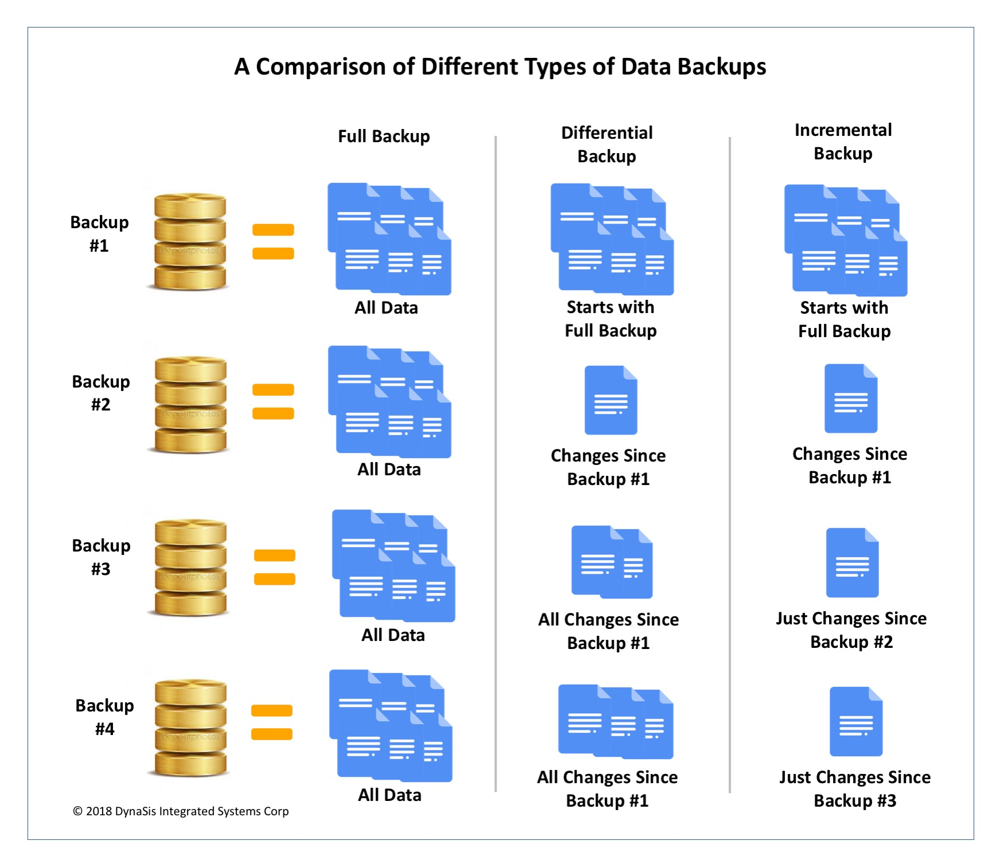

<!-- .slide: data-background="#2C3E50" -->
# Sistemas de copias de seguridad

---

# Introducción

--

## Tipos de personas

Hay dos tipos de personas:

* Los que hacen copias de seguridad

* Los que se lamentan de no haberlas hecho

--
## Etapas del proceso de pérdida I

<!-- .element width="100%" -->

--

## Etapas del proceso de pérdida II

<!-- .element width="100%" -->

---
## ¿Por qué necesitamos copias de seguridad?

* Tengo mis discos en raid: Tolerantes a fallos
	- [Calculadora Riesgo de Memset](https://www.memset.com/support/resources/raid-calculator/)

--

<!-- .element width="100%" -->

---
## ¿Por qué necesitamos copias de seguridad?

- [https://www.raidisnotabackup.com/](https://www.raidisnotabackup.com/)

* [https://www.smallnetbuilder.com/nas/nas-features/data-recovery-tales-raid-is-not-backup/ ](https://www.smallnetbuilder.com/nas/nas-features/data-recovery-tales-raid-is-not-backup/)

--
## ¿Por qué necesitamos copias de seguridad?

Aún usando configuraciones RAID, Los datos pueden perderse por varios motivos:

* **Catástrofe**: 
	* Incendio, inundación, explosión... 
* **Fallo humano**:
	* Borrado accidental (Usuario root ejecuta `rm -rf *`)
	* Sobrescritura
	* Corrupción por software defectuoso (bases de datos)
* **Ataque**:
	* Malware: Virus, Ransomware...
	* Robo
	* Bandalismo

---
##  Debemos tener en cuenta

* **Tiempo** razonable de recuperación del sistema ante un desastre. Por ejemplo un incidente de ransomware. 
* Copias on-line y off-line (dispositivos externo o cloud).
* Protección del propio servicio. **Los atacantes destruyen el sistema de backup**. Segmentación del sistema de copias.
* Copias de datos y configuraciones
* Manual de restablecimiento de copias
* Probar la integridad de las copias de seguridad. Haciendo **simulaciones de recuperación**. 
* Establecimiento de procedimiento de copias: prioridades, infraestructura, tiempos de retención,... 
* Tener una estrategia de copias de seguridad. Por ejemplo la [regla 3.2.1](https://www.ninjaone.com/es/blog/3-2-1-respaldo-de-seguridad-explicado/#:~:text=La%20norma%20establece%20que%20debes,sitio%20o%20en%20la%20nube.).

---

## ¿Cómo hacer copias de seguridad?

* ¿Cuándo?
	* **Periódicamente** y de forma sistemática
		* La **automatización** es la mejor opción
* ¿Qué copiar?
	* Todo dato difícil o **imposible de reemplazar** 
* ¿Dónde copiar?
	* Guardar copias en **ubicaciones geográficas distantes**
* ¿Cómo copiar?
	* Cifrado de datos: casi imprescindible
	* **Etiquetado** de soportes necesario para su organización 

---

## Tipos de Copias de seguridad

* **Backup de datos**. 
	* Copia de seguridad de los datos del usuario o empresa que están almacenados en un ordenador o servidor
	* Debe hacerse diariamente como mínimo

* **Backup del sistema**. 
	* Copia de seguridad de los programas y **configuraciones** (sistema operativo y aplicaciones) que están instalados en un ordenador
	* Suele hacerse una vez, o después de cada cambio importante

---

# Backup de datos

--

## Tipos de datos 

Primero, debemos identificar los datos a copiar. Hay que distinguir entre:

* **Ficheros**. 
	* Pueden ser unidades enteras, o carpetas específicas
	* Complicación: ficheros se modifican mientras se copian
	
* **Sistemas complejos**: Bases de datos
	* La **concurrencia** elevada. Posibilidad de guardar estados **inconsistentes**
	* Los servidores de base de datos tienen sus propios mecanismos de exportación del contenido de las tablas

> Para cada tipo de información hay que **acordar la frecuencia de respaldo**. Dependerá su frecuencia de cambios

<!--
> Ej: Supermercado: lista empleados vs stock de tienda
-->

--

## Tipos de copias

* **Completa**
	* Incluye toda la información identificada
		
	* **Diferencial**
	* Incluye toda la información que ha cambiado desde la última vez que se hizo una copia de seguridad completa
* **Incremental**
	* Incluye toda la información que ha cambiado desde la última copia de seguridad, sea completa o incremental

--

## Tipos de copias

<!-- .element width="80%" -->

--

## ¿Qué tipo de copia utilizar?

* Copia completa con muchos datos
	* Dificultad para asegurar **consistencia** de datos
		* Los archivos se siguen usando mientras se hace la copia 
	* Puede ralentizar los sistemas 
		* Lectura de discos mientras se usan en producción 

* Copia diferencial o incremental
	*  Son más rápidas sólo copian archivos con cambios
	*  Recuperamos la información aplicando la última copia completa y la última diferencial (o la última completa y todas las incrementales).
	
> Se suelen utilizar **combinaciones** de copias completas periódicas combinadas con copias diferenciales o incrementales

--

## Ej: Esquema de 10 copias

En una empresa mediana es habitual el esquema de diez copias:

* Una para un backup completo (los viernes).

* Cuatro para un backup parcial diario 
	* diferencial o incremental de lunes a jueves.

* Cinco para backups completos anteriores:
	* quincenal, mensual, trimestral, semestral y anual.

---

## Destinos de copias

* Discos 
	* En la misma máquina
	* Extraíbles
	* En red (Pueden estar en sedes distintas)
* Almacenamiento en la **nube**
* Soportes **extraíbles**: Cintas, DVC/BR
	* Requieren etiquetado adecuado 

--

Recomendaciones:

* Ubicación de copia alejada de originales
	* No guardar todas las copias en el mismo edificio
* Cifrado
	* Especialmente en soportes extraíbles y en la nube
		* Posibilidad de robo o pérdida 

--

## Robot de cintas

<!-- .element width="80%" -->

---

# Backup del sistema

---

## Imagen del sistema

La imagen de un sistema es un volcado del contenido del disco duro.

Permite restaurar el contenido de un disco de forma sencilla y rápida.

* La imagen del sistema no es tan importante como los datos
	* Podríamos instalar desde cero SO y aplicaciones
	* Configuración que tenemos documentadas
	* Pero este proceso lento 

La imagen no es un método adecuado de hacer copias de seguridad de datos

* Proceso lento 
* sistema no está operativo

---

## Puntos de restauración

Los sistemas Windows incluyen una funcionalidad llamada **puntos de restauración** 

> Recogen el estado de los ejecutables y la configuración del sistema operativo (**no se incluyen los documentos de los usuarios**). 

* Importante antes de cambios importantes en el sistema
	* Instalación o sustitución de drivers 
	* Aplicación de parches. 
	* Las actualizaciones automáticas de Windows siempre crean primero un punto de restauración.
	
* Si el cambio aplicado ha sido un desastre:

	*  Podemos volver a la situación anterior

---

# Software

## Integrado en sistema operativo

* Windows
	* "Copia de seguridad y restauración" 
* Mac
	* Time Machine 
*  GNU/Linux incluye herramientas como **rsync** o tar
	*  Pudiendo automatizar copias mediante scripts (ficheros con secuencias de comandos) en el programador de tareas cron o at. 

---

## Software libre para copias de seguridad

* **Bacula**, excelente herramienta para uso profesional y doméstico.
 
* **Deja-dup**, muy sencilla de usar y para entornos GNU/Linux, está en los repositorios de la mayoría de distribuciones. Por contra, no permite tantas opciones como Bacula.

* **Duplicati**
	* Copias incrementales y cifradas en la nube (Amazon S3, Drive, Windows SkyDrive, etc) y por FTP, SSH, WebDAV, etc.

* **Amanda**
	* Para entornos GNU/Linux, 
	* Modelo cliente-servidor y 
	* Existen clientes para Windows y Mac.

---
## Software para crear imágenes del sistema

Existen varias herramientas e para crear y recuperar imágenes:

* Norton Ghost (Propietario)
* Acronis True Image (Propietario)
* **Clonezilla/DRBL** (Open source)

