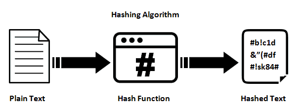

# **Ejercicio: Funciones Hash**


{:style="width: 50%;" class="center"}


## 1. Descarga y verificación de ISO utilizando huella hash

### **Objetivos**

- Verificar la integridad del archivo mediante la comparación de la huella hash (checksum) usando herramientas disponibles en Windows y Linux.

### **Parte 1: Descargar la ISO de AlmaLinux**

1. Accede al siguiente enlace desde tu navegador:  
    [AlmaLinux ISO](https://almalinux.org/get-almalinux/)
    
2. Descarga la ISO que mejor se ajuste a tus necesidades, por ejemplo, la versión más reciente de AlmaLinux.
    
3. Durante la descarga, también debes descargar el archivo de checksum asociado. En el mismo sitio web, busca la opción para obtener los checksums ("Download CHECKSUM").     

---

### **Parte 2: Verificación de la huella hash en Windows**

1. **Acceder a la terminal de comandos (PowerShell)**    
    - Haz clic derecho sobre el botón de inicio de Windows y selecciona "Windows PowerShell" o abre la búsqueda y escribe "PowerShell".
2. **Navegar a la carpeta donde se descargó la ISO**
    
    - Utiliza el siguiente comando para moverte a la carpeta de descargas:   
	    ```shell
        cd C:\Usuarios\TuUsuario\Descargas
        ```
3. **Comprobar el hash de la ISO usando SHA256**
    
    - Para obtener el hash de la ISO, usa el siguiente comando:
                        
     ```shell        
        Get-FileHash .\nombre-del-archivo.iso -Algorithm SHA256
        ```
        
        Nota: Reemplaza `nombre-del-archivo.iso` con el nombre real del archivo descargado.
4. **Comparar el hash**
    
    - Compara el valor que has obtenido con el que figura en el archivo `SHA256SUMS` descargado. Si coinciden, la imagen es íntegra y no ha sido alterada.

---

### **Parte 3: Verificación de la huella hash en Linux**

1. **Abrir la terminal**
    
    - En tu distribución Linux, abre una terminal (puedes buscarla como "Terminal" en el menú de aplicaciones).
2. **Navegar a la carpeta donde se descargó la ISO**
    
    - Usa el siguiente comando para moverte a la carpeta de descargas (por defecto suele ser `Descargas`):
        
	 ```bash       
    cd ~/Descargas
    ```
        
3. **Comprobar el hash de la ISO usando SHA256**
    
    - Ejecuta el siguiente comando para calcular la huella hash:
        
    ```bash        
        sha256sum nombre-del-archivo.iso
    ```
        
	Nota: Reemplaza `nombre-del-archivo.iso` con el nombre real del archivo descargado.
4. **Comparar el hash**    
    - Al igual que en Windows, compara el valor que has obtenido con el que figura en el archivo `SHA256SUMS`. Si ambos coinciden, la imagen descargada es correcta y no ha sido modificada.

### Parte4: Repite el proceso con otros archivos

Repite el proceso, pero ahora descarga una imagen ISO de Debian, presta atención al tipo de hash proporcionado.

Descarga la ISO desde [el sitio web oficial](https://www.debian.org/download) y comprueba su integridad.

## 2. **Comparación de Hash de Documentos usando Utilidades del Sistema Operativo**

**Objetivo:**


El propósito de este ejercicio es que los estudiantes utilicen las herramientas integradas en los sistemas operativos (Linux y Windows) para calcular y comparar el hash de documentos. Este ejercicio te permitirá observar cómo las funciones hash son extremadamente sensibles a los cambios en los datos de entrada, una característica esencial para garantizar la integridad de los archivos en sistemas de seguridad.

#### **Situación:**

Estás trabajando en un entorno donde se debe garantizar la integridad de archivos importantes. Para ello, utilizarás las utilidades incluidas en tu sistema operativo para calcular el hash de un documento. Luego, harás una pequeña modificación en el archivo y volverás a calcular su hash para ver cómo cambia.

### **Parte 1: Cálculo del Hash de un Documento en Linux y Windows**

1. **Paso 1:** Crea un archivo de texto llamado `documento_original.txt` con uno o varios párrafos de cualquier contenido. Puedes usar un editor de texto simple (por ejemplo, **gedit**, **nano**, **notepad**, etc.).

2. **Paso 2:** Calcula el hash del archivo utilizando las herramientas incluidas en tu sistema operativo:

   - **En Linux:**
     - Abre una terminal y utiliza el comando `sha256sum` para calcular el hash del archivo:
       ```bash
       sha256sum documento_original.txt
       ```

   - **En Windows:**
     - Abre una ventana de **PowerShell** y utiliza el siguiente comando para calcular el hash con SHA-256:
       ```powershell
       Get-FileHash .\documento_original.txt -Algorithm SHA256
       ```

3. **Paso 3:** Guarda el valor hash generado para el archivo `documento_original.txt`.

---

### **Parte 2: Modificación del Documento y Re-cálculo del Hash**

1. **Paso 1:** Abre el archivo `documento_original.txt` y cambia un solo carácter (puedes cambiar una letra o agregar un espacio adicional). Guarda el archivo modificado con el nombre `documento_modificado.txt`.

2. **Paso 2:** Calcula el hash del archivo modificado siguiendo los mismos pasos:

   - **En Linux:**
     ```bash
     sha256sum documento_modificado.txt
     ```

   - **En Windows:**
     ```powershell
     Get-FileHash .\documento_modificado.txt -Algorithm SHA256
     ```

3. **Paso 3:** Compara los valores hash de `documento_original.txt` y `documento_modificado.txt`. Observa si hay diferencias.

---
### **Preguntas de Reflexión:**

1. ¿Cómo cambió el valor del hash después de modificar un solo carácter en el archivo?
2. ¿Por qué crees que un pequeño cambio en el archivo genera un valor hash completamente diferente?
3. ¿Cómo crees que las funciones hash son útiles para detectar modificaciones no autorizadas en los archivos?


<!-- 
---

### **Entrega:**

- Captura de pantalla los comandos usados en tu sistema operativo para calcular los hashes.
- Los valores hash generados para ambos archivos (`documento_original.txt` y `documento_modificado.txt`).

Respuesta escrita a las preguntas de reflexión.

---

### **Criterios de Evaluación:**

- Correcta ejecución de los comandos para calcular los hashes en Linux o Windows.
- Comparación clara de los valores hash antes y después de la modificación.
- Reflexión bien argumentada sobre el comportamiento de las funciones hash y su importancia en la seguridad de datos.

---

**Nota:** Este ejercicio te permitirá observar cómo las funciones hash son extremadamente sensibles a los cambios en los datos de entrada, una característica esencial para garantizar la integridad de los archivos en sistemas de seguridad.

-->