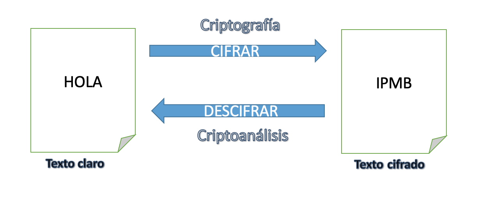
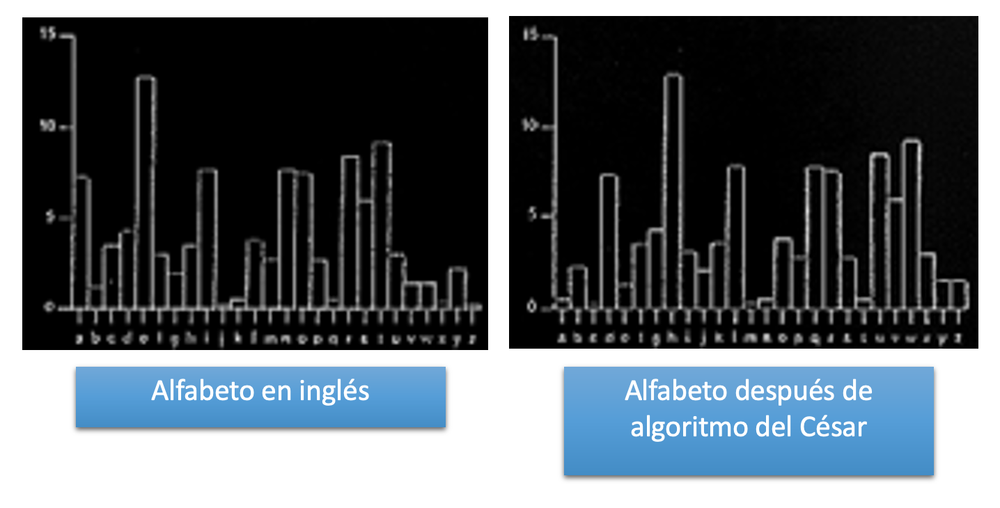
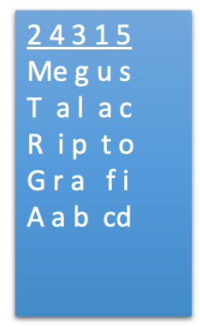
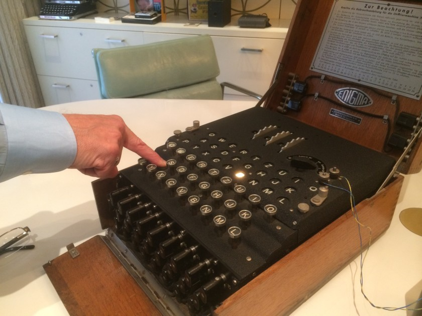
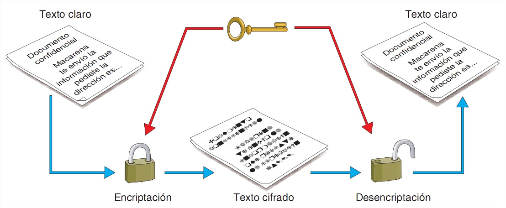
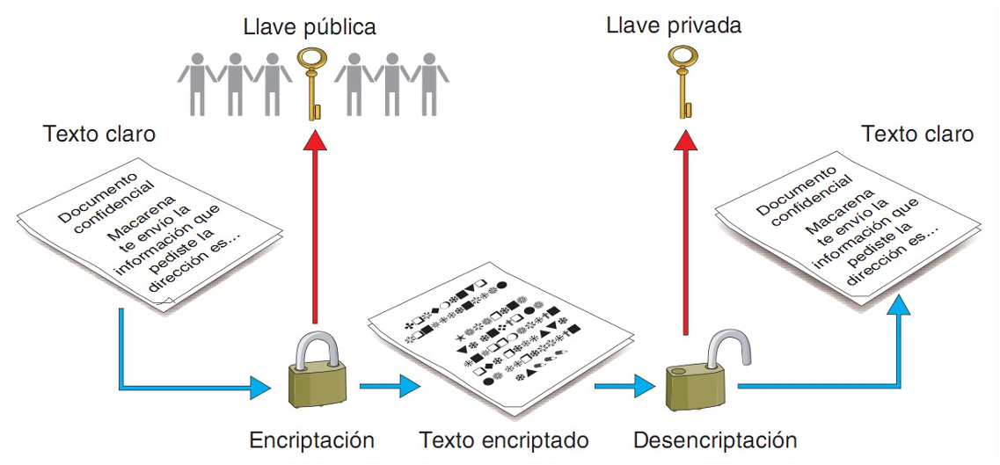
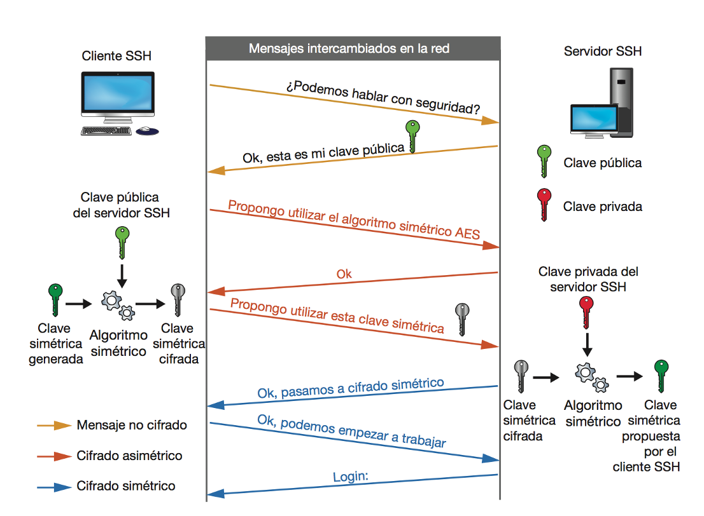

<!-- .slide: data-background="#2C3E50" -->
# Introducción a la Criptografía

---

# Criptografía

La palabra **criptografía** proviene del griego y está compuesta por dos términos:

- **"Kryptós" (κρυπτός)**, que significa "oculto" o "secreto".
- **"Graphía" (γραφή)**, que significa "escritura".

--

## Objetivos de la Criptografía

1. **Confidencialidad**
	- Garantiza que solo personas autorizadas accedan a la información.
2. **Integridad**
	- Verifica que la información no ha sido alterada.
3. **Autenticación**
	- Confirma la identidad del emisor de la información.
4. **No repudio**
	- Evita que el emisor niegue haber enviado un mensaje.

--

## Nomenclatura

--

## Nomenclatura

* **Criptografía**: ciencia que busca generación de algoritmos de cifrado
 
* **Criptoanálisis**: ciencia que busca técnicas para descifrar mensajes cifrados

* **Cifrar** consiste en emplear un proceso para convertir la información en claro (se conoce como **texto en claro**) en ilegible (texto **cifrado**).
	 
* **Descifrar** es el proceso inverso y permite convertir el texto ilegible en plano.
 
> Encriptar y desencriptar son anglicismos. NO SON CORRECTOS en castellano.

---

## Criptografía Clásica

--

### Criptografía clásica (Antes de ordenadores)

* **Sistemas de transposición:** alteran el orden de letras, sílabas o conjuntos de letras. 
	* Sistemas de transposición simple: el texto en claro sólo es sometido a una transposición
	* Sistemas de transposición múltiple: se realiza más de una transposición sobre el texto de forma sucesivas

* **Sistemas de sustitución:** se reemplazan algunas letras del alfabeto por otras o por un conjunto de ellas según el método
	* Según el tipo de sustitución se clasifican en: literal (letras por letras), numérica (letras por números), esteganográfica (se sustituyen por signos o se oculta el mensaje tras una imagen, sonido, etc).
	* Según  el número de caracteres a sustituir: monoalfabética, polialfabética, etc.

--

### Primer método de cifrado: Escítala Espartana

* Siglo V A.C., usada por los espartanos para ocultar sus comunicaciones
* El método consiste en enrollar una cinta sobre un bastón 
	* Escribir el mensaje en forma longitudinal
	* Al desenrollar la cinta queda una sucesión de letras ininteligibles
	* Clave: diámetro de bastón

--

### Cifrado del César (siglo I a.C.). 

* Sistemas de sustitución
* Desplazamiento de 3 letras
			A -> D, 
			B -> E, 
			C -> F, 
			...
* Siendo A=0, B=1, ... y con un alfabeto de 26 letras (sin la ñ)  de manera que  C = (M + 3) mod 26
* Descifrar = restar 3

**Ejemplo** ([Web para cifrado César](https://es.planetcalc.com/1434/?license=1)) 
Mensaje plano   = megustalacriptografia  
Mensaje cifrado = phjxvwdodfulswrjudild  

--

### Criptoanálisis: César

--

### Sistemas de transposición

**Transposición por columnas:** El texto se descompone en n columnas y éstas se reordenan según la clave

**Ejemplo:** clave = 24315

* k={2,4,3,1,5}
* m=megustalacriptografia
* c=uatfcmtrgaglpabeairascoid

> **Criptoanálisis**: reordenar bloques de letras y letras saltando cada n hasta encontrar el n que da palabras que estén en un diccionario.

---

## Máquinas de cifrado
### Enigma

--

--

## Máquinas de cifrado: Enigma

**Máquina Enigma**

* Dispositivos electromecánicos 
* Pueden cifrar y descifrar
* Usado por Alemanes en Segunda Guerra mundial

**Alan Touring**

* Trabajó rompiendo el cifrado de enigma
* Ayudó a acortar la guerra
* Película: Descifrando enigma

---

## El principio de Kerckhoff

Los **algoritmos** son los métodos que se utilizan para transformar el texto claro en el texto cifrado.  
 
### **El principio de Kerckhoff:**   
- La seguridad depende de la clave secreta, no del algoritmo. 
- Los sistemas criptográficos modernos son de código abierto para ser auditados.

--

### 6 Principios de Kerckhoffs: 
1. Seguridad práctica. 
2. El sistema no debe depender de ser secreto. 
3. Clave fácil de memorizar y cambiar. 
4. Sistema portable y operable por una sola persona. 
5. Fácil de usar. 
6. Aplicable a cualquier tipo de comunicación.

---

---

## Criptografía Simétrica

> Criptografía simétrica o de **clave privada**

Este método se basa en un **secreto compartido** entre origen y destino, es decir, utiliza la misma clave en el proceso de cifrado que en el de descifrado.

--

### Criptografía Simétrica

* **Ventajas**:
	* Computacionalmente eficiente (Claves relativamente cortas)

* **Desventajas**:
	* Difusión de la clave de forma segura
	* Gestión de claves, hace falta una diferente para cada persona con la que me comunico
		* EJ: Para que 10 personas se pudiera comunicar entre ellas de forma segura harían falta: 10personas*9claves = 90 claves

 --
 
### Criptografía Simétrica

* Para aumentar la seguridad:
	* Claves de mayor longitud
	* Cambiar periódicamente la clave
	* No utilizar palabras de diccionario en la clave
	* Usar algoritmos cuyas vulnerabilidades no hayan sido descubiertas

---

## Criptografía Asimétrica

--

### Criptografía Asimétrica

> Criptografía asimétrica o de **clave pública**

--
### Criptografía Asimétrica

* Clave pública: la puede tener cualquiera y se usa para cifrar mensajes dirigidos al dueño de la clave
* Clave privada: solamente la debe tener su dueño, se usa para descifrar mensajes recibidos

Estas claves se generan a la vez y se encuentran relacionadas matemáticamente entre sí mediante funciones de un solo sentido para que **resulte imposible descubrir la clave privada a partir de la pública**

--
### Criptografía Asimétrica: Funcionalidad

* Cifrado
* Firma
* No repudio
* Garantizar la integridad de un documento
	* Hash + Firma 

---

## Criptografía Híbrida

## Criptografía Híbrida

* Intenta combinar las ventajas de los dos tipos de criptografía
	* Seguridad de la asimétrica y eficiencia de la simétrica
* Para evitar el coste de procesado de la criptografía de clave pública:
	* Se utiliza criptografía de clave pública para enviar una clave privada simétrica.
	* A partir de ahí, las comunicaciones se cifran usando criptografía simétrica.

--

### Criptografía Híbrida

---

## **Funciones Hash**

- Convierte un bloque de datos en una secuencia de longitud fija.
- Estos valores, se conocen como "resúmenes" o "hashes"
  
* **Propiedades**:
	1. Unidireccionalidad.
		- No es posible calcular la entrada original a partir del valor hash.
	2. Sensibilidad a pequeñas modificaciones.
	3. Determinismo.
		- Para una misma entrada, siempre la misma salida.
	4. Eficiencia.
		- Rápido de calcular para cualquier tamaño de entrada

---

## Ejemplos de funciones HASH

- **SHA-256**: Usado en blockchain.
- **MD5**: Considerado inseguro hoy en día.

--

## Aplicaciones de las funciones hash I

1. **Verificación de integridad**
	**Ejemplo:** Verificaicón de archivo descarado de Intentet.
2. **Almacenamiento seguro de contraseñas**
	Se almacena hash en lugar de contraseña. En caso de acceso no autorizado, dificulta recuperar la contraseña original.
3. **Firmas digitales y criptografía**
	 Al crear una firma digital, se aplica una función hash al mensaje y luego se firma el valor resultante con una clave privada. 
4. **Índices y búsqueda eficiente en bases de datos**
	Implementación de estructuras de datos: tablas hash o los diccionarios, que permiten búsquedas rápidas. 

## Aplicaciones de las funciones hash II

5. **Generación de direcciones en blockchain**
	En sistemas de **blockchain**, como Bitcoin o Ethereum.  En la minería de Bitcoins e usa el algoritmo hash SHA-256, los mineros deben encontrar un valor hash que cumpla con ciertos criterios para validar bloques de transacciones.
6. **Algoritmos de control de duplicados (Deduplicación de datos)**
	Identificar archivos o bloques de datos idénticos. Permite eliminar duplicados.
	**Ejemplo:** En sistemas de almacenamiento como TrueNAS, se puede usar deduplicación de datos basada en hash para reducir el espacio consumido por datos duplicados.
7. **Detección de malware y huellas digitales de archivos**
	Las herramientas antivirus y otros sistemas de seguridad utilizan funciones hash para crear **huellas digitales** de archivos conocidos. 

