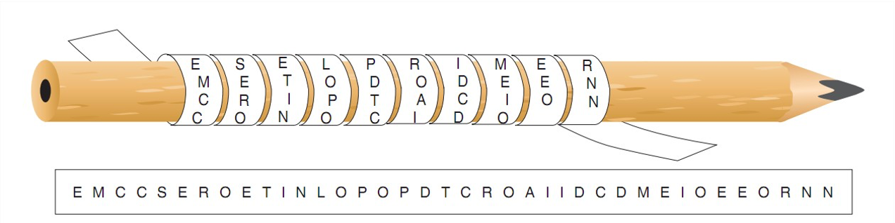

<!-- .slide: data-background="#2C3E50" -->
# Introducción a la Criptografía

> Criptografía: **Cripto** (ocultar) + **grapho** (escritura)
  
   
  
#### Motivación

* Ocultar contenido de comunicaciones
* Proteger datos de accesos no autorizados
* Asegurar la integridad del mensaje
* Asegurar la identidad del remitente

### Nomenclatura

### Nomenclatura

* **Criptografía**: ciencia que busca generación de algoritmos de cifrado
 
* **Criptoanálisis**: ciencia que busca técnicas para descifrar mensajes cifrados

* **Cifrar** consiste en emplear un proceso para convertir la información en claro (se conoce como **texto en claro**) en ilegible (texto **cifrado**).
	 
* **Descifrar** es el proceso inverso y permite convertir el texto ilegible en plano.
 
> Encriptar y desencriptar son anglicismos. NO SON CORRECTOS en castellano.

## Criptografía Clásica

### Criptografía clásica (Antes de ordenadores)

* **Sistemas de transposición:** alteran el orden de letras, sílabas o conjuntos de letras. 
	* Sistemas de transposición simple: el texto en claro sólo es sometido a una transposición
	* Sistemas de transposición múltiple: se realiza más de una transposición sobre el texto de forma sucesivas

* **Sistemas de sustitución:** se reemplazan algunas letras del alfabeto por otras o por un conjunto de ellas según el método
	* Según el tipo de sustitución se clasifican en: literal (letras por letras), numérica (letras por números), esteganográfica (se sustituyen por signos o se oculta el mensaje tras una imagen, sonido, etc).
	* Según  el número de caracteres a sustituir: monoalfabética, polialfabética, etc.

### Primer método de cifrado: Escítala Espartana

* Data del siglo V antes de Jesucristo, usada por los espartanos para ocultar sus comunicaciones
* El método consiste en enrollar una cinta sobre un bastón 
	* Escribir el mensaje en forma longitudinal
	* Al desenrollar la cinta queda una sucesión de letras ininteligibles
	* Clave: diámetro de bastón

### Sistemas de sustitución

**Cifrado del César (siglo I a.C.)**

* Sumar 3 al número de orden de cada letra  
			A -> D, B -> E, C -> F, ...
* Siendo A=0, B=1, ... y con un alfabeto de 26 letras (sin la ñ)  de manera que  C = (M + 3) mod 26
* Descifrar = restar 3
    

**Ejemplo** ([Web para cifrado César](https://es.planetcalc.com/1434/?license=1)) 
Mensaje plano   = megustalacriptografia  
Mensaje cifrado = phjxvwdodfulswrjudild  

### Criptoanálisis: César

### Sistemas de transposición

**Transposición por columnas:** El texto se descompone en n columnas y éstas se reordenan según la clave

**Ejemplo:** clave = 24315

* k={2,4,3,1,5}
* m=megustalacriptografia
* c=uatfcmtrgaglpabeairascoid

> **Criptoanálisis**: reordenar bloques de letras y letras saltando cada n hasta encontrar el n que da palabras que estén en un diccionario.

### Máquinas de cifrado: Enigma

### Máquinas de cifrado: Enigma

**Máquina Enigma**

* Dispositivos electromecánicos 
* Pueden cifrar y descifrar
* Usado por Alemanes en Segunda Guerra mundial

**Alan Touring**

* Trabajó rompiendo el cifrado de enigma
* Ayudó a acortar la guerra
* Película: Descifrando enigma

### Algoritmos

Los **algoritmos** son los métodos que se utilizan para transformar el texto claro en el texto cifrado.  
 
> **El principio de Kerckhoff:**   
> Establece que la fortaleza de un sistema de cifrado debe recaer en la clave y no en el algoritmo, lo cual quiere decir que aunque el algoritmo sea de dominio público, si no conocemos la clave, no seremos capaces de descifrar los mensajes. 

### Tipos de Algoritmos

Los algoritmos de cifrado se clasifican en dos tipos:

* Algoritmos de **bloque**: 
	* dividen el documento en bloques de bits, que por lo general son del mismo tamaño, y cifran cada uno de éstos de manera independiente, para posteriormente construir el documento cifrado. 
* Algoritmos de **flujo**: 
	* se diferencian de los anteriores en que se cifra bit a bit, byte a byte o carácter a carácter, en vez de grupos completos de bits; son muy útiles cuando tenemos que transmitir información cifrada según se va creando, es decir, se cifra sobre la marcha. 

## Criptografía Simétrica

### Criptografía Simétrica

> Criptografía simétrica o de **clave privada**

Este método se basa en un **secreto compartido** entre origen y destino, es decir, utiliza la misma clave en el proceso de cifrado que en el de descifrado.

### Criptografía Simétrica

* **Ventajas**:
	* Computacionalmente eficiente (Claves relativamente cortas)

* **Desventajas**:
	* Difusión de la clave de forma segura
	* Gestión de claves, hace falta una diferente para cada persona con la que me comunico
		* EJ: Para que 10 personas se pudiera comunicar entre ellas de forma segura harían falta: 10personas*9claves = 90 claves
 

* Para aumentar la seguridad:
	* Claves de mayor longitud
	* Cambiar periódicamente la clave
	* No utilizar palabras de diccionario en la clave
	* Usar algoritmos cuyas vulnerabilidades no hayan sido descubiertas

### Criptografía Simétrica: Algoritmos 

Todos son **algoritmos de bloque** :

* **DES** (Data Encryption Standard) Clave de 56 bits ha sido un estándar durante 30 años. Actualmente roto.
* **3DES** clave 168 (3x56) bits. Se emplea en tarjetas de crédito. Está siendo sustituido por AES
* **IDEA** (International Data Encryption Algorithm) Candidato a sustituir a 3DES, se usó en primeras versiones de PGP. Clave de 128 bits
* **RC5**: algoritmo que se incluye en los navegadores desde 1999 (RC2) con una clave de hasta 2040 bits, iteraciones hasta 255.
* **AES** (Advanced Encryption Standard) o Rijndael: claves de 128, 192 o 256. Usado por gobierno de EEUU. Usado en WiFi, SSL, OpenVPN. Más rápido que 3DES

## Criptografía Asimétrica

### Criptografía Asimétrica

> Criptografía asimétrica o de **clave pública**

[Vídeo con Explicación del funcionamiento de la clave pública](https://www.youtube.com/watch?v=On1clzor4x4)

### Criptografía Asimétrica

> Inicios: En 1976, los criptógrafos **Diffie y Hellman** publicaron sus investigaciones sobre criptografía asimétrica.

Consiste en que cada una de las partes involucradas en una comunicación segura tienen una pareja de claves: 

* Clave pública: la puede tener cualquiera y se usa para cifrar mensajes dirigidos al dueño de la clave
* Clave privada: solamente la debe tener su dueño, se usa para descifrar mensajes recibidos

Estas claves se generan a la vez y se encuentran relacionadas matemáticamente entre sí mediante funciones de un solo sentido para que **resulte imposible descubrir la clave privada a partir de la pública**

### Criptografía Asimétrica: Funcionalidad

* Cifrado
* Firma
* No repudio
* Garantizar la integridad de un documento
	* Hash + Firma 

### Criptografía Asimétrica: Algoritmos
Algunos algoritmos de técnicas de clave asimétrica son:

* **Diffie-Hellman**: se basa en el uso de logaritmos
* **RSA y DSA** se basan en la factorización de números enteros empleando números primos (Principio de Fermat).
* Criptografía de **curva elíptica**: emplea ecuaciones de tercer grado

### Criptografía Asimétrica: Ventajas

* No necesitamos canales seguros para compartir las claves, las claves se hacen públicas.
* No hay desbordamiento en la gestión de claves, cada persona tiene una pareja de claves. Para comunicarnos entre 10 personas nos bastará con gestionar las 10 claves públicas.
* Permiten firmar mensajes. (Cifrarlos con nuestra clave privada

### Criptografía Asimétrica: Desventajas

* Son poco eficientes: 
	* Coste computacional alto, porque usan claves largas para asegurar la independencia matemática entre ellas.
* Hay que **proteger la clave privada**
	* **Keyring** (Llavero), guarda las claves. 
		* Protegido por cifrado simétrico, para usar la clave privada es necesario introducir una contraseña que permite leerla
* Hay que **transportar la clave privada**. 
	* Demasiado grandes para recordarlas. Hay que transportar el llavero con el riesgo que ello supone si se pierde.
* El **uso repetido** de la clave privada, puede hacerla vulnerable a ataques criptográficos.
* El **tamaño** de los menajes cifrados con clave pública es mayor que los cifrados con clave privada.

### Criptografía Asimétrica: Transporte

Tarjetas inteligentes, hay dos tipos:

* Tarjeta de memoria: equivale a memoria Flash
	* Se limita a almacenar el llavero, cifrado con clave simétrica
	* Expone nuestro llavero, al usarla el PC lee el llavero.
* Tarjeta procesadora
	* Incorpora CPU y RAM
	* Almacena las claves, pero estas nunca salen de la tarjeta
	* La tarjeta realiza el cifrado de los datos
	* Para utilizarla también hay que introducir la clave simétrica del llavero
	* Un ejemplo es la tarjeta SIM del móvil

### Criptografía Asimétrica: Autenticación 

* Autenticación mediante contraseña:
	* Utiliza login y password
	* Se contrasta con los ficheros /etc/passwd y /etc/shadow del servidor
	* El cliente debe reescribir la contraseña en cada sesión
	* Susceptible de ataques de fuerza bruta
* Autenticación con clave pública:
	* El usuario genera la pareja de claves pública/privada
	* La clave pública se copia en el servidor
	* El servidor genera un “desafío” aleatorio mediante la clave pública del cliente
	* Evita el envío de la contraseña del usuario.

### Criptografía asimétrica: Autenticación

## Criptografía Híbrida

### Criptografía Híbrida

* Intenta combinar las ventajas de los dos tipos de criptografía
	* Seguridad de la asimétrica y eficiencia de la simétrica
* Para evitar el coste de procesado de la criptografía de clave pública:
	* Se utiliza criptografía de clave pública para enviar una clave privada simétrica.
	* A partir de ahí, las comunicaciones se cifran usando criptografía simétrica.

### Criptografía Híbrida

<!-- 

## Firma digital, Certificados y PKI

### Funciones Hash

### Firma digital

### Certificados

### PKI (*Public Key Infrastructure*)

-->
