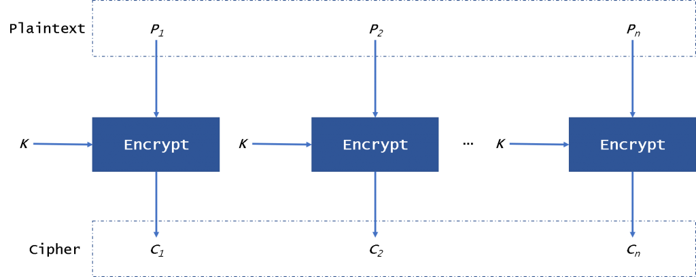
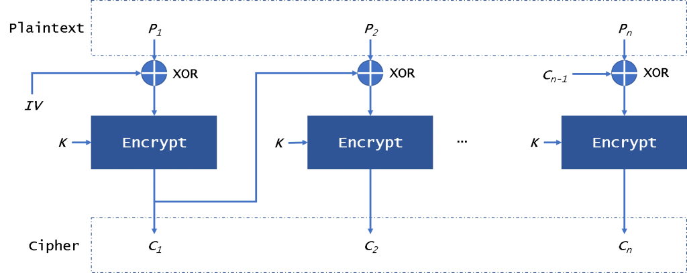
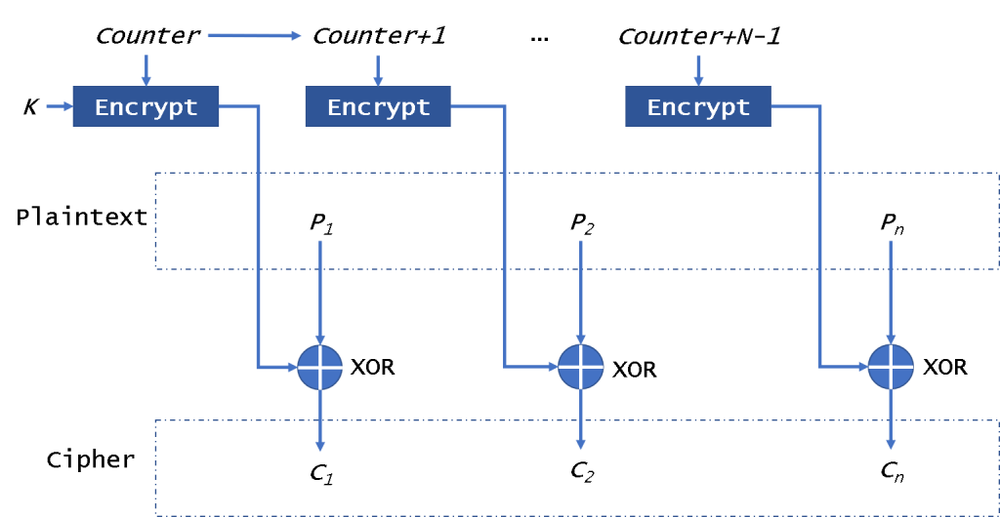

<!-- .slide: data-background="#2C3E50" -->
# Criptografía Simétrica

---

# Introducción

--

### Introducción

La **criptografía simétrica** es una herramienta esencial en la protección de información, especialmente en **grandes volúmenes de datos**.  

Hoy, el algoritmo **AES** ha reemplazado a **DES** como estándar global debido a su mayor seguridad. 

Sin embargo, la elección del **modo de operación** es clave para garantizar la seguridad y la integridad de los datos cifrados.

---

## Principio Básico

El principio básico de la criptografía simétrica es el uso de **una única clave secreta** para cifrar y descifrar información.  

- **Emisor y receptor** deben compartir la clave y mantenerla en secreto.  

### Funcionamiento:

1. **Cifrado**: El mensaje claro se cifra con la clave secreta, obteniendo el texto cifrado.
2. **Descifrado**: El receptor, usando la misma clave, recupera el texto claro.

--

### Funcionamiento: Criptografía simétrica

> Criptografía simétrica o de **clave privada**

<!-- .element width="80%" -->

---

## Algoritmos Comunes

--

### **DES (Data Encryption Standard)**
- **Historia**: DES fue el estándar desde los años 70. Utiliza una clave de **56 bits** y fue popular hasta volverse vulnerable a ataques.
- **Problemas**: La corta longitud de clave y los ataques de fuerza bruta lo hicieron inseguro.
- **3DES**: Aplica DES tres veces con diferentes claves. Extiende su seguridad temporalmente, pero fue reemplazado por **AES**.

--

### **AES (Advanced Encryption Standard)**
- Adoptado en 2001, basado en el algoritmo **Rijndael**.
- Utiliza bloques de **128 bits** y claves de **128, 192, o 256 bits**.
- **Ventajas**: Muy seguro y eficiente en software y hardware.

---

## Modos de Operación

--

### Modos de Operación

Los algoritmos simétricos como **AES** requieren **modos de operación** para cifrar datos mayores al tamaño del bloque.  

Modos de operación:
- **ECB** (Electronic Codebook)
- **CBC** (Cipher Block Chaining)
-  **CFB** (Cipher Feedback)
- **OFB** (Output Feedback)
- **CTR** (Counter)
- **GCM** (Galois/Counter Mode)

--

### 1. **ECB (Electronic Codebook)**
- Cada bloque de datos se cifra por separado.
- **Problema**: Los bloques idénticos en el texto claro generan bloques cifrados idénticos, revelando patrones.
- Modo **inseguro**.

--

## Cifrado ECB(Electronic Codebook)

--

### 2. **CBC (Cipher Block Chaining)**
- Cada bloque de texto claro se combina con el bloque cifrado anterior.
- **Ventaja**: Evita patrones en el cifrado.
- Muy seguro para la mayoría de los usos.
	- Vulnerable a ataques de padding si no se utiliza correctamente

--

### Cifrado CBC(Cipher Block Chaining)

--
## 3. **CFB/OFB/CTR**

- **CFB (Cipher Feedback)**
- **OFB (Output Feedback)**
- **CTR** (Counter)

Estos modos son útiles cuando se necesita operar sobre
flujos de datos o grandes cantidades de información:

- Permiten cifrar **datos en paralelo** (CTR)
- O cifrar más eficientemente en **flujos** (CFB/OFB)

--

### Cifrado CTR (Counter)

--
### 3. **GCM (Galois/Counter Mode)**
- Proporciona cifrado y **autenticación**.
- Se usa **AES en modo CTR (Counter Mode)** para cifrar.
- Se genera un **tag de autenticación** (basado en Galois, op. matemática) 
- **Usado en sistemas como HTTPS e IPsec** por su eficiencia y seguridad.

---

## Cifrado de Bloque y Cifrado de Flujo

--

### **Cifrado de Bloque**

- Procesa datos en **bloques de tamaño fijo** (por ejemplo, 128 bits en AES).  
- Es ideal para grandes volúmenes de datos **estáticos**.
 - Ofrece alta **seguridad** 
	 - Con modos de operación adecuados: **CBC** o **GCM**.

--

### **Cifrado de Flujo**

- Procesa datos **bit a bit** o **byte a byte**, cifrando de manera continua.  
- Ideal para transmisiones en tiempo real, como **audio o video**.
- El manejo seguro del flujo de claves es un reto; 
	- cualquier error en su implementación puede comprometer la seguridad del cifrado completo.

--

## Comparativa: Bloque vs. Flujo

| Característica          | Cifrado de Bloque                        | Cifrado de Flujo                     |
|-------------------------|------------------------------------------|--------------------------------------|
| **Tamaño de datos**      | Bloques fijos                            | Procesa datos de forma continua      |
| **Ejemplos**             | AES, DES, 3DES                           | RC4, ChaCha20                        |
| **Rendimiento**          | Ideal para grandes volúmenes de datos    | Ideal para transmisión en tiempo real|

---

## Cifrado Simétrico

### **Ventajas**
1. **Rápido y eficiente**: Requiere menos recursos que la criptografía asimétrica.
2. **Sencillo de implementar**: Ideal para grandes volúmenes de datos.
3. **Amplia aplicación**: Usado en sistemas como VPN, Wi-Fi y HTTPS.

--

## Cifrado Simétrico

### **Inconvenientes**
1. **Distribución de claves**: Se necesita un canal seguro para compartir la clave secreta.
2. **Escalabilidad limitada**: En entornos con muchos usuarios, el manejo de claves se vuelve complicado. (Ej: 10personas*9claves = 90 claves)
3. **Falta de no repudio**: No se puede probar quién cifró o descifró un mensaje.

---

# Ejercicio

### [Ej: Cifrado simétrico con GPG](../exercises/ej.simetrica.html)

