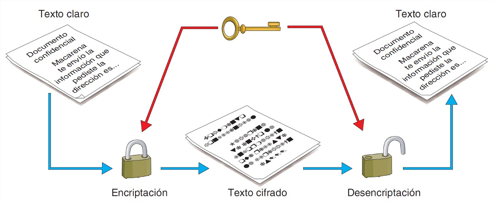

### Criptografía Simétrica

* **Ventajas**:
	* Computacionalmente eficiente (Claves relativamente cortas)

* **Desventajas**:
	* Difusión de la clave de forma segura
	* Gestión de claves, hace falta una diferente para cada persona con la que me comunico
		* EJ: Para que 10 personas se pudiera comunicar entre ellas de forma segura harían falta: 10personas*9claves = 90 claves
 

* Para aumentar la seguridad:
	* Claves de mayor longitud
	* Cambiar periódicamente la clave
	* No utilizar palabras de diccionario en la clave
	* Usar algoritmos cuyas vulnerabilidades no hayan sido descubiertas

## Criptografía Simétrica

### Criptografía Simétrica

> Criptografía simétrica o de **clave privada**

Este método se basa en un **secreto compartido** entre origen y destino, es decir, utiliza la misma clave en el proceso de cifrado que en el de descifrado.

### Criptografía Simétrica

* **Ventajas**:
	* Computacionalmente eficiente (Claves relativamente cortas)

* **Desventajas**:
	* Difusión de la clave de forma segura
	* Gestión de claves, hace falta una diferente para cada persona con la que me comunico
		* EJ: Para que 10 personas se pudiera comunicar entre ellas de forma segura harían falta: 10personas*9claves = 90 claves
 

* Para aumentar la seguridad:
	* Claves de mayor longitud
	* Cambiar periódicamente la clave
	* No utilizar palabras de diccionario en la clave
	* Usar algoritmos cuyas vulnerabilidades no hayan sido descubiertas

## Tipos de Algoritmos

Los algoritmos de cifrado se clasifican en dos tipos:

* Algoritmos de **bloque**: 
	* dividen el documento en bloques de bits, que por lo general son del mismo tamaño, y cifran cada uno de éstos de manera independiente, para posteriormente construir el documento cifrado. 
* Algoritmos de **flujo**: 
	* se diferencian de los anteriores en que se cifra bit a bit, byte a byte o carácter a carácter, en vez de grupos completos de bits; son muy útiles cuando tenemos que transmitir información cifrada según se va creando, es decir, se cifra sobre la marcha. 

### Criptografía Simétrica: Algoritmos 

Todos son **algoritmos de bloque** :

* **DES** (Data Encryption Standard) Clave de 56 bits ha sido un estándar durante 30 años. Actualmente roto.
* **3DES** clave 168 (3x56) bits. Se emplea en tarjetas de crédito. Está siendo sustituido por AES
* **IDEA** (International Data Encryption Algorithm) Candidato a sustituir a 3DES, se usó en primeras versiones de PGP. Clave de 128 bits
* **RC5**: algoritmo que se incluye en los navegadores desde 1999 (RC2) con una clave de hasta 2040 bits, iteraciones hasta 255.
* **AES** (Advanced Encryption Standard) o Rijndael: claves de 128, 192 o 256. Usado por gobierno de EEUU. Usado en WiFi, SSL, OpenVPN. Más rápido que 3DES

