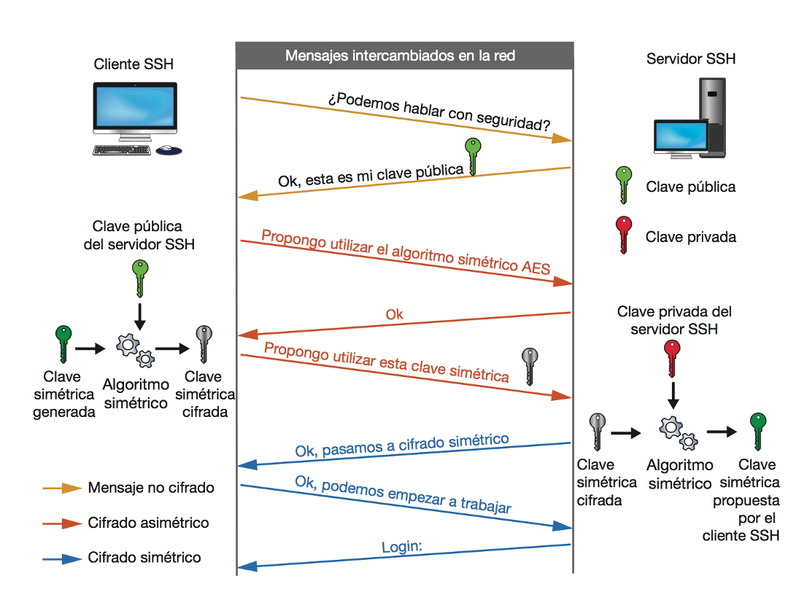

<!-- .slide: data-background="#2C3E50" -->
# **Criptografía Asimétrica**

---

## Principios y Algoritmos

--

## Criptografía Asimétrica

> Criptografía asimétrica o de **clave pública**

<!-- .element width="80%" -->

--

## Principios Básicos

Las claves se generan a la vez y se encuentran relacionadas matemáticamente entre sí mediante funciones de un solo sentido para que **resulte imposible descubrir la clave privada a partir de la pública**

- **Clave Pública**: Compartida libremente, para
	- Cifrar mensajes
	- Verificar firmas digitales.
- **Clave Privada**: Mantenida en secreto, para 
	- Descifrar mensajes
	- Firmar digitalmente

--

## Ventajas

- Soluciona problemas de distribución y gestión de claves en criptografía simétrica.
- Firmas digitales: 
	- garantizan autenticidad e integridad. 
	- Facilitan No-repudio

## Inconvenientes:

- Claves grandes: 
	- Computacionalmente costosa
	- Requieren almacenamiento y transporte seguro de las claves privadas.

---

## **Algoritmos de Criptografía Asimétrica**

--

## **Algoritmos de Criptografía Asimétrica**
- **RSA**(Rivest-Shamir-Adleman): 
	- Basado en la dificultad de **factorizar** números grandes: producto de **números primos grandes.**
- **ECC**(Elliptic Curve Cryptography): 
	- Basado en curvas elípticas, ofreciendo **alta seguridad con claves cortas**.

--

## **RSA (Rivest-Shamir-Adleman)**

 **Principio Básico**
 Seguridad basada en la factorización de números grandes.

**Funcionamiento**:
 **Generación de claves**: Dos primos grandes y sus productos.

 - **Ventaja**: Amplia fiabilidad y uso.
 - **Desventaja**: Requiere **claves largas** (>= 2048 bits), lo que impacta en el **rendimiento**.

--

## **ECC (Elliptic Curve Cryptography)**

 **Principio Básico**
Usa propiedades de curvas elípticas en un campo finito.

 **Funcionamiento**
1. **Generación de claves**: Punto en la curva y número secreto.
2. **Cifrado y Descifrado**: Similar a RSA.

 - **Ventaja**: Alta seguridad con claves cortas y eficiencia. 
	- Clave  ECC de 256 bits en ECC equivale a calve  RSA de3072 bits.
- **Desventaja**: Implementación compleja, mayor riesgo de vulnerabilidades.

--

## Casos de uso de RSA
- **SSL/TLS**: RSA es utilizado  en la seguridad web.
- **Firmas digitales**: garantiza la autenticidad y la integridad de la información.

## Casos de uso de ECC
- **Dispositivos móviles**: Debido a su eficiencia y menor consumo de recursos.
- **Blockchain**: En criptomonedas como Bitcoin, ECC es la base para la generación de direcciones y la verificación de transacciones.

---

# Firmas digitales

--

## Firma Digital: Generación

La firma digital permite garantizar la **autenticidad** y la **integridad** de un documento.

<!-- .element width="80%" -->

--

## Firma Digital: Creación

1. Se usa una función **hash** para calcular un resumen (Ej: SHA)
	- Si cambia el texto el resumen no será valido.

2. Este valor resumen se cifra utilizando la **clave privada** del firmante.
	- La única persona que ha podido firmar el documento es la que tiene la clave privada.
3. El resultado es lo que se conoce como firma digital del documento

--

## Firma Digital: Verificación

* La firma se descifra utilizando la **clave pública** del firmante
	* Se obtiene el valor resumen del documento original.
* Se calcula el valor **resumen** del documento recibido junto a la firma.
* Se comparan los dos valores resúmenes obtenidos en los dos procesos anteriores 
	* Si coinciden entonces la firma es válida
	* Si estos son distintos la firma será nula.

--

## Aplicaciones de firma digital

- Correo electrónico seguro (PGP, S/MIME).
- Certificados digitales (SSL/TLS).
- Documentos electrónicos legales.
- Autenticación: usuarios y servidores

---

## Custodia y Transporte de Claves Privadas

--

## Desafíos
1. **Seguridad Física y Digital**: Protección contra accesos no autorizados.
2. **Almacenamiento Seguro**: Uso de cifrado y dispositivos dedicados.

--

## Buenas Prácticas
- **Dispositivos de Hardware Seguro**
	- Hardware Security Modules (**HSM**s)
		- Custodian claves privadas y se encargan del cifrado/descifrado/firmas
		- [EJ: Thales](https://cpl.thalesgroup.com/es/encryption/hardware-security-modules), [Entrust](https://www.entrust.com/)
	- **Smart Cards** y [Tokens USB](https://tienda.fnmt.es/fnmttv/fnmt/es/Productos/Tarjetas-y-Lectores/c/6000)
		- Ej: DNI digital, SIM del móvil
		- La clave no sale del dispositivo
	
- **Cifrado de claves privadas** con cifrado simétrico.
- **MFA**: Múltiples factores de autenticación.

--

## **Implicaciones Legales y Cumplimiento**

### Normativas
- **GDPR en Europa**: Protección de datos personales.
- **PCI DSS**: Estándares de seguridad en pagos.

### Consecuencias
- Pérdida o compromiso de claves: Implicaciones legales y posibles multas.

---

## Criptografía Asimétrica: Autenticación

--

### Criptografía asimétrica: Autenticación SSH

<!-- .element width="80%" -->

--

### Criptografía Asimétrica: Autenticación SSH

* Autenticación mediante contraseña:
	* Utiliza login y password
	* Se contrasta con los ficheros /etc/passwd y /etc/shadow del servidor
	* El cliente debe reescribir la contraseña en cada sesión
	* Susceptible de ataques de fuerza bruta
* Autenticación con clave pública:
	* El usuario genera la pareja de claves pública/privada
	* **La clave pública se copia en el servidor**
	* El servidor genera un “desafío” aleatorio mediante la clave pública del cliente
	* Evita el envío de la contraseña del usuario.
 

---

# Criptografía Híbrida
## Intercambio seguro de claves

--

### Criptografía Híbrida

<!-- .element width="50%" -->

--

### Criptografía Híbrida

* Intenta combinar las ventajas de los dos tipos de criptografía
	* **Seguridad** de la asimétrica y **eficiencia** de la simétrica
* Para evitar el coste de procesado de la criptografía de clave pública:
	* Se utiliza criptografía de **clave pública** para enviar una **clave simétrica**.
	* A partir de ahí, las comunicaciones se cifran usando criptografía simétrica.