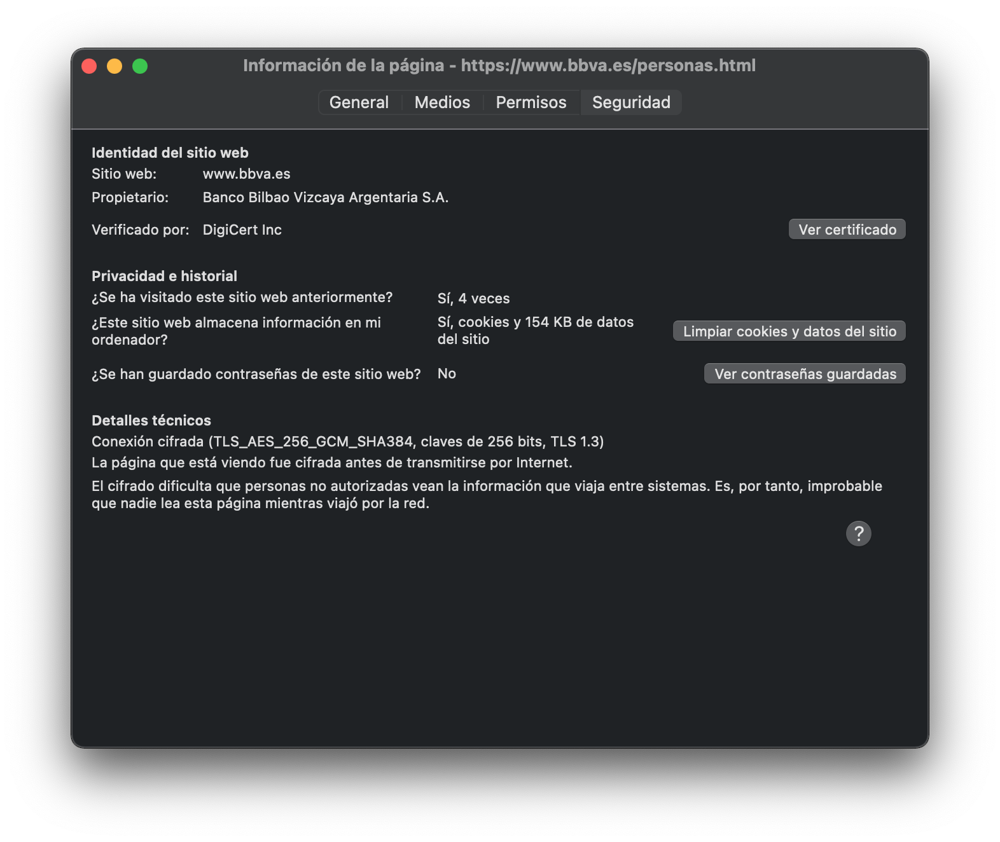
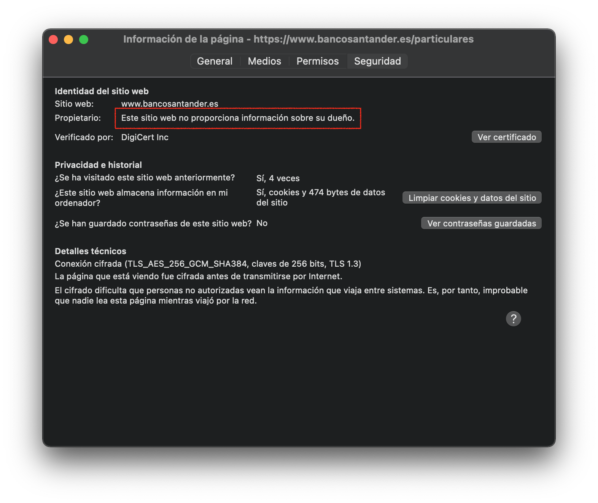

<!-- .slide: data-background="#2C3E50" -->
# **Infraestructura de Clave Pública**
## PKI

---

## PKI (*Public Key Infrastructure*)

--

### Introducción

* La ventaja de la criptografía asimétrica es su facilidad para difundir la clave pública
* Pero **cualquiera puede generar un par de claves y pretender ser otra persona**

> Problema: **¿Cómo puedo estar seguro que el dueño de una clave pública es realmente quien dice ser?**

--

#### Solución

**Autoridad de Certificación**: Tercera parte de confianza que verifique la identidad del dueño de la clave pública.
#### Certificado digital

Los **certificados digitales** asocian claves públicas con identidades verificadas, y son  **firmados por una Autoridad de Certificación**, esenciales para: 
1. Garantizar la autenticidad en comunicaciones seguras (ej. HTTPS). 
2. Verificar la identidad de las partes en una comunicación.

---

## PKI (Public Key Infraestructure)

--

### PKI: Definición

Infraestructura de clave pública o PKI (Public Key Infraestructure)  es un conjunto de:

- Políticas y procedimientos 
- Hardware y software

Su objetivo es gestionar de forma segura la **creación, distribución y revocación de certificados digitales**.

--

### Componentes PKI

* La **Autoridad de Certificación** (**CA** [Certificate Authority]), 
	- Su misión es emitir certificados
* La **Autoridad de Registro** (**RA** [Registration Authority]), 
	- Verifica identidad de solicitante. 
* La **Autoridad de Validación** (**VA** [Validation Authority]) 
	- Información online de certificado.
* Los **repositorios** (o Directorios), son almacenes de certificados. 
	- Repositorio de certificados activos 
	- Repositorio de **listas de revocación** de certificados (**CRL**)

--

### Componentes PKI

<!-- .element width="80%" -->

---

## Certificados Digitales

--

### Certificado Digital

Un **certificado digital** es un documento electrónico que vincula una **clave pública** a la identidad de una persona, organización, dispositivo o servidor

--
### **Componentes de un Certificado Digital** 

1. **Clave pública** del propietario del certificado. 
2. **Datos de identidad** del propietario (persona, organización, etc.)
3. **Nombre de la CA** que emite el certificado. 
4. **Fecha de validez** del certificado. 
5. **Firma digital de la CA** para evitar alteraciones.

--

### Proceso de Creación y Verificación 

1. **Solicitud de Certificado (CSR: Certificate Signing Request)** 
2. **Verificación** por la CA 
3. **Emisión y Firma** del certificado 
4. **Verificación en la Comunicación** 
5. **Revocación y Consulta CRL** (Certificate Revocation List)

--

### Formatos de Certificado Digital 

1. **X.509**: Estándar jerárquico ampliamente utilizado. 
2. **PEM**: Formato ASCII para Unix/Linux. 
3. **DER**: Formato binario para Windows y Java. 
4. **PKCS#12**: Almacena certificado y clave privada juntos. 
5. **PKCS#7**: Solo incluye certificados públicos.

## Ejemplos de certificados

- [DNI electrónico](https://www.dnielectronico.es/PortalDNIe/PRF1_Cons02.action?pag=REF_800&id_menu=30)
- Certificados emitidos por la [FNMT](https://www.cert.fnmt.es/)
- Cetificados SSL/TLS usados en web

---

## Tipos de certificados

--

### Según Uso

- **Personales**: Para identificación individual.
- **Servidor**: Para asegurar la autenticidad de los servidores.
- **Software**: Para verificar la integridad y autenticidad del software.
- **Entidad de Certificación**: Para la identificación de CAs.
	- Ej: **Certificado Raíz** (Autofirmado) y Certificados Intermedios

--

### Según Nivel de Validación

1. **Domain Validated (DV)**: Verificación de dominio del solicitante, de nivel bajo. No se comprueba organización. 
	- Uso: cifrado comunicaciones.
2. **Organization Validated (OV)**: Verificación del dominio y de la identidad de la organización, aumentando la confianza. 
	- Uso: sitios web comerciales o corporativos.  Garantiza empresa legítima.
3. **Extended Validation (EV)**: Mayor nivel de seguridad, con verificación exhaustiva de la organización. **Muestra nombre de empresa en verde** en navegador.
	- Uso: bancos y datos sensibles. Alto nivel de confianza.
 

---

## Ejemplo de tipos de certificados

--

### Certificado: BBVA

<!-- .element width="80%" -->

--

### Certificado: BBVA

<!-- .element width="60%" -->

--

### Certificado: Santander 

<!-- .element width="80%" -->

--

### Certificado: Santander

<!-- .element width="60%" -->

## Discusión

Un banco debería ofrecer un nivel de verificación que permita comprobar quién es el dueño de la página.
### Ejercicio

- Revisa los detalles del certificado y mira la **cadena de confianza**:
	- Certificado del sitio
	- Certificado intermedio
	- Certificado raíz

- Revisa los **certificado raíz** incluidos en tu navegador web

---

## Autoridad de certificación

--

### Autoridad de certificación

La AC es  una entidad fiable y **reconocida regional o mundialmente**, encargada de garantizar de forma unívoca y segura la identidad asociada a una clave pública. 

* Realiza las siguientes tareas:
	- Recibe y procesa peticiones de certificados (CSR) de los usuarios finales. 
	- Consulta con una Autoridad de Registro para determinar si acepta o rehúsa la petición de certificado
	- Emite el certificado
	- Gestiona Listas de Revocación de Certificados (CRLs)
	- Renueva certificados

--

### Autoridad de certificación

Algunas de las principales autoridades certificadoras son:

* Privadas: DigiCert, Let's Encrypt, Sectigo, etc  

* Públicas España: FNMT, ACCV (GVA), etc  

> **Cualquiera puede crear su propia AC** con el software adecuado (por ejemplo Openssl). El problema es generar **reputación** y confianza por el resto para ser incluido en los repositorios de AC, como las que vienen de serie en nuestro navegador

--

### PKI: Tipos

* **Públicas**: gestionadas por el gobierno, normalmente para identificar personas y entidades públicas.
* **Privadas**: gestionadas por empresas privadas, usadas para verificar identidad de servidores frente a consumidores
* **Propias**: para cifrar y verificar comunicaciones dentro de una empresa
	* Ahorro de costes respecto a PKI privada.

---

## Ejempos de autoridades de certificación

--

## Autoridades de Certificación Privadas 

- **[DigiCert](https://www.digicert.com/)**: Líder en certificados SSL/TLS. 
- **[Let's Encrypt](https://letsencrypt.org/)**: Gratuita y automatizada. 
- **[GlobalSign](https://www.globalsign.com/)**: Alta seguridad y cumplimiento regulatorio. 
- **[Sectigo](https://sectigostore.com/)**: Opciones asequibles. 
- **[Entrust](https://www.entrust.com/)**: Especialización en grandes corporaciones.

--

## Autoridades de Certificación Públicas en España

- Fábrica Nacional de Moneda y Timbre ([FNMT](https://www.fnmt.es/ceres)): a través de su proyecto CERES (Certificación Española), es una de las principales autoridades de certificación pública en España. Ofrece servicios de certificación digital para ciudadanos, empresas y administraciones públicas, garantizando la identidad de los participantes en comunicaciones electrónicas.

* Generalitat Valenciana ([ACCV](https://www.accv.es/))**La Agencia de Tecnología y Certificación Electrónica de la Generalitat Valenciana emite certificados digitales reconocidos a nivel nacional

---

## Ejercicio

### [Comprobación de Vulnerabilidades en Sitios Web Seguros](../exercises/ej.ssllabs.html)