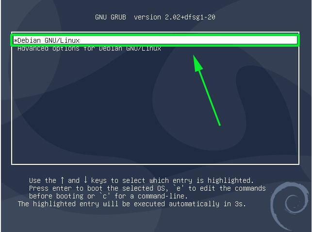
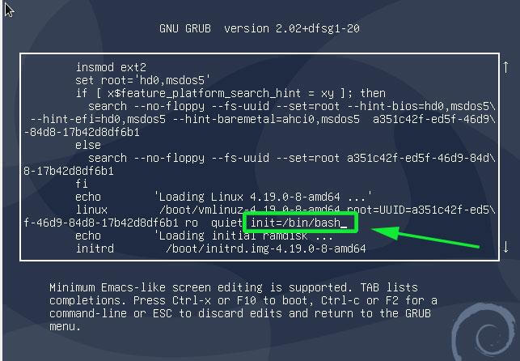
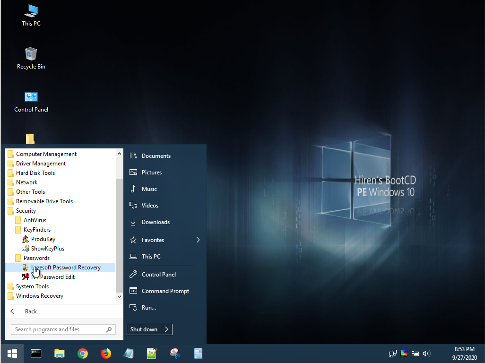
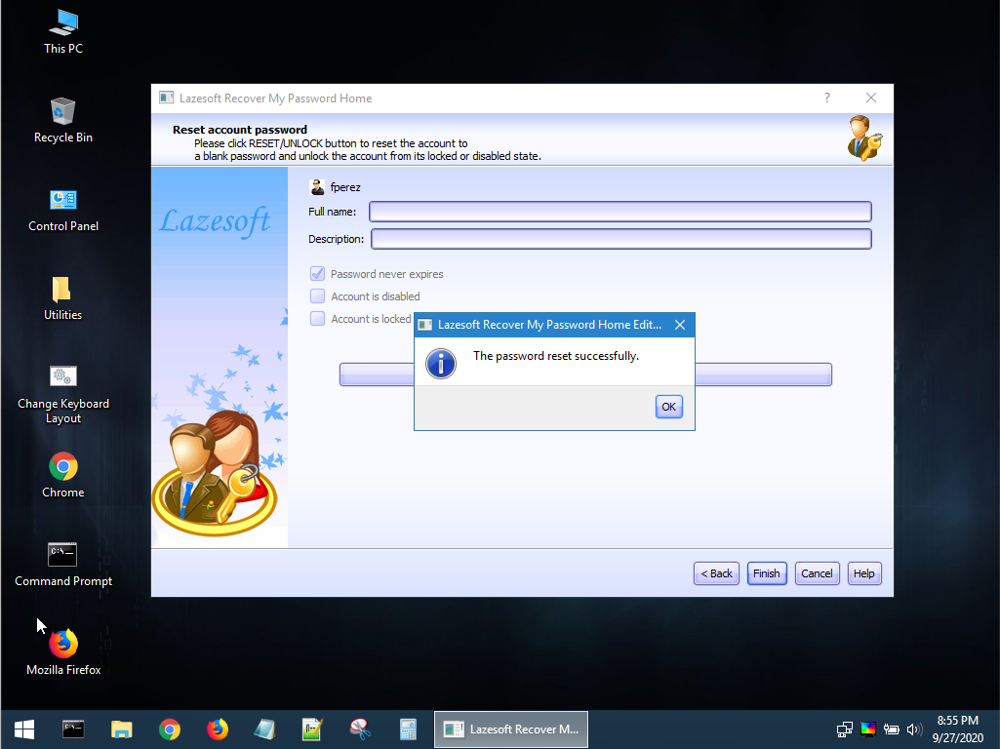

<!--
Esta práctica se debe acompañar de dos máquinas virtuales:

Una debian 10 con un password en root seguro
Una con Windows 10 con un usuario que sea administrador seguro
 * En mi caso el usuario es fperez

En cada página se pondrá un fondo de pantalla distinto en los usuarios objetivo para asegurar que el reseteo de password ha sido realizado satisfactoriamente. 

PWD máquinas: gatoperro1
-->

# Restaurar contraseña de root en Debian

{:style="width: 40%;" class="center"}

## Introducción

En esta práctica vamos a analizar los problemas de seguridad que surgen cuando una persona no autorizada tiene acceso físico a una máquina. La seguridad física es una capa fundamental en la protección de sistemas, ya que, como veremos en este ejercicio, permite a un atacante con acceso directo al hardware comprometer el sistema y realizar modificaciones que pueden dejarlo vulnerable o incluso causar una pérdida de datos.

Dado que el acceso físico puede facilitar la manipulación de configuraciones críticas o el restablecimiento de contraseñas, en esta práctica observaremos dos casos comunes:
  
* Problemas derivados de **no asegurar el GRUB** en sistemas **Linux**.
* Sencillez de **cambiar la contraseña en un usuario local de Windows**.

> Puedes descargar las máquinas para probar de los siguientes enlaces:
> 
> - [Debian](https://drive.google.com/file/d/1Ug51cI5QU_JRXc5AYDtzopPzgialnQ-m/view?usp=drive_link)
> - [Windows 10](https://drive.google.com/file/d/154_79tj0vYpHCziFwr08BgwjeX9F2V1R/view?usp=sharing)

## Restaurar contraseña de root en Debian

### ¿Qué es GRUB?

El **GRUB** (GRand Unified Bootloader) es el gestor de arranque más común en sistemas Linux. Se encarga de cargar el sistema operativo y proporcionar un menú de opciones en el arranque. Aunque GRUB facilita el inicio del sistema, también puede ser un punto de vulnerabilidad si no se protege adecuadamente. Un atacante con acceso físico puede manipular el arranque del sistema para acceder a privilegios de administrador sin conocer las credenciales. Configurar una contraseña para el GRUB es una medida de seguridad básica que veremos en esta práctica.

### Procedimiento

Si tenemos acceso físico a la máquina, resulta relativamente sencillo restaurar la contraseña del usuario root siguiendo este tutorial:

> 1) Debes conseguir acceder a la máquina que te proporcione el profesor en clase, con el usuario **root** y hacer una captura del escritorio para demostrar que has conseguido hacer login.

Vamos a modificar el script de arranque para conseguir privilegios de administrador sin tener ninguna contraseña.

Para ello, arranca o reinicia tu Debian. Cuando aparezca el menú de arranque **GRUB**, teniendo seleccionada la primera opción, pulsa la tecla `e` en el teclado antes de que el sistema arranque. Con este paso podremos editar los parámetros del kernel antes de que el sistema arranque.

{:style="width: 80%;" class="center"}

Esto hará que se muestre una pantalla como la que se muestra a continuación. Localiza la línea que empieza con `linux` que precede la sección `/boot/vmlinuz-*` que también especifica el UUID.

{:style="width: 80%;" class="center"}

Lleva el cursor al final de esta línea, justo antes de `ro quiet` y añade el parámetro `init=/bin/bash`.

A continuación presiona `ctrl + x` para hacer que el sistema arranque en modo de usuario único, con el sistema de ficheros montado con permisos de sólo lectura (`ro`).

Para cambiar el password, necesitas cambiar los permisos de acceso al sistema de fichero de solo lectura (`ro`) a lectura y escritura (`rw`). Para ello, usa el siguiente comando:

```sh
mount -o remount,rw /
```

Ahora ya puedes cambiar el password simplemente usando el comando `passwd`.

```sh
passwd
```

Proporciona el nuevo password, vuélvelo a introducir para confirmarlo y ya está.

Reinicia la máquina para comprobar que ahora puedes hacer login como **root** con tu nuevo password.

> 2) Hemos podido hacer todo este procedimiento porque no se ha protegido el GRUB. ¿Cómo podría añadir una contraseña al menú GRUB para evitar que alguien use este procedimiento?

### Preguntas adicionales

> - ¿Qué diferencias encuentras entre acceder a una máquina Linux de esta manera y hacerlo a través de un ataque remoto?
> - ¿Qué nivel de seguridad tendrías si el sistema de archivos estuviera cifrado? ¿Podrías realizar el mismo proceso?
> - ¿Cuáles podrían ser las consecuencias de no proteger adecuadamente el GRUB en un entorno profesional? Piensa en los tipos de datos que podrían estar en riesgo.

---

# Resetear contraseña de usuario en Windows 10

### ¿Qué es Hirens Boot CD y Lazesoft Password Recovery?

**Hirens Boot CD** es un conjunto de herramientas gratuitas y legales que facilita la recuperación y el mantenimiento de sistemas operativos, especialmente Windows. Es útil para resetear contraseñas, eliminar malware y solucionar otros problemas técnicos sin necesidad de acceder al sistema operativo principal.

En este caso, usaremos **Lazesoft Password Recovery**, una herramienta específica que permite restablecer contraseñas en máquinas con Windows. Esta herramienta funciona arrancando desde un entorno externo (un CD o USB) y permite cambiar las contraseñas de cualquier usuario local de Windows sin requerir acceso directo al sistema operativo.

> 3) Debes conseguir acceder a la máquina con el usuario que te indique el profesor y hacer una captura del escritorio para demostrar que has conseguido hacer login con el usuario indicado.

El proceso es muy sencillo:

* Arranca la máquina con HBCD.
  * Como trabajamos con máquinas virtuales, es suficiente con que cargues el fichero ISO en la unidad de DVD de la máquina virtual. 
* Ejecuta la Herramienta `Lazesoft Password Recovery`.
* Sigue el asistente para reiniciar la contraseña.
* Reinicia la máquina y haz login con la cuenta a la que has cambiado la contraseña.

{:style="width: 80%;" class="center"}

Tienes un tutorial completo en el siguiente enlace: [https://www.lazesoft.com/how-to-reset-administrator-password.html](https://www.lazesoft.com/how-to-reset-administrator-password.html)

{:style="width: 80%;" class="center"}

> 4) Para realizar este procedimiento en una máquina física necesitarías grabar la imagen en un DVD o preparar un USB de arranque. ¿Cómo se puede preparar un USB de arranque a partir de un fichero ISO?

### Preguntas adicionales

> - ¿Qué tipo de acceso se necesita para utilizar herramientas como Hirens Boot CD y Lazesoft Password Recovery en un equipo Windows?
> - ¿Existen métodos para evitar que un usuario sin permiso acceda físicamente a una máquina para realizar estos cambios? Describe dos métodos.
> - ¿Por qué crees que Windows permite este tipo de cambios sin autenticación? ¿Qué ventajas y desventajas presenta desde el punto de vista de seguridad?

---

# Reflexión Final

Tras completar esta práctica, reflexiona sobre los siguientes puntos:

> 1. ¿Qué medidas adicionales se podrían tomar en una organización para proteger tanto el sistema operativo como los datos ante el acceso físico no autorizado?
> 2. ¿Cómo pueden combinarse la seguridad física y lógica para fortalecer el sistema ante intentos de acceso indebido?
> 3. Valora los riesgos que implican herramientas como Hirens Boot CD y Lazesoft Password Recovery en entornos laborales. ¿Qué controles de acceso podrían implementarse para mitigar su uso no autorizado?

---

# Bibliografía

- [https://www.hirensbootcd.org/](https://www.hirensbootcd.org/)
- [https://www.lazesoft.com/how-to-reset-administrator-password.html](https://www.lazesoft.com/how-to-reset-administrator-password.html)
- [https://www.tecmint.com/reset-forgotten-root-password-in-debian/](https://www.tecmint.com/reset-forgotten-root-password-in-debian/)
- [https://askubuntu.com/questions/24006/how-do-i-reset-a-lost-administrative-password](https://askubuntu.com/questions/24006/how-do-i-reset-a-lost-administrative-password)
- [https://geekland.eu/proteger-el-grub-con-contrasena/](https://geekland.eu/proteger-el-grub-con-contrasena/)
- [http://www.gnu.org/software/grub/](https://geekland.eu/proteger-el-grub-con-contrasena/)

### Creación de boot USB a partir de ISOs

- [https://www.top-password.com/iso2disc.html](https://www.top-password.com/iso2disc.html)
- [https://rufus.ie/](https://rufus.ie/)

