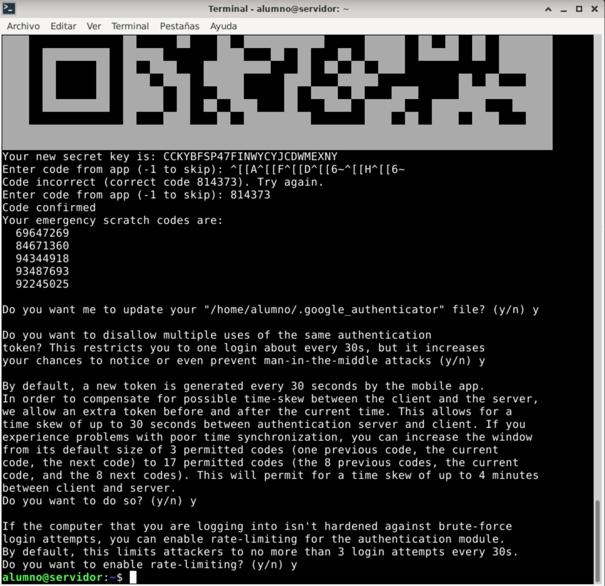

---
title: Autenticación de doble factor por SSH
---

<!-- Tomada de curso seguridad del CEFIRE 2020 -->

# Introducción


## Objetivos

Utilizar un sistema de autenticación de doble factor mediante *Google Authenticator* en el acceso *ssh* a un sistema GNU/Linux

{:style="width: 30%;" class="center"}

## Preparación

Se necesita:

* Un móvil con la app `Google Authenticator` instalada.
* Una máquina virtual con Debian/Ubuntu instalada y con el servicio ssh con la configuración por defecto (autenticación mediante contraseñas).

# Enunciado

Si existe una instalación previa de ssh y quieres reiniciar la configuración por defecto, puedes desintalar el servicio ssh mediante el siguiente comando, `purge` hará que también se eliminen los archivos de configuración.

```sh
sudo apt-get purge openssh-server
```

Ahora vuelve a instalarlo

```sh
sudo apt-get install openssh-server
```

Asegúrate de la máquina virtual Linux tiene el servicio `sshd` levantado, que ningún *firewall* esté cortando el puerto 22/tcp (**sshd**) y que hay visibilidad entre tu máquina anfitrión y la máquina virtual . 


Puedes poner la máquina virtual en modo puente con tu tarjeta de red o bien en modo red solo-anfitrión pero en ambos casos asegúrate que ambas máquinas puedes verse por red mediante  ping y  ssh. 

Desde la línea de comandos de Windows 10 existe un cliente ssh integrado pero en caso de no tenerlo habilitado se puede habilitar como característica de Windows o bien puedes descargar un cliente ssh para Windows como `Putty` [https://www.putty.org/](https://www.putty.org/).

@. En una shell de Linux, instala el paquete `libpam-google-authenticator` en el sistema mediante el comando :

```sh
sudo apt-get update
sudo apt-get install libpam-google-authenticator
```

@. Una vez instalado `google authenticator` en Linux, desde la línea de comandos y con el usuario que quieras usar la autenticación 2FA, ejecuta la utilidad `google-authenticator`:

```sh
alumno@pc:~$ google-authenticator
```


@. La aplicación te hace una serie de preguntas y se recomienda que contestes a lo siguiente:

```sh
Do you want authentication tokens to be time-based (y/n) y
```

La aplicación genera un `secret key` (clave secreta) y muestra un `QR`. 


{width=70%}


Abre la app Google Authenticator, pulsa el botón + para añadir una cuenta y escanea el QR (o también puedes intruducir la clave secreta tecleandola). Automáticamente te aparecerá en la APP el usuario y equipo para el que has activado la autenticación OTP y mostrará una clave que cambia cada 30 segundos:


Debes introducir un código mostrado por el teléfono para confirmar que es correcta la configuración.


Se mostrarán unos códigos de emergencia (de un uso) para poder acceder en caso de no disponer del teléfono móvil.

{width=70%}


A partir de aquí, debes seguir respondiendo a más preguntas que te hace desde consola de Linux:


{width=70%}

<!--
```
Enter code from app (-1 to skip): -1

Do you want me to update your "/home/usuario/.google_authenticator" file? (y/n) y

Do you want to disallow multiple uses of the same authentication
token? This restricts you to one login about every 30s, but it increases
your chances to notice or even prevent man-in-the-middle attacks (y/n) y

By default, a new token is generated every 30 seconds by the mobile app ... (texto omitido)…
Do you want to do so? (y/n) n

If the computer that you are logging into isn't hardened against brute-force
login attempts, you can enable rate-limiting for the authentication module.
By default, this limits attackers to no more than 3 login attempts every 30s.
Do you want to enable rate-limiting? (y/n)  y
```
-->

@. Llegado a este punto, se debe haber creado en tu carpeta `home` el fichero `.google_authenticator` que si tienes interés puedes visualizar con un editor de textos o con cat.


A continuación configuraremos la autenticación **PAM** (*Pluggable Authentication Module*) en ssh para que use `google_authenticator`.
PAM es un mecanismo de autenticación flexible que permite independizar las aplicaciones y servicios de un sistema GNU/Linux del proceso de identificación. Permite configurar distintos sistemas de autenticación, sesión y cambio de contraseñas y conectarlos a los servicios que queramos, como por ejemplo el servicio login (que permite acceder al sistema desde una consola), el servicio sshd (que permite acceder via red mediante SSH) o el servicio web de apache, por citar sólo unos pocos ejemplos.

Como root, edita el fichero `/etc/pam.d/sshd`,

```sh
sudo nano /etc/pam.d/sshd
```

y comenta la linea `@include common-auth` y añade dos líneas más:

```sh
#@include common-auth
auth requisite pam_unix.so nullok
auth requisite pam_google_authenticator.so
```

@. En la ayuda (man pam_unix) puedes ver el significado del parámetro `nullok` que se le pasa al módulo pam_unix


La opción `nullok` permitirá a los usuarios iniciar sesión solo con el nombre de usuario y la contraseña hasta que completen la configuración de 2FA. Una vez que la configuración de 2FA se completa con éxito para todos los usuarios, es una buena idea eliminar la opción nullok para hacer cumplir el uso de 2FA para todos. Si eres el único usuario de este sistema, puedes omitir  la opción `nullok`.


Edita el fichero `/etc/ssh/sshd_config` y cambia esta línea:

```sh
ChallengeResponseAuthentication yes
```

y reinicia el servicio como root (o con sudo) con:

```sh
sudo systemctl restart sshd
```

@. Comprueba ahora que desde un terminal desde otro equipo (por ejemplo desde el propio anfitrión) puedes hacer ssh al usuario y máquina Linux (comprueba su ip primero) y te pide primero el password de la cuenta y después el código temporal de Google Authenticator:

```sh
$ ssh usuario@192.168.100.124
Password: ***** 
Verification code:******
```

Con el modulo `pam_succeed_if` puedes aplicar expresiones condicionales (consultar man pam_succeed_if) como por ejemplo que ha determinados grupos de usuarios no les aplique el 2FA, como en el siguiente ejemplo en el `/etc/pam.d/sshd`, donde a los usuarios del grupo invitados no les pide el código de Google Authenticator:

```
auth requisite pam_unix.so nullok
auth [success=done default=ignore] pam_succeed_if.so user ingroup invitados
auth requisite pam_google_authenticator.so
```

Adjunta una breve memoria en formato PDF con capturas del proceso realizado y súbela al Moodle en la actividad correspondiente

## Bibliografía

- Tutorial SSH con google Authenticator en Almalinux **9**: [https://reintech.io/blog/implementing-two-factor-authentication-ssh-almalinux-9](https://reintech.io/blog/implementing-two-factor-authentication-ssh-almalinux-9)

* Google authenticator: [https://support.google.com/accounts/answer/1066447?sjid=1517607344428081015-EU](https://support.google.com/accounts/answer/1066447?sjid=1517607344428081015-EU)
	* Android: [https://play.google.com/store/apps/details?id=com.google.android.apps.authenticator2](https://play.google.com/store/apps/details?id=com.google.android.apps.authenticator2)
	* iOS: [https://apps.apple.com/app/google-authenticator/id388497605](https://apps.apple.com/app/google-authenticator/id388497605)
	
* PAM: [https://www.debian.org/doc/manuals/debian-reference/ch04.es.html](https://www.debian.org/doc/manuals/debian-reference/ch04.es.html)

* Instalar SSH: [https://phoenixnap.com/kb/how-to-enable-ssh-on-debian#htoc-step-5-install-ssh-client-service-optional](https://phoenixnap.com/kb/how-to-enable-ssh-on-debian#htoc-step-5-install-ssh-client-service-optional)

* Tutorial 2FA: [https://4sysops.com/archives/enable-two-factor-authentication-for-ssh-in-linux/](https://4sysops.com/archives/enable-two-factor-authentication-for-ssh-in-linux/)
