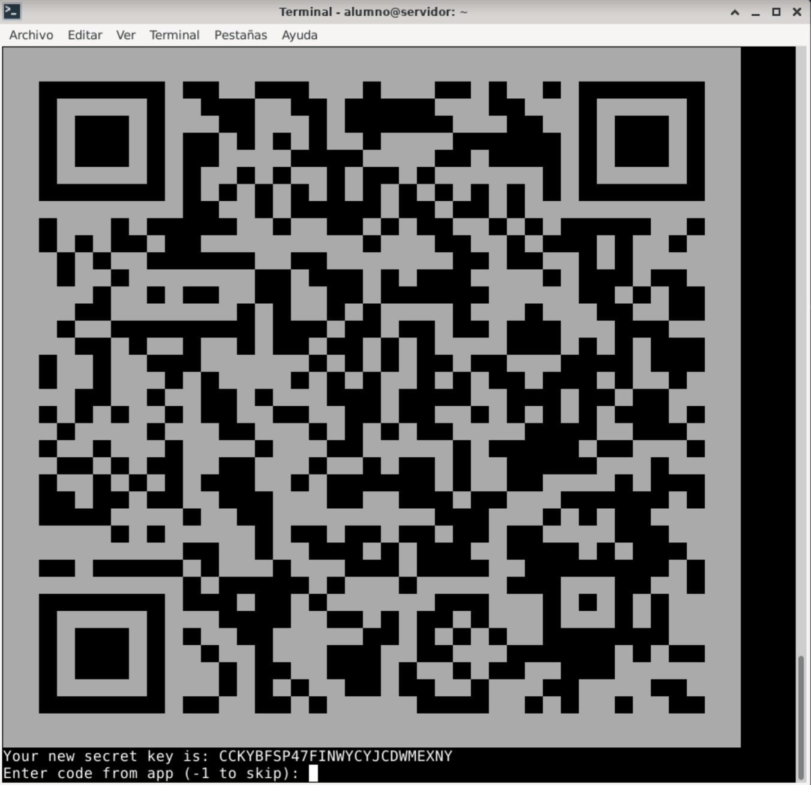
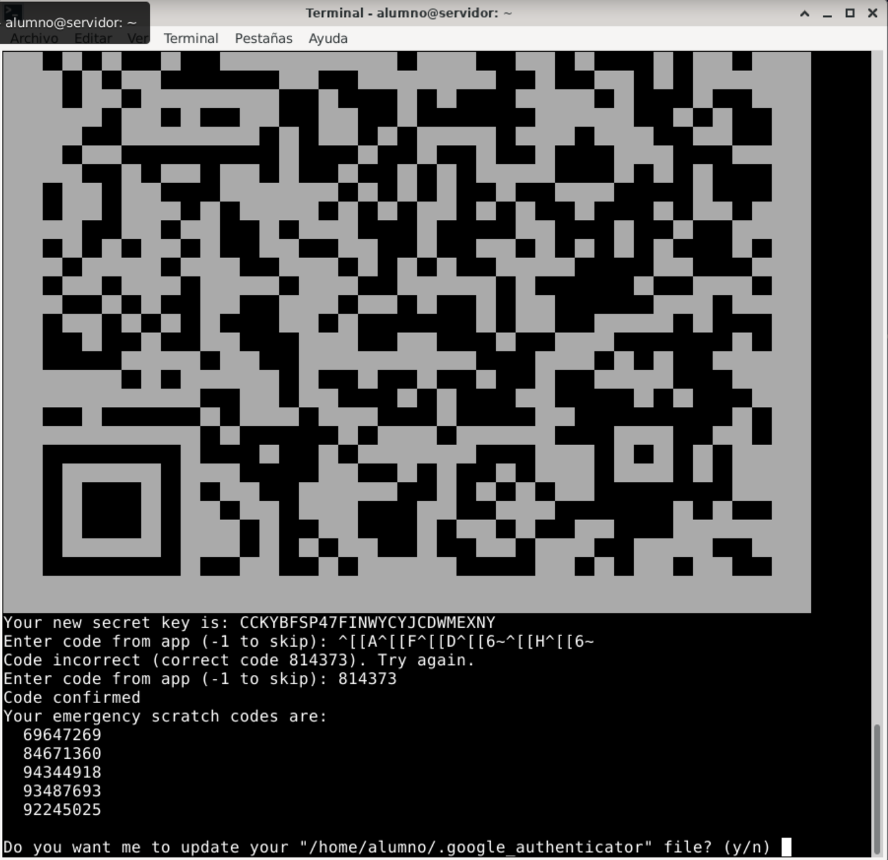

---
title: Autenticación de doble factor por SSH
---


# Autenticación de Doble Factor por SSH

<!-- Adaptado del curso de seguridad del CEFIRE 2020 -->

# Introducción

## Objetivos

Configurar un sistema de autenticación de doble factor mediante *Google Authenticator* en el acceso *ssh* a un sistema GNU/Linux.

{:style="width: 30%;" class="center"}

## Preparación

Para seguir esta práctica se necesita:

* Un dispositivo móvil con la aplicación `Google Authenticator` instalada.
* Una máquina virtual con AlmaLinux 9 configurada y con el servicio ssh en su configuración predeterminada (autenticación mediante contraseña).

# Enunciado

Si ya tienes instalada una versión de ssh y quieres restablecer su configuración a los valores predeterminados, desinstala el servicio ssh mediante el siguiente comando. El uso de `remove` eliminará el paquete sin conservar la configuración.

```sh
sudo dnf remove openssh-server
```

Luego, vuelve a instalar el servicio ssh:

```sh
sudo dnf install openssh-server
```

Asegúrate de que el servicio `sshd` está activo en tu máquina virtual Linux, de que no existen reglas de *firewall* bloqueando el puerto 22/tcp (**sshd**), y que hay visibilidad de red entre la máquina anfitrión y la máquina virtual.

Configura tu máquina virtual en **modo puente** con tu tarjeta de red o en **modo red solo-anfitrión**. En ambos casos, verifica la conectividad mediante `ping` y `ssh`.

Desde un equipo con Windows 10, puedes usar el cliente ssh integrado. Si no está habilitado, puedes activarlo en las características de Windows o descargar un cliente ssh, como `Putty` desde [https://www.putty.org/](https://www.putty.org/).

1. En una terminal de Linux, instala el paquete `libpam-google-authenticator` en el sistema usando el siguiente comando:

    ```sh
    sudo dnf install -y epel-release
    sudo dnf install -y google-authenticator
    ```

2. Una vez instalado `google-authenticator` en Linux, ejecuta la utilidad `google-authenticator` con el usuario que quieras proteger con 2FA:

    ```sh
    google-authenticator
    ```

3. La aplicación te hace una serie de preguntas. Se recomienda que respondas de la siguiente manera:

    ```sh
    Do you want authentication tokens to be time-based (y/n) y
    ```

   La aplicación generará una **clave secreta** (`secret key`) y mostrará un **código QR**. 

   
   
   Abre la app Google Authenticator en tu teléfono, pulsa el botón + para añadir una cuenta y escanea el QR (también puedes introducir la clave secreta manualmente). En la aplicación aparecerá una clave de acceso que se actualiza cada 30 segundos.

4. Introduce el código que muestra el teléfono para confirmar la configuración correcta y revisa los códigos de emergencia (de un solo uso) que te permitirán acceder en caso de no disponer del móvil.

   

5. A partir de aquí, sigue respondiendo a las preguntas que aparecerán en consola:

    ```sh
    Enter code from app (-1 to skip): -1

    Do you want me to update your "/home/usuario/.google_authenticator" file? (y/n) y

    Do you want to disallow multiple uses of the same authentication
    token? This restricts you to one login about every 30s, but it increases
    your chances to notice or even prevent man-in-the-middle attacks (y/n) y

    Do you want to enable rate-limiting? (y/n) y
    ```

6. Al completar estos pasos, se habrá generado el archivo `.google_authenticator` en tu directorio `home`. Puedes visualizarlo con un editor de texto o usando `cat` para examinar su contenido.

7. A continuación, configura el sistema **PAM** (Pluggable Authentication Module) para que use `google_authenticator` en ssh. **PAM** permite implementar distintos métodos de autenticación y gestionar permisos de acceso para varios servicios, como el inicio de sesión y ssh.

   Edita el archivo `/etc/pam.d/sshd` como root:

    ```sh
    sudo nano /etc/pam.d/sshd
    ```

    Comenta la línea `@include common-auth` y añade las siguientes líneas:

    ```sh
    #@include common-auth
    auth requisite pam_unix.so nullok
    auth requisite pam_google_authenticator.so
    ```

    > **Nota**: La opción `nullok` permite a los usuarios iniciar sesión con usuario y contraseña hasta completar la configuración de 2FA. Una vez configurado el 2FA para todos, se recomienda eliminar `nullok` para forzar el uso de 2FA.

8. Edita el archivo de configuración de ssh `/etc/ssh/sshd_config` y habilita `ChallengeResponseAuthentication`:

    ```sh
    ChallengeResponseAuthentication yes
    ```

9. Reinicia el servicio ssh:

    ```sh
    sudo systemctl restart sshd
    ```

10. Ahora, desde otro equipo (por ejemplo, desde la máquina anfitrión), conecta por ssh y verifica que el sistema solicita primero la contraseña y luego el código de verificación de Google Authenticator:

    ```sh
    $ ssh usuario@192.168.100.124
    Password: *****
    Verification code: ******
    ```

Para implementar condiciones específicas, puedes usar el módulo `pam_succeed_if`, que permite aplicar reglas condicionales en `/etc/pam.d/sshd`. Por ejemplo, en el siguiente ejemplo no se solicitará 2FA a los usuarios del grupo `invitados`:

```sh
auth requisite pam_unix.so nullok
auth [success=done default=ignore] pam_succeed_if.so user ingroup invitados
auth requisite pam_google_authenticator.so
```

## Actividad Final

Adjunta una breve memoria en formato PDF con capturas de pantalla del proceso realizado y súbela al Aules en la actividad correspondiente.


# Bibliografía

- Tutorial SSH con google Authenticator en Almalinux **9**: [https://reintech.io/blog/implementing-two-factor-authentication-ssh-almalinux-9](https://reintech.io/blog/implementing-two-factor-authentication-ssh-almalinux-9)

* Google authenticator: [https://support.google.com/accounts/answer/1066447?sjid=1517607344428081015-EU](https://support.google.com/accounts/answer/1066447?sjid=1517607344428081015-EU)
	* Android: [https://play.google.com/store/apps/details?id=com.google.android.apps.authenticator2](https://play.google.com/store/apps/details?id=com.google.android.apps.authenticator2)
	* iOS: [https://apps.apple.com/app/google-authenticator/id388497605](https://apps.apple.com/app/google-authenticator/id388497605)
	
* PAM: [https://www.debian.org/doc/manuals/debian-reference/ch04.es.html](https://www.debian.org/doc/manuals/debian-reference/ch04.es.html)

* Instalar SSH: [https://phoenixnap.com/kb/how-to-enable-ssh-on-debian#htoc-step-5-install-ssh-client-service-optional](https://phoenixnap.com/kb/how-to-enable-ssh-on-debian#htoc-step-5-install-ssh-client-service-optional)

* Tutorial 2FA: [https://4sysops.com/archives/enable-two-factor-authentication-for-ssh-in-linux/](https://4sysops.com/archives/enable-two-factor-authentication-for-ssh-in-linux/)
