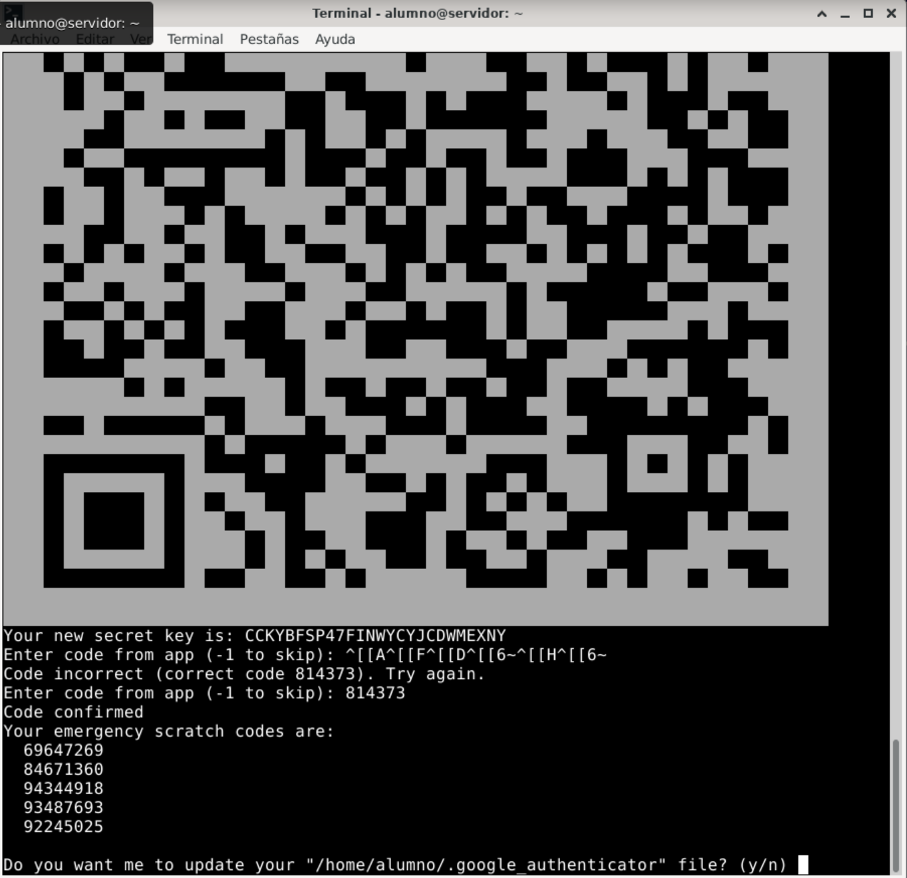

# Autenticación de Doble Factor por SSH en AlmaLinux

<!-- Adaptado del curso de seguridad del CEFIRE 2020 -->

## Introducción

### Objetivos

Configurar un sistema de autenticación de doble factor mediante *Google Authenticator* en el acceso *ssh* a un sistema Almalinux 9.

{:style="width: 30%;" class="center"}

### Preparación

Para seguir esta práctica se necesita:

* Un dispositivo móvil con la aplicación `Google Authenticator` instalada.
* Una máquina virtual con AlmaLinux 9 configurada y con el servicio ssh en su configuración predeterminada (autenticación mediante contraseña).

# Enunciado

### Reinstalar ssh (opcional)

Si ya tienes instalada una versión de ssh y quieres restablecer su configuración a los valores predeterminados, desinstala el servicio ssh mediante el siguiente comando. El uso de `remove` eliminará el paquete sin conservar la configuración.

```sh
sudo dnf remove openssh-server
```

Luego, vuelve a instalar el servicio ssh:

```sh
sudo dnf install openssh-server

sudo systemctl start sshd

sudo systemctl enable sshd
```

Asegúrate de que el servicio `sshd` está activo en tu máquina virtual Linux, de que no existen reglas de *firewall* bloqueando el puerto 22/tcp (**sshd**), y que hay visibilidad de red entre la máquina anfitrión y la máquina virtual.

```sh
sudo firewall-cmd --permanent --add-port=22/tcp

sudo firewall-cmd --reload

sudo firewall-cmd --list-ports

```


Configura tu máquina virtual en **modo puente** con tu tarjeta de red o en **modo red solo-anfitrión**. En ambos casos, verifica la conectividad mediante `ping` y/o `ssh`.

Desde un equipo con Windows, puedes usar el cliente ssh integrado. Si no está habilitado, puedes activarlo en las características de Windows o descargar un cliente ssh, como `Putty` desde [https://www.putty.org/](https://www.putty.org/).

### Instalación de google-authenticator

1. En una terminal de Linux, instala el paquete `libpam-google-authenticator` en el sistema usando el siguiente comando:

    ```sh
    sudo dnf install -y epel-release
    sudo dnf install -y google-authenticator
    sudo dnf install -y qrencode
    ```

2. Una vez instalado `google-authenticator` en Linux, ejecuta la utilidad `google-authenticator` con el usuario que quieras proteger con 2FA:

    ```sh
    google-authenticator
    ```

3. La aplicación te hace una serie de preguntas. Se recomienda que respondas de la siguiente manera:

    ```sh
    Do you want authentication tokens to be time-based (y/n) y
    ```

   La aplicación generará una **clave secreta** (`secret key`) y mostrará un **código QR**. 

   {:style="width: 60%;" class="center"}
   
   Abre la app Google Authenticator en tu teléfono, pulsa el botón + para añadir una cuenta y escanea el QR (también puedes introducir la clave secreta manualmente). En la aplicación aparecerá una clave de acceso que se actualiza cada 30 segundos.

4. Introduce el código que muestra el teléfono para confirmar la configuración correcta y revisa los códigos de emergencia (de un solo uso) que te permitirán acceder en caso de no disponer del móvil.

   {:style="width: 60%;" class="center"}

5. A partir de aquí, sigue respondiendo a las preguntas que aparecerán en consola:

    ```sh   
	Do you want me to update your "/home/fperez/.google_authenticator" file? (y/n) y

	Do you want to disallow multiple uses of the same authentication
	token? This restricts you to one login about every 30s, but it increases
	your chances to notice or even prevent man-in-the-middle attacks (y/n) y

	By default, a new token is generated every 30 seconds by the mobile app.
	In order to compensate for possible time-skew between the client and the server,
	we allow an extra token before and after the current time. This allows for a
	time skew of up to 30 seconds between authentication server and client. If you
	experience problems with poor time synchronization, you can increase the window
	from its default size of 3 permitted codes (one previous code, the current
	code, the next code) to 17 permitted codes (the 8 previous codes, the current
	code, and the 8 next codes). This will permit for a time skew of up to 4 minutes
	between client and server.
	Do you want to do so? (y/n) y
	
	Do you want to enable rate-limiting? (y/n) y
```

6. Al completar estos pasos, se habrá generado el archivo `.google_authenticator` en tu directorio `home`. Puedes visualizarlo con un editor de texto o usando `cat` para examinar su contenido.

7. A continuación, configura el sistema **PAM** (Pluggable Authentication Module) para que use `google_authenticator` en ssh. **PAM** permite implementar distintos métodos de autenticación y gestionar permisos de acceso para varios servicios, como el inicio de sesión y ssh.

   Edita el archivo `/etc/pam.d/sshd` como root:

    ```sh
    sudo nano /etc/pam.d/sshd
    ```

    Añade la siguiente línea en la parte **superior** del fichero:

    ```sh
auth required pam_google_authenticator.so nullok
    ```

    > **Nota**: La opción `nullok` permite a los usuarios iniciar sesión con usuario y contraseña hasta completar la configuración de 2FA. Una vez configurado el 2FA para todos, se recomienda eliminar `nullok` para forzar el uso de 2FA.

8. Edita el archivo de configuración de ssh `/etc/ssh/sshd_config.d/50-redhat.conf` y habilita `ChallengeResponseAuthentication`:

   ```sh
    ChallengeResponseAuthentication yes
   ```

9. Edita el fichero de configuración `/etc/ssh/sshd_config` y haz los siguientes cambios:
 Busca y modifica las siguientes líneas:

   ```sh
    bdInteractiveAuthentication yes
    UsePAM yes
    ```

 Añade al **final** la siguiente línea:

```sh
	AuthenticationMethods password,publickey keyboard-interactive
```

10. Reinicia el servicio ssh:

    ```sh
    sudo systemctl restart sshd
    ```

11. Ahora, desde otro equipo (por ejemplo, desde la máquina anfitrión), conecta por ssh y verifica que el sistema solicita primero el código de Google Authenticator y luego la contraseña :

    ```sh
    ssh usuario@192.168.100.124
    Verification code: ******
    Password: *****
    ```


**Probablemente te fallará.** El motivo es que **SELinux** está interfiriendo en el funcionamiento de google-authenticator.

Para ver los logs relacionados con sshd ejecuta:

```sh
 sudo cat /var/log/audit/audit.log | grep "sshd"
```

`/var/log/audit/audit.log`: Este archivo es mantenido por el servicio de auditoría de Linux y contiene registros detallados de eventos importantes del sistema, como accesos, cambios de configuración, fallos de autenticación, y acciones de SELinux.

Verás algo similar a:

```sh
type=USER_AUTH msg=audit(1730851779.213:558): pid=19367 uid=0 auid=4294967295 ses=4294967295 subj=system_u:system_r:sshd_t:s0-s0:c0.c1023 msg='op=PAM:authentication grantors=? acct="fperez" exe="/usr/sbin/sshd" hostname=192.168.100.104 addr=192.168.100.104 terminal=ssh res=failed'UID="root" AUID="unset"
type=USER_AUTH msg=audit(1730851781.270:559): pid=19365 uid=0 auid=4294967295 ses=4294967295 subj=system_u:system_r:sshd_t:s0-s0:c0.c1023 msg='op=challenge-response acct="fperez" exe="/usr/sbin/sshd" hostname=? addr=192.168.10.104 terminal=ssh res=failed'UID="root" AUID="unset"
```

### Revisar SELinux

SELinux podría estar bloqueando el acceso al módulo `pam_google_authenticator.so` o al archivo `.google_authenticator` en el directorio del usuario `fperez`.

1. Cambia temporalmente a modo `permissive` para probar:

   ```bash
   sudo setenforce 0
   ```

2. Intenta iniciar sesión de nuevo por ssh. Si funciona, es probable que SELinux esté interfiriendo. En ese caso, genera una política específica. 

   ```bash
   sudo ausearch -c 'sshd' --raw | audit2allow -M googleauth_mfa
   sudo semodule -i googleauth_mfa.pp
   ```

El primer comando crea un archivo de módulo de política (`googleauth_mfa.pp`) en el directorio actual. Esta política incluirá permisos adicionales para que `sshd` pueda realizar las acciones necesarias que SELinux estaba bloqueando.

El segundo comando activa la política.

- **`sudo ausearch -c 'sshd' --raw`**:
    
    - **`ausearch`**: Es una herramienta para buscar eventos específicos en los registros de auditoría de SELinux.
    - **`-c 'sshd'`**: Filtra los eventos relacionados con el comando o proceso `sshd`, que es el demonio de SSH. Esto busca todos los eventos de SELinux en los que el proceso `sshd` haya sido bloqueado.
    - **`--raw`**: Muestra los resultados en un formato sin procesar, adecuado para ser pasado a otro comando (en este caso, `audit2allow`).
- **`| audit2allow -M googleauth_mfa`**:
    
    - **`audit2allow`**: Es una herramienta que convierte los mensajes de auditoría de SELinux en una política personalizada que permitirá las acciones previamente bloqueadas.
    - **`-M googleauth_mfa`**: Crea un módulo de política con el nombre `googleauth_mfa`. Este módulo incluirá reglas de SELinux basadas en los eventos registrados en el log, permitiendo las acciones de `sshd` que antes fueron bloqueadas.


3. Vuelve a activar SELinux en modo `enforcing`:

   ```bash
   sudo setenforce 1
   ```

## Actividad Final

Adjunta una breve memoria en formato PDF con capturas de pantalla del proceso realizado: Muestra capturas de los ficheros de configuración y de la autenticación por ssh usando doble factor. Súbela l Aules en la actividad correspondiente. 


# Bibliografía

- [Configuraciones específicas de Almalinux](https://forums.almalinux.org/t/problem-with-mfa-activation/2321/2)

- Tutorial  Arch linux:[https://wiki.archlinux.org/title/Google_Authenticator](https://wiki.archlinux.org/title/Google_Authenticator)

- [Tutorial SSH con Google Authenticator CentOS 9](https://green.cloud/docs/configure-google-authenticator-ssh-on-centos-9/)

- [https://www.a2hosting.com/kb/getting-started-guide/accessing-your-account/enabling-two-factor-authentication-for-ssh/](https://www.a2hosting.com/kb/getting-started-guide/accessing-your-account/enabling-two-factor-authentication-for-ssh/)

- Tutorial SSH con google Authenticator en Almalinux **9**: [https://reintech.io/blog/implementing-two-factor-authentication-ssh-almalinux-9](https://reintech.io/blog/implementing-two-factor-authentication-ssh-almalinux-9)

* Google authenticator: 
	* [https://support.google.com/accounts/answer/1066447?sjid=1517607344428081015-EU](https://support.google.com/accounts/answer/1066447?sjid=1517607344428081015-EU)
	* Android: [https://play.google.com/store/apps/details?id=com.google.android.apps.authenticator2](https://play.google.com/store/apps/details?id=com.google.android.apps.authenticator2)
	* iOS: [https://apps.apple.com/app/google-authenticator/id388497605](https://apps.apple.com/app/google-authenticator/id388497605)
	
* PAM: [https://www.debian.org/doc/manuals/debian-reference/ch04.es.html](https://www.debian.org/doc/manuals/debian-reference/ch04.es.html)

* Instalar SSH: [https://phoenixnap.com/kb/how-to-enable-ssh-on-debian#htoc-step-5-install-ssh-client-service-optional](https://phoenixnap.com/kb/how-to-enable-ssh-on-debian#htoc-step-5-install-ssh-client-service-optional)

* Tutorial 2FA: [https://4sysops.com/archives/enable-two-factor-authentication-for-ssh-in-linux/](https://4sysops.com/archives/enable-two-factor-authentication-for-ssh-in-linux/)
