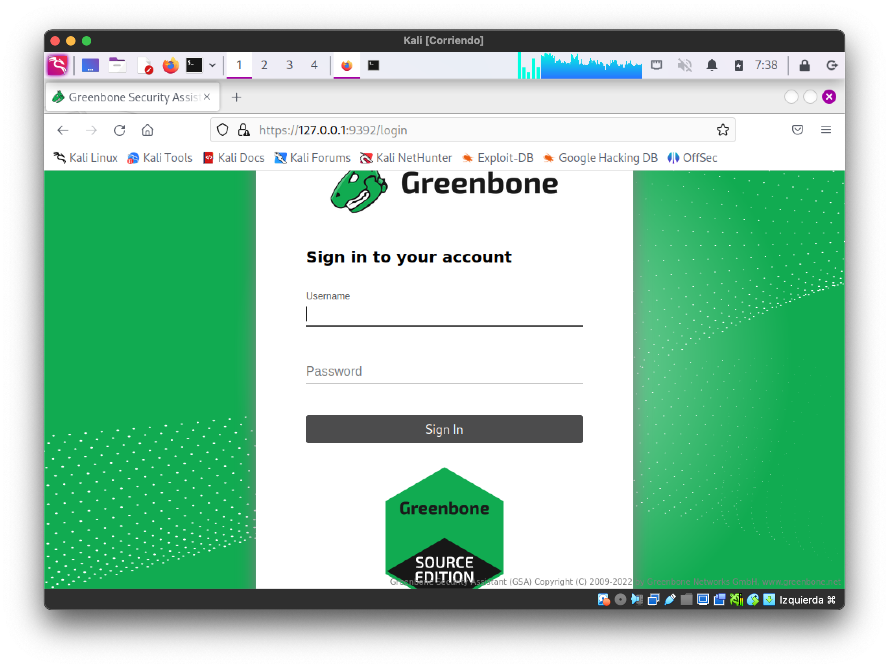
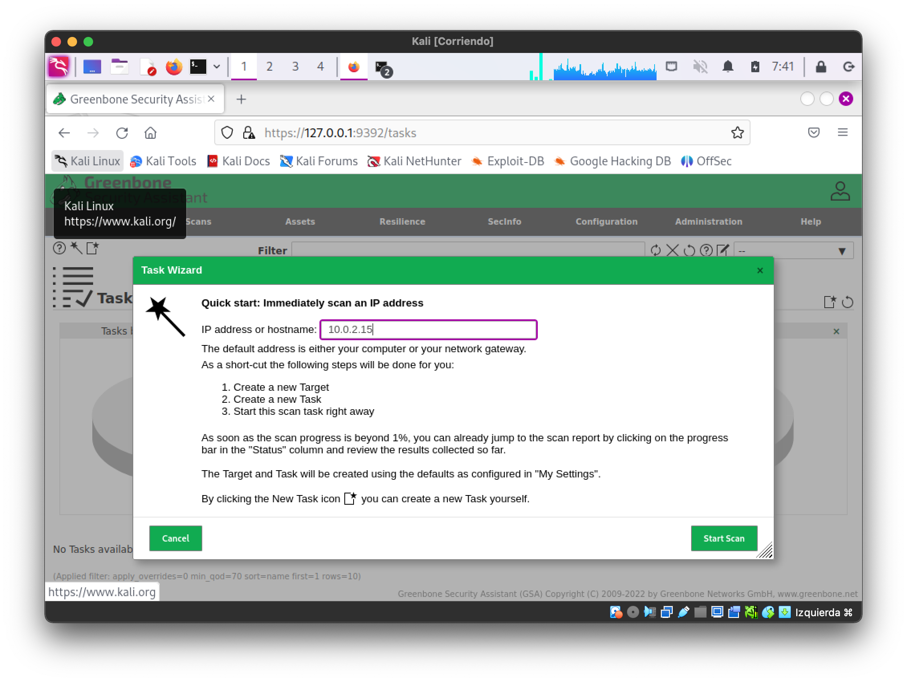
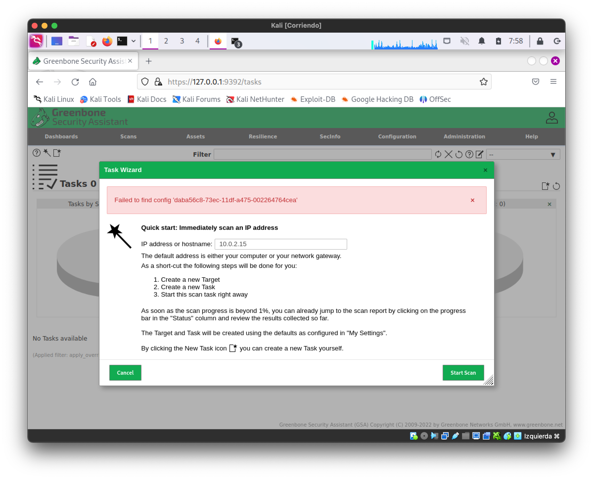

# Auditoría de seguridad con GVM/OpenVAS

Greenbone Vulnerability Management (**GVM**), anteriormente conocido como **OpenVAS**, es una solución de código abierto diseñada para la gestión y evaluación de vulnerabilidades en redes y sistemas informáticos. Proporciona herramientas para identificar, clasificar y gestionar posibles brechas de seguridad, ayudando a las organizaciones a proteger sus infraestructuras contra amenazas conocidas. GVM es ampliamente utilizado por profesionales de seguridad para realizar análisis exhaustivos y asegurar que los sistemas estén actualizados y seguros frente a vulnerabilidades explotables.


{:style="width: 40%;" class="center"}


# Enunciado

En esta ocasión vamos a intentar usar GVM para auditar varias **máquinas remotas**, pueden ser tanto **linux** como windows. **Para** instalar la herramienta instalaremos una nueva máquina virtual con [Kali Linux][getkali]


> **Revisa la bibliografía antes de empezar.**

## Instala la herramienta GVM

Debido a que GVM es una herramienta que se ejecuta en una máquina distinta al objetivo que se desea escanear, es necesario disponer de otra máquina para utilizarla. En esta ocasión, se propone utilizar una máquina virtual en la que instalaremos la distribución[ Kali Linux][getkali] para emplear la herramienta GVM.

### Requisitos:

Mínimos:
- CPU Cores: 2    
- Random-Access Memory: 4GB    
- Hard Disk: 20GB free

Recomendados:
- CPU Cores: 4    
- Random-Access Memory: 8GB    
- Hard Disk: 60GB free

### Actualización del sistema

 Antes de empezar actualizaremos el sistema, es importante no omitir las actualizaciones del sistema, GVM no funcionará bien si no están disponible la última versión de la base de datos PostgreSQL:

```sh
sudo apt-get update
sudo apt upgrade
```

Este proceso de actualización es largo. Se recomienda tomar una instantánea (snapshot)  de la máquina virtual antes de continuar con la práctica.

### Instalación y configuración de GVM

Para **instalar** y configurar GVM ejecutaremos

```sh
sudo apt-get install gvm -y
```

Para **inicializar** GVM:

```sh
sudo gvm-setup
```

> **Este paso lleva bastante tiempo**. Al terminar la configuración **obtendremos la contraseña del usuario, debemos anotarla**. La salida por la consola será algo parecido a lo siguiente:

Si se recibe un error sobre la configuración de la base de datos consulta la sección de [Posibles Problemas](#Problema%201%20Actualización%20de%20la%20versión%20de%20la%20base%20de%20datos%20PostgreSQL) para actualizar la base de datos y después volver a intentar ejecutar el comando `gvm-setup`

```sh

...

[*] Checking Default scanner
[*] Modifying Default Scanner
Scanner modified.

[+] Done
[*] Please note the password for the admin user
[*] User created with password 'c13cc45b-a4a3-4e20-a765-8455f2c547f4'.

[>] You can now run gvm-check-setup to make sure everything is correctly configured
```


Podemos comprobar que todo está correctamente instalado mediante el comando:

```sh
sudo gvm-check-setup
```

Si todo ha ido bien, aparecerá algo similar a:

```

...

It seems like your GVM-23.11.0 installation is OK.
```


> Puede aparecer algún error, se debe seguir las instrucciones indicadas en pantalla para corregirlo. Hay ejemplos en la sección de Posibles problemas.

### Actualización de feeds 

Una vez terminada la instalación y configuración inicial. Podemos ejecutar la **actualizaicón de los feeds** con las definiciones de las vulnerabilidades.  Descargará la base de datos de vulnerabilidades y purebas, **tardará un buen rato**. Deberíamos actualizar los feeds periódicamente para mantener actualizada la base de datos de vulnerabilidades.

> Es importante ejecutar como el usuario `_gvm` las actualizaciones de feeds, si no se hace así tendremos problemas al crear tareas posteriormente. Podremos corregir esta situación cambiando el Feed Owner (explicado en la sección de Posibles problemas)

```sh
sudo runuser -u _gvm -- greenbone-feed-sync
```


Desde la interfaz web de GVM podemos consultar el estado de los feeds en `Administration->Feed Status`


<!--
  
Update NVT Feed 

sudo runuser -u _gvm -- greenbone-nvt-sync 

Update SCAP Feed 

sudo runuser -u _gvm -- greenbone-feed-sync --type SCAP 

Update CERT Feed 

 sudo runuser -u _gvm -- greenbone-feed-sync --type CERT 

 Update gvmd DATA Feed 
 
 sudo runuser -u _gvm -- greenbone-feed-sync --type GVMD_DATA
-->

<!-- antes era:
gvm-feed-update -h
-->

### Inicio y detención de GVM

Para iniciar GVM:

```sh
sudo gvm-start
```

Veremos una salida similar a:

```sh
[sudo] password for test: 
[>] Please wait for the GVM services to start. 
[>] 
[>] You might need to refresh your browser once it opens. 
[>] 
[>] Web UI (Greenbone Security Assistant): https://127.0.0.1:9392
```

Se debería lanzar el navegador Firefox de forma automática, si no lo hiciera podremos hacerlo de forma manual a través de  [https://127.0.0.1:9392](https://127.0.0.1:9392) 

{:style="width: 70%;" class="center"}

Recuerda que la cuenta es `admin`y la contraseña se generó al ejecutar el comando `sudo gvm-setup`.

Para detener el servicio (cuando no se quiera seguir utilizando):

```sh
 sudo gvm-stop
```

Una vez instalado y configurado ya  puedes usar la herramienta para escanear las vulnerabilidades de la máquina objetivo.

## Utilización de GVM

> Antes de iniciar el primer escaneo, Greenbone necesita analizar las fuentes de vulnerabilidades y almacenarlas en la base de datos PostgreSQL de gvmd; de lo contrario, no podrá iniciar o completar los escaneos sin errores. Este proceso se inicia durante la etapa de configuración, pero **generalmente toma desde unos pocos minutos hasta varias horas para completarse**, dependiendo de los recursos de tu sistema.

Pudes comprobar el estado de actualizaicón desde la interfaz web de GVM podemos consultar el estado de los feeds en `Administration->Feed Status`. 


## Crear una tarea

Debemos usar el menú `scans->tasks`, crearemos una nueva tarea utilizando el wizard (icono de la varita mágica) y después la ejecutaremos.


{:style="width: 70%;" class="center"}


## Preparación de máquina objetivo de escaneo

Instala algunos servicios en las máquinas que serán escaneadas antes de comenzar la auditoría. Puedes usar alguna de las máquinas virtuales que ya tengas de otras asignaturas, o puedes configurar una a propósito para realizar las pruebas.

Se sugiere usar una de las máquinas usadas previamente (AlmaLinux). En la máquina que será objetivo de la auditoría se debe instalar algunos servicios, tales como SSH, Apache, MariaDB, etc. De este modo tendremos algo que escanear con GVM.

SSH

```sh
sudo dnf install openssh-server
```

Apache
```sh
sudo dnf install httpd
```

Después de instalar Apache, puedes iniciar y habilitar el servicio con:
```sh
sudo systemctl start httpd
sudo systemctl enable httpd
```


MariaDB
Para instalar el servidor MariaDB:
```sh
sudo dnf install mariadb-server
```

Y luego iniciar el servicio:
```sh
sudo systemctl start mariadb
sudo systemctl enable mariadb
```


## Tareas a realizar

> 1. **Instala GVM**    
>     - Proporciona evidencias de la instalación, como capturas de pantalla del proceso o comandos ejecutados. Descripción de problemas encontrados y como se han resuelto.
> 2. **Escanea un mínimo de dos máquinas**    
>     - Las máquinas pueden tener diferentes sistemas operativos o servicios instalados.
>     - Asegúrate de contar con autorización para escanear estas máquinas.
> 3. **Muestra los resultados de los escaneos realizados**    
>     - Presenta los informes generados por GVM.
>     - Incluye capturas de pantalla y explica brevemente los hallazgos.
> 4. **Revisa los informes y comenta los problemas encontrados**    
>     - Analiza las vulnerabilidades detectadas.
>     - Propón soluciones o medidas de mitigación para cada problema identificado.

## Advertencias y consideraciones éticas

- **Importante:** Asegúrate de tener autorización para realizar escaneos de vulnerabilidades en las máquinas objetivo. Realizar escaneos sin permiso puede tener implicaciones legales y éticas.

# Posibles Problemas 

Es posible encontrar problemas durante la instalación y configuración. Debes haber seguido los pasos descritos anteriormente:

- Haber actualizado el sistema.
- Configurar la nueva versión de la base de datos PostgreSQL
- Haber comprobado la corrección de la instalación.
- Actualizar los feeds.
- Arrancar GVM y **esperar un buen rato** para que se importen las nuevas vulnerabilidades.

Después sigue las indicaciones para solucionar problemas que encontrarás en el siguiente enlace: [https://greenbone.github.io/docs/latest/22.4/kali/troubleshooting.html](https://greenbone.github.io/docs/latest/22.4/kali/troubleshooting.html)

## Problema 1: Actualización de la versión de la base de datos PostgreSQL

Se puede solucionar siguiendo esta guía que se ha actualizado y traducido más adelante: [https://greenbone.github.io/docs/latest/22.4/kali/troubleshooting.html](https://greenbone.github.io/docs/latest/22.4/kali/troubleshooting.html)

###  Actualización de Clúster PostgreSQL

Si encuentras un error relacionado con la versión de PostgreSQL al ejecutar `sudo gvm-setup`, debes actualizar la versión instalada de PostgreSQL a la versión más reciente requerida por el paquete nativo `gvm` de Kali. En el ejemplo a continuación se muestra la actualización de PostgreSQL versión 15 a la versión 16, pero estos pasos funcionarán para actualizar entre cualquier versión.

### Error que indica la necesidad de actualizar el clúster de PostgreSQL

```sh
┌──(dev㉿kali)-[~]
└─$ sudo gvm-setup

[>] Starting PostgreSQL service
[-] ERROR: The default PostgreSQL version (15) is not 17 that is required by libgvmd
[-] ERROR: libgvmd needs PostgreSQL 17 to use the port 5432
[-] ERROR: Use pg_upgradecluster to update your PostgreSQL cluster
```

Para completar la configuración de la Greenbone Community Edition, debes:

1. Migrar la configuración y los datos de PostgreSQL a un clúster actualizado.
2. Configurar el nuevo clúster para que utilice el puerto `5432`.
3. Instalar la extensión más reciente de `pg-gvm`.
4. Corregir la discrepancia de COLLATION en la base de datos `gmvd`.
5. Resolver dependencias pendientes.
6. Completar la configuración de Greenbone Community Edition.

> **Advertencia:** Considera el contenido de tu base de datos PostgreSQL existente y realiza copias de seguridad antes de proceder. Además, ten en cuenta que la actualización de paquetes de Kali Linux podría afectar el funcionamiento de tu sistema.

Puedes listar todos los clústeres PostgreSQL existentes usando el comando `pg_lsclusters`.

### Listado de los clústeres PostgreSQL existentes

```sh
┌──(dev㉿kali)-[~]
└─$ pg_lsclusters
16  main    5432 online postgres /var/lib/postgresql/16/main /var/log/postgresql/postgresql-16-main.log                                                   
17  main    5433 online postgres /var/lib/postgresql/17/main /var/log/postgresql/postgresql-17-main.log    
```

El resultado muestra dos clústeres en línea escuchando en los puertos `5432` y `5433`. Si el clúster objetivo `16/main` ya existe, debe eliminarse temporalmente para evitar el error `Error: target cluster 16/main already exists`. La existencia del clúster `16/main` no significa necesariamente que el clúster antiguo ya haya sido actualizado; simplemente indica que un clúster para esa versión está presente.

Intentar actualizar a un clúster existente fallará.

```sh
┌──(dev㉿kali)-[~]
└─$ sudo pg_upgradecluster 16 main 17
Error: target cluster 17/main already exists
```

Para completar la actualización, primero se debe detener y eliminar el clúster `16/main`.

```sh
sudo pg_ctlcluster 17 main stop
sudo pg_dropcluster 17 main
```

Ahora actualiza el clúster antiguo al nuevo. El comando `pg_upgradecluster` migra las bases de datos del clúster antiguo al nuevo.

### Sintaxis básica del comando `pg_upgradecluster`

```sh
pg_upgradecluster [options] oldversion oldclustername [newversion]
```

Para actualizar tu clúster PostgreSQL, usa el siguiente comando:

```sh
sudo pg_upgradecluster 16 main
```

Si no necesitas el clúster antiguo de PostgreSQL, elimínalo.

```sh
sudo pg_dropcluster 16 main
```

Y elimina los paquetes de PostgreSQL 15:

```sh
sudo apt autoremove
```

Ahora solo existe el nuevo clúster PostgreSQL.

```sh
┌──(dev㉿kali)-[~]
└─$ pg_lsclusters
Ver Cluster Port Status Owner    Data directory              Log file
17  main    5432 online postgres /var/lib/postgresql/16/main /var/log/postgresql/postgresql-16-main.log
```

---

### 2. Configurar el Puerto de PostgreSQL

El comando `pg_upgradecluster` generalmente configura la nueva versión de PostgreSQL para usar el puerto estándar `5432`, requerido por Greenbone Community Edition. Sin embargo, si el puerto no se cambia automáticamente, debes modificarlo manualmente editando el archivo de configuración `postgresql.conf` y reiniciando el servicio systemd de PostgreSQL.

Para ubicar el archivo de configuración, ejecuta el siguiente comando:

```sh
sudo -u postgres psql -c 'SHOW config_file'
```

Salida esperada:

```sh
┌──(dev㉿kali)-[~]
└─$ sudo -u postgres psql -c 'SHOW config_file'

               config_file
-----------------------------------------
 /etc/postgresql/16/main/postgresql.conf
(1 row)
```

Edita el archivo de configuración para cambiar el puerto de conexión a `5432` y reinicia PostgreSQL.

```sh
sudo nano /etc/postgresql/16/main/postgresql.conf
```

```sh
# - Connection Settings -

#listen_addresses = 'localhost'         
-port = 5433                             
+port = 5432                             
max_connections = 100                   
```

Reinicia el servicio PostgreSQL:

```sh
sudo systemctl restart postgresql
```

---

### 3. Instalar la Extensión más Reciente de `pg-gvm` para PostgreSQL

Cuando se actualiza el clúster PostgreSQL a una versión más reciente, también se debe actualizar el paquete `pg-gvm`. Si no lo actualizas antes de ejecutar `sudo gvm-check-setup`, encontrarás un error al reconstruir la base de datos `gvmd`:

```sh
[*] Creating extension pg-gvm
ERROR:  extension "pg-gvm" is not available
DETAIL:  Could not open extension control file "/usr/share/postgresql/16/extension/pg-gvm.control": No such file or directory.
HINT:  The extension must first be installed on the system where PostgreSQL is running.
```

Busca las versiones disponibles de `pg-gvm`:

```sh
apt-cache search pg-gvm
```

Instala la versión correspondiente al PostgreSQL actualizado:

```sh
sudo apt install postgresql-17-pg-gvm -y
```


## Problema 2: Errores al ejecutar `gvm-check-setup`

A continuación se detallan algunos posibles errores, como nota indicar la importancia de ejecutar la actualización de feeds con el usuario _gvm, si no se hace así se tendrá que cambiar el feed owner posteriormente.

### Error 1

```sh
sudo gvm-check-setup  

gvm-check-setup 23.11.0
  Test completeness and readiness of GVM-23.11.0
Step 1: Checking OpenVAS (Scanner)... 
        OK: OpenVAS Scanner is present in version 23.9.0.
        OK: Notus Scanner is present in version 22.6.4.
        ERROR: No CA certificate file for Server found.
        FIX: Run 'sudo runuser -u _gvm -- gvm-manage-certs -a -f'.

 ERROR: Your GVM-23.11.0 installation is not yet complete!

Please follow the instructions marked with FIX above and run this
script again.
```

Tal como indica el error, ejecuto el siguiente comando para corregirlo:

```sh
sudo runuser -u _gvm -- gvm-manage-certs -a -f
```

### Error 2

Vuelvo a comprobar la instalación con `sudo gvm-check-setup` y obtengo otro error:

```sh
sudo gvm-check-setup   

...

ERROR: Directories containing the NVT collection not found.
        FIX: Run the NVT synchronization script greenbone-feed-sync.
        sudo greenbone-feed-sync --type nvt
```

Ejecuto el comando sugerido:

```sh
sudo runuser -u _gvm greenbone-feed-sync --type nvt
```

### Error 3

Vuelvo a comprobar la instalación con `sudo gvm-check-setup` y obtengo otro error:

```sh
sudo gvm-check-setup   

...

tep 4: Checking data ... 
        ERROR: SCAP DATA are missing.
        FIX: Run the SCAP synchronization script greenbone-feed-sync.
        sudo greenbone-feed-sync --type scap.

 ERROR: Your GVM-23.11.0 installation is not yet complete!

Please follow the instructions marked with FIX above and run this
script again.

```


ejecuto el comanodo:

```
sudo runuser -u _gvm greenbone-feed-sync --type scap
```

### Error 4


```
Step 4: Checking data ... 
        OK: SCAP data found in /var/lib/gvm/scap-data.
        ERROR: CERT data are missing.
        FIX: Run the CERT synchronization script greenbone-feed-sync.
        sudo greenbone-feed-sync --type cert.

 ERROR: Your GVM-23.11.0 installation is not yet complete!

Please follow the instructions marked with FIX above and run this script again.

```

Tal como me indica el error, ejecutaré el siguiente comando para solucionarlo, pero usaré el usuario `_gvm` para evitar problemas de permisos. Las conexiones con el servidor remoto pueden fallar en algún momento, espera unos minutos y vuelve a intentarlo más tarde si te sucede.

```sh
sudo runuser -u _gvm greenbone-feed-sync --type cert
```

Ahora, se debe volver a ejecutar el comando `gvm-check-setup` para comprobar si ahora está todo correcto. 


## Problema 3: Falta de pestañas en interfaz web

No has actualizado los paquetes antes de instalar, actualiza y sigue las instrucciones de este enlace:
[https://greenbone.github.io/docs/latest/22.4/kali/troubleshooting.html](https://greenbone.github.io/docs/latest/22.4/kali/troubleshooting.html)

Ve comprobando si está todo correcto con el siguiente comando que te irá indicando los elementos que todavía no estén correctos.


```sh
sudo gvm-check-setup
```

## Problema 4: Problemas al crear una tarea


#### Failed to find port_list '33d0cd82-57c6-11e1-8ed1-406186ea4fc5'


Prueba a ejecutar el siguiente comando y vuelve a probar:

```sh
sudo -u _gvm greenbone-feed-sync --type GVMD_DATA
sudo -u _gvm gvmd --rebuild-gvmd-data=all
```

### Cambio del Feed owner

Si alguna vez te encuentres con un problema como el siguiente, o algún error relacionado con "Feed owner" puedes solucionarlo con las instrucciones que tienes a continuación.

{:style="width: 70%;" class="center"}


Parece que el problema está relacionado con el cambio de **Feed Owner,** que debería realizarse ejecutando los comandos `gvmd` con el usuario `gvm`

Si te sucede esto se puede solucionar siguiendo los siguientes pasos: 

1 - Obtener el id de usario 

```sh
sudo runuser -u _gvm -- gvmd --get-users --verbose
```

Obtendremos algo similar a:

admin 5fac1198-14eb-4c95-b5ef-54db7d6b3ae1

En el siguiente comando debemos sustituir `uid` por el valor que hemos obtenido al ejecutar el comando anterior.

```sh
sudo runuser -u _gvm -- gvmd --modify-setting 78eceaec-3385-11ea-b237-28d24461215b --value <uid>
```

Con el resultado del ejemplo anterior el comando quedaría de la siguiente forma:

`sudo runuser -u _gvm -- gvmd --modify-setting 78eceaec-3385-11ea-b237-28d24461215b --value 5fac1198-14eb-4c95-b5ef-54db7d6b3ae1
`

Reiniciamos GVM:

```sh
sudo gvm-stop
sudo gvm-start
```


[troubleshooting]:https://greenbone.github.io/docs/latest/22.4/kali/troubleshooting.html
[getkali]:https://www.kali.org/get-kali/

# Bibliografía

* [GreenBone Community Edition](https://community.greenbone.net/)
* Greenbone Community Edition: [Documentación](https://greenbone.github.io/docs/latest/)
	*  [Arquitectura OpenVAS](https://greenbone.github.io/docs/latest/background.html)
* Desarrollador Greenbone:  [https://www.greenbone.net/](https://www.greenbone.net/)
	* Docs productos greenbone: [https://docs.greenbone.net/](https://docs.greenbone.net/)
- Foros [Greenbone Community](https://forum.greenbone.net/)


### Instalación Usando Kali Linux
- Instalación de Kali en [VirtualBox](https://www.kali.org/docs/virtualization/install-virtualbox-guest-vm/)
* GVM Kali Linux [Install Guide](https://greenbone.github.io/docs/latest/22.4/kali/index.html)
* GVM Kali Linux [Troubleshooting][troubleshooting]
* GVM Kali Linux [Tool Documentation](https://www.kali.org/tools/gvm/)
* GVM[ Feed Synchronization](https://greenbone.github.io/docs/latest/22.4/source-build/feed-sync.html)

### Instalación docker

*  Greenbone Community Containers:[https://greenbone.github.io/docs/latest/22.4/container/index.html](https://greenbone.github.io/docs/latest/22.4/container/index.html)

### Problemas

- Faltan opciones en WebUI: [https://forum.greenbone.net/t/gui-not-showing-all-options-kali/19215/10](https://forum.greenbone.net/t/gui-not-showing-all-options-kali/19215/10)
* Solución al problema al crear tareas (Kali purple): [https://forum.greenbone.net/t/scan-config-cant-be-created-failed-to-find-config-daba56c8-73ec-11df-a475-002264764cea/8938/28](https://forum.greenbone.net/t/scan-config-cant-be-created-failed-to-find-config-daba56c8-73ec-11df-a475-002264764cea/8938/28)
* Solución al problema al crear tareas usando Kali standard (Actualizar feeds y esperar): [https://www.youtube.com/watch?v=DoNaGl1XHYE&t=470s](https://www.youtube.com/watch?v=DoNaGl1XHYE&t=470s)
- [Error al crear tarea: "Failed to find port ..."]( https://forum.greenbone.net/t/cannot-start-a-scan-task-with-task-wizard-failed-to-find-port-list-33d0cd82-57c6-11e1-8ed1-406186ea4fc5/13128/7)
- [GitHub greenbone-feed-sync](https://github.com/greenbone/greenbone-feed-sync)

- [Failed to find port_list...](https://greenbone.github.io/docs/latest/22.4/source-build/troubleshooting.html#failed-to-find-config)


## Vídeo tutoriales GVM

Introducción a Greenbone:

<iframe width="560" height="315" src="https://www.youtube.com/embed/Wqff4BDphDI?si=oGK08xGYE3XFirbq" title="YouTube video player" frameborder="0" allow="accelerometer; autoplay; clipboard-write; encrypted-media; gyroscope; picture-in-picture; web-share" referrerpolicy="strict-origin-when-cross-origin" allowfullscreen></iframe>


Instalación usando docker (no recomendado):

<iframe width="560" height="315" src="https://www.youtube.com/embed/2mPOsBVDS2E?si=XhqH53kmK7o3zCWS" title="YouTube video player" frameborder="0" allow="accelerometer; autoplay; clipboard-write; encrypted-media; gyroscope; picture-in-picture; web-share" referrerpolicy="strict-origin-when-cross-origin" allowfullscreen></iframe>

Primer escaneo:

<iframe width="560" height="315" src="https://www.youtube.com/embed/MH4vVhHPm4s?si=C0JW7AyUGUUs9hVZ" title="YouTube video player" frameborder="0" allow="accelerometer; autoplay; clipboard-write; encrypted-media; gyroscope; picture-in-picture; web-share" referrerpolicy="strict-origin-when-cross-origin" allowfullscreen></iframe>

Configuración de filtros.

<iframe width="560" height="315" src="https://www.youtube.com/embed/4V7VQAxwtxM?si=tc1ZVHdKkrw5rPgA" title="YouTube video player" frameborder="0" allow="accelerometer; autoplay; clipboard-write; encrypted-media; gyroscope; picture-in-picture; web-share" referrerpolicy="strict-origin-when-cross-origin" allowfullscreen></iframe>


## Vídeo comparación Nessus y GVM

<iframe width="560" height="315" src="https://www.youtube.com/embed/sEzN2U4Pqcs?si=Q24I_02Igo9ffmwz" title="YouTube video player" frameborder="0" allow="accelerometer; autoplay; clipboard-write; encrypted-media; gyroscope; picture-in-picture; web-share" referrerpolicy="strict-origin-when-cross-origin" allowfullscreen></iframe>