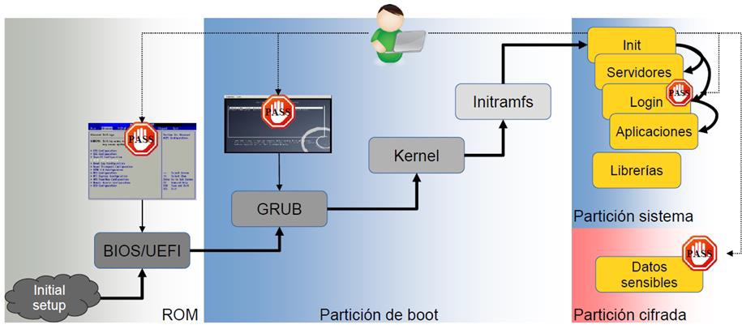
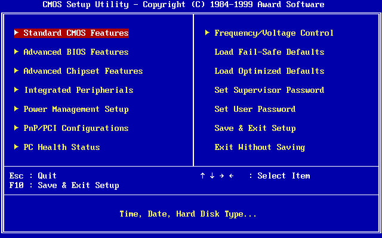
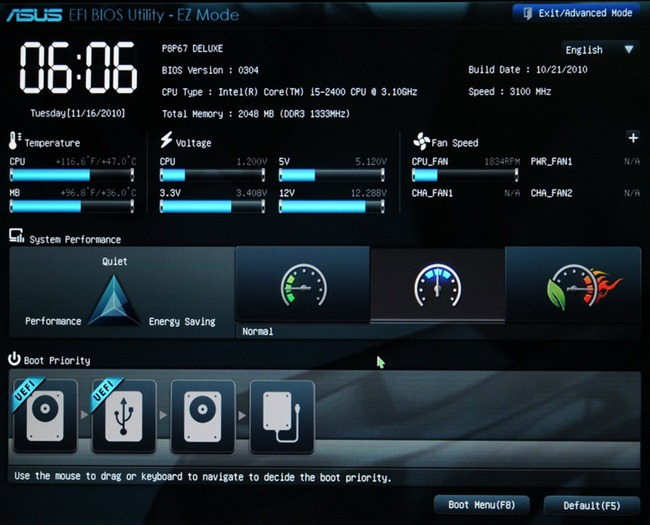

<!-- .slide: data-background="#2C3E50" -->
# Fortificación de Hosts

## Autenticación, Arranque Seguro y Cifrado

---

# Introducción

--

### Introducción

- **Importancia de la Seguridad de Hosts**
  - Protección de sistemas y datos sensibles.
  - Prevención de **accesos no autorizados**.
- **Objetivo**
  - Fortalecer la **integridad, confidencialidad y disponibilidad** de la información.
  - Implementar medidas clave de ciberseguridad centradas en el **acceso**.

#### Queremos evitar

* Evitar la instalación de **Rootkits / Bootkits**
* Evitar **acceso a los datos** almacenados en los discos del sistema 

--

### Autenticación, Arranque Seguro y Cifrado

--

#### 1. **Control de Acceso y Autenticación**
   - **Contraseñas** Seguras
   - Autenticación Multifactor (**MFA**)
   - **Biometría** y Autenticación Avanzada

--

####  2. **Seguridad en el Arranque**
   - **BIOS/UEFI**: Configuración Segura
   - Gestores de Arranque: Protección y **Cifrado**
   - Medidas de **Seguridad Física**

--

####  3. **Cifrado y Protección de Datos**
   - Cifrado de **Discos**: BitLocker, LUKS, etc.
   - Cifrado de Particiones y **Carpetas**
   - Protección de Datos en **Reposo y en Tránsito**

---

### Medidas de seguridad en el arranque seguro

<!-- .element width="80%" -->

--

### Rootkit

**Rootkit**: Conjunto de programas maliciosos que anidan en los ordenadores a través de huecos en el sistema de seguridad, concediendo así a los atacantes **acceso remoto permanente**

<!--
> [https://www.ionos.es/digitalguide/servidores/seguridad/rootkit/](https://www.ionos.es/digitalguide/servidores/seguridad/rootkit/)
-->

--

### Tipos de Rootkit I

* **Rootkits de firmware**.  Su función es sobreescribir el firmware de nuestro sistema por otro malicioso para que el rootkit se inicie antes que el sistema operativo.

* **Rootkits de kernel**.  Parecido al de firmware, pero este rootkit sobreescribe un trozo del kernel de nuestro sistema para poder iniciar antes de cargarse el sistema operativo de forma automática.

--

### Tipos de Rootkit II

* **Rootkits de controlador**.  Engaña al sistema haciéndose pasar por uno de los contradores del sistema que en teoría debería ser de confianza.

* **Bootkits**.  Funciona de forma similar al de firmaware o el de kernel, pero en este caso reemplaza el GRUB del sistema para indicar que el bootkit se inicie antes del Sistema Operativo

--

### Medidas de seguridad en arranque I

* **Arranque seguro**: los equipos que dispongan de un firmware **UEFI y TPM** (Trusted Plataform Module) se pueden configurar para solamente inicien los sistemas de seguridad que consideren que son de confianza.

* **Antimalware de inicio temprano**: prueba que todos los controladores existentes sean de confianza y a los que no lo son les impide el arranque.

--

### Medidas de seguridad en arranque II

* **Arranque de confianza**: el sistema comprueba la integridad de cada componente del arranque antes de cargarse.

* **Arranque medido**: el firmware se guarda el proceso de arranque del sistema y el propio sistema lo manda a un servidor para valorar el estado actual del equipo

---

#  Control de Acceso y Autenticación

---

### **Contraseñas Seguras**

- **Políticas de Contraseñas**
  - Longitud mínima de 12 caracteres.
  - Uso de mayúsculas, minúsculas, números y símbolos.
  - Cambio periódico cada 60 o 90 días.
  - Historial para evitar reutilización.
  - Bloqueo tras intentos fallidos.

--

- **Beneficios e Inconvenientes**
  - **Beneficios**: Mayor seguridad, difícil de descifrar.
  - **Inconvenientes**: Posible frustración, malas prácticas.

- **Mejores Prácticas**
  - Educación al usuario.
  - Uso de gestores de contraseñas.

---

### Autenticación Multifactor (MFA)

La autenticación multifactor añade capas adicionales al proceso de autenticación, combinando algo que el usuario **sabe** (contraseña), algo que **tiene** (token) y algo que **es** (biometría).

- **Implementación de MFA**
  - Tokens físicos (ej. [YubiKey](https://www.yubico.com/)).
  - Aplicaciones móviles ([Google Authenticator](https://play.google.com/store/apps/details?id=com.google.android.apps.authenticator2&hl=es&pli=1)).
  - SMS y correo electrónico (menos seguros).

--

- **Beneficios e Inconvenientes**
  - **Beneficios**: Mayor seguridad, protección contra phishing.
  - **Inconvenientes**: Menos conveniente, dependencia de dispositivos.

- **Consideraciones**
  - Equilibrio entre seguridad y usabilidad.
  - Procedimientos de recuperación seguros.

---

### **Biometría y Autenticación Avanzada**

- **Tipos de Autenticación Biométrica**
  - Huella dactilar.
  - Reconocimiento facial.
  - Escaneo de iris y retina.
  - Reconocimiento de voz.

--

- **Beneficios e Inconvenientes**
  - **Beneficios**: Alta seguridad, conveniencia.
  - **Inconvenientes**: Preocupaciones de **privacidad**, posibles errores.

- **Consideraciones de Seguridad**
  - Almacenamiento cifrado de datos biométricos.
  - Cumplimiento de regulaciones (ej. GDPR).

---

# Seguridad en el Arranque

---

## BIOS/UEFI

--

### **BIOS/UEFI**

**BIOS/UEFI**: **Firmware** que se ejecuta en el arranque del equipo. Primer software que ejecuta el ordenador.

- Proporcionado por el fabricante.
- **Alojado en memoria ROM específica** del equipo.
- Software en otros periféricos: tarjeta gráficas, controladores de tarjetas de red,...

#### Vector de ataque

* Malware **muy persistente** y difícil de detectar
	* Resiste reinstalaciones del SO 
* Procedimiento operativo de actualización de este software
* No existe control de usuarios

--

### BIOS/UEFI: Configuración Segura

- **Medidas de Seguridad**
  - Establecer **contraseñas** de configuración y arranque.
  - Habilitar **Arranque Seguro** (Secure Boot).
  - Deshabilitar arranque desde dispositivos externos.
  - Mantener firmware actualizado.
  - Asegurar cadena de suministro hardware

- **Beneficios e Inconvenientes**
  - **Beneficios**: Previene ataques de firmware.
  - **Inconvenientes**: Configuraciones incorrectas pueden causar fallos.

--

### BIOS - Basic Input Output System

**BIOS** (Basic Input Output System) 

* Creado en **1975**
* Firmware guardado en una memoria ROM 
* Primer programa iniciado al encenderse.
* El código se ejecuta a 16 bits	

--

Las funciones principales son:

* POST (Power-On Self-Test), pruebas para comprobar que hardware se inicializa correctamente
* Proporciona entrada y salida (teclado y pantalla)
* Permite configurar parámetros del hardware
* Arranca el SO una vez completado el POST.

--

### UEFI - Unified Extensible Firmware Interface

**UEFI** (Unified Extensible Firmware Interface) 

* Sucesor de BIOS, desarrollado en **2002** por Intel
* Mismas funciones que BIOS 
* El código de UEFI se ejecuta a 32 o 64 bits

--

### UEFI - Diferencias con BIOS:

* UEFI dispone de una i**nterfaz gráfica**
* UEFI tiene capacidad de utilizar también el ratón
* Más rápido en el arranque 
* **UEFI puede conectarse a internet para actualizarse**
* Puede hacer comprobaciones de seguridad durante el arranque (**Arranque seguro**)

---

## Seguridad en acceso: BIOS

<!-- .element width="80%" -->

--

## Seguridad en acceso: UEFI

<!-- .element width="80%" -->

--

## Seguridad en acceso:  BIOS/UEFI

 El uso de **contraseña para entrar en la BIOS** evitará que personas no autorizadas modifiquen la configuración del ordenador, así como cambios en el orden de arranque.

* Se evita arrancar el sistema desde medios extraíbles
* Se evita acceso a contenido de discos no cifrados

**No es un método realmente fiable**, pero pone las cosas un poco más difíciles a los atacantes.

--

## Seguridad en acceso:  BIOS/UEFI

Si se tiene **acceso físico** al ordenador y sobre todo, si se puede abrir: Es posible saltarse este mecanismo.

* Hay fabricantes que incluyen una **contraseña por defecto**, a modo de puerta trasera.

* Páginas como [bios-pw.org](https://bios-pw.org/) donde indican la contraseña por defecto según el código de error de la BIOS cuando se escribe la contraseña incorrecta varias veces.
  
* Existen programas que como administrador del equipo pueden modificar o eliminar la contraseña de la BIOS. (Ej: [CmosPwd](https://www.cgsecurity.org/wiki/CmosPwd))

* [Artículo sobre cómo resetear password de BIOS https://www.wikihow.com/Reset-a-BIOS-Password](https://www.wikihow.com/Reset-a-BIOS-Password)

--

### Actualización del firmware

* Firmware obtenido desde las web oficial del fabricante
	* Comprobación de la **integridad** de firmware 
	* Precaución con **actualizaciones automáticas**
* Revisión del proceso de arranque

* Reinicio configuración accediendo físicamente al sistema. 
	* Complementar con **medidas físicas**
	* Acceso a puertos USB de equipos.

---

## Arranque seguro UEFI 

--

### UEFI Secure Boot (**SB**):

 Mecanismo de verificación para garantizar que el **código lanzado por el firmware UEFI** de una computadora es confiable. 
- Evita la **carga y ejecución de código malicioso temprano** (antes de que el sistema operativo haya sido cargado).
- **SB** funciona utilizando **firmas criptográficas**
- Cada programa que carga el firmware debe incluir una firma 
- Si la firma no es válida se detendrá la ejecución

--

## Arranque seguro UEFI y Linux

La mayoría del hardware x86 viene precargado de fábrica con las **claves de Microsoft**. 

- Esto significa que el firmware de estos sistemas confiará en **binarios firmados por Microsoft**
- La mayoría de los sistemas nuevos tienen **SB activado por defecto**:
	- no ejecutarán ningún código sin firmar de forma predeterminada
- Es posible cambiar la configuración del firmware para deshabilitar **SB** o para inscribir claves de firma adicionales.

--

## Ejemplos de malware BIOS/UEFI

- [https://blog.elhacker.net/2022/07/encuentran-un-rootkit-chino-llamado-CosmicStrand-BIOS-UEFI-placa-bases-gigabyte-asus.html](https://blog.elhacker.net/2022/07/encuentran-un-rootkit-chino-llamado-CosmicStrand-BIOS-UEFI-placa-bases-gigabyte-asus.html)

- [Vulnerabilidad BIOS Dell](https://www.adslzone.net/noticias/seguridad/actualizar-bios-dell-vulnerabilidad-uefi/)

--

## Buenas prácticas

- [Buenas prácticas en actualización de firmware de Eclypsium: ](https://eclypsium.com/blog/enterprise-best-practices-for-firmware-updates/)

- [Eclypsium Platform: seguridad hardware y de cadena de suminsitro](https://eclypsium.com/platform/)

--

## Actualizaciones UEFI automáticas

Permiten la eliminación de vulnerabilidades del Firmware de manera automatizada

Pueden suponer otras vulnerabilidades:

> [https://www.incibe-cert.es/alerta-temprana/avisos-seguridad/multiples-vulnerabilidades-biosconnect-y-https-boot-dell-client](https://www.incibe-cert.es/alerta-temprana/avisos-seguridad/multiples-vulnerabilidades-biosconnect-y-https-boot-dell-client)

---

### Ejemplo monitorización firmware

**Eclypsium**, compañía especializada en fortificación a nivel firmware / hardware ofrece productos que verifican estado de firmware

> https://eclypsium.com/enterprise-firmware-security/endpoints/

> https://eclypsium.com/enterprise-firmware-security/servers/

---

# Gestores de Arranque

---

### Gestores de Arranque: Protección y Cifrado

- **Protecciones Implementables**:
  - **Contraseña** en el gestor de arranque.
  - **Cifrado** de la partición de arranque.
  - Verificación de **integridad** con TPM.

- **Beneficios e Inconvenientes**
  - **Beneficios**: Protege el proceso de arranque.
  - **Inconvenientes**: Mayor complejidad en recuperación.

---

### Medidas de Seguridad Física

- **Implementación**
  - Control de acceso a instalaciones.
  - Protección antirrobo.
  - Monitoreo y vigilancia.
  - Uso de gabinetes y cajas de seguridad.

- **Beneficios e Inconvenientes**
  - **Beneficios**: Evita accesos físicos no autorizados.
  - **Inconvenientes**: Gastos adicionales, posible molestia al personal.

--

### Boothole

Boothole: Vulnerabilidad pasada de GRUB 2

- [https://www.muylinux.com/2020/07/30/boothole-vulnerabilidad-grub/](https://www.muylinux.com/2020/07/30/boothole-vulnerabilidad-grub/)

- [https://eclypsium.com/2020/07/29/theres-a-hole-in-the-boot/](https://eclypsium.com/2020/07/29/theres-a-hole-in-the-boot/)

---

# Cifrado y Protección de Datos

---

### Cifrado de Discos

- **Herramientas y Tecnologías**
  - **BitLocker (Windows)**
    - Integración con TPM.
  - **LUKS (Linux)**
    - Soporte para múltiples algoritmos.
  - **FileVault (macOS)**
    - Integrado en el sistema operativo.

- **Beneficios e Inconvenientes**
  - **Beneficios**: Protección en caso de pérdida o robo.
  - **Inconvenientes**: Impacto en rendimiento, gestión de claves.

---

### Cifrado de Particiones y Carpetas

- **Herramientas y Tecnologías**
  - **[VeraCrypt](https://www.veracrypt.fr/en/Home.html)**
    - Cifrado de volúmenes y particiones.
  - **[EFS](https://learn.microsoft.com/en-us/windows/win32/fileio/file-encryption) (Windows)**
    - Cifrado de archivos y carpetas individuales.

- **Beneficios e Inconvenientes**
  - **Beneficios**: Flexibilidad, protección granular.
  - **Inconvenientes**: Complejidad en gestión, riesgo de error.

---

### Protección de Datos en Reposo y en Tránsito

- **Datos en Reposo**
  - Control de **acceso y permisos**.
  - Copias de seguridad **cifradas**.
  - Clasificación de datos **sensibles**.

- **Datos en Tránsito**
  - Uso de protocolos seguros (HTTPS, SSH, VPN).
  - Evitar redes no seguras para datos sensibles.

--

- **Beneficios e Inconvenientes**
  - **Beneficios**: Protección integral de datos.
  - **Inconvenientes**: Necesidad de gestión constante.

- **Mejores Prácticas**
  - Educación continua.
  - Monitoreo y detección de intrusiones.

---

# Conclusiones

--

## Conclusiones

- **Enfoque Integral**
  - Combinación de **medidas técnicas y educativas**.
  - Importancia de balancear **seguridad y usabilidad**.

- **Cultura de Seguridad**
  - Fomentar prácticas seguras entre usuarios.
  - Actualización constante de medidas de seguridad.

- **Protección de la Organización**
  - Salvaguardar la infraestructura y la información crítica.
  - Cumplimiento de **regulaciones** y **estándares** de seguridad.

---

## Ejercicios

### [Reinicio de contraseñas con acceso físico](exercises/ej.resetPass.html)