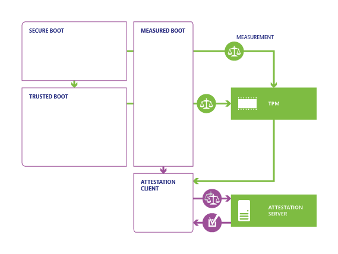
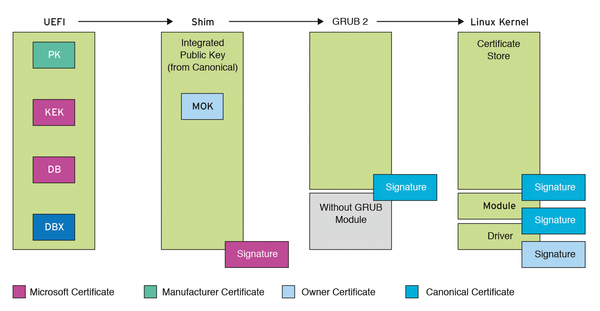
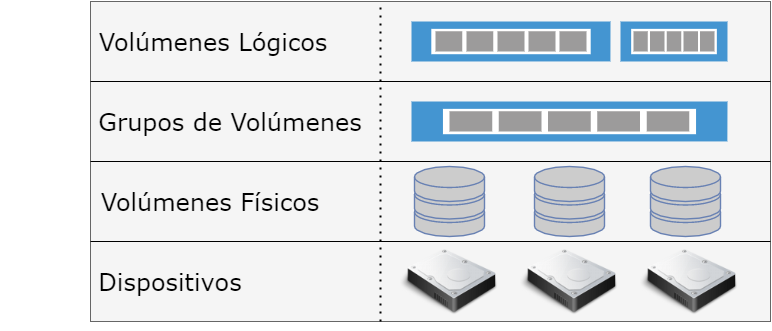
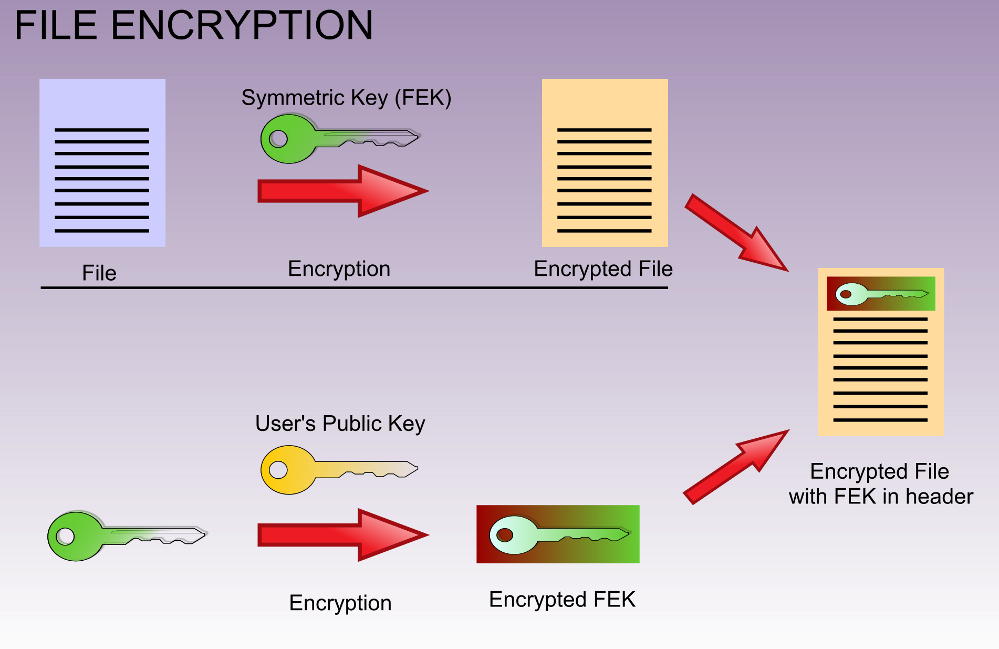
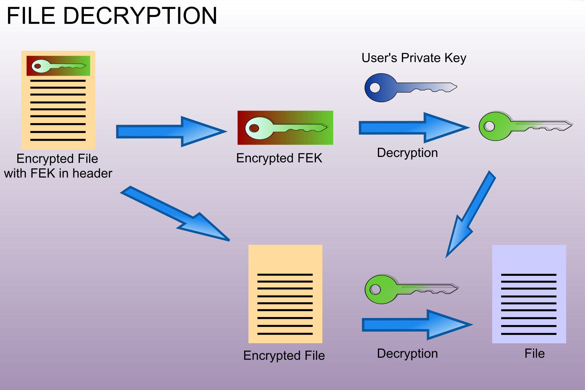

<!-- .slide: data-background="#2C3E50" -->
# Fortificación de Hosts

## Autenticación, Arranque Seguro y Cifrado

---

# Introducción

--

### Introducción

- **Importancia de la Seguridad de Hosts**
  - Protección de sistemas y datos sensibles.
  - Prevención de **accesos no autorizados**.
- **Objetivo**
  - Fortalecer la **integridad, confidencialidad y disponibilidad** de la información.
  - Implementar medidas clave de ciberseguridad centradas en el **acceso**.

--

### Queremos evitar

* Evitar la instalación de **Rootkits / Bootkits**
* Evitar **acceso a los datos** almacenados en los discos del sistema 

--

### Autenticación, Arranque Seguro y Cifrado

#### 1. **Control de Acceso y Autenticación**
   - Contraseñas Seguras
   - Autenticación Multifactor (MFA)
   - Biometría y Autenticación Avanzada

--

####  2. **Seguridad en el Arranque**
   - BIOS/UEFI: Configuración Segura
   - Gestores de Arranque: Protección y Cifrado
   - Medidas de Seguridad Física

--

####  3. **Cifrado y Protección de Datos**
   - Cifrado de Discos: BitLocker, LUKS, etc.
   - Cifrado de Particiones y Carpetas
   - Protección de Datos en Reposo y en Tránsito

--

### Medidas de seguridad en el arranque seguro

<!-- .element width="80%" -->

--

## Rootkit

**Rootkit**: Conjunto de programas maliciosos que anidan en los ordenadores a través de huecos en el sistema de seguridad, concediendo así a los atacantes **acceso remoto permanente**

> [https://www.ionos.es/digitalguide/servidores/seguridad/rootkit/](https://www.ionos.es/digitalguide/servidores/seguridad/rootkit/)

--

### Tipos de Rootkit

* **Rootkits de firmware**.  Su función es sobreescribir el firmware de nuestro sistema por otro malicioso para que el rootkit se inicie antes que el sistema operativo.

* **Rootkits de kernel**.  Parecido al de firmware, pero este rootkit sobreescribe un trozo del kernel de nuestro sistema para poder iniciar antes de cargarse el sistema operativo de forma automática.

* **Rootkits de controlador**.  Engaña al sistema haciéndose pasar por uno de los contradores del sistema que en teoría debería ser de confianza.

* **Bootkits**.  Funciona de forma similar al de firmaware o el de kernel, pero en este caso reemplaza el GRUB del sistema para indicar que el bootkit se inicie antes del Sistema Operativo

--

### Medidas de seguridad en arranque

* **Arranque seguro**: los equipos que dispongan de un firmware **UEFI y TPM** (Trusted Plataform Module) se pueden configurar para solamente inicien los sistemas de seguridad que consideren que son de confianza.

* **Antimalware de inicio temprano**: prueba que todos los controladores existentes sean de confianza y a los que no lo son les impide el arranque.

* **Arranque de confianza**: el sistema comprueba la integridad de cada componente del arranque antes de cargarse.

* **Arranque medido**: el firmware se guarda el proceso de arranque del sistema y el propio sistema lo manda a un servidor para valorar el estado actual del equipo

---

##  Control de Acceso y Autenticación

---

### **Contraseñas Seguras**

- **Políticas de Contraseñas**
  - Longitud mínima de 12 caracteres.
  - Uso de mayúsculas, minúsculas, números y símbolos.
  - Cambio periódico cada 60 o 90 días.
  - Historial para evitar reutilización.
  - Bloqueo tras intentos fallidos.

--

- **Beneficios e Inconvenientes**
  - **Beneficios**: Mayor seguridad, difícil de descifrar.
  - **Inconvenientes**: Posible frustración, malas prácticas.

- **Mejores Prácticas**
  - Educación al usuario.
  - Uso de gestores de contraseñas.

---

### Autenticación Multifactor (MFA)

La autenticación multifactor añade capas adicionales al proceso de autenticación, combinando algo que el usuario sabe (contraseña), algo que tiene (token) y algo que es (biometría).

- **Implementación de MFA**
  - Tokens físicos (ej. [YubiKey](https://www.yubico.com/)).
  - Aplicaciones móviles ([Google Authenticator](https://play.google.com/store/apps/details?id=com.google.android.apps.authenticator2&hl=es&pli=1)).
  - SMS y correo electrónico (menos seguros).

--

- **Beneficios e Inconvenientes**
  - **Beneficios**: Mayor seguridad, protección contra phishing.
  - **Inconvenientes**: Menos conveniente, dependencia de dispositivos.

- **Consideraciones**
  - Equilibrio entre seguridad y usabilidad.
  - Procedimientos de recuperación seguros.

---

### **Biometría y Autenticación Avanzada**

- **Tipos de Autenticación Biométrica**
  - Huella dactilar.
  - Reconocimiento facial.
  - Escaneo de iris y retina.
  - Reconocimiento de voz.

- **Beneficios e Inconvenientes**
  - **Beneficios**: Alta seguridad, conveniencia.
  - **Inconvenientes**: Preocupaciones de privacidad, posibles errores.

- **Consideraciones de Seguridad**
  - Almacenamiento cifrado de datos biométricos.
  - Cumplimiento de regulaciones (ej. GDPR).

---

# Seguridad en el Arranque

---

## BIOS/UEFI

--

### **BIOS/UEFI**

**Firmware** que se ejecuta en el arranque del equipo. Primer software que ejecuta el ordenador.

- Proporcionado por el fabricante.
- **Alojado en memoria ROM específica** del equipo.
- Software en otros periféricos: tarjeta gráficas, controladores de tarjetas de red,...

#### Vector de ataque

* Malware **muy persistente** y difícil de detectar
	* Resiste reinstalaciones del SO 
* Procedimiento operativo de actualización de este software
* No existe control de usuarios

--

### BIOS/UEFI: Configuración Segura

- **Medidas de Seguridad**
  - Establecer **contraseñas** de configuración y arranque.
  - Habilitar **Arranque Seguro** (Secure Boot).
  - Deshabilitar arranque desde dispositivos externos.
  - Mantener firmware actualizado.
  - Asegurar cadena de suministro hardware

- **Beneficios e Inconvenientes**
  - **Beneficios**: Previene ataques de firmware.
  - **Inconvenientes**: Configuraciones incorrectas pueden causar fallos.

--

### BIOS - Basic Input Output System

**BIOS** (Basic Input Output System) 

* Creado en 1975
* Firmware guardado en una memoria ROM 
* Primer programa iniciado al encenderse.
* El código se ejecuta a 16 bits	

Las funciones principales son:

* POST (Power-On Self-Test), pruebas para comprobar que hardware se inicializa correctamente
* Proporciona entrada y salida (teclado y pantalla)
* Permite configurar parámetros del hardware
* Arranca el SO una vez completado el POST.

--

### UEFI - Unified Extensible Firmware Interface

**UEFI** (Unified Extensible Firmware Interface) 

* Sucesor de BIOS, desarrollado en 2002 por Intel
* Mismas funciones que BIOS 
* El código de UEFI se ejecuta a 32 o 64 bits

Diferencias con BIOS:

* UEFI dispone de una interfaz gráfica
* UEFI tiene capacidad de utilizar también el ratón
* Más rápido en el arranque 
* UEFI puede conectarse a internet para actualizarse
* Puede hacer comprobaciones de seguridad durante el arranque (**Arranque seguro**)

--

## Seguridad en acceso: BIOS

<!-- .element width="80%" -->

--

## Seguridad en acceso: UEFI

<!-- .element width="80%" -->

--

### Actualización del firmware

* Firmware obtenido desde las web oficial del fabricante
	* Comprobación de la integridad de firmware 
	* Precaución con actualizaciones automáticas
* Revisión del proceso de arranque

* Reinicio configuración accediendo físicamente al sistema. 
	* Complementar con medidas físicas
	* Acceso a puertos

--

## Arranque seguro UEFI 

UEFI Secure Boot (**SB**):

- mecanismo de verificación para garantizar que el código lanzado por el firmware UEFI de una computadora es confiable. 
- diseñado para proteger un sistema contra la carga y ejecución de código malicioso temprano antes de que el sistema operativo haya sido cargado.

- SB funciona utilizando **firmas criptográficas**
- Cada programa que carga el firmware debe incluir una firma 
- Antes de permitir su ejecución se comprueba la firma
- Si la firma no es válida se detendrá la ejecución

--

## Arranque seguro UEFI y Linux

La mayoría del hardware x86 viene precargado de fábrica con las claves de Microsoft. 

- Esto significa que el firmware de estos sistemas confiará en binarios firmados por Microsoft
- La mayoría de los sistemas nuevos tienen SB activado por defecto:
	- no ejecutarán ningún código sin firmar de forma predeterminada
- Es posible cambiar la configuración del firmware para deshabilitar SB o para inscribir claves de firma adicionales.

--

## Ejemplos de malware

> [https://blog.elhacker.net/2022/07/encuentran-un-rootkit-chino-llamado-CosmicStrand-BIOS-UEFI-placa-bases-gigabyte-asus.html](https://blog.elhacker.net/2022/07/encuentran-un-rootkit-chino-llamado-CosmicStrand-BIOS-UEFI-placa-bases-gigabyte-asus.html)

--

## Buenas prácticas

- [https://eclypsium.com/resources/#bestpractices](https://eclypsium.com/resources/#bestpractices)

--

## Actualizaciones UEFI automáticas

Permiten la eliminación de vulnerabilidades del Firmware de manera automatizada

Pueden suponer otras vulnerabilidades:

> [https://www.incibe-cert.es/alerta-temprana/avisos-seguridad/multiples-vulnerabilidades-biosconnect-y-https-boot-dell-client](https://www.incibe-cert.es/alerta-temprana/avisos-seguridad/multiples-vulnerabilidades-biosconnect-y-https-boot-dell-client)

---

### Gestores de Arranque: Protección y Cifrado

- **Protecciones Implementables**
  - Contraseñas en el gestor de arranque.
  - Cifrado de la partición de arranque.
  - Verificación de integridad con TPM.

- **Beneficios e Inconvenientes**
  - **Beneficios**: Protege el proceso de arranque.
  - **Inconvenientes**: Mayor complejidad en recuperación.

---

### Medidas de Seguridad Física

- **Implementación**
  - Control de acceso a instalaciones.
  - Protección antirrobo.
  - Monitoreo y vigilancia.
  - Uso de gabinetes y cajas de seguridad.

- **Beneficios e Inconvenientes**
  - **Beneficios**: Evita accesos físicos no autorizados.
  - **Inconvenientes**: Gastos adicionales, posible molestia al personal.

--

### Boothole

Boothole: Vulnerabilidad pasada de GRUB 2

- [https://www.debian.org/security/2020-GRUB-UEFI-SecureBoot/index.es.html](https://www.debian.org/security/2020-GRUB-UEFI-SecureBoot/index.es.html)

- [https://eclypsium.com/2020/07/29/theres-a-hole-in-the-boot/](https://eclypsium.com/2020/07/29/theres-a-hole-in-the-boot/)

---

# Cifrado y Protección de Datos

---

### Cifrado de Discos

- **Herramientas y Tecnologías**
  - **BitLocker (Windows)**
    - Integración con TPM.
  - **LUKS (Linux)**
    - Soporte para múltiples algoritmos.
  - **FileVault (macOS)**
    - Integrado en el sistema operativo.

- **Beneficios e Inconvenientes**
  - **Beneficios**: Protección en caso de pérdida o robo.
  - **Inconvenientes**: Impacto en rendimiento, gestión de claves.

---

### Cifrado de Particiones y Carpetas

- **Herramientas y Tecnologías**
  - **VeraCrypt**
    - Cifrado de volúmenes y particiones.
  - **EFS (Windows)**
    - Cifrado de archivos y carpetas individuales.

- **Beneficios e Inconvenientes**
  - **Beneficios**: Flexibilidad, protección granular.
  - **Inconvenientes**: Complejidad en gestión, riesgo de error.

---

### Protección de Datos en Reposo y en Tránsito

- **Datos en Reposo**
  - Control de acceso y permisos.
  - Copias de seguridad cifradas.
  - Clasificación de datos sensibles.

- **Datos en Tránsito**
  - Uso de protocolos seguros (HTTPS, SSH, VPN).
  - Evitar redes no seguras para datos sensibles.

--

- **Beneficios e Inconvenientes**
  - **Beneficios**: Protección integral de datos.
  - **Inconvenientes**: Necesidad de gestión constante.

- **Mejores Prácticas**
  - Educación continua.
  - Monitoreo y detección de intrusiones.

---

# Conclusiones

--

## Conclusiones

- **Enfoque Integral**
  - Combinación de **medidas técnicas y educativas**.
  - Importancia de balancear **seguridad y usabilidad**.

- **Cultura de Seguridad**
  - Fomentar prácticas seguras entre usuarios.
  - Actualización constante de medidas de seguridad.

- **Protección de la Organización**
  - Salvaguardar la infraestructura y la información crítica.
  - Cumplimiento de **regulaciones** y **estándares** de seguridad.

---

# **Anexos**

- **Recursos Adicionales**
  - Enlaces a herramientas mencionadas.
  - Referencias a normativas y estándares (GDPR, ISO 27001).

---

# Introducción

---

--

### Medidas de seguridad

Las principales medidas para un arranque de forma segura son:

---

# Configuración Pre-instalación

--

--

## Seguridad en acceso:  BIOS/UEFI

> El uso de **contraseña para entrar en la BIOS** evitará que personas no autorizadas modifiquen la configuración del ordenador, así como cambios en el orden de arranque.

* Se evita arrancar el sistema desde medios extraíbles
* Se evita acceso a contenido de discos no cifrados

> **No es un método realmente fiable**, pero pone las cosas un poco más difíciles a los atacantes

--

## Seguridad en acceso:  BIOS/UEFI

Si se tiene **acceso físico** al ordenador y sobre todo, si se puede abrir: Es posible saltarse este mecanismo.

* Hay fabricantes que incluyen una contraseña por defecto, a modo de puerta trasera.

* Páginas como [bios-pw.org](https://bios-pw.org/) donde indican la contraseña por defecto según el código de error de la BIOS cuando se escribe la contraseña incorrecta varias veces.
  
* Existen programas que como administrador del equipo pueden modificar o eliminar la contraseña de la BIOS. (Ej: [CmosPwd](https://www.cgsecurity.org/wiki/CmosPwd))

* [Artículo sobre cómo resetear password de BIOS https://www.wikihow.com/Reset-a-BIOS-Password](https://www.wikihow.com/Reset-a-BIOS-Password)

<!--

La mayoría de los programas que se espera que se ejecuten en el entorno UEFI son cargadores de arranque,
Pero también existen otros. También hay 
programas para lidiar con las actualizaciones de firmware antes del inicio del sistema operativo (como fwupdate y fwupd ), y otras utilidades pueden vivir aquí también.

Otras distribuciones de Linux (Red Hat, Fedora, SUSE, Ubuntu, etc.) han tenido SB funcionó durante un tiempo, pero Debian tardó en hacer que esto funcionara. Esto significó que en muchos sistemas informáticos nuevos, los usuarios primero tenían que deshabilitar SB para poder instalar y usar Debian. Los métodos para hacer esto varían masivamente de un sistema a otro, lo que hace que esto sea potencialmente bastante difícil para los usuarios.

Comenzando con la versión 10 de Debian ("Buster"), Debian incluía funcionesArranque seguro UEFI para facilitar las cosas.

[Secure Boot Debian: https://wiki.debian.org/SecureBoot](https://wiki.debian.org/SecureBoot)
[Ubuntu UEFI: https://help.ubuntu.com/community/UEFI](https://help.ubuntu.com/community/UEFI)

https://www.xataka.com/basics/que-secure-boot-uefi-como-puedes-desactivarlo

-->

<!--
#  Bloqueo de la BIOS

[https://www.delltechnologies.com/asset/en-us/products/security/technical-support/dell-safebios-datasheet.pdf](https://www.delltechnologies.com/asset/en-us/products/security/technical-support/dell-safebios-datasheet.pdf)
-->

<!--
## Phoenix BIOS simulador

https://www.grs-software.de/sims/bios/phoenix/pages/index.php
-->

---

# Seguridad en el arranque

--

### Medidas de seguridad en el arranque seguro

* Comprobación de la **integridad del sistema**: firmware, drivers, ficheros del sistema, configuración,... 
* Monitorización del arranque al SOC para su análisis.
* Control de **jerarquía de procesos** del sistema.
* Cambios en relación a línea base de configuración
* Alternativa. Arranque con un dispositivo externo (liveCD o liveDVD) .
* Protección arranque red PXE. Acceso con contraseña y control de comunicación. Reglas firewall. 
* Configuración segura gestor arranque. Linux-grub. Mantenerlo actualizado.

--

### Ejemplo monitorización firmware

**Eclypsium**, compañía especializada en fortificación a nivel firmware / hardware ofrece productos que verifican estado de firmware

> https://eclypsium.com/enterprise-firmware-security/endpoints/

> https://eclypsium.com/enterprise-firmware-security/servers/

--

### Windows: Protección del proceso de arranque 

Windows admite cuatro características para ayudar a **evitar que los rootkits y bootkits** se carguen durante el proceso de inicio: [[Enlace a documento]](https://learn.microsoft.com/es-es/windows/security/information-protection/secure-the-windows-10-boot-process)

* **Arranque seguro**. Los equipos con firmware UEFI y un módulo de plataforma segura (TPM) se pueden configurar para cargar solo **cargadores de arranque** de sistema operativo **de confianza**.
* **Arranque de confianza**. Windows comprueba la integridad de cada componente del proceso de inicio antes de cargarlo.
* **Antimalware de inicio temprano (ELAM)**. ELAM prueba todos los **controladores** antes de que se carguen e impide que se carguen controladores no aprobados.
* **Arranque medido**. El firmware del equipo registra el proceso de arranque y Windows puede enviarlo a un **servidor** de confianza que pueda **evaluar objetivamente el estado del equipo**.

<!--
https://learn.microsoft.com/es-es/windows/security/information-protection/secure-the-windows-10-boot-process
-->

--

### Windows: Secure Boot

<!-- .element width="80%" -->

--

## Windows: Arranque de confianza

El arranque de confianza continúa tras el arranque seguro. 

- El cargador de arranque comprueba la firma digital del **kernel** de Windows antes de cargarlo. 
- El kernel de Windows comprueba el resto de los componentes del proceso de inicio 
	- incluidos los **controladores** de arranque, 
	- los **archivos de inicio **
	- y el componente antimalware de inicio temprano **ELAM**. 

**Si un archivo se ha modificado, el cargador de arranque detecta el problema y se niega a cargar el componente dañado. **

--

## Windows: Arranque Medio I

- Las aplicaciones antimalware notifican infecciones de malware al SOC
	- Eso no funciona con rootkits que ocultan su presencia.
	- **no puede confiar en que el cliente le indique si está en buen estado.**

- Equipos infectados con rootkits con antimalware en ejecución se muestran con estado correcto
	- el rootkit obtiene acceso a una gran cantidad de datos confidenciales 
	- se puede expandir en toda la red interna.

El arranque medido funciona con TPM. Permite que un servidor de confianza de la red compruebe la integridad del proceso de inicio de Windows. 

--

## Windows: Arranque Medio II

El arranque medido usa el siguiente proceso:

- El firmware UEFI almacena en el TPM un hash del firmware, el cargador de arranque, los controladores de arranque (todo lo que se cargar antes de la aplicación antimalware)

- Al final del proceso de inicio, Windows inicia el cliente de atestación remota
- El servidor de atestación de confianza envía al cliente una clave única
- El TPM usa la clave única para firmar digitalmente el registro grabado por la UEFI
- El cliente envía el registro al servidor

- El servidor puede determinar si el cliente está en buen estado. Puede conceder al cliente acceso a una red de cuarentena limitada o a la red completa.

--

## Windows: Arranque Medio III

<!-- .element width="80%" -->

--

## Windows: Antimalware de inicio temprano I

Hasta ahora:

* Arranque seguro ha protegido el cargador de arranque
* El arranque de confianza ha protegido el kernel de Windows

La siguiente oportunidad de inicio de malware es la infección de un **controlador de arranque** que no es de Microsoft. 

- Las aplicaciones antimalware tradicionales no se inician hasta que se han cargado los controladores de arranque, lo que da a un rootkit disfrazado de controlador la oportunidad de trabajar.

- El componente antimalware de inicio temprano (**ELAM**) puede carga un controlador de antimalware 
antes de todas las aplicaciones y los controladores de arranque que no son de Microsoft

--

## Windows: Antimalware de inicio temprano II

ELAM tiene una tarea sencilla: 

- Examinar todos los **controladores** de arranque 
- Determinar si está en la l**ista de controladores de confianza**.
- Si no es de confianza, Windows no lo cargará.

**Un controlador ELAM no es una solución antimalware completa**

Windows Defender (incluido con Windows) admite ELAM, al igual que varias aplicaciones antimalware que no son Microsoft.

--

## Linux: Secure Boot

Los fabricantes hardware incluyen en el firmware UEFI:

* (**PK**) Platform key (Claves del fabricante hardware)
* (**KEK**) Key Exchange Key database (Claves de confianza incluidas de serie)
* (**DB**) (authorized) database 
* (**DBX**) DBX is the forbidden signatures database.

El poder de mercado de Microsoft hace que todos los fabricantes incluyan sus certificados en KEK y DB, de modo que los **PC y portátiles x86 inicialmente sólo soportan software firmado por Microsoft**

--

## Linux: Shim - Arranque seguro en Linux

* Los fabricantes de hardware soportan las claves de Microsoft en Secure Boot
	* Esto impedía la ejecución código abierto 

* **Matthew Garrett** creó un programa llamado [[*the **Shim** bootloader*]](https://mjg59.dreamwidth.org/20303.html)
	*  [[una alternativa de código abierto que integra sus propios certificados]](https://www.linux-magazine.com/Issues/2018/206/Linux-Secure-Boot-with-Shim)
	*  Ubuntu, Red Hat, SUSE, and Debian generan sus propias versiones de Shim que incluyen certificados emitidos por su propias empresas. 

* **Verisign/Symantec firma este bootloader con el certificado de Microsoft**
* The UEFI firmware carga Shim. 
* Una vez que se carga el Shim, éste funciona de forma independiente a la cadena de verificación de Microsoft. 
* Shim tiene incluida una gestión de certificados que permite al propietario del ordenador almacer sus propios certificados. Se denomina *machine owner keys* (**MOKs**)

<!--
https://www.linux-magazine.com/Issues/2018/206/Linux-Secure-Boot-with-Shim
-->

--

## Linux: Protección del proceso de arranque 

<!-- .element width="80%" -->

<!--
https://www.linux-magazine.com/Issues/2018/206/Linux-Secure-Boot-with-Shim
-->

--

## Protección del gestor de arranque Linux: GRUB

> Establecer contraseña que impida modificar las opciones de arranque de los distintos sistemas operativos o la consola en modo monousario

Para evitar que personas no autorizadas tengan acceso a la edición de las opciones de arranque de los distintos sistemas operativos que controla GRUB, estableceremos una contraseña.

- Impide cambiar o eliminar la clave de root

- Alternativamente podemos cifrar por completo la partición del sistema operativo con LUKS o similares, de esta forma, no se podrá acceder al cambio del sistema operativo si no conocemos esta contraseña de paso.

> [https://www.gnu.org/software/grub/manual/grub/html_node/Authentication-and-authorisation.html#Authentication-and-authorisation
> ](https://www.gnu.org/software/grub/manual/grub/html_node/Authentication-and-authorisation.html#Authentication-and-authorisation
> )

<!--
### Bloqueo acceso a GRUB

https://www.redeszone.net/tutoriales/seguridad/cambiar-eliminar-contrasena-root-linux-gru

https://linuxconfig.org/set-boot-password-with-grub

https://web.mit.edu/rhel-doc/4/RH-DOCS/rhel-sg-es-4/s1-wstation-boot-sec.html
-->

--

## Protección del proceso de arranque de Linux: Enlaces

> [https://www.linux-magazine.com/Issues/2018/206/Linux-Secure-Boot-with-Shim
> ](https://www.linux-magazine.com/Issues/2018/206/Linux-Secure-Boot-with-Shim)

> [Matthew Garrett's Shim: https://mjg59.dreamwidth.org/20303.html
> ](https://mjg59.dreamwidth.org/20303.html
> )

> [Actualización de shim en ubuntu - https://wiki.ubuntu.com/UEFI/SecureBoot/ShimUpdateProcess
> ](https://wiki.ubuntu.com/UEFI/SecureBoot/ShimUpdateProcess)

---

# Seguridad de los datos

---

## Introducción

- Sistema de archivos adecuado
- **Particiones**
	- Separar sistemas, datos de usuario
	- Evita fallos del funcionamiento del sistema si la partición para datos de usuario se llena 
- **Cifrado**
	- Evita acceso a datos arrancando con otro SO
	- Necesario para evitar acceso a datos si se consigue acceso físico al equipo
- Borrado seguro de datos

---

## Sistemas de ficheros I

* **FAT32** (FILE ALLOCATION TABLE). Es un sistema de archivos que fue desarrollado por **Microsoft** sucediendo a FAT16. El **máximo** tamaño que puede ocupar un archivo en este formato es **4 GB** y es utilizado principalmente para el intercambio de información entre distintos equipos, ya que es **compatible** con prácticamente todos los dispositivos. Este sistema también se utiliza en USB y tarjetas de memoria.

* **ExFAT** (EXTENDED FILE ALLOCATION TABLE). Podemos definirlo como una **actualización de FAT32**, ya que dispone de todas las ventajas de FAT32 y **no tiene la limitación de 4 GB**. Es compatible con Linux y Mac y puede ser utilizado en Windows desde **XP SP3**.

--

## Sistemas de ficheros II

* **NTFS** (NEW TECHNOLOGY FILE SYSTEM). Otra alternativa a FAT32 desarrollada por Microsoft. No tiene límite de tamaño máximo de 4 GB y es muy recomendado su uso en discos duros y unidades externas. Además, distingue entre mayúsculas y minúsculas. En cuanto al acceso a archivos, es más rápido que una partición en FAT, ya que hace uso de un árbol binario de alto rendimiento y **cifra** los archivos, al contrario que FAT.

* **EXT3** (THIRD EXTENDED FILESYSTEM). Es un sistema de archivos usado principalmente en **Linux** con **journaling** que ha sido sucedido por EXT4. El journaling se basa en llevar un registro diario en el que almacenar la información necesaria para que, en caso de que falle, poder restablecer los datos del sistema. Gracias a esto, se reducen en gran cantidad los tiempos para recuperar datos en caso de que se caiga el sistema.

--

## Sistemas de ficheros III

* **EXT4** (FOURTH EXTENDED FILESYSTEM). Sucesor de EXT3 con mejores características, como una **mayor velocidad de lectura y escritura y un menor uso de CPU**. Además, soporta volúmenes de **hasta 1024 PiB** o PebiByte (1 PebiByte equivale a 2 a la 50 Bytes). Mejora la velocidad de lectura y escritura, pero es más lento al borrar archivos.

* **BTRFS** (B-TREE FS). Es una nueva tecnología para Linux desarrollada por **Oracle** que permite escalar el almacenamiento a configuraciones de **gran capacidad**. Se supone que en un futuro reemplazará a EXT4. Soporta volúmenes de hasta 16 EiB (ExbiByte) (1 EiB = 1024 PiB). Su uso es recomendable en **discos muy grandes y SSD**. Mejora la velocidad de lectura, escritura y borrado.

--

## Sistemas de ficheros IV

* **XFS** es un sistema de archivos de 64 bits con registro de bitácora o **journaling** de alto rendimiento creado por SGI (antiguamente **Silicon Graphics** Inc.) para su implementación de UNIX llamada **IRIX**. En mayo de 2000, SGI liberó XFS bajo una licencia de código abierto. Usado por **[[Red Hat]](https://access.redhat.com/documentation/en-us/red_hat_enterprise_linux/9/html/managing_file_systems/assembly_overview-of-available-file-systems_managing-file-systems)**. 

* **ZFS** es un sistema de archivos y administrador de volúmenes desarrollado originalmente por **Sun Microsystems** para su sistema operativo **Solaris**. La integridad de los archivos es uno de los aspectos más importantes. Gran consumo de RAM ECC(Error correction code). Usado en FreeBSD: TrueNAS 
[[ZFS Wikipedia]](https://es.wikipedia.org/wiki/ZFS_(sistema_de_archivos)) 
[[ZFS ProxMox]](https://pve.proxmox.com/wiki/ZFS_on_Linux)
[[ZFS Redes Zone]](https://www.redeszone.net/tutoriales/servidores/sistema-archivos-zfs-servidores)

---

## Linux: Particiones 

> [[Red Hat recomienda las siguientes particiones:]](https://access.redhat.com/documentation/en-us/red_hat_enterprise_linux/6/html/installation_guide/s2-diskpartrecommend-x86): 

- `swap` partition: memoria de intercambio
- `/boot` partition: arranque
- `/` partition: kernel
- `home` partition: datos de usuario

[Además debian sugiere separar también:](https://www.debian.org/releases/stable/i386/apcs03.en.html)

- `var`partition: datos de aplicaciones
- `tmp`partition: datos temporales
<!--
https://unix.stackexchange.com/questions/37720/best-disk-partitioning-scheme-for-a-linux-based-developer-machine
-->

--

## Linux: Partición `SWAP`

<!-- https://atareao.es/como/particiones-en-linux/ -->

Memoria de intercambio

* Memoria vitual, permite ejecutar que requieren más ram que la disponible

* La partición swap debe ser de al menos 256 MB.

Red Hat recomienda los siguientes tamaños:

| RAM             | SWAP          | SWAP con hibernación |
|-----------------|---------------|----------------------|
| menos de 2 GB   | 2xRAM         | 3xRAM                |
| Entre 2 y 8 GB  | RAM           | 2xRAM                |
| Entre 8 y 64 GB | 4 GB o mas | 1,5xRAM              |
| Mas de 64 GB    | 4 GB o mas | No rec. hiber.       |

--

## Linux: Partición `Boot`

* Contiene el **kernel** junto con otros archivos que se utilizan durante el proceso de arranque.

* Tamaño: 250 MB suele ser suficiente.

* Cada kernel de Linux ocupa de forma aproximada unos 30 MB. Debes tener en cuenta esto a la hora de dimensionar esta partición.

Solo es necesario realizar una partición para /boot en el caso de instalar un sistema RAID.

--

## Linux: Partición `\`

Aquí es donde va todo nuestro sistema operativo.

Respecto al tamaño, esto dependerá de el uso que le vayas a dar a tu equipo. La recomendación de Red Hat es que sea como mínimo de **3.0 GB**.

En general, yo siempre le doy un tamaño mínimo de 20 GB, aunque últimamente he incrementado esto a 30 GB. Cada vez las aplicaciones requieren mas espacio.

--

## Linux: partición `/HOME`

Aquí es donde se almacena toda la información de los usuarios.
 Y aquí quiero hacer especial hincapié en que se refiere a toda la que generamos. Y es que, además de los archivos que nosotros ponemos de forma consciente, también aparecen otros, que se generan por nuestra actividad. Me refiero a los archivos de caché, miniaturas (thumbnails), etc, a los que me referiré posteriormente.

En lo que se refiere al tamaño, la recomendación de Red Hat es de 100 GB. Aquí dependerá, evidentemente del uso que le vayas a dar a tu dispositivo.

--

## Esquemas recomendados de Particiones

Red Hat:

> [https://access.redhat.com/documentation/en-us/red_hat_enterprise_linux/6/html/installation_guide/s2-diskpartrecommend-x86](https://access.redhat.com/documentation/en-us/red_hat_enterprise_linux/6/html/installation_guide/s2-diskpartrecommend-x86)

Debian:

> [https://www.debian.org/releases/stable/i386/apcs03.en.html
> ](https://www.debian.org/releases/stable/i386/apcs03.en.html)

--

## LVM I

LVM (Logical Volume Manager) es un método de localización del espacio disco duro en volúmenes lógicos que pueden ser fácilmente redimensionados en vez de particiones. 

 Nos permite crear una **capa de abstracción entre dispositivos de almacenamiento y un sistema de archivos**. Nos permite mayor **flexibilidad** que el particionado tradicional. 

Con el uso de LVM, podremos utilizar grupos de volúmenes lógicos como si fueran uno. Su uso se recomienda en sistemas Linux sobre los que necesitamos realizar una fácil expansión o si queremos combinar varios discos en un solo grupo. 

No se recomienda su uso en equipos pequeños (como un portátil). Su uso en sistemas grandes nos permite unificar discos de distinto tamaño y crear volúmenes lógicos desentendiéndonos del tamaño de los discos.

--

## LVM II

> [https://es.wikipedia.org/wiki/Logical_Volume_Manager_(Linux)
> ](https://es.wikipedia.org/wiki/Logical_Volume_Manager_(Linux))

<!-- .element width="80%" -->

--

## LVM III

* **Volúmenes Lógicos**
Podemos considerarlo como la equivalencia a una partición tradicional.

* **Grupos de volúmenes**
Es la unión de los volúmenes lógicos y volúmenes físicos. Nos permite unificar tanto Volúmenes físicos y lógicos para crear un nuevo volumen, transparente para el usuario.

* **Volúmenes Físicos**
Es decir, las particiones de almacenamiento que tengan el sistema de archivos LVM. (Puede ser un disco duro, una tarjeta SD, un RAID…).

<!--

https://web.mit.edu/rhel-doc/3/rhel-sag-es-3/ch-lvm-intro.html

-->

---

## Cifrado en WINDOWS: EFS vs Bitlocker

* **BitLocker** se usa para 
	* Cifrado de unidades completas fijas o externas (mediante BitLocker To Go).
	* AES en modo CBC con  clave de 128 bits
	* Se puede configurar una clave de 256 bits modo XTS que es más seguro
	* Puede usar chip **TPM** para almacenar clave

* **EFS**, se usa para proteger los archivos individuales de las unidades de forma individual para cada usuario.
	* Cifrado en particiones **NTFS**
	* Vinculado a una **cuenta de usuario**
	* Cifrado Transparente
	* La clave de cifrado EFS se guarda en el propio sistema operativo en lugar del TPM

> [[Comparativa EFS Bitlocker RedesZone]](https://www.redeszone.net/tutoriales/seguridad/diferencias-cifrado-windows-bitlocker-efs/)

--

## Windows: cifrado Bitlocker

> [https://learn.microsoft.com/es-es/windows-hardware/manufacture/desktop/bitlocker-drive-encryption?view=windows-10](https://learn.microsoft.com/es-es/windows-hardware/manufacture/desktop/bitlocker-drive-encryption?view=windows-10)

> [https://support.microsoft.com/es-es/windows/cifrado-del-dispositivo-en-windows-ad5dcf4b-dbe0-2331-228f-7925c2a3012d](https://support.microsoft.com/es-es/windows/cifrado-del-dispositivo-en-windows-ad5dcf4b-dbe0-2331-228f-7925c2a3012d)

--

## Windows: EFS

**EFS**: Encrypting File System

> [https://learn.microsoft.com/es-es/troubleshoot/windows-server/identity/back-up-recovery-agent-efs-private-key](https://learn.microsoft.com/es-es/troubleshoot/windows-server/identity/back-up-recovery-agent-efs-private-key)

> [https://en.wikipedia.org/wiki/Encrypting_File_System](https://en.wikipedia.org/wiki/Encrypting_File_System)

--

## Windows: cifrado EFS

<!-- .element width="80%" -->

--

## Windows: descifrado EFS

<!-- .element width="80%" -->

---

## Cifrado en Linux

En Linux existen diversas opciones para cifrar datos:

* LUKS
* eCryptfs
* Veracrypt 

 
--

## Linux: LUKS Linux Unified Key Setup

LUKS (Linux Unified Key Setup) 

* Standard de Linux para cifrado de discos

* Permite cifrar discos, particiones y también volúmenes
* Está incluido en el propio kernel, alto rendimiento
 
> [https://gitlab.com/cryptsetup/cryptsetup](https://gitlab.com/cryptsetup/cryptsetup)
 

> [https://www.redeszone.net/tutoriales/seguridad/cifrar-discos-particiones-archivos-luks-linux/](https://www.redeszone.net/tutoriales/seguridad/cifrar-discos-particiones-archivos-luks-linux/)

> [https://www.fpgenred.es/Seguridad-Informatica-I/cifrado_de_una_particin_en_debian.html](https://www.fpgenred.es/Seguridad-Informatica-I/cifrado_de_una_particin_en_debian.html)

> [https://www.zeppelinux.es/como-instalar-debian-10-con-particiones-cifradas-con-luks/](https://www.zeppelinux.es/como-instalar-debian-10-con-particiones-cifradas-con-luks/)

--

## Linux: Alternativas a LUKS

Veracrypt

> [https://www.veracrypt.fr/code/VeraCrypt/](https://www.veracrypt.fr/code/VeraCrypt/)
 

> [https://www.redeszone.net/tutoriales/seguridad/veracrypt-cifra-archivos-gratis/](https://www.redeszone.net/tutoriales/seguridad/veracrypt-cifra-archivos-gratis/)

--

## Instalación Linux (Debian)

Configuración manual de particiones encriptadas:

> [https://unix.stackexchange.com/questions/577379/how-can-i-install-debian-with-full-disk-encryption-and-a-custom-sized-swapfile](https://unix.stackexchange.com/questions/577379/how-can-i-install-debian-with-full-disk-encryption-and-a-custom-sized-swapfile)

--

## Seguridad en acceso: Cuotas de disco

> La mayoría de los sistemas operativos poseen **mecanismos para impedir que ciertos usuarios hagan un uso indebido de la capacidad del disco**.

Un disco lleno:

* Evita que otros usuarios puedan trabajar
* Producirá errores en la ejecución de servicios y programas
* Hará que el rendimiento del ordenador disminuya.

--

## Guías CCN-STIC

Seguridad sobre CENTOS:

> [https://www.ccn-cert.cni.es/pdf/guias/series-ccn-stic/guias-de-acceso-publico-ccn-stic/5332-ccn-stic-619b-configuracion-segura-de-centos-8/file.html](https://www.ccn-cert.cni.es/pdf/guias/series-ccn-stic/guias-de-acceso-publico-ccn-stic/5332-ccn-stic-619b-configuracion-segura-de-centos-8/file.html)

Seguridad en WIN 2019 ficheros: 

> [https://www.ccn-cert.cni.es/pdf/guias/series-ccn-stic/guias-de-acceso-publico-ccn-stic/6663-ccn-stic-573a21-servidor-de-ficheros-en-ws2019/file.html](https://www.ccn-cert.cni.es/pdf/guias/series-ccn-stic/guias-de-acceso-publico-ccn-stic/6663-ccn-stic-573a21-servidor-de-ficheros-en-ws2019/file.html)

<!--
### Cuotas en Windows

### Cuotas en GNU/Linux

La gestión de cuotas es más compleja que en Windows ya que hay que instalar paquetes y editar ficheros de texto de configuración. Para los que estén interesados, en el siguiente recurso se muestra como hacerlo:

[http://somebooks.es/9-6-cuotas-de-disco](http://somebooks.es/9-6-cuotas-de-disco/)/
-->

