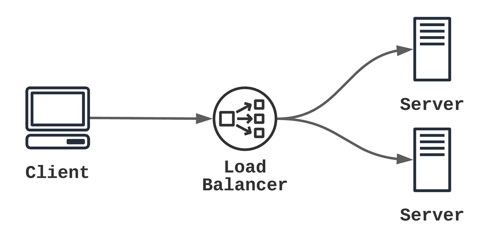

### Servidor web en HA con balanceador de carga


Esta práctica introduce el concepto de balanceo de carga, permitiendo experimentar con un entorno funcional y observar cómo las solicitudes se distribuyen dinámicamente entre varios servidores backend.


{:style="width: 60%;" class="center"}


### **Requisitos previos**

- Sistema operativo Linux (AlmaLinux 9 o equivalente).
- Conocimientos básicos de redes (IP, puertos, protocolos).
- Familiaridad con el uso de la terminal y herramientas como `ssh`.
- Herramientas necesarias: `haproxy` o `nginx`.

### **Entorno de la práctica**

1. **Máquinas virtuales**:    
	- Sistema operativo Linux (AlmaLinux 9 o equivalente).
    - 1 máquina para el balanceador de carga.
	    - Nombre de la máquina: 
> 		Cambia el nombre a la máquina para que coincida con `balanceador+apellido` (Ej: balanceadorperez)
    - 2 máquinas para los servidores backend que atenderán las solicitudes.
	    - Nombre de la máquina: 
> 	    Cambia el nombre a la máquinas para `backend1apellido`, `backend2apellido` (Ej: backend1perez)
    
1. **Software necesario**:    
    - Balanceador de carga: `HAProxy` o `Nginx`.
    - Backend: Servidor web simple (por ejemplo, Apache o Nginx).


## **Pasos a seguir**

### **1. Preparar el entorno**

1. Instalar el servidor web en las máquinas backend:
    
    ```bash
    sudo dnf install httpd -y  # Para instalar Apache
    sudo systemctl enable --now httpd  # Para iniciar el servicio
    ```
    
    Añade los puertos al firewall
	```
	sudo firewall-cmd --permanent --add-service={http,https}
	sudo firewall-cmd --reload
	```
	
    - En cada backend, crea una página HTML básica que identifique el servidor:
        
        ```bash
        echo "Servidor Backend 1" | sudo tee /var/www/html/index.html
        ```
        
        (Reemplaza "Backend 1" por "Backend 2" en la otra máquina).
2. Asegúrate de que los servidores sean accesibles desde el balanceador mediante sus direcciones IP y el puerto 80.
    

### **2. Configurar el balanceador de carga con HAProxy**

1. Instala HAProxy en la máquina destinada como balanceador:
    
    ```bash
    sudo dnf install haproxy -y
    ```
    
2. Edita el archivo de configuración:
    
    ```bash
    sudo nano /etc/haproxy/haproxy.cfg
    ```
    
    Modifica la parte final del fichero para que coincida con la siguiente configurción:
    
```
#---------------------------------------------------------------------
# main frontend which proxys to the backends
#---------------------------------------------------------------------
frontend main
bind *:80
default_backend app

#---------------------------------------------------------------------
# static backend for serving up images, stylesheets and such
#---------------------------------------------------------------------

backend static
balance roundrobin
server static 127.0.0.1:4331 check

#---------------------------------------------------------------------
# round robin balancing between the various backends
#---------------------------------------------------------------------
backend app
balance roundrobin
server app1 192.168.1.101:80 check
server app2 192.168.1.102:80 check
```
    
    - Reemplaza las IPs (`192.168.1.101` y `192.168.1.102`) con las IPs de tus máquinas backend.
3. Reinicia el servicio HAProxy:
    
    ```bash
    sudo systemctl restart haproxy
    sudo systemctl enable haproxy
    ```

Puede que sea necesario que abras los puertos a los que quieras conectarte en el firewall.

### **3. Probar la configuración**

1. En tu navegador, accede a la dirección IP del balanceador.
2. Refresca la página varias veces y observa cómo cambia entre los servidores backend (por la configuración `roundrobin`).

### **4. Monitorización del balanceador**

1. Activa el panel de estadísticas de HAProxy añadiendo lo siguiente al final del archivo `/etc/haproxy/haproxy.cfg`:
    
    ```plaintext
    frontend stats
        bind *:8080
        stats enable
        stats uri /stats
        stats refresh 10s
        stats auth admin:password
    ```
    
2. Reinicia el servicio HAProxy.
3. Accede a `http://<IP_BALANCEADOR>:8080/stats` en tu navegador.


## **Preguntas de reflexión**

1. ¿Qué ocurre si apagas uno de los servidores backend? ¿Cómo responde el balanceador?
2. Cambia la política de balanceo de `roundrobin` a `leastconn` en la configuración de HAProxy. ¿Qué diferencias observas?


## Opcional

Busca cómo utilizar Nginx como balanceador de carga y configuralo para realizar estas función.


# Bibliografía

- [HAproxy](https://www.haproxy.org/)
- [HAproxy manual](https://www.haproxy.com/documentation/haproxy-configuration-manual/latest/)
- [Haproxy docs: config tutorials ](https://www.haproxy.com/documentation/haproxy-configuration-tutorials/core-concepts/overview/)
- [Ejemplo configuración HAproxy](https://support.ptc.com/help/thingworx/platform/r9/es/index.html#page/ThingWorx/Help/ThingWorxHighAvailability/HAProxyExample.html)
- [Haproxy stats](https://www.haproxy.com/blog/exploring-the-haproxy-stats-page)
- [Comandos Almalinux](../../UD0/comandos.almalinux.md)


