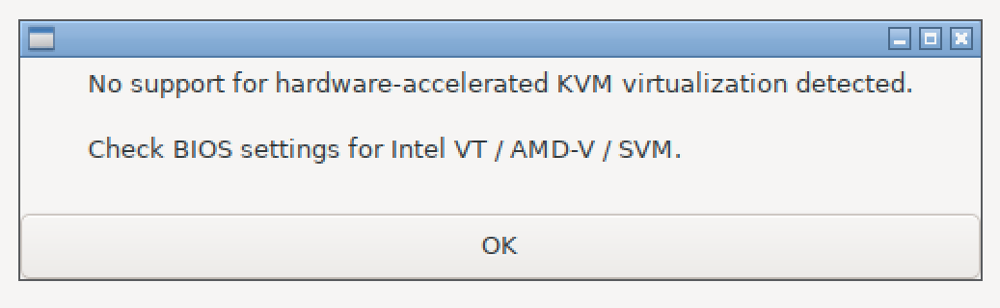

# Máquinas virtuales en alta disponibilidad con Proxmox

{:style="width: 60%;" class="center"}

## Introducción

En esta práctica aprenderemos a configurar una máquina en alta disponibilidad. Esto significa que, en caso de fallo de la máquina física donde se encuentra en ejecución, su funcionamiento podrá transferirse automáticamente a otra máquina. Gracias a esta configuración, los servicios alojados solo estarán inaccesibles durante unos segundos, mientras se completa el proceso de recuperación.


**Proxmox** es una plataforma de virtualización de código abierto basada en Debian, diseñada para gestionar entornos de máquinas virtuales y contenedores de forma sencilla y eficiente. Combina tecnologías como **KVM** (Kernel-based Virtual Machine) para la virtualización completa y **LXC** (Linux Containers) para la virtualización ligera. Además, incluye herramientas avanzadas para la gestión de clústeres, alta disponibilidad (HA), copias de seguridad, snapshots, y almacenamiento compartido. Su interfaz web intuitiva permite administrar todo el entorno de manera centralizada, lo que lo convierte en una solución popular en entornos empresariales y educativos.

**Ceph** es un sistema de almacenamiento distribuido de código abierto diseñado para ofrecer **alta disponibilidad**, **escalabilidad** y **rendimiento** en entornos de almacenamiento masivo. Su arquitectura permite almacenar datos sin un único punto de fallo, distribuyéndolos de manera eficiente entre múltiples nodos. Ceph soporta tres tipos principales de almacenamiento:

1. **Bloques**: Ideal para discos virtuales en entornos de virtualización.
2. **Objetos**: Utiliza un sistema similar a servicios como Amazon S3.
3. **Sistema de archivos (CephFS)**: Permite montar sistemas de archivos compartidos.

Es comúnmente utilizado en entornos de nube y virtualización, integrándose fácilmente con plataformas como Proxmox y OpenStack. Su capacidad de autogestión y autorreparación lo hace altamente confiable para entornos críticos.


### 1. Instalación de los nosdos

 Instala  3 nodos con la última versión de Proxmox. Necesitarás 3 máquinas virtuales: PVE1, PVE2, y PVE3
	- Descarga la ISO de Proxmox VE desde la [página oficial](https://www.proxmox.com).
	- Cada nodo debe tener como mínimo **2048 MiB de RAM**.
	- Añade **dos discos duros a cada nodo**. Uno será para instalar Proxmox y el otro para añadirlo al almacenamiento distribuido **Ceph**. (20 GiB debería ser suficiente para nuestras pruebas)
	- Realiza la instalación básica en cada servidor y configura una dirección IP estática.
	- Recuerda quitar la ISO del DVD al terminar la instalación.
	- Debes utilizar un modo de red que permita que todos los nodos se puedan conectar entre sí. (Modo puente, Red NAT o red host). La interfaz es web, así que tú también tendrás que poder conectarte a las máquinas. Si es posible, el **Modo puente** es la configuración más sencilla. Otra opción es usar una Red NAT y añadir un segundo adaptador de red en red host para conectarnos a la interfaz web.

Puede que recibas un aviso como el siguiente durante la instalación:

{:style="width: 60%;" class="center"}

Significa que las máquinas virtuales funcionarán muy lentas por que el procesador no soporta aceleración para la virtualización, es un problema o del procesador o de configuración del VirtualBox. En cualquier caso no impide realizar la práctica, podemos ignorarlo. En un entorno de producción isntalariamos Proxmox en máquinas físicas.


### 2. Configurar la red    

* Durante la instalación tienes la posibilidad de configurar la interfaz de red.
	{:style="width: 60%;" class="center"}{:style="width: 60%;" class="center"}
	
-  Posteriormente, en cada nodo puedes configurar la interfaz de red en `/etc/network/interfaces` 
    
## 2. Unir los nodos al clúster

Hay que crear el cluster desde el nodo principal y unir el resto al cluster, se puede realizar mediante la interfaz web de proxmox o usando comandos. **Puedes ver cómo usar la interfaz web en el primer vídeo que se muestra al final de la práctica**.

Los pasos serían:

En el nodo principal, desde la UI Web: `Datacenter->Cluster->Create Cluster`

Después para cada nodo, nos uniremos desde la UI Web: `Datacenter->Cluster->Join Cluster`, te solicitará `Join Information`que obtendremos desde el nodo principal en `Datacenter->Cluster->Join Information`(Esta información cambia cada vez, y hay que solicitar una nueva para cada nuevo nodo)

Una vez unidos, los nodos aparecerán bajo `Datacenter`.

Alternativamente, también es posible crear el cluster usando comandos:

   - Accede al nodo principal (Node1) y crea el clúster:
        
    ```
    pvecm create CLUSTER-NAME
    ```
        
   - En los nodos secundarios (Node2 y Node3), únete al clúster: 
        
    ```
    pvecm add IP-NODO-PRINCIPAL
    ```
        
   - Verifica que los nodos están en el clúster:
        
    ```        
    pvecm status
    ```


## 3. Crear almacenamiento distribuido Ceph 

**El primer vídeo también muestra como configurar el almacenamiento distribuido Ceph.** Se recomienda ver esta parte antes de realizar la práctica. 

### Instalación de Ceph

Primero tendremos que instalar el componente Ceph, Iremos a` Datacenter->Ceph`. **Durante la instalación cambia el repositorio a 'No-susbscription'**. Sigue los pasos del asistente, asegúrate de elegir bien las direcciones IP.

Al terminar nos dice que nos queda:

1. Install Ceph on other nodes
2. Create additional Ceph Monitors
3. Create Ceph OSDs
4. Create Ceph Pools

Así que procedemos a seguir los pasos, **repite la instalación de Ceph en el resto de nodos**.


### Creación de almacenamiento OSD ( Object Storage Daemo)


- Desde uno de los nodos: `PVE1->Ceph->OSD->Create OSD`
- Elige el disco secundario que deseas añadir.
- **Repite el proceso para cada nodo.**

Una vez terminado debería aparecer con estado `HEALTH_OK`cuando consultamos el estado de Ceph desde `Datacenter->Ceph`

### Creación de Pool

Ahora vamos a crear nuestro Pool, Desde cualquier nodo `PVE1->Ceph->Pool->Create Pool`, asigna un nombre y deja el resto de opciones por defecto.


### 4. Crear una Máquina Virtual 

Ahora vamos a instalar una máquina virtual, se recomienda instalar una máquina sin entorno gráfico porque necesitará menos recursos. 

Almalinux da un error relacionado con el tipo de procesador que no he podido solucionar en esta configuración. Así que usaremos **Debian** o Ubuntu Server. Ten paciencia, puesto que la virtualización anidada funcionará bastante lento, espececialmente si la aceleración VT.

1. **Crear la máquina virtual**:
    
    - En la interfaz web, crea una nueva máquina virtual:
        - Nombre: `LinuxHA`.
        - **Disco: Almacenamiento en el pool Ceph** 
        - RAM: 512 o 1024 MiB
    - Instala un servidor SSH para probar que es posible conectarnos a la máquina. 

Si al arrancar recibes un error de "TASK ERROR: KVM virtualisation configured, but not available. Either disable in VM configuration or enable in BIOS.". Ve a la máquina virtual ->Options y busca `KVM Hardware Virtualizatio`y desmarca `Enable`

Puedes ver la interfaz de la máquina pulsando en el botón 'Console'


Una vez instalada, puedes migrar la máquina de un nodo a otro sin detenerla, tal como se muestra en el primer vídeo.

### 5. Configurar alta disponibilidad (HA) para la máquina 

En el segundo vídeo se muestra como configurar una máquina virtual en alta disponibilidad, de forma que si un nodo cae, se levantará en alguno de los otros nodos.
		
1. **Configurar Alta Disponibilidad (HA)**:
    
    - Ve a **Datacenter->HA->Add** y añade la máquina virtual al grupo HA.
    - Configura las políticas de HA, como el tiempo de espera para reiniciar en otro nodo.
3. **Probar la alta disponibilidad**:
    
    - Apaga uno de los nodos donde está corriendo la máquina virtual.
    - Observa cómo se migra automáticamente a otro nodo del clúster.


 Haz un ping a la máquina Linux desde un ordenador externo. Y apaga físicamente el nodo de Proxmox sobre el que está corriendo. El ping debería pararse durante unos segundos y volver a funcionar en unos segundos.

Conéctate por SSH a la máquina linux, comprueba si se rompe la conexión si se migra la máquina de nodo y también si se apaga el nodo en que está ejecutandose la máquina.


[proxmox]: https://www.proxmox.com/
## Bibliografía

- [Proxmox][proxmox]
- - [Ceph](https://ceph.io/en/)

- [Proxmox on VirtualBox](https://pve.proxmox.com/wiki/Proxmox_VE_inside_VirtualBox)
- [Cómo instalar una MV en Proxmox](https://www.tecmint.com/proxmox-create-vm/)
- [Cambiar nombre a nodo Proxmox](https://pve.proxmox.com/wiki/Renaming_a_PVE_node)

- [Proxmox HA Wiki](https://pve.proxmox.com/wiki/High_Availability)
- [Proxmos HA docs](https://pve.proxmox.com/pve-docs/chapter-ha-manager.html)


## Videos

### Configuración de cluster con almacenamiento Ceph

<iframe width="560" height="315" src="https://www.youtube.com/embed/-qk_P9SKYK4?si=SZAqf7vwzwXT8I_j" title="YouTube video player" frameborder="0" allow="accelerometer; autoplay; clipboard-write; encrypted-media; gyroscope; picture-in-picture; web-share" referrerpolicy="strict-origin-when-cross-origin" allowfullscreen></iframe>

### Configuración de HA 
En este caso usa NFS como sistema de ficheros, nosotros usaremos Ceph. Sólo nos fijaremos en cómo configura HA.


<iframe width="560" height="315" src="https://www.youtube.com/embed/bR3VnmiTMCc?si=3q-vAOqk7aBVla5D" title="YouTube video player" frameborder="0" allow="accelerometer; autoplay; clipboard-write; encrypted-media; gyroscope; picture-in-picture; web-share" referrerpolicy="strict-origin-when-cross-origin" allowfullscreen></iframe>

<iframe width="560" height="315" src="https://www.youtube.com/embed/JfZuZ6zE7AI?si=ZVeZYVm9ebhDDOj8" title="YouTube video player" frameborder="0" allow="accelerometer; autoplay; clipboard-write; encrypted-media; gyroscope; picture-in-picture; web-share" referrerpolicy="strict-origin-when-cross-origin" allowfullscreen></iframe>


