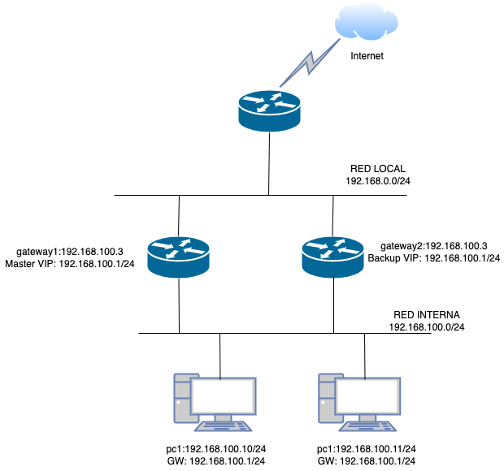

#  Puerta de enlace en alta disponibilidad (VRRP) con Keepalived

En esta práctica vamos a usar VRRP (Virtual Router Redundancy Protocol para conseguir alta alta disponibilidad en los routers 

{:style="width: 50%;" class="center"}


Keepalived es un software en C que proporciona balanceo de carga y alta disponibilidad en Linux. Utiliza el módulo IPVS para el balanceo de nivel 4, el protocolo VRRP para lograr conmutación por error en routers, y BFD para una detección rápida de fallos de red. Sus funcionalidades pueden emplearse por separado o de manera conjunta, ofreciendo infraestructuras resilientes y adaptativas. En esta práctica nos centraremos en VRRP.

## Objetivos de la práctica

1. **Comprender el funcionamiento de VRRP (Virtual Router Redundancy Protocol)**: Conocer cómo VRRP permite disponer de un gateway virtual compartido entre dos o más routers.
2. **Configurar keepalived en AlmaLinux**: Instalar y configurar el servicio en dos routers Linux, uno en modo maestro (master) y otro en modo respaldo (backup).
3. **Probar la conmutación por error (failover)**: Simular la caída del router principal y comprobar cómo el router de respaldo asume automáticamente la dirección IP virtual del gateway, sin interrumpir el tráfico.


## Requisitos previos

- Dos máquinas con AlmaLinux 9 que harán funciones de routers/gateways (por ejemplo, `gateway1` y `gateway2`).
- Una o varias máquinas cliente que se conectarán a internet a través de la dirección IP de gateway configurada mediante VRRP para que sea compartida entre `gateway1` y `gateway`

**Ejemplo de configuración de red (Debéis adaptarla a vuestro entorno):**

{:style="width: 80%;" class="center"}

- `gateway1`: IP real `192.168.100.2`, Máscara `255.255.255.0`
- `gateway2`: IP real `192.168.100.3`, Máscara `255.255.255.0`
- IP Virtual a asignar mediante VRRP: `192.168.100.1` (esta será la puerta de enlace que se configure en los clientes de la LAN)

_(Aseguraos de que la IP virtual no esté en uso en la red.)_

Los adaptadores conectados a la "RED LOCAL" se configurarán en modo `puente`, o en modo `NAT`. Por estos adaptadores se tendrá acceso a internet. Pueden estar configurados con DHCP.

Los adaptadores conectados a la "RED INTERNA" se configurarán en modo 'red interna' en VirtualBox.

Los dos routers que funcionarán como gateway serán configurados como routers NAT más adelante. La red INTERNA no debe tener DHCP y todas las IPs se configurarán manualmente de forma estática. El acceso a internet desde la red interna se realizará enviando el tráfico a la IP flotante compartida entre los dos gateways (192.168.100.1 en el diagrama)

Es suficiente con un solo cliente, puede ser linux o windows.

## Pruebas de realización de la tarea

La memoria a entregar debe contener como mínimo:

- Captura pantallas de configuración de la red de todas las máquinas, tanto en VirtualBox como en el sistema operativo (debe poder verse tanto las IP, máscaras de red y gateway).
- Muestra configuraciones de VRRP.
- Muestra prueba de funcionamiento


## Paso 1: Activar el IP Forwarding y configurar NAT en los gateways

Antes de nada vamos a configurar los gateway para que funcionen como router NAT. Para ello:

### 1. **Habilitar el reenvío de paquetes (IP forwarding)**  
   Para que Linux reenvíe paquetes entre interfaces, es necesario activar esta función. Edita el archivo `/etc/sysctl.conf` y asegúrate de tener la siguiente línea:
   ```bash
   net.ipv4.ip_forward = 1
   ```
   Aplica los cambios con:
   ```bash
   sudo sysctl -p
   ```
   
   Esto permitirá que el kernel de Linux enrute paquetes entre sus interfaces.

  Puedes comprobar si se ha aplicado con el siguiente comando:ping

```
sysctl net.ipv4.ip_forward
```


### 2. **Configurar las interfaces de red de los gateways**  

Vamos a configurar las interfaces de red de la RED INTERNA de forma estática. Tanto en los gateway como en el cliente.

- identificar la interfaz de red**  
    Ejecuta:
    
    ```bash
    ip link
    ```
    
    Localiza el nombre de tu interfaz, por ejemplo `enp0s8` o `eth0`.
    
- **Listar las conexiones existentes**
    
    ```bash
    nmcli connection show
    ```
    
    Esto mostrará las conexiones administradas por NetworkManager. Anota el nombre de la conexión asociada a tu interfaz conectada a la RED INTERNA (por ejemplo, `enp0s8`).
    
- Puedes ver tus IPs con el comando:
	```
	ip a
	```

- **Configurar la IP estática**  
	Ejecuta:
    
    ```bash
    nmtui
    ```
    

	1. Selecciona **"Edit a connection"**.
	2. Escoge la conexión asociada a tu interfaz.
	3. Cambia el "Método" de `Automático (DHCP)` a `Manual`.
	4. Introduce la dirección IP en `addresses`. (Ej: addresses 192.168.100.2/24)
	5. No es necesario configurar la puerta de enlace ni el DNS.
	6. Guarda los cambios
	7. Asegurate que la conexión está activada en la opción "**Activate a connection**". (Cuando está activada aparece un asterisco al lado del nombre de la conexión)

- Comprueba la configuración con el siguiente comando:
    
    ```bash
    nmcli device show enp0s8
    ```
    
- Verifica conectividad a internet:
    
    ```bash
    ping 8.8.8.8
    ```
    

### 3. Configurar NAT con `firewalld` 

Vamos a configurar los gateways para que funcionen como router NAT, compartiendo su conexión a la RED LOCAL con las máquinas de la RED INTERNA. De este modo las máquinas de la red interna tendrán acceso a internet si se configura alguno de los routers(gateway) como puerta de enlace por defecto (gateway en inglés).

   AlmaLinux utiliza `firewalld` de forma predeterminada. Lo primero es identificar las zonas de firewalld y asignar interfaces (debes cambiar el identificador de tarjeta de red al adecuado en tu configuración):

   - Asigna la interfaz WAN a la zona **public** (o la que estimes conveniente). Por ejemplo:
     ```bash
     sudo firewall-cmd --zone=public --change-interface=enp0s3 --permanent
     ```
   
   - Asigna la interfaz LAN a la zona **internal** (por ejemplo):
     ```bash
     sudo firewall-cmd --zone=internal --change-interface=enp0s8 --permanent
     ```   
   
   - Verifica la zona y las interfaces asignadas:
   ```bash
   sudo firewall-cmd --get-active-zones
   ```
   
   - Una vez configuradas las zonas, habilita el enmascaramiento (masquerade) en la zona que tengas conectada a Internet (normalmente la zona `public`):
   ```bash
   sudo firewall-cmd --zone=public --add-masquerade --permanent
   ```
   
   - Vamos a permitir todo el tráfico desde la zona interna (podríamos configurar solamente cierto tipo de tráfico, pero admitiremos todo por simplicidad):
   ```bash
sudo firewall-cmd --permanent --zone=internal --set-target=ACCEPT
   ```
   
   - Aplica los cambios:
   ```bash
   sudo firewall-cmd --reload
   ```


LLegados a este punto, los gateway deberían ser capaces de enrutar el tráfico de la RED INTERNA usando NAT, si los configuras como gateway en alguno de los clientes (usando su ip propia, 192.168.100.2 o 192.168.100.3), los clientes deberían enviar su tráfico a Internet a través de ellos. Deberás configurar también un DNS en el cliente, puedes usar los de google (8.8.8.8)

Puedes probar la conexión cargando alguna página o haciendo un ping a los servidores DNS de google:
```
ping 8.8.8.8
```

Puedes verificar las IPs de los equipos por los que pasas el paquete con el comando:

```
traceroute 8.8.8.8
```

## Paso 2: Instalación de Keepalived

En ambos gateways (`gateway1` y `gateway2`):

```bash
sudo dnf install -y keepalived
```


## Paso 3: Configuración del Router Maestro (gateway1)

Edita el archivo `/etc/keepalived/keepalived.conf`:

```conf
vrrp_instance VI_1 {
    state MASTER
    interface enp0s8           # Adaptar a la interfaz de red correspondiente
    virtual_router_id 51     
    priority 100             # Mayor prioridad, este será el gateway principal
    advert_int 1
    authentication {
        auth_type PASS
        auth_pass 12345      # Clave compartida
    }
    virtual_ipaddress {
        192.168.100.1/24
    }
}
```

**Puntos clave:**

- `state MASTER`: Indica que este router es el principal.
- `priority 100`: Prioridad más alta que el router de respaldo.
- `virtual_ipaddress`: La IP virtual que será el gateway de la LAN.


## Paso 4: Configuración del Router Respaldo (gateway2)

En `gateway2`, edita `/etc/keepalived/keepalived.conf`:

```conf
vrrp_instance VI_1 {
    state BACKUP
    interface enp0s8
    virtual_router_id 51
    priority 90              # Menor prioridad que el principal
    advert_int 1
    authentication {
        auth_type PASS
        auth_pass 12345
    }
    virtual_ipaddress {
        192.168.100.1/24
    }
}
```


## Paso 5: Activar y Habilitar el Servicio

En ambos gateways:

```bash
sudo systemctl enable keepalived
sudo systemctl start keepalived
```

Verifica el estado:

```bash
systemctl status keepalived
```


## Paso 6: Verificación de la Configuración

- En el gateway principal (`gateway1`): La IP virtual `192.168.100.1` debería estar asignada a la interfaz correspondiente (`ip addr show`).
- En el gateway de respaldo (`gateway2`): No debería aparecer la IP virtual inicialmente.


Configura en los clientes de la RED INTERNA la puerta de enlace predeterminada `192.168.100.1`. El tráfico saliente debería enrutarse correctamente a través del gateway principal.

Prueba desde una estación de trabajo en la RED INTERNA haciendo ping a `8.8.8.8`. Deberías obtener respuesta.


## Paso 7: Prueba de Failover

Haz un ping desde una de las estaciones de trabajo a 8.8.8.8, de este modo si se interrumpe la conexión se notará porque dejan de llegar las respuestas.

1. En el gateway principal (`gateway1`),  desconecta el cable de la interfaz de la red interna. Aunque sea una máquina virtual existe la opción `Cable conectado`  en el panel de preferencias del adaptador de red de VirtualBox. Desmárcala y el adaptador quedará desconectado. 
2. En pocos segundos, el gateway de respaldo (`gateway2`) debe 1adoptar la IP virtual `192.168.100.1`. Comprobad con `ip addr show` en `gateway2`.
    
3.  Vuelve a conectar el cable en `gateway1`. El gateway principal volverá a asumir la IP virtual tras unos segundos.
   

## Conclusiones

Con esta práctica, has aprendido a:
- Configurar dos routers en alta disponibilidad utilizando VRRP a través de keepalived.
- Proporcionar una puerta de enlace virtual a los clientes de la LAN.
- Garantizar continuidad del servicio ante la caída del router principal.


## Bibliofrafía

- [Keepalived](https://www.keepalived.org/)
- [Keepalived doc Web](https://www.keepalived.org/doc/)
- [Keepalived doc PDF](https://www.keepalived.org/pdf/UserGuide.pdf)
- [Configuración de Red en Alamlinux 9](https://shape.host/resources/configuracion-de-red-en-almalinux-9)
- [Configuración de NAT en Almalinux](https://www.server-world.info/en/note?os=AlmaLinux_9&p=firewalld&f=2)