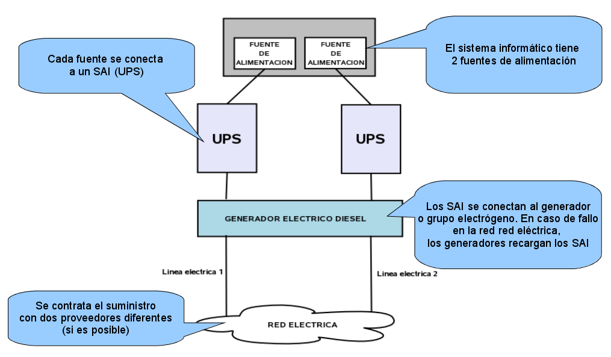
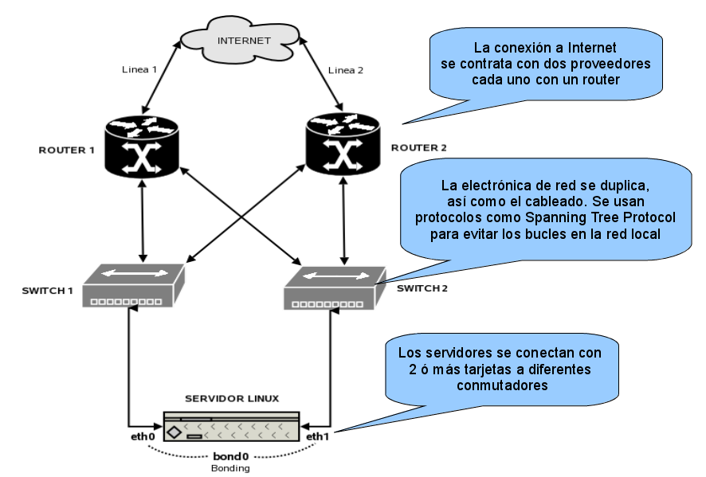
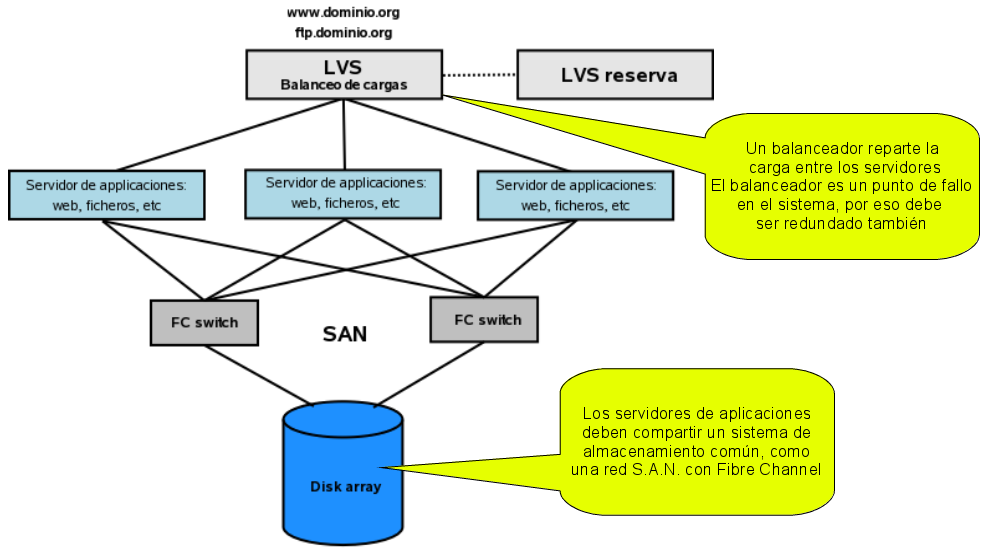

<!-- .slide: data-background="#2C3E50" -->

# Alta Disponibilidad

---

## Introducción

 **Alta disponibilidad (HA):** capacidad de un sistema, servicio o aplicación para **mantenerse operativo y accesible durante la mayor parte del tiempo posible**, minimizando interrupciones no planificadas y maximizando el tiempo de actividad. 

--

Importante en entornos donde la **continuidad del servicio es crítica**:
- Sistemas financieros
- Comercio electrónico
- Infraestructuras de TI empresariales.

--

#### Características principales:

1. **Tolerancia a fallos**: Los sistemas de alta disponibilidad están diseñados para seguir funcionando incluso si uno o varios componentes fallan.
2. **Redundancia**: Se emplean múltiples componentes (servidores, discos, redes) para garantizar que, si uno falla, otro pueda asumir su función.
3. **Monitorización y recuperación automática**: El sistema supervisa continuamente su estado y puede reconfigurarse automáticamente para evitar interrupciones.
4. **Escalabilidad**: La infraestructura debe ser capaz de manejar aumentos de carga sin comprometer la disponibilidad.

--

#### Elementos clave:

- **Cluster de alta disponibilidad**: Conjunto de servidores configurados para trabajar juntos y asegurar que, si uno falla, los demás puedan tomar el control automáticamente.
- **Balanceadores de carga**: Distribuyen el tráfico entre varios recursos para evitar sobrecargas en un único punto.
- **Almacenamiento redundante**: Uso de tecnologías como RAID, sistemas distribuidos o replicación de datos.
- **Redundancia en la red**: Uso de múltiples conexiones de red para evitar caídas por fallos en la conectividad.
- **Plan de recuperación ante desastres**: Incluye procedimientos para restaurar operaciones ante fallos mayores.

--

## Ejemplo:

Un sitio web de comercio electrónico puede implementar alta disponibilidad mediante:

- un **clúster** de servidores
- bases de datos **replicadas**
- **balanceadores de carga**

Si uno de los servidores falla, el tráfico se redirige automáticamente a los demás, asegurando que los usuarios puedan seguir navegando y realizando compras sin interrupciones.

---

## Tipos de interrupciones

* Interrupciones **previstas**:
	* Cambios o mejoras en nuestro **hardware**
	* Actualizaciones **software**  	
* Interrupciones **imprevistas**:
	* Un apagón
	* Un error del hardware o del software
	* Problemas de seguridad
	* Desastre natural
	* Caídas involuntarias del sistema
	* Sobrecarga de sistemas

---

## Definición de Disponibilidad

**Disponibilidad:** porcentaje del tiempo que un servicio o dispositivo está operativo:

$$D=\frac{MTBF}{MTTR + MTBF}$$

* **MTBF:** Mean Time Between Failure
* **MTTR:** Mean Time To Repair

--

### Alta disponibilidad: los nueves

* La disponibilidad **se expresa en número de nueves**: 
	* Disponibilidad de 3 nueves significa que D = 99,9%. 
	* Aplicaciones **críticas** exigen una disponibilidad de **5 nueves**, 
		

| Nueves |    D(%)      |  Inactividad anual |
|:------:|:-------------|------------------:|
| 2 | 99% | $3,65 días |
| 3 | 99.9% |   8,76 horas |
| 4 | 99.99%|    52,56 minutos |
| 5 | 99.999% |    5,26 minutos|
| 6 | 99.9999% |    31,5 segundos |

---

## Redundancia 

---

### Redundancia

La **redundancia**: estrategia de **replicar** componentes críticos de un sistema.
En caso de fallo de uno de ellos, el servicio pueda continuar funcionando sin interrupciones. 

--

#### Tipos de redundancia:

1. **Redundancia de hardware**:    
    - Uso de servidores duplicados o clústeres.
    - Sistemas de almacenamiento redundantes (por ejemplo, RAID para discos duros).
    - Fuentes de alimentación y ventiladores duplicados en los servidores.
2. **Redundancia de software**:    
    - Copias de seguridad y replicación de bases de datos en tiempo real.
    - Aplicaciones distribuidas capaces de ejecutarse en múltiples nodos.

--

3. **Redundancia de red**:    
    - Uso de múltiples rutas de red para evitar interrupciones por fallos en un enlace.
    - Duplicación de switches, routers o firewalls.
4. **Redundancia geográfica**:    
    - Centros de datos replicados en diferentes ubicaciones físicas (disaster recovery).
    - Replicación de servicios y datos entre distintas zonas o regiones.

--

5. **Redundancia lógica**:    
    - Algoritmos que permiten la recuperación de información o el mantenimiento del servicio ante fallos parciales.
    - Balanceadores de carga para gestionar varias instancias de un mismo servicio.

--

#### Métodos de implementación:

- **Activa/Activa**: Todas las instancias redundantes están en **funcionamiento** y gestionan el tráfico simultáneamente. Esto aumenta la capacidad y reduce los riesgos de sobrecarga.
- **Activa/Pasiva**: Solo una instancia está activa mientras las otras permanecen en **espera** para asumir el control en caso de fallo.

--

#### Beneficios de la redundancia:

- **Minimización de interrupciones**: Si un componente falla, otro toma el control automáticamente.
- **Mayor confiabilidad**: Se reducen los puntos únicos de fallo (**SPOF**, por sus siglas en inglés).
- **Escalabilidad**: La redundancia puede facilitar el manejo de mayores volúmenes de trabajo al distribuir la carga.

---

##  Ejemplos de HA

--

### Redundancia de suministro eléctrico

<!-- .element width="80%" -->

---

## Alta Disponibilidad en Redes

--

### Introducción

La **alta disponibilidad en redes** 
garantizar que la conectividad y el flujo de datos entre los distintos componentes de un sistema permanezcan operativos sin interrupciones. 

--

### HA en red

<!-- .element width="75%" -->

#### Estrategias para lograr alta disponibilidad en redes:

1. **Redundancia de enlaces**:    
    - Implementación de múltiples rutas físicas o lógicas entre dispositivos de red para asegurar que, si un enlace falla, el tráfico pueda ser redirigido automáticamente por otra ruta.
    - Uso de protocolos como **EtherChannel** o **Link Aggregation Control Protocol (LACP)** para combinar varios enlaces físicos en uno lógico.    
2. **Equipos redundantes**:    
    - Duplicación de switches, routers y firewalls para eliminar puntos únicos de fallo.
    - Configuración de dispositivos en modos activos/activos o activos/pasivos para asegurar la conmutación inmediata en caso de fallo.

--

2. **Protocolos de redundancia de capa 3**:    
    - Uso de protocolos como **HSRP (Hot Standby Router Protocol)**, **VRRP (Virtual Router Redundancy Protocol)** o **GLBP (Gateway Load Balancing Protocol)** para proporcionar puertas de enlace redundantes.
3. **Balanceadores de carga**:    
    - Distribución del tráfico entrante entre múltiples servidores o rutas para evitar sobrecargas y optimizar el rendimiento.
    - Implementación de balanceadores de carga tanto a nivel de hardware como de software.

--

3. **Diseño de red resiliente**:    
    - Arquitecturas de red como topologías en anillo, malla o estrella que ofrecen múltiples caminos para el tráfico de datos.
    - Segmentación de la red para limitar el impacto de fallos en un área específica.

--

#### Beneficios:

- **Minimización de interrupciones**: La redundancia y la conmutación automática reducen significativamente el tiempo de inactividad.
- **Optimización del rendimiento**: Las rutas múltiples y el balanceo de carga mejoran la velocidad y la eficiencia del tráfico de red.
- **Escalabilidad**: Las redes diseñadas para alta disponibilidad pueden crecer y adaptarse a mayores demandas sin sacrificar fiabilidad.

---

## Clústeres de Alta Disponibilidad

Un **clúster de alta disponibilidad** es un grupo de servidores que trabajan juntos para garantizar la continuidad de los servicios y aplicaciones. Si uno de los servidores (nodos) falla, otro puede asumir su carga de trabajo sin interrumpir el servicio al usuario final.

--

### Redundancia: balanceador de carga

<!-- .element width="80%" -->

--

#### Tipos de clústeres:

1. **Clústeres Activo/Pasivo**:    
    - **Un nodo activo** maneja las solicitudes mientras que uno o más nodos pasivos están en espera.
    - Si el nodo activo falla, uno de los pasivos toma el control automáticamente (**failover**).
2. **Clústeres Activo/Activo**:    
    - **Todos los nodos están activos** y comparten la carga de trabajo.
    - Ofrece **mejor utilización de recursos** y mayor capacidad de procesamiento.

#### Componentes clave:

- **Heartbeat (latido del corazón)**:    
    - Señales periódicas entre nodos para monitorizar su estado.
    - Permite detectar rápidamente fallos y activar procedimientos de failover.
- **Almacenamiento compartido**:    
    - Acceso común a datos y aplicaciones para garantizar la consistencia.
    - Uso de sistemas de archivos **distribuidos** o redes de área de almacenamiento (**SAN**).
- **Gestión de recursos**:    
    - Coordinación de servicios y aplicaciones para evitar conflictos.
    - Herramientas que aseguran que solo un nodo acceda a un recurso crítico a la vez.

--

#### Beneficios:

- **Alta disponibilidad de servicios**: Minimiza el tiempo de inactividad y asegura la continuidad operativa.
- **Escalabilidad**: Permite añadir más nodos para aumentar la capacidad y rendimiento.
- **Mantenimiento sin interrupciones**: Actualizaciones y reparaciones pueden realizarse sin afectar al servicio.

---

## Virtualización y Contenedores

--

La **virtualización** y el uso de **contenedores** son tecnologías clave para lograr alta disponibilidad, ya que permiten una gestión más flexible y eficiente de los recursos de TI.

--

#### Virtualización:

- **Máquinas Virtuales (VMs)**:    
    - Creación de múltiples entornos de sistemas operativos en un solo hardware físico.
    - Aislamiento de aplicaciones para mejorar la seguridad y estabilidad.
- **Características para alta disponibilidad**:    
    - **Migración en vivo**: Mover VMs entre servidores físicos sin tiempo de inactividad.
    - **Snapshots**: Copias de estado que permiten una rápida recuperación.
    - **Replicación**: Duplicación de VMs en tiempo real para failover inmediato.

--

#### Contenedores:

- **Tecnología de virtualización a nivel de sistema operativo**:    
    - Ejecución de múltiples aplicaciones aisladas en el mismo SO.
    - Menor sobrecarga que las VMs, permitiendo una mayor densidad de aplicaciones.
- **Orquestación de contenedores**:    
    - Herramientas como **Docker Swarm** o **Kubernetes** gestionan automáticamente el despliegue, escalado y gestión de contenedores.
    - Facilitan la implementación de estrategias de alta disponibilidad y balanceo de carga.

--

#### Estrategias de alta disponibilidad con virtualización y contenedores:

1. **Redundancia de instancias**:    
    - Despliegue de múltiples instancias de aplicaciones en diferentes VMs o contenedores.
    - Uso de balanceadores de carga para distribuir el tráfico.
2. **Despliegue en múltiples hosts físicos**:    
    - Evita puntos únicos de fallo al distribuir las cargas de trabajo en diferentes servidores.
    - Permite el mantenimiento de hardware sin afectar al servicio.
3. **Automatización y orquestación**:    
    - Implementación de políticas que repliquen y reinicien automáticamente aplicaciones fallidas.
    - Uso de scripts y herramientas que monitorizan y gestionan el estado de los servicios.

--

#### Beneficios:

- **Flexibilidad y escalabilidad**: Fácil adaptación a cambios en la demanda y despliegue rápido de nuevos servicios.
- **Eficiencia de recursos**: Mejor utilización del hardware disponible, reduciendo costos.
- **Rapidez en la recuperación**: Restauración casi inmediata de servicios en caso de fallo.

