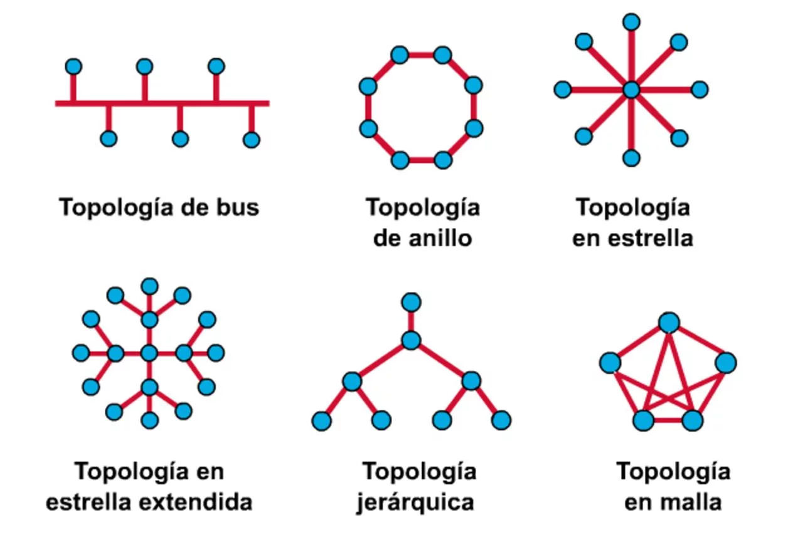
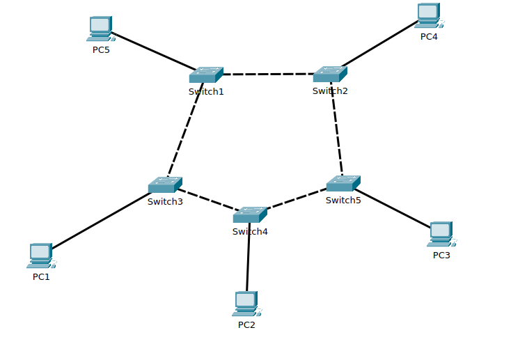
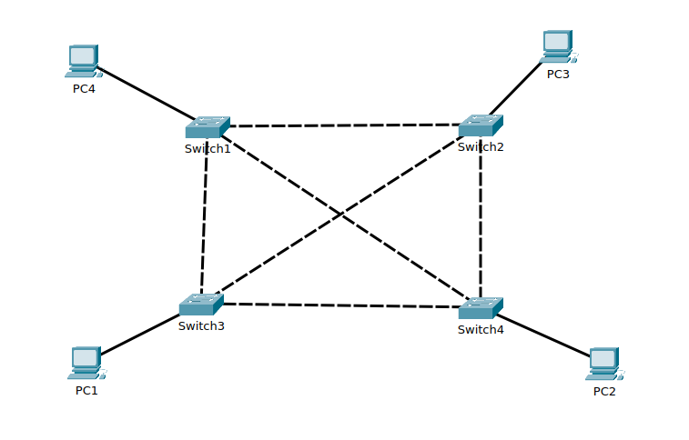
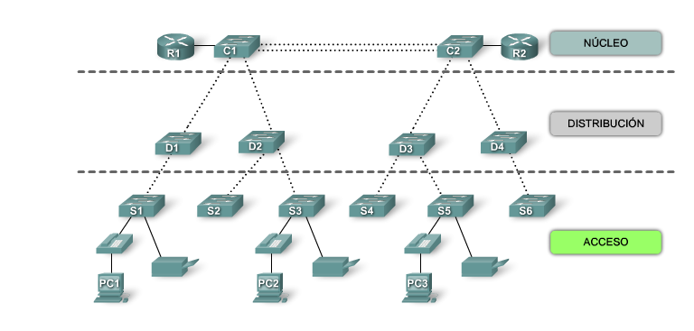
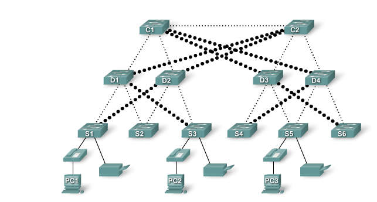
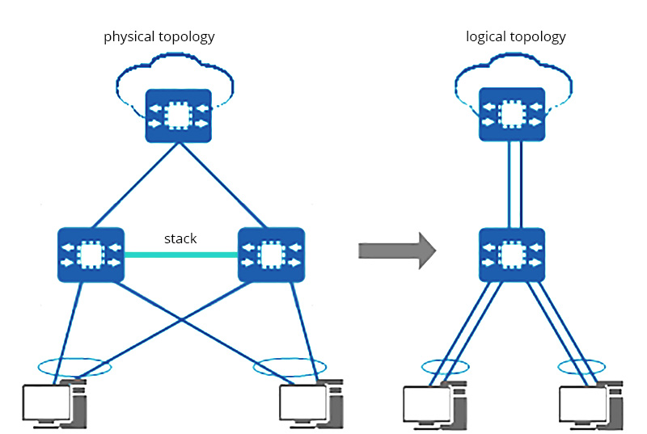
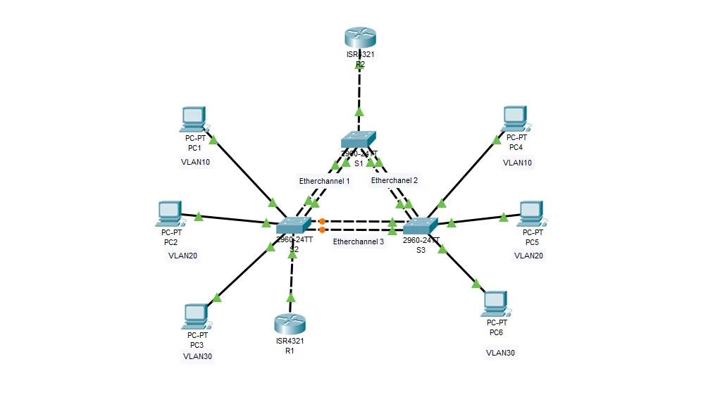
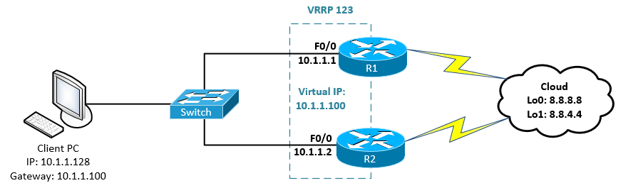
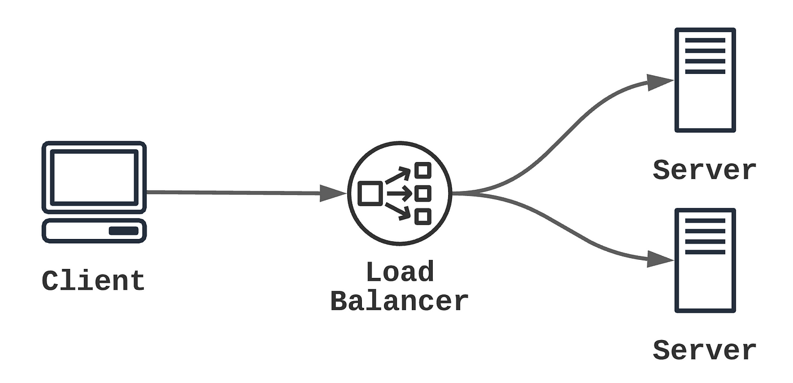

<!-- .slide: data-background="#2C3E50" -->

# Alta Disponibilidad

## Alta disponibilidad en redes

---

## Redes LAN resilientes

---

### Diseñando una LAN resiliente

Objetivo: Mantener conectividad ante fallos.

- Incorporación de:
  - **Redundancias**.
  - Mecanismos de **failover**.
- Protocolos clave:
  -  Agregación de enlaces: **LACP** y Etherchannel
  - **VRRP** o **HSRP**: Enrutamiento redundante.
  - **STP/RSTP/MSTP**: Prevención de bucles.

--

### Topologías de red

<!-- .element width="80%" -->

---

### Prevención de bucles LAN

--

#### **STP (Spanning Tree Protocol)**

- **Propósito**: Protocolo diseñado para evitar bucles en redes conmutadas Ethernet al desactivar enlaces redundantes.
- **Funcionamiento**:
    - Selecciona un **Root Bridge** (puente raíz).
    - Define un único camino activo hacia el puente raíz desde cada switch.
    - Los puertos que generan bucles se colocan en estado de bloqueo.
- **Tiempos de convergencia**: Lentos (**30-50 segundos**) debido a los estados de puerto: bloqueo, escucha, aprendizaje y reenvío.
- **Estándar**: IEEE 802.1D.

--

#### **RSTP (Rapid Spanning Tree Protocol)**

- **Propósito**: Mejora de STP para lograr una convergencia más rápida en la red.
- **Funcionamiento**:
    - Introduce roles y estados de puertos mejorados: Designado, Raíz, Alternativo y de Respaldo.
    - Reducción de los tiempos de convergencia a unos pocos segundos gracias al uso de un mecanismo de negociación y sincronización.
- **Compatibilidad**: Es retrocompatible con STP.
- **Estándar**: IEEE 802.1w.

--

#### **MSTP (Multiple Spanning Tree Protocol)**

- **Propósito**: Protocolo avanzado que permite gestionar varias instancias de STP en una misma red, mejorando la utilización de los enlaces redundantes.
- **Funcionamiento**:
    - Divide la red en **regiones MST**, donde cada región puede tener múltiples instancias de STP.
    - Cada instancia puede manejar un grupo de VLANs, optimizando el balanceo de carga y la redundancia.
- **Compatibilidad**: Compatible con STP y RSTP.
- **Estándar**: IEEE 802.1s.

---

## Topologías resilientes

1. **Malla**:
   - Cada dispositivo conectado a varios otros.
   - Tolerancia a fallos elevada.
2. **Anillo**:
   - Recuperación rápida ante cortes.
3. **Jerárquica**:
   - Núcleo, distribución y acceso.
   - Múltiples rutas hacia el núcleo.

--

### Topología en anillo

<!-- .element width="80%" -->

--

### Topología en malla

<!-- .element width="80%" -->

--

### Topología Jerárquica

<!-- .element width="80%" -->

--

### Topología Jerárquica:

- **Núcleo**: Conmutación de alta velocidad.
- **Distribución**: Políticas de seguridad y agregación.
- **Acceso**: Conexión de equipos finales.

--

### Topología Jerárquica (Redundancia)

<!-- .element width="80%" -->

---

## Agregación de enlaces

--

### ¿Qué es la agregación de enlaces?

- Combina **múltiples interfaces físicas** en un único canal lógico.
- Proporciona:
  - **Mayor ancho de banda**.
  - **Resiliencia** y alta disponibilidad.
- Protocolos comunes:
  - **LACP** ([IEEE 802.3ad](https://ieeexplore.ieee.org/document/810387)).
  - Etherchannel (propietario de CISCO).

--

### Agregación de enlaces: Servidor

<!-- .element width="70%" -->

--

### Agregación de enlaces: Switches

<!-- .element width="80%" -->

--

### LACP (Link Aggregation Control Protocol)

- **Protocolo estándar**  ([IEEE 802.3ad](https://ieeexplore.ieee.org/document/810387)) para la unión de interfaces físicas.
- Beneficios:
  - Incrementa la disponibilidad (**HA**).
  - Mejora el ancho de banda agregado.
  - Redistribuye tráfico entre interfaces activas.
- Configuración:
  - **Servidor**: Crea un bond o team.
  - **Switch**: Configurado para gestionar el grupo de puertos.

--

### EtherChannel

- **Tecnología propietaria de Cisco**.
- Combina múltiples enlaces Ethernet en uno lógico.
- Ventajas:
  - Mayor ancho de banda total.
  - Redundancia: los enlaces restantes operan si uno falla.
- Configuración:
  - **Estática** o mediante protocolos como **PAgP** o **LACP**.
- Uso común:
  - Entre switches.
  - Entre switches y servidores.

---

## VRRP 

### Virtual Router Redundancy Protocol

--

###  VRRP

- **Alta disponibilidad**:
  - Router virtual con múltiples routers físicos.
- Beneficios:
  - Cambio transparente al router de respaldo en caso de fallo.

<!-- .element width="80%" -->

--

### Funcionamiento

1. **Dirección IP Virtual**:
   - Compartida entre routers físicos.
   - **Master** gestiona el tráfico.
   - **Backup** toma el control si el Master falla.
2. **Elección del Maestro**:
   - Basada en prioridad (1-254).
3. **Mensajes Multicast**:
   - Detectan el estado del Master.
4. **Transparencia**:
   - Clientes siempre ven la misma puerta de enlace.

--

## Implementación práctica

- **Software**:
  - [Keepalived](https://www.keepalived.org/): Solución Linux para VRRP.
  - [VRRPd](https://gitlab.com/fredbcode/Vrrpd): Alternativa ligera para Linux.
- **Hardware**:
  - Compatible con equipos de **Cisco**, **Juniper**, **HP**, etc.

---

## Balanceadores de carga y proxies inversos

---

## Balanceador de carga

<!-- .element width="80%" -->

--

## Balanceador de carga

- Distribuye el tráfico entre varios servidores.
- **Objetivos**:
  - Mejorar rendimiento, disponibilidad y escalabilidad.
- **Funciones**:
  1. **Distribución del tráfico**:
     - Algoritmos: Round-robin, least connections, IP hash.
  2. **Alta disponibilidad**.
  3. **Seguridad**: Punto de control para proteger servidores.

--

## Ejemplos de balanceadores

- **Software**:
  - [HAProxy](https://www.haproxy.org/).
  - [Nginx](https://nginx.org/en/docs/http/load_balancing.html).
- **Hardware**:
  - [F5 Big-IP](https://www.f5.com/es_es/products/big-ip).
- **Cloud**:
  - [AWS ELB](https://aws.amazon.com/es/elasticloadbalancing/).

---

## Proxy inverso

- Actúa como intermediario entre clientes y servidores internos.
- **Funciones**:
  1. **Distribución de carga**.
  2. **Cacheo de contenido**.
  3. **Seguridad**: Filtrado y ocultación de la red interna.
  4. **Gestión SSL/TLS**.

--

## Ejemplo: Proxy inverso

- [Nginx como balanceador y proxy](https://nginx.org/en/docs/http/load_balancing.html).
- Uso práctico:
  - Distribución de solicitudes HTTP.
  - Reducción de carga en servidores backend. (Cache y SSL)

