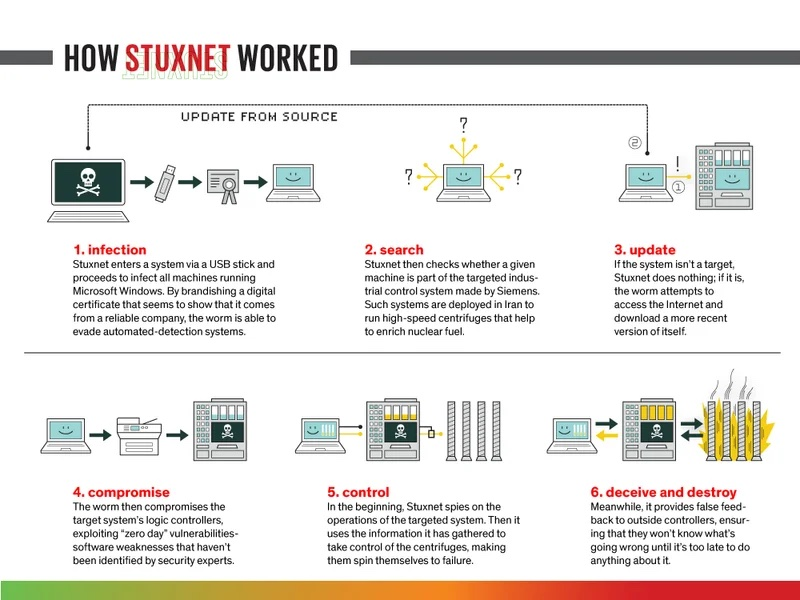

# Malware Stuxnet

## Introducción

Stuxnet es un gusano informático altamente sofisticado que fue descubierto en junio de 2010. Es ampliamente considerado como uno de los primeros ejemplos de malware diseñado específicamente para sabotear sistemas industriales, particularmente los sistemas de control y adquisición de datos (SCADA) utilizados en instalaciones nucleares.

## Origen y Desarrollo

Aunque ningún país ha admitido oficialmente su responsabilidad, se cree que Stuxnet fue desarrollado conjuntamente por Estados Unidos e Israel con el objetivo de retrasar el programa nuclear de Irán. Investigaciones y análisis de expertos en seguridad cibernética apuntan a que el malware fue creado entre 2005 y 2010.

## Funcionamiento Técnico

### Propagación

Stuxnet se propagaba principalmente a través de dispositivos USB infectados y explotaba múltiples vulnerabilidades de día cero en el sistema operativo Windows, lo que le permitía difundirse sin ser detectado.

**Métodos de Propagación**:

   - **Unidades extraíbles**: Stuxnet se autoinstalaba en dispositivos extraíbles usando una vulnerabilidad en la ejecución automática de archivos.
   - **Redes locales**: Se propagaba mediante vulnerabilidades en servicios de Windows, como el servicio de cola de impresión y el SMB, permitiendo que se copiara y ejecutara en otros equipos.
   - **Proyectos de Step 7**: Infiltraba proyectos de Siemens Step 7 para ejecutar automáticamente el malware al abrirlos.
   - **Actualización P2P**: Utilizaba un mecanismo de actualización entre pares (peer-to-peer) dentro de la red local para mantenerse al día en todas las máquinas infectadas.
   
 **Explotación de Vulnerabilidades de Día Cero**: 
 
 Stuxnet aprovechó cuatro vulnerabilidades sin parche en sistemas Windows, dos de ellas para replicarse y dos para elevar privilegios. Esto incluía vulnerabilidades críticas como la de Windows LNK y la de impresión.

### Objetivo Específico

El malware estaba diseñado para atacar controladores lógicos programables (PLC) de Siemens, utilizados en las **centrifugadoras de enriquecimiento de uranio** en la planta nuclear de Natanz, Irán.

### Manipulación de Sistemas

Una vez infiltrado, Stuxnet alteraba el funcionamiento de las centrifugadoras, cambiando su velocidad de rotación de manera impredecible, lo que provocaba daños físicos mientras mostraba lecturas normales a los operadores para evitar la detección.

## Características

 **Rootkit de Windows y PLC**: Stuxnet usaba un rootkit para ocultarse tanto en el sistema operativo Windows como en los PLC, dificultando su detección y eliminación. Además, este fue el primer malware en incluir un rootkit para PLCs, logrando que las modificaciones pasaran desapercibidas para los operadores.
   
 **Funcionalidad de Comando y Control (C&C)**: El malware incluía una función de comando y control que le permitía conectarse a servidores externos para recibir actualizaciones o ejecutar comandos específicos, aunque esta capacidad estaba limitada en entornos sin conexión a internet.
   
 **Distribución Geográfica y Enfoque en Irán**: Aproximadamente el 60% de las infecciones se detectaron en Irán, lo que indica que probablemente era el objetivo principal. Sin embargo, se propagó más allá debido a sus amplios métodos de infección.
   
 **Evasión de Antivirus y Detección**: Incorporaba técnicas de evasión para evitar ser detectado por antivirus y otros sistemas de seguridad, y solo se ejecutaba en versiones de Windows específicas.

 **Inyección de Código**: Usaba técnicas avanzadas de inyección de código para ejecutar sus componentes en procesos de confianza, como "lsass.exe" o "svchost.exe", lo cual complicaba aún más su identificación y eliminación.

## Impacto

### Daño Físico

Se estima que Stuxnet destruyó alrededor de 1,000 centrifugadoras iraníes, retrasando significativamente su programa nuclear.

### Difusión Global

Aunque estaba dirigido específicamente a instalaciones iraníes, el malware infectó sistemas en varios países, lo que generó preocupación mundial sobre la seguridad de infraestructuras críticas.

## Implicaciones en Seguridad Cibernética

### Nuevo Paradigma

Stuxnet marcó un antes y un después en la ciberseguridad, demostrando que el malware puede causar daños físicos en el mundo real.

### Ciberarmas

Introdujo el concepto de las ciberarmas estatales y abrió el debate sobre la militarización del ciberespacio.

### Medidas de Seguridad

Impulsó a gobiernos y organizaciones a reforzar la seguridad de sus sistemas industriales y a desarrollar estrategias de defensa cibernética más robustas.

## Conclusiones

Stuxnet es un ejemplo paradigmático de cómo las amenazas cibernéticas pueden trascender el ámbito digital y tener consecuencias físicas y geopolíticas. Su aparición ha llevado a una mayor concienciación sobre la importancia de proteger las infraestructuras críticas y ha sentado precedentes en cuanto a las consideraciones éticas y legales del uso de malware con fines militares.

    

Este malware se considera uno de los más complejos de su época, tanto por sus técnicas avanzadas como por su capacidad de sabotaje industrial en sistemas críticos

## Referencias

- [Dosier sobre Stuxnet de Symantec](https://www.security.com/threat-intelligence/stuxnet-dossier-espionage) 
- 
-  [Información sobre Stuxnet de Kaspersky](https://www.kaspersky.com/resource-center/definitions/what-is-stuxnet).

- [ENISSA](https://www.enisa.europa.eu/news/enisa-news/stuxnet-analysis)

- Artículos académicos y periodísticos:

- [https://spectrum.ieee.org/wsense-internet-of-underwater-things](https://spectrum.ieee.org/wsense-internet-of-underwater-things)

- [Transcripción de episodio sobre Stuxnet del podcast "MaliciousLife"](https://malicious.life/episode/episode-7-stuxnet-part-1/)
