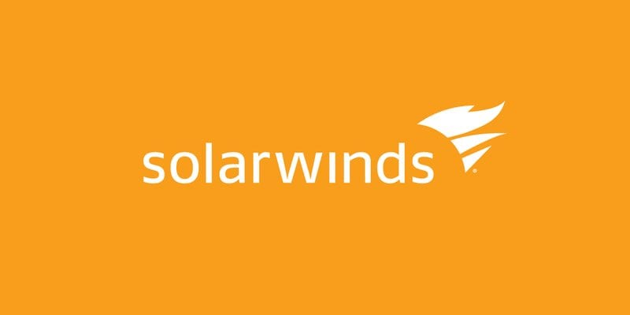

# Incidente de SolarWinds 2020

{:class="center"}

El incidente de SolarWinds fue un sofisticado ataque a la cadena de suministro que tuvo un impacto significativo en numerosas organizaciones a nivel mundial. Aquí se resumen los aspectos clave.

Sus consecuencias son tan grandes que no es posible estimarlas.

## Naturaleza del ataque

El ataque involucró la troyanización de actualizaciones del software [Orion][orion] de SolarWinds, una plataforma ampliamente utilizada para la gestión de redes e infraestructura de TI. Los atacantes lograron insertar código malicioso (conocido como **SUNBURST**) en estas actualizaciones, que luego fueron distribuidas a miles de clientes de SolarWinds. El ataque fue descubierto por la empresa de seguridad FireEye.

## Impacto y alcance

- Afectó a versiones de Orion lanzadas entre marzo y junio de 2020.
- Se estima que unas 18,000 organizaciones descargaron las actualizaciones comprometidas.
- Entre los afectados se encontraban importantes agencias gubernamentales de EE.UU. y grandes corporaciones:
	- Casi todas las empresa del Fortune 500.
	- Gobierno de Estados Unidos
- **Es importante destacar que el alcance total del ataque aún está por determinarse.** 
- Microsoft ha indicado que aproximadamente el 20% de las empresas afectadas se encuentran fuera de Estados Unidos, incluyendo países como Canadá, México, Bélgica, Reino Unido, España e Israel.

Algunos de los afectados:

### Agencias gubernamentales de EE.UU:
	- El Pentágono
	- El Ejército y la Marina
	- Instituto Nacional de Salud
	- Departamento del Tesoro
	- Departamento de Comercio
	- Departamento de Seguridad Nacional (DHS)
	- Departamento de Estado
	- Departamento de Energía
	- Administración Nacional de Seguridad Nuclear

### Grandes corporaciones tecnológicas

- Microsoft
- Cisco
- Intel
- NVIDIA

### Otras organizaciones relevantes

- NASA

## Características del malware

- La puerta trasera SUNBURST se comunicaba con servidores de comando y control de los atacantes.
- Tenía capacidades para transferir archivos, ejecutar comandos, perfilar sistemas y desactivar servicios.
- Utilizaba técnicas de evasión sofisticadas para evitar la detección.

## Atribución y respuesta

- Se sospecha que el ataque fue realizado por un grupo APT(Advanced Persistent Threat) vinculado a Rusia, aunque la atribución definitiva sigue siendo incierta.
- La detección y respuesta al incidente involucró a múltiples agencias gubernamentales y empresas de ciberseguridad.

## Lecciones aprendidas

Este incidente puso de manifiesto:

1. La criticidad de los ataques a la cadena de suministro.
2. La necesidad de mejorar la coordinación en la respuesta a incidentes a gran escala.
3. La importancia de implementar medidas de seguridad robustas en el desarrollo y distribución de software.

El ataque a SolarWinds representa uno de los incidentes de ciberseguridad más significativos de los últimos años, destacando la creciente sofisticación de las amenazas y la vulnerabilidad inherente en las cadenas de suministro de software.

[mandiant]:https://www.zscaler.com.mx/resources/security-terms-glossary/what-is-the-solarwinds-cyberattack
[zscaler]:https://www.zscaler.com.mx/resources/security-terms-glossary/what-is-the-solarwinds-cyberattack
[xataca]:https://www.xataka.com/pro/ataque-a-solarwinds-explicado-que-ataque-a-esta-empresa-desconocida-trae-cabeza-a-grandes-corporaciones-gobiernos-mundo
[orion]: https://www.solarwinds.com/orion-platform

## Bibliografía

* Contramedidas: https://github.com/mandiant/sunburst_countermeasures
 * Informe inicial: https://cloud.google.com/blog/topics/threat-intelligence/evasive-attacker-leverages-solarwinds-supply-chain-compromises-with-sunburst-backdoor
* Plataforma Orion: https://www.solarwinds.com/orion-platform
* https://www.zscaler.com.mx/resources/security-terms-glossary/what-is-the-solarwinds-cyberattack
* https://www.xataka.com/pro/ataque-a-solarwinds-explicado-que-ataque-a-esta-empresa-desconocida-trae-cabeza-a-grandes-corporaciones-gobiernos-mundo

