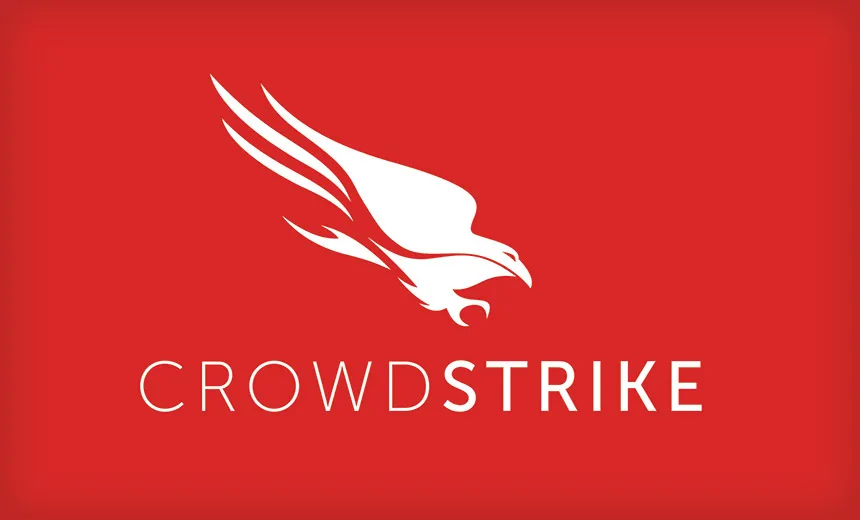
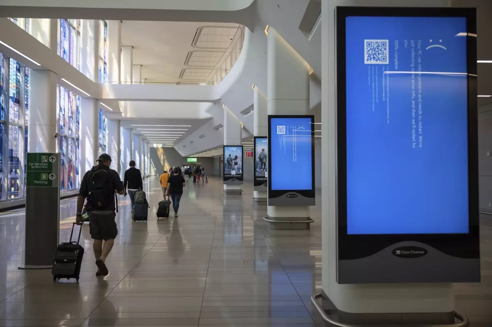
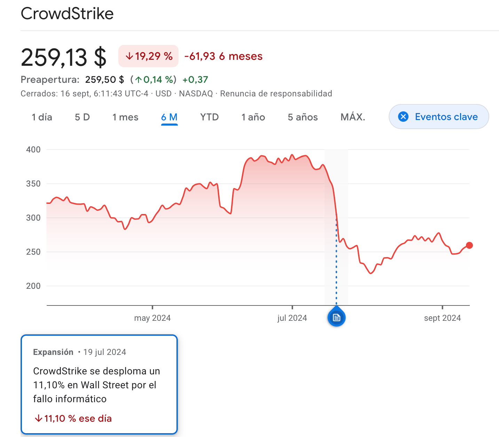

# Incidente de CrowdStrike 2024

{:class="center"}

El incidente de CrowdStrike en julio de 2024 fue un fallo técnico significativo que causó interrupciones masivas a nivel global, pero no se trató de un incidente de seguridad o ciberataque. Los equipos mostraban BSOD ( Blue Screen of Death) en cada reinicio.

## Naturaleza del incidente

- Se originó por un error en una actualización del software **antivirus Falcon de CrowdStrike** para sistemas Windows.
- La actualización defectuosa provocó fallos críticos en los sistemas operativos, causando la "pantalla azul de la muerte" y reinicios continuos.

### Ejecución en modo kernel

Habitualmente los programas se ejecutan en modo usuario, teniendo solamente a la memoria que tienen asignados, si se produce un fallo en este modo la aplicación falla pero el resto del sistema sigue funcionando.
Pero Falcon se ejecuta a nivel de kernel. Este modo de ejecución privilegiado permite acceso a toda la memoria, sin restricciones. Es el modo en que se ejecuta el sistema operativo y los controladores hardware. Un fallo de gestión de memoria en este modo produce la BSOD puesto que es mejor detener el sistema que permitir que continúe con resultados no previsibles.

CrowdStrike desarrolló un controlador de dispositivo aunque no hay hardware como tal, pero eso le da acceso a los recursos necesarios para funcionar como debe y proteger esos servidores. Este controlador estaba  certificado por Microsoft.

Para garantizar que este tipo de controladores funcionan como deben aun teniendo acceso privilegiado, Microsoft dispone de la certificación WHQL (Windows Hardware Quality Labs) que garantiza que dichos componentes han sido validados tanto por el desarrollador como por Microsoft, que los prueba en distintas plataformas y configuraciones y que los "firma" digitalmente para conferirles esa certificación.

Esa certificación WHQL se mantiene si el driver no cambia, y aquí está el problema para CrowdStrike, cuyo controlador debe cambiar constantemente para adaptarse a las nuevas amenazas. Eso haría que tuviese que ser reevaluado constantemente para mantener la certificación, pero en lugar de eso, en CrowdStrike utilizaron "ficheros de definición" que se procesan por parte del controlador pero no se incluyen directamente en él. Esos ficheros dinámicos van actualizándose e "informando" al sensor Falcon de (por ejemplo) nuevas amenazas para que las tenga en cuenta en sus procesos de detección.

Estos ficheros consisten en código que se ejecutará en modo kernel que no ha tenido que pasar el proceso de certificación.

## Impacto

- Afectó a aproximadamente 8,5 millones de ordenadores con Windows en todo el mundo.
- Causó interrupciones en múltiples sectores como transporte, salud, finanzas y empresas.
- Tuvo un impacto global, afectando a organizaciones en España, Alemania, Francia, Reino Unido, EE.UU., Australia, China, Japón, entre otros.

### Transporte y viajes

- El sector de viajes se vio especialmente impactado, con aerolíneas y aeropuertos sufriendo importantes problemas.
- Se retrasaron vuelos internacionales y se interrumpieron las conexiones de transporte público.
- Se cancelaron más de 1000 vuelos en todo el mundo.

{:class="center" width=80%}

### Salud

- Los sistemas de hospitales se vieron afectados, obligando a cancelar operaciones no urgentes.
- Se estima que el sector de la salud sufrió una parte significativa de las pérdidas totales.

### Finanzas y banca

- Las operaciones bancarias y de pago se vieron ralentizadas o interrumpidas.
- El sector bancario fue uno de los más impactados económicamente.

### Otros sectores afectados

- Empresas de medios de comunicación
- Bolsas de valores
- Minoristas
- Agencias gubernamentales
- Ferrocarriles

## Respuesta y solución

- CrowdStrike identificó el problema y revirtió la actualización defectuosa.
- Se proporcionaron instrucciones para una **solución manual**, que incluía iniciar en modo seguro y eliminar un archivo específico. [Fix][fix]
	- Esta solución es extremadamente lenta
	- En las fechas del incidente gran cantidad de personal IT estaba de vacaciones.
	- 
- La empresa emitió actualizaciones continuas y transparentes sobre el progreso de la recuperación.

## Consecuencias

* Generó pérdidas financieras significativas para las empresas afectadas
 
* Tuvo un impacto global, afectando a múltiples sectores críticos como:
    
    - Transporte aéreo: Más de 5,000 vuelos fueron cancelados, causando pérdidas millonarias a aerolíneas importantes.
    - Logística: Empresas como UPS y FedEx sufrieron retrasos en entregas.
    - Sector financiero: Bancos y bolsas de valores experimentaron interrupciones operativas.
    - Salud: Hospitales tuvieron que cancelar operaciones no urgentes.
    
* Las acciones de CrowdStrike cayeron más de un 11% en un solo día, lo que representa una pérdida significativa de valor de mercado. Y siguieron cayendo posteriormente.
* **Se espera que CrowdStrike enfrente costosos litigios y posibles indemnizaciones por daños y perjuicios.**

Es importante destacar que, aunque el incidente fue grave y de gran alcance, **no fue resultado de un ataque malicioso sino de un error técnico** en una actualización de software.
## Bibiografía

Descripción del incidente:

* [https://ciberseguridadtic.es/reportajes/los-principales-detalles-del-incidente-de-crowdstrike-y-microsoft-202407226156.htm](https://ciberseguridadtic.es/reportajes/los-principales-detalles-del-incidente-de-crowdstrike-y-microsoft-202407226156.htm)

* [https://www.cio.com/article/3476470/el-incidente-de-crowdstrike-lleva-a-los-cio-a-replantearse-sus-estrategias-en-la-nube.html](https://www.cio.com/article/3476470/el-incidente-de-crowdstrike-lleva-a-los-cio-a-replantearse-sus-estrategias-en-la-nube.html)

Caída en bolsa en un solo día:
[https://www.expansion.com/mercados/2024/07/19/669a482fe5fdeaa9398b4586.html](https://www.expansion.com/mercados/2024/07/19/669a482fe5fdeaa9398b4586.html)

Explicación del problema por un ex-desarrollador de windows:

* [https://www.youtube.com/watch?v=wAzEJxOo1ts](https://www.youtube.com/watch?v=wAzEJxOo1ts)

* [https://www.xataka.com/servicios/modo-kernel-explicado-asi-funciona-seguridad-windows-asi-se-salto-crowdstrike-para-provocar-caos](https://www.xataka.com/servicios/modo-kernel-explicado-asi-funciona-seguridad-windows-asi-se-salto-crowdstrike-para-provocar-caos)

Solución:

* [https://www.lumitiv.com/blog/crowdstrike-falcon-causing-bsod-heres-how-to-fix-it/](https://www.lumitiv.com/blog/crowdstrike-falcon-causing-bsod-heres-how-to-fix-it/)
* [https://www.incibe.es/empresas/avisos/un-fallo-en-la-actualizacion-de-crowdstrike-provoca-interrupciones-en-multiples](https://www.incibe.es/empresas/avisos/un-fallo-en-la-actualizacion-de-crowdstrike-provoca-interrupciones-en-multiples)

[^fix]:https://www.incibe.es/empresas/avisos/un-fallo-en-la-actualizacion-de-crowdstrike-provoca-interrupciones-en-multiples